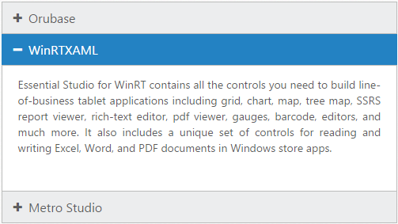
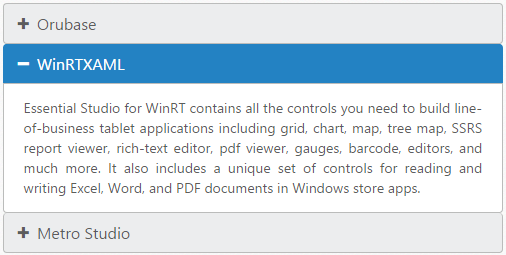
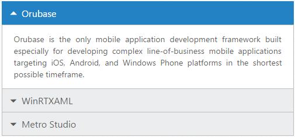
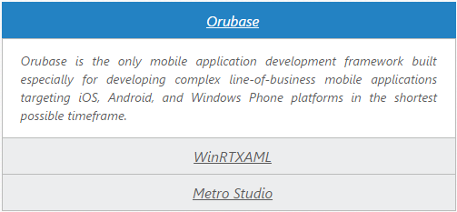

# Appearance and Styling

## Adjusting Accordion size

You can customize the **Accordion** panel height using [heightAdjustMode](https://help.syncfusion.com/api/js/ejaccordion#members:heightadjustmode) property. It can be set to **enum** values like content, fill or auto. By default **heightAdjustMode** is set to **content** so the panel height is adjusted to the content size.

### Configure Height of Accordion panel

The following steps explains you on how to configure **Accordion** panel height.

In an HTML page, define a &lt;div&gt; element that is a container for  Accordion widget and add the contents correspondingly



    <h3>
        <a href="#">Orubase</a>
    </h3>
    

        <!-- add accordion contents here to load contents under this header -->
        Orubase is the only mobile application development Framework built especially for developing complex line-of-business mobile applications targeting iOS, Android, and Windows Phone platforms in the shortest possible time frame.
    

    <h3>
        <a href="#">WinRTXAML</a>
    </h3>
    

        <!-- add accordion contents here to load contents under this header -->
        Essential Studio for WinRT contains all the controls you need to build line-of-business tablet applications including grid, chart, map, tree map, SSRS report viewer, rich-text editor, pdf viewer, gauges, barcode, editors, and much more. It also includes a unique set of controls for reading and writing Excel, Word, and PDF documents in Windows store apps.
    

    <h3>
        <a href="#">Metro Studio</a>
    </h3>
    

        <!-- add accordion contents here to load contents under this header -->
        Syncfusion Metro Studio is a collection of over 2500 Metro-style icon templates that can be easily customized to create thousands of unique Metro icons.
    





    // Configure heightAdjustMode for accordion
    $("#accordion").ejAccordion({
        heightAdjustMode: "auto"
    });



Output for Accordion control when panel height is set to auto so that the maximum content height and Fill for minimum content height in all the panels is as follows.

 

## Rounded corner

You can customize the shape of the **Accordion** widget from regular rectangular shape to rounded rectangle shape enabling [show rounded Corner](https://help.syncfusion.com/api/js/ejaccordion#members:showroundedcorner) property that is set to false by default.

### Enabling Rounded corner property

The following steps explains you in enabling the **showRoundedCorner** property for an **Accordion** control.

In an HTML page, define a &lt;div&gt; element that is a container for  Accordion widget and add the contents correspondingly



    <h3>
        <a href="#">Orubase</a>
    </h3>
    

        <!-- add accordion contents here to load contents under this header -->
        Orubase is the only mobile application development Framework built especially for developing complex line-of-business mobile applications targeting iOS, Android, and Windows Phone platforms in the shortest possible time frame.
    

    <h3>
        <a href="#">WinRTXAML</a>
    </h3>
    

        <!-- add accordion contents here to load contents under this header -->
        Essential Studio for WinRT contains all the controls you need to build line-of-business tablet applications including grid, chart, map, tree map, SSRS report viewer, rich-text editor, pdf viewer, gauges, barcode, editors, and much more. It also includes a unique set of controls for reading and writing Excel, Word, and PDF documents in Windows store apps.
    

    <h3>
        <a href="#">Metro Studio</a>
    </h3>
    

        <!-- add accordion contents here to load contents under this header -->
        Syncfusion Metro Studio is a collection of over 2500 Metro-style icon templates that can be easily customized to create thousands of unique Metro icons.
    





    // Enable showRoundedCorner for Accordion
    $("#accordion").ejAccordion({
        showRoundedCorner: true
    });



Output for accordion widget when “showRoundedCorner” is set to “true” is as follows.

 

## Customize Accordion icon

**Accordion** widget allows you to customize the icons using [customIcon](https://help.syncfusion.com/api/js/ejaccordion#members:customicon) option that has two properties **header** and **selectedHeader**. By default, the classes of header and selectedHeader are e-collapse and e-expand respectively. By setting the desired CSS class names for these properties as required overrides the default icons with customized icons.

### Configuring custom icon for Accordion

The following steps explains you the configuration of icon for an **Accordion** control.

In an HTML page, define a &lt;div&gt; element that is a container for  Accordion widget and add the contents correspondingly



    <h3>
        <a href="#">Orubase</a>
    </h3>
    

        <!-- add accordion contents here to load contents under this header -->
        Orubase is the only mobile application development Framework built especially for developing complex line-of-business mobile applications targeting iOS, Android, and Windows Phone platforms in the shortest possible time frame.
    

    <h3>
        <a href="#">WinRTXAML</a>
    </h3>
    

        <!-- add accordion contents here to load contents under this header -->
        Essential Studio for WinRT contains all the controls you need to build line-of-business tablet applications including grid, chart, map, tree map, SSRS report viewer, rich-text editor, pdf viewer, gauges, barcode, editors, and much more. It also includes a unique set of controls for reading and writing Excel, Word, and PDF documents in Windows store apps.
    

    <h3>
        <a href="#">Metro Studio</a>
    </h3>
    

        <!-- add accordion contents here to load contents under this header -->
        Syncfusion Metro Studio is a collection of over 2500 Metro-style icon templates that can be easily customized to create thousands of unique Metro icons.
    





    // Set the “e-arrowheaddown” and “e-arrowheadup” classes to header and selectedHeader properties.  “e-arrowheaddown” and “e-arrowheadup” are available in ej.widgets.core.min.css file.
    $("#accordion").ejAccordion({
        customIcon: {
            /*  To set icon for the collapsed accordion headers  */
            header: "e-arrowheaddown",
            /*  To set icon for the selected accordion headers  */
            selectedHeader: "e-arrowheadup"
        }
    });



Output for Accordion widget with customized icons is as follows.

 

## Animations

### Set animation

By default the **Animation** for expanding and collapsing is enabled. To remove the Animation you can set the [enableAnimation](https://help.syncfusion.com/api/js/ejaccordion#members:enableanimation) property to **false**. This restricts customizing animations as well. By default **enableAnimation** is set to **true**.

Following code disables **Animation** for **Accordion**.



    $("#accordion").ejAccordion({
        enableAnimation: false
    });
    


## Expand and collapse speed

This feature allows you to set the speed for expanding and collapsing the **Accordion** panels. By default it is set to 300 in milliseconds. By configuring the animation speed you can optimize the delay in loading the panel content.

The following code sample sets value for [expandSpeed](https://help.syncfusion.com/api/js/ejaccordion#members:expandspeed) and [collapseSpeed](https://help.syncfusion.com/api/js/ejaccordion#members:collapsespeed) properties,



    $("#accordion").ejAccordion({
        expandSpeed: 600,
        collapseSpeed: 1000,
        collapsible: true
    });
    


## Theme

You can control the style and appearance of Accordion control based on **CSS** classes. In order to apply styles to the Accordion widget, you can refer two files, **ej.widgets.core.min.css** and **ej.theme.min.css**. When you refer **ej.widgets.all.min.css** file, then it is not necessary to include the files ej.widgets.core.min.css and ej.theme.min.css in your project, as ej.widgets.all.min.css is the combination of these two. 

By default, there are 12 themes support available for **Accordion** control namely

* default-theme
* flat-azure-dark
* fat-lime
* flat-lime-dark
* flat-saffron
* flat-saffron-dark
* gradient-azure
* gradient-azure-dark
* gradient-lime
* gradient-lime-dark
* gradient-saffron
* gradient-saffron-dark

## CSS class

**CSS** class can be used to customize the **Accordion** control appearance. Define a **CSS** class as you’re your requirement and assign the class name to [cssClass](https://help.syncfusion.com/api/js/ejaccordion#members:cssclass) property.

### Configure AutoComplete textbox using CSS class

The following steps allows you to configure **CSS** class for an **Accordion** widget.

In the HTML page, define a &lt;div&gt; element that is a container for  Accordion widget and add the contents correspondingly



    

    <h3>
        <a href="#">Orubase</a>
    </h3>
    

        <!-- add accordion contents here to load contents under this header -->
        Orubase is the only mobile application development Framework built especially for developing complex line-of-business mobile applications targeting iOS, Android, and Windows Phone platforms in the shortest possible time frame.
    

    <h3>
        <a href="#">WinRTXAML</a>
    </h3>
    

        <!-- add accordion contents here to load contents under this header -->
        Essential Studio for WinRT contains all the controls you need to build line-of-business tablet applications including grid, chart, map, tree map, SSRS report viewer, rich-text editor, pdf viewer, gauges, barcode, editors, and much more. It also includes a unique set of controls for reading and writing Excel, Word, and PDF documents in Windows store apps.
    

    <h3>
        <a href="#">Metro Studio</a>
    </h3>
    

        <!-- add accordion contents here to load contents under this header -->
        Syncfusion Metro Studio is a collection of over 2500 Metro-style icon templates that can be easily customized to create thousands of unique Metro icons.
    





    // Set the cssClass property for Accordion
    $("#accordion").ejAccordion({
        cssClass: "customCss"
    });



Define CSS class for customizing the Accordion.





Output for Accordion with customized CSS property to hide the Accordion icon and format its content is as follows.

 

