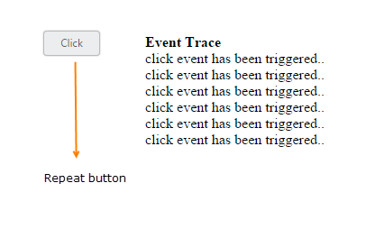

# Repeat Button with Time Interval

When you press button continuously, click event is raised at each specific time interval. This type of button is called **Repeat Button**. This functionality repeatedly raises the click event of button in both button click and from button in pressed state to the released state. **timeInterval** property is used to specify the time Interval for triggering click event, when the button is in pressed state. **repeatButton** property is used to set the button in repeat mode.

The following steps explains you the details about rendering the **Repeat Button.**

In the **HTML** page, add the following button elements to configure **Button** widget.



   
    
        
                        
            <button id="button_repeat">Click
                </button>                       
        

        

            
<b>Event Trace</b>

            

        

    





    $(function () {
        $("#button_repeat").ejButton({
            size: "mini",
            showRoundedCorner: true,
            //used to set the button in repeat mode
            repeatButton: true,
            //specifies the time interval for click method
            //call, when the button is in pressed state
            timeInterval: "200",
            click: "btnClick"
        });
    });
    //If the button  is in pressed state or clicked, this method will be called
    function btnClick(e) {
        $(".eventTrace").html("click event has been triggered.. " + $(".eventTrace").html());
    }



Configure the **CSS** styles to apply on button


    



Execute the above code to render the following output.

 

