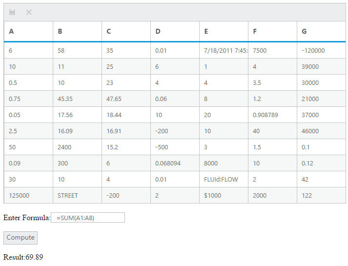

# Getting Started 

Essential Calculate can be configured in a web `HTML` page by using the following steps,

1. Create a `HTML` file and add the following code templates,

   ~~~ html 
    <!DOCTYPE html>
    <html>
    <head>
       <!--Add scripts and CSS files here -->
     </head>
     <body>
       <!--- Create CalcEngine object Here --->
     </body>
    </html>
   ~~~

2. Add scripts files and `CSS` file into the `title` tag of the created `HTML` page,

   ~~~ html
    <head>
    <meta name="viewport" content="width=device-width, initial-scale=1.0" charset="utf-8" />
    <!-- Style sheet for default theme (flat azure) -->
    <link href="http://cdn.syncfusion.com/13.2.0.29/js/web/gradient-saffron-dark/ej.web.all.min.css" rel="stylesheet" />
    <!--Scripts-->
    
    
    <!—The below script have the reference of ejCalculate  -->
    
    <!--Add custom scripts here -->
    </head>
   ~~~

## Calculating a simple equation

This section explains about calculating a simple equation `2*SQRT(25) + SIN(RADIANS(90))` using calculate engine and getting 11 as a result.

### Creating calculate object

The calculate engine will be created within the `body` tag like below,



<body>

 </body>



Here, the `CalcEngine` is instantiated with empty constructor. If any control needs to be integrated with `CalcEngine`, that control can be passed as parameter of constructor. 

### Computing formulas

The `parseAndComputeFormula` method will be used evaluate the equation `2*SQRT(25) + SIN(RADIANS(90))` and return the calculated value in a string format.



<body>



### Evaluating formula

The given formula in the text box can be evaluated using `parseAndComputeFormula` by clicking on the `compute` button.



$("input:button").ejButton({
click: function (args) {
if (document.activeElement.value == "Compute") {
try
{
    var value = calcObj.parseAndComputeFormula($("#formulaTxt").val());     document.getElementById("result").innerHTML = value;
}
catch(ex)
{
	alert(ex.message);
}
}
<!--- grid’s Ok icon code --->
else if (document.activeElement.value == "OK") {
$("#Grid").data("ejGrid")._triggerConfirm(args);
}
<!--- grids’s Cancel icon code --->                 
else if (document.activeElement.value == "Cancel") {  $("#Grid").data("ejGrid")._triggerConfirm(args);  }               
}
});



## Performing calculation using indexer method (CalcQuick)

The indexer method will provides options to directly parse and compute a formula, or register variable names that can later be used in more complex formulas involving these variables.

These registered variable names are indexer keys. In `[C] = [A] + [B] * 10`, the names A, B, C are indexer keys. The text boxes can be taken for registering it as keys. Here is the `HTML` code for text boxes inside `div` tag.



 <input type="text" id="txtBoxA" />
 
 <input type="text" id="txtBoxB" />
 
 <input type="text" id="txtBoxC" />



### Register elements as keys

CalcQuick object can be created in the `body` tag. Each element is registered as the key or virtual references by using the `setKeyValue` method.





### Assigning formulas and values

After registering keys, the formulas and values are assigned for the keys.



document.getElementById("txtBoxA").value = "12"; 
document.getElementById("txtBoxB").value = "3"; 
document.getElementById("txtBoxC").value = "= [A] + 2 * [B]"; 

// codes -> setDirty



### Evaluate keys

The evaluation of keys can be triggered using `setDirty` method which will computes the formulas of the keys. The result will be returned through `getKeyValue` method.



//evaluating key formulas
calculator.setDirty(); 
document.getElementById("txtBoxA").value = calculator.getKeyValue("A"); 
document.getElementById("txtBoxB").value = calculator.getKeyValue("B"); 
document.getElementById("txtBoxC").value = calculator.getKeyValue("C");



After the code, the computed value will be returned in the `txtBoxC`. The formula of the key can be retrieved through `getFormula(key)` method.

