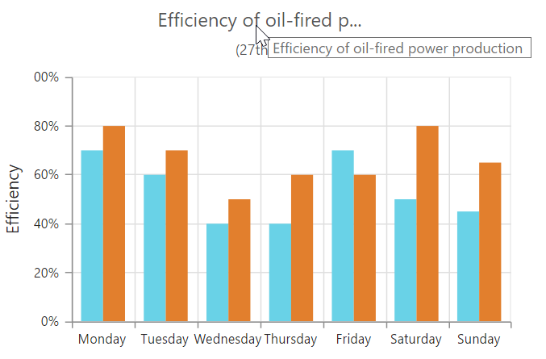
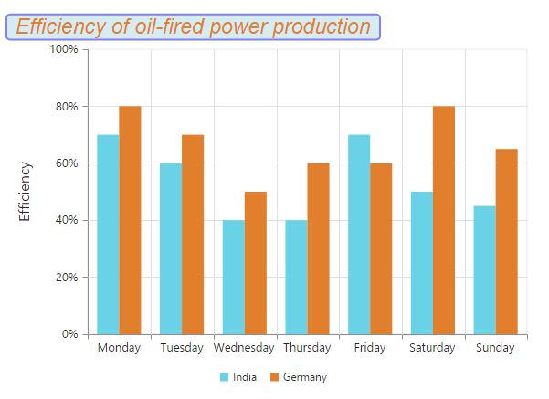
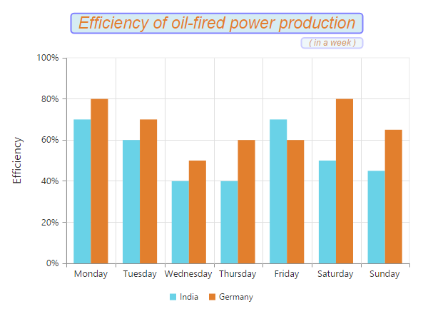

# Chart Title & Subtitle

## Title

By using the title option, you can add the [`text`](../api/ejchart#members:title-text) as well as customize its [`border`](../api/ejchart#members:title-border),  [`background`](../api/ejchart#members:title-background) color and [`font`](../api/ejchart#members:title-font).
The visibility of the title is controlled by using the [`visible`](../api/ejchart#members:title-visible)property.



$("#container").ejChart({ 

             // ... 
             title: { 
                  //Adding text to chart title
                 text: 'Efficiency of oil-fired power production ', 
                  //Change the title text background color
                 background : "lightblue",
                  //Customizing Chart title border
                border: { 
                           color: "blue",
                           width: 2,
                           opacity: 0.5 ,
                           cornerRadius : 4
                         },
 
                  //Customizing Chart title font 
                 font:{ 
                         opacity: 1,
                         fontFamily: "Arial",
                         fontStyle: 'italic',
                         fontWeight: 'regular',
                         color: "#E27F2D",
                         size: '23px' 
                     },
               }, 
        // ... 

});



[Click](http://js.syncfusion.com/demos/web/#!/azure/chart/chartcustomization/subtitle) here to view the Chart Title online demo sample.

We can trim, wrap and wrapAndTrim to the chart title using [`textOverflow`](../api/ejchart#members:title-textoverflow) property. 
To perform trim operation [`enableTrim`](../api/ejchart#members:title-enableTrim) property is used and text width is controlled by using the [`maximumWidth`](../api/ejchart#members:title-maximumwidth) property.
The original text will be displayed as tooltip on mouse hover.



    $("#container").ejChart(
        {
            // ...

            title: {
                text: 'Efficiency of oil-fired power production ',
                 //To enable the title trim, wrap and wrapAndTrim
                enableTrim: true,
                 //Setting maximum width to the title
                maximumWidth: 150,
                 //To trim the title
                textOverflow: "trim",
            },

            // ...

        });



### Title Alignment

You can change the title alignment to *center*, *far* and *near* by using the [`textAlignment`](../api/ejchart#members:title-textalignment) property of the chart title. 



    $("#container").ejChart({
           
          //  ...
          
           title: {
                //Change title text alignment
                textAlignment: "near",
                //...
            }          

            //  ...   
      });

 

### title border

Options to customize the [`border`](../api/ejchart#members:title-border) of the title.

### title border width 
[`Width`](../api/ejchart#members:title-border-width) of the title border.



    $("#container").ejChart({
           
          title:{ 
          border : { width:1}
      }  
      });

 

### title border color

[`color`] (../api/ejchart#members:title-border-color)of the title border.



    $("#container").ejChart({
           
          title:{ 
          border : { color: "black"}
      }  
      });

 

### title border opacity

[`opacity`] (../api/ejchart#members:title-border-opacity)of the title border.



    $("#container").ejChart({
           
         title:{ 
          border : { opacity: 1 }
      }  
      });

 

### title border cornerRadius
[`cornerRadius`](../api/ejchart#members:title-border-cornerradius)  of the title border.



    $("#container").ejChart({
           
       title:{ 
          border : { cornerRadius: 2 }
      }     
      });

 

### title fontFamily

[`Font family`](../api/ejchart#members:title-font-fontfamily) for Chart title.



    $("#container").ejChart({
           
      title : { font : { fontFamily : "Algerian" } }   
      });

 

### title fontStyle

[`Font style`](../api/ejchart#members:title-font-fontstyle) for Chart title.



    $("#container").ejChart({
           
    title : { font : { fontStyle : "italic" } }               
      });

 

### title fontWeight

[`Font weight`](../api/ejchart#members:title-font-fontweight) for Chart title.



    $("#container").ejChart({
           
    title : { font : { fontWeight : "lighter" } }              
      });

 

### title font opacity

[`Opacity`] (../api/ejchart#members:title-font-opacity)of the Chart title.



    $("#container").ejChart({
           
  title : { font : { opacity : 0.8 } }                   
      });

 

### title font size
Font [`size`](../api/ejchart#members:title-font-size) for Chart title.



    $("#container").ejChart({
           
  title : { font : { size : "22px" } }                
      });

 

### title maximum width
[`MaximumWidth`](../api/ejchart#members:title-maximumwidth) of the title, when the title exceeds this width, the title gets trimmed, when enableTrim is true.



    $("#container").ejChart({
           
 title : { maximumWidth : 150 }                    
      });

 

### title text overflow
 [`TextOverflow`](../api/ejchart#members:title-textoverflow) specifies the action taken when the Chart width is more than the titleWidth.

 

    $("#container").ejChart({
           
 title : { textOverflow : "trim" }                          
      });

 

### title subtitle font fontFamily

[`FontFamily`](../api/ejchart#members:title-subtitle-font-fontfamily) of sub title.

 

    $("#container").ejChart({
           
 title: {subTitle : {font :{ fontFamily : "Algerian" } } }                               
      });

 

### title subtitle font fontStyle

[`FontStyle`](../api/ejchart#members:title-subtitle-font-fontstyle)for sub title.



   $("#container").ejChart({

   title: { subTitle : {font :{ fontStyle : "Normal" } } }                     

});

 

### title subtitle font fontWeight

[`FontWeight`](../api/ejchart#members:title-subtitle-font-fontweight)for sub title.



   $("#container").ejChart({

   title: { subTitle : {font :{ fontWeight : "regular" } } }                    

});

 
 
 ### title subtitle font opacity

 [`Opacity`](../api/ejchart#members:title-subtitle-font-opacity) of the sub title.

 

   $("#container").ejChart({

   title: { subTitle : {font :{ opacity : 0.5 } } }                   

});

 

### title subtitle font size

[`Font size`](../api/ejchart#members:title-subtitle-font-size) for sub title.



   $("#container").ejChart({

  title: { subTitle : {font :{ size : "14px" } } }                       

});

 

### title subtitle background

[`Background`](../api/ejchart#members:title-subtitle-background) color for the chart subtitle.



   $("#container").ejChart({

   title : {  subTitle:{ background : "red" } }                       

});

 

### title subtitle border width

[`Width`](../api/ejchart#members:title-subtitle-border-width) of the subtitle border.



   $("#container").ejChart({

   title:{ 
         subTitle:{ border : { width:1} }
      }                        

});

 

### title subtitle border color

[`color`](../api/ejchart#members:title-subtitle-border-color) of the subtitle border.



   $("#container").ejChart({

   title:{ 
         subTitle:{ border : { color: "black"}}
      }  
                                

});

 

### title subtitle border opacity
[`opacity`](../api/ejchart#members:title-subtitle-border-opacity) of the subtitle border.



   $("#container").ejChart({

   title:{ 
        subTitle:{ border : { opacity: 1 } }
      }  
                                

});

 

### title subtitle border opacity
[`opacity`](../api/ejchart#members:title-subtitle-border-opacity) of the subtitle border.



   $("#container").ejChart({

   title:{ 
        subTitle:{ border : { opacity: 1 } }
      }  
                                

});

 

### title subtitle border cornerRadius
[`cornerRadius`](../api/ejchart#members:title-subtitle-border-cornerradius) of the subtitle border.



   $("#container").ejChart({

   title:{ 
       subTitle:{  border : { cornerRadius: 2 } }
      }  
                                

});

 

### title subtitle text

[`Text`](../api/ejchart#members:title-subtitle-text) to be displayed in sub title.



   $("#container").ejChart({

   title:{ 
       title: { subTitle: { text : "Performance chart" } } 
      }  
                                

});

 

### title subtitle visible
Controls the [`visibility`](../api/ejchart#members:title-subtitle-visible) of the Chart SubTitle



   $("#container").ejChart({

   title:{ 
       title :{ subTitle: { visible : false }  }     
      }  
                                

});

 

### title subtitle maximum width
[`Maximum width`](../api/ejchart#members:title-subtitle-maximumwidth) of the Subtitle, when the Subtitle exceeds this width, the Subtitle gets trimmed, when enableTrim is true.



   $("#container").ejChart({

   title:{ 
      title : { subTitle: { maximumWidth : 150 }  }    
      }  
                                

});

 

### title subtitle text overflow
[`text overflow`](../api/ejchart#members:title-subtitle-textOverflow) specifies the action taken when the Chart width is more than the SubTitleWidth.



   $("#container").ejChart({

   title:{ 
     title : { subTitle: { textOverflow : "trim" }  }  
      }  
                                

});

 

## Add Subtitle to the chart

By using the subTitle option, you can add the [`subTitle`](../api/ejchart#members:title-subtitle) to the chart title and customize its [`border`](../api/ejchart#members:title-subtitle-border),  [`background`](../api/ejchart#members:title-subtitle-background) color and [`font`](../api/ejchart#members:title-subtitle-font). 



$("#container").ejChart({
               
              // ... 
            title: {
                  // ... 
                 subTitle: { 
                           //Add subtitle to chart title 
                            text: "( in a week )", 
                          //Change the title text background color
                            background : "lightblue",
                          //Customizing Chart subtitle border
                            border: { 
                                      color: "blue",
                                      width: 2,
                                      opacity: 0.2 ,
                                      cornerRadius : 4
                           },

                           //Customizing Chart subtitle font 
                              font:{ 
                                     opacity: 1, 
                                     fontFamily: "Arial", 
                                     fontStyle: 'italic',
                                     fontWeight: 'regular', 
                                     color: "#E27F2D", 
                                     size: '12px' 
                                }, 
                              } 
                           } 
                  // ...
 });



We can trim, wrap and wrapAndTrim to the chart title using [`textOverflow`](../api/ejchart#members:title-subtitle-textoverflow) property. 
To perform trim operation [`enableTrim`](../api/ejchart#members:title-subtitle-enableTrim) property is used and text width is controlled by using the [`maximumWidth`](../api/ejchart#members:title-subtitle-maximumwidth) property.
The original text will be displayed as tooltip on mouse hover.



        $("#container").ejChart(
         {
             // ...

             title: {

                 // ...
                 subTitle:{
                     text: '( in a week )', 
                     //To enable the sub-title trim, wrap and wrap and trim
                     enableTrim: true,
                     //Setting maximum width to the sub-title
                     maximumWidth: 50,
                     //To trim the sub-title
                     textOverflow: "wrap",
                 },
             },

             // ...

         });



### Subtitle Alignment

You can change the subtitle alignment to *center*, *far* and *near* by using the [`textAlignment`](../api/ejchart#members:title-subtitle-textalignment) property of the subTitle.



    $("#container").ejChart({
    
        //  ...  
        title: {                
             // ...
             subTitle:{
                 //Change subtitle to text alignment
                 textAlignment: "center",		
                 // ...
               }
         }
            
            //  ...   
      });



