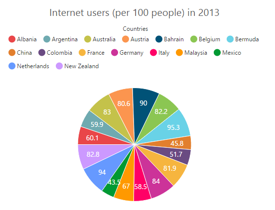
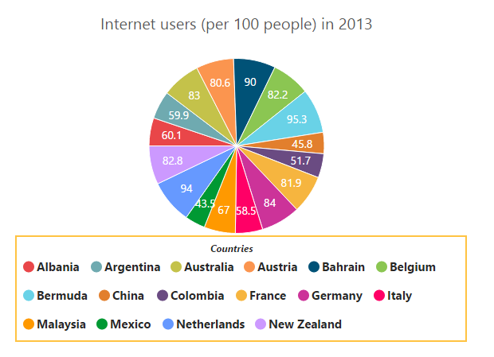

# Legend

The legend contains the list of chart series and Trendlines that appear in a chart. 

## Legend Visibility

By default, the legend is enabled in the chart. You can enable or disable it by using the [`visible`](../api/ejchart#members:legend-visible) option of the [`legend`](../api/ejchart#members:legend).



    $("#container").ejChart({
         // ...
         legend: {
            //Visible chart legend
            visible: true
        },
        //...
     });



[Click](http://js.syncfusion.com/demos/web/#!/azure/chart/chartcustomization/legendposition) here to view the online demo sample for legend position.

## Legend title

To add the title to the legend, you have to specify the [`text`](../api/ejchart#members:legend-title-text) option.



        $("#container").ejChart({
            // ...             
              legend: {
                //...
                title: {
                   //Add title to the chart legend
	               text: "Countries",
				
		         }  },

            // ...             
        });



## Position and Align the Legend

By using the [`position`](../api/ejchart#members:legend-position) option, you can position the legend at *left*, *right*, *top* or *bottom* of the chart. The legend is positioned at the **bottom** of the chart, by default.



        $("#container").ejChart({
            // ...             
            legend: {
                // ...  
                //Place the legend at top of the chart
                position: 'top',

            }
            // ...             
        });



**Legend Alignment**

You can align the legend to the *center*, *far* or *near* based on its position by using the [`alignment`](../api/ejchart#members:legend-alignment) option.



        $("#container").ejChart({
            // ...             
            legend: {
                //...
                //The below two settings will place the legend at the top-right corner of the chart.
                alignment: 'far',
                position: 'top', 
            }
            // ...             
        });



## Arrange legend items in the rows and columns

You can arrange the legend items horizontally and vertically by using the [`rowCount`](../api/ejchart#members:legend-rowcount) and [`columnCount`](../api/ejchart#members:legend-columncount) options of the legend.

* When only the [`rowCount`](../api/ejchart#members:legend-rowcount) is specified, the legend items are arranged according to the [`rowCount`](../api/ejchart#members:legend-rowcount) and number of columns may vary based on the number of legend items.

* When only the [`columnCount`](../api/ejchart#members:legend-columncount) is specified, the legend items are arranged according to the [`columnCount`](../api/ejchart#members:legend-columncount) and number of rows may vary based on the number of legend items.

* When both the options are specified, then the one which has higher value is given preference. For example, when the [`rowCount`](../api/ejchart#members:legend-rowcount) is 4 and [`columnCount`](../api/ejchart#members:legend-columncount) is 3, legend items are arranged in 4 rows.

* When both the options are specified and have the same value, the preference is given to the [`columnCount`](../api/ejchart#members:legend-columncount) when it is positioned at the top/bottom position. The preference is given to the [`rowCount`](../api/ejchart#members:legend-rowcount) when it is positioned at the left/right position.
 



        $("#container").ejChart({
            // ...             
            legend: {
                //Arrange legend items in 4 rows and approximately 4 columns. Column couldn’t may vary based on number of items. 
                rowCount: 4,
                columnCount: 4 
            }
            // ...             
        });



## Customization

### Legend shape

To change the legend icon shape, you have to specify the shape in the [`shape`](../api/ejchart#members:legend-shape) property of the legend. When you want the legend icon to display the prototype of the series, you have to set the **seriesType** as shape.



        $("#container").ejChart({
            // ...             
            legend: {
                //...
                //Change legend shape
                 shape: 'seriesType',
            }
            // ...             
        });



### Legend items size and border

You can change the size of the legend items by using the [`width`](../api/ejchart#members:legend-itemstyle-width) and [`height`](../api/ejchart#members:legend-itemstyle-height) options. To change the legend item border, use [`border`](../api/ejchart#members:legend-border) option of the legend [`itemStyle`](../api/ejchart#members:legend-itemstyle).



        $("#container").ejChart({
            // ...             
            legend: {
                //...
                //Change legend items border, height and width
                itemStyle: {width: 13, height: 13, border: { color: "#FF0000", width: 1 } },
            }
            // ...             
        });



### Legend size

By default, legend takes 20% of the [`height`](../api/ejchart#members:legend-size-height) horizontally when it was placed on the top or bottom position and 20% of the [`width`](../api/ejchart#members:legend-size-width) vertically while placing on the left or right position of the chart. You can change this default legend size by using the [`size`](../api/ejchart#members:legend-size) option of the legend.  



        $("#container").ejChart({   
            // ...
            legend: { 
                 //...
                 //Change legend size
                 size:{width: '550', height: '100'}
            }
            // ...             
        });



### Legend Item Padding

You can control the spacing between the legend items by using the [`itemPadding`](../api/ejchart#members:legend-itempadding) option of the legend.  The default value is 10. 



        $("#container").ejChart({
            // ...             
            legend: {
                //...
                //Add space between each legend item
                itemPadding: 15,
            }
            // ...             
        });



### Legend background

You can customize the legend background by using the [`background`](../api/ejchart#members:legend-background) option in the legend. 



        $("#container").ejChart({
            // ...             
            legend: {
                //...
                //Set background image for the legend
                background : "green url('flower.png')"} 
            }
            // ...             
        });



### Legend fill

You can customize the legend item  shape color  by using the [`fill`](../api/ejchart#members:legend-fill) option in the legend. 
By using this property, it displays all legend item shapes in same color.Legend items representing invisible series is displayed in gray color.



        $("#container").ejChart({
            // ...             
            legend: {
                //...
                //Set fill color  for the legend
                fill : "green "} 
            }
            // ...             
        });



### Legend border

You can customize the legend border by using the [`border`](../api/ejchart#members:legend-border) option in the legend. 
The color and width of the border are customized using the [`color`](../api/ejchart#members:legend-border-color) and [`width`](../api/ejchart#members:legend-border-width) properties.



        $("#container").ejChart({
            // ...             
            legend: {
                //...
                //Set border color and width to legend
                border: {color: "#FFC342", width: 2},
            }
            // ...             
        });



### Legend opacity

You can customize the legend opacity by using the [`opacity`](../api/ejchart#members:legend-opacity) option in the legend. 



        $("#container").ejChart({
            // ...             
            legend: {
                //...
                //Set opacity for the  legend
               opacity: 0.5,
            }
            // ...             
        });



### Scrollbar for legend

You can enable or disable the legend scrollbar by using the [`enableScrollbar`](../api/ejchart#members:legend-enablescrollbar) option of the legend. When you disable the scrollbar option, the legend does not consider the [`default size`](legend.html#legend-size) and chart draws in the remaining space. If you have specified the [`size`](legend.html#legend-size) to the legend with the scrollbar disabled, then the legends beyond this limit will get clipped. The default value of [`enableScrollbar`](../api/ejchart#members:legend-enablescrollbar) option is **true**.  



        $("#container").ejChart({
            // ...             
            legend: {
                //...
                //Enable scrollbar option in for legend
                enableScrollbar: true,
                size:{width: '430', height: '80'},
            }
            // ...             
        });



### Legend Location

The [`location`](../api/ejchart#members:legend-location) property is used for customizing the position of the chart legend. 
Legend is placed in provided location only when value of **position** property is **custom**. Both the [`x`](../api/ejchart#members:legend-location-x)and [`y`](../api/ejchart#members:legend-location-y) locations can be customized in the location property



        $("#container").ejChart({
            // ...             
            legend: {
                //...
               
                location :{x :20 ,y:100}  
            }
            // ...             
        });



### Customize the legend text

To customize the legend item text and title you can use the [`font`](../api/ejchart#members:legend-font) and [`title`](../api/ejchart#members:legend-title) options. You can change the legend title alignment by using the [`textAlignment`](../api/ejchart#members:legend-title-textalignment) option of the legend title.



        $("#container").ejChart({
            // ...             
            legend: {
                //...
                //Customize the legend item text
                font: { fontFamily: 'Segoe UI', fontStyle: 'Normal', fontWeight: 'Bold', size: '15px' },
                title: {
                    //...
		            textAlignment: "center",
                    //Customize the legend title text
	                font: { fontFamily: 'Segoe UI', fontStyle: 'Italic', 
                                        fontWeight: 'Bold', size: '12px' },
	             }            
             },
            // ...             
        });



### LegendItems Text Overflow

**Trim**

You can trim the legend item text when its width exceeds the [`legend.textWidth`](../api/ejchart#members:legend-textwidth), by specifying [`textOverflow`](../api/ejchart#members:legend-textoverflow) as **"trim"**. The original text will be displayed on mouse hover.



    $("#container").ejChart({
            
            // ...             
            legend: {
               //trim the legend text
		        textOverflow: 'trim', 
		        textWidth: 34
	          } 

            // ...             
        });



 

**Wrap**

By specifying [`textOverflow`](../api/ejchart#members:legend-textOverflow) as **"wrap"**, you can wrap the legend text by word.

**WrapAndTrim**

You can wrap and trim the legend text by specifying [`textOverflow`](../api/ejchart#members:legend-textOverflow) as **"wrapAndTrim"**. The original text will be displayed on mouse hover.

   

## Handle the legend item clicked

You can get the legend item details such as *index*, *bounds*, *shape* and *series* by subscribing the [`legendItemClick`](../api/ejchart#events:legenditemclick) event on the chart. When the legend item is clicked, it triggers the event and returns the [`legend information`](../api/ejchart.html#events:legenditemclick). 



        $("#container").ejChart({

            legend: {
                   //...
              },
              
           //Subscribe the legend item click event
            legendItemClick: "onLegendClicked",
            
            //...
        });
        
     function onLegendClicked(sender) {
        //Get legend item details on legend item click.
        var legendItem = sender.data;
      }



## Series selection on legend item click

You can select a specific series or point while clicking on the corresponding legend item through disabling the [`toggleSeriesVisibility`](../api/ejchart#members:legend-toggleseriesvisibility) option of the legend. The default value of toggleSeriesVisibility option is **true**. To customize the series selection refer to the series [`selection`](../api/ejchart.html#members:series-selectionsettings).



        $("#container").ejChart({
            // ...             
                legend: {
                   //...
                   //Disable series collapsing on legend item clicked
                   toggleSeriesVisibility: false,
               },
           //...
      });
      



## Collapsing legend item

You can collapse the specific series/point legend item displaying in the chart, by setting the [`visibleOnLegend`](../api/ejchart.html#members:series-visibleonlegend) as *"hidden"* in the point or series.



     $("#container").ejChart({
     
          //Initializing Series
          series:[{
             points: [{ x: 'Albania', y: 60.1 },
                     //...
                     //Collapse the point's legend item in the legend collection
                     { x: 'New Zealand', y: 82.8, visibleOnLegend:'hidden' }]
                  }],
         legend: { visible: true}
     });
      


## legend enableScrollbar
Controls whether legend has to use scrollbar or not. When [`enableScrollbar`](../api/ejchart#members:legend-enablescrollbar) appears depending upon size and position properties of legend.



     $("#container").ejChart({
     
        legend :{ enableScrollbar : false}                    
     });
      


## legend font

Options to customize the [`font`](../api/ejchart#members:legend-font)used for legend item text.

## legend font fontFamily

[`FontFamily`](../api/ejchart#members:legend-font-fontfamily) for legend item text.



     $("#container").ejChart({
     
       legend :{ font :{fontFamily : "Algerian"}}                           
     });
      


## legend font fontStyle

[`FontStyle`](../api/ejchart#members:legend-font-fontstyle) for legend item text.



     $("#container").ejChart({
     
      legend :{ font :{fontStyle : "italic"}}                    
                    
     });
      


## legend font fontWeight

[`FontWeight`](../api/ejchart#members:legend-font-fontweight)for legend item text.



     $("#container").ejChart({
     
    legend :{ font :{fontWeight : "lighter"}}                    
                    
     });
      


## legend font size
Font [`size`] (../api/ejchart#members:legend-font-size)for legend item text.



     $("#container").ejChart({
     
   legend :{ font :{size : "14px"}}                        
                    
     });
      


## legend itemStyle
Options to customize the [`style`](../api/ejchart#members:legend-itemstyle) of legend items.

## legend itemStyle border
Options for customizing the [`border`](../api/ejchart#members:legend-itemstyle-border) of legend items.

## legend itemStyle border color
Border [`color`](../api/ejchart#members:legend-itemstyle-border-color)of the legend items.
 
 

     $("#container").ejChart({
     
    legend :{ itemStyle :{border : { color : "green' }}}                             
                    
     });
      


## legend itemStyle border width
Border [`width`](../api/ejchart#members:legend-itemstyle-border-width) of the legend items.



     $("#container").ejChart({
     
    legend :{ itemStyle :{border :{ width : 2 }}}                                             
                    
     });
      


## legend title font

Options to customize the [`font`](../api/ejchart#members:legend-title-font) used for legend title

## legend title font fontFamily

[`FontFamily`](../api/ejchart#members:legend-title-font-fontfamily) for the text in legend title.



     $("#container").ejChart({
     
    legend: { title: { font :{fontFamily: "Algerian" } } }                                            
                    
     });
      


## legend title font fontStyle
[`Font style`](../api/ejchart#members:legend-title-font-fontstyle) for legend title



     $("#container").ejChart({
     
    legend: { title: { font :{fontStyle: "normal" } }                                             
                    
     });
      


## legend title font font weight
[`Font weight`](../api/ejchart#members:legend-title-font-fontweight) for legend title.



     $("#container").ejChart({
     
    legend: { title: { font :{fontWeight: "normal" } } }                                             
                    
     });
      


## legend title font font size

[`Font-Size`](../api/ejchart#members:legend-title-font-size) for legend title.



     $("#container").ejChart({
     
     legend: { title: { font :{size: "14px" } } }                                               
                    
     });
      


