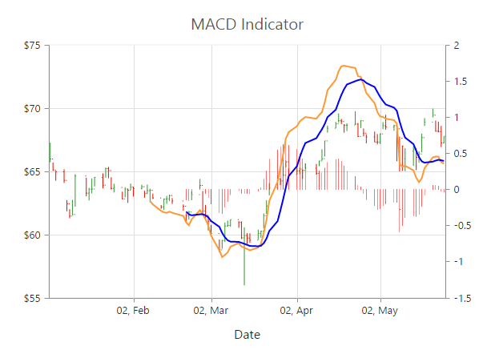

# Technical Indicators

EjChart control supports 10 types of technical indicators. 

## Bind data to render the indicator

You can bind the series [`dataSource`](../api/ejchart#members:indicators-datasource) to the indicator by setting the specific series name to the indicator by using the [`indicators.seriesName`](../api/ejchart#members:indicators-seriesname) property.



        $("#container").ejChart({
              //  ...
              //Initializing Series
              series:[{
                  dataSource: chartData,
                  xName: "xDate",
                  high: "High",
                  low: "Low",
                  open: "Open",
                  close: "Close", 
                  //Set name to series
                  name: 'Hilo',
                  //  ...
            }],

            //Initializing Indicators    
            indicators: [{
                //Set Hilo series dataSource to indicator using seriesName
                seriesName: "Hilo",
                //  ...
	     }],
            //  ...
     });



Also, you can add data to the indicator directly by using the [`dataSource`](../api/ejchart#members:indicators-datasource) option of the [`indicator`](../api/ejchart#members:indicators).  



        $("#container").ejChart({
            //  ...
            //Initializing Indicators    
            indicators: [{
                   //Add dataSource to indicator directly
                    dataSource: chartData,
                    xName: "xDate",
                    high: "High",
                    low: "Low",
                    open: "Open",
                    close: "Close",                
                    //  ...
	       }],
            //  ...
     });



	
## Indicator Types

### Accumulation Distribution

To create an Accumulation Distribution indicator, set the [`indicators.type`](../api/ejchart#members:indicators-type) as **"accumulationdistribution"**. Accumulation Distribution require **‘volume’** field additionally with the [`dataSource`](../api/ejchart#members:indicators-datasource) to calculate the signal line.



        $("#container").ejChart({
             // Initializing Series
              series:[{
                       name: "Hilo",
                       dataSource: chartData,
                       xName: "xDate",
                       high: "High",
                       low: "Low",
                       open: "Open",
                       close: "Close",
                       //Add additional volume field to data source for accumulation distribution
                       volume: "Volume",
                       //  ...
                   }],
               //Initializing Indicators    
               indicators: [{
                     seriesName: "Hilo",
                     //Set indicator type
                     type: "accumulationdistribution", 
                     //  ...
	        }],
            // ...   
        });



[Click](http://js.syncfusion.com/demos/web/#!/azure/chart/technicalindicators/accumulationdistribution) here to view the Accumulation Distribution indicator online demo sample.

### Average True Range (ATR)

You can create an ATR indicator by setting the [`indicators.type`](../api/ejchart#members:indicators-type) as **"atr"** in the [`indicators`](../api/ejchart#members:indicators). 



        $("#container").ejChart({
            // ...
            //Initializing Indicators    
            indicators: [{
                 //Set indicator type
                 type: "atr", 
                 //  ...
	      }],
            // ...   
        });



[Click](http://js.syncfusion.com/demos/web/#!/azure/chart/technicalindicators/atr) here to view the ATR indicator online demo sample.

### Bollinger Band 

Bollinger Band indicator is created by setting the [`indicators.type`](../api/ejchart#members:indicators-type) as **"bollingerband"**. It contains three lines, namely upper band, lower band and signal line. Bollinger Band default value of the period is 14 and standardDeviations is 2.



        $("#container").ejChart({
             // ...             
             //Initializing Indicators    
              indicators: [{
                   //Set indicator type
                   type: " bollingerband", 
                   //  ...
	         }],
            // ...   
        });



[Click](http://js.syncfusion.com/demos/web/#!/azure/chart/technicalindicators/bollingerband) here to view the Bollinger Band indicator online demo sample.

### Exponential Moving Average (EMA)

To render an EMA indicator, you have to set the [`indicators.type`](../api/ejchart#members:indicators-type) as **"ema"**.  



        $("#container").ejChart({
            // ...             
             //Initializing Indicators    
              indicators: [{
                   //Set indicator type
                   type: "ema", 
                   //  ...
	         }],
            // ...   
        });



[Click](http://js.syncfusion.com/demos/web/#!/azure/chart/technicalindicators/ema) here to view the EMA indicator online demo sample.

### Momentum 

Momentum Technical indicator is created by setting the [`indicators.type`](../api/ejchart#members:indicators-type) as **"momentum"**. The momentum indicator renders two lines, namely upper band and signal line. Upper band always rendered at the value 100 and the signal line is calculated based on the momentum of the data.



        $("#container").ejChart({
            // ...             
             //Initializing Indicators    
              indicators: [{
                   //Set indicator type
                   type: "momentum", 
                   //  ...
	         }],
            // ... 
        });



[Click](http://js.syncfusion.com/demos/web/#!/azure/chart/technicalindicators/momentum) here to view the Momentum indicator online demo sample.

### Moving Average Convergence Divergence (MACD)

To render an MACD indicator, you have to set the [`indicators.type`](../api/ejchart#members:indicators-type) as **"macd"**.  MACD indicator contains [`MACD line`](../api/ejchart#members:indicators-macdline), Signal line and Histogram column. Histogram is used to differentiate MACD and signal line. The color and width of MACD Line can be customized using [`fill`](../api/ejchart#members:indicators-macdline-fill) and [`width`](../api/ejchart#members:indicators-macdline-width) property.



        $("#container").ejChart({
            // ...             
             //Initializing Indicators    
              indicators: [{
                   //Set indicator type
                   type: "macd", 
                   //  ...
	         }],
            // ...  
        });



[Click](http://js.syncfusion.com/demos/web/#!/azure/chart/technicalindicators/macd) here to view the MACD indicator online demo sample.

#### macdType

By using the [`macdType`](../api/ejchart#members:indicators-macdtype) enumeration property, you can change the MACD rendering as *line*, *histogram* or *both*. 



        $("#container").ejChart({
            // ...             
             //Initializing Indicators    
              indicators: [{
                   type: "macd", 
                   //Set MACD draw type
                   macdType: "histogram", 
                   //  ...
	         }],
            // ...  
        });



### Relative Strength Index (RSI)

To render the RSI indicator, set the [`indicators.type`](../api/ejchart#members:indicators-type) as **"rsi"**. It contains three lines, namely upper band, lower band and signal line. Upper and lower band always render at value 70 and 30 respectively and signal line is calculated based on the **RSI** formula.



        $("#container").ejChart({
            // ...             
             //Initializing Indicators    
              indicators: [{
                   //Set indicator type
                   type: "rsi",
                   //  ...
	         }],
            // ...
        });



[Click](http://js.syncfusion.com/demos/web/#!/azure/chart/technicalindicators/rsi) here to view the RSI indicator online demo sample.

### Simple Moving Average (SMA)

To render the SMA indicator, you should specify the [`indicators.type`](../api/ejchart#members:indicators-type) as **"sma"**.  



        $("#container").ejChart({
            // ...             
             //Initializing Indicators    
              indicators: [{
                   //Set indicator type
                   type: "sma",
                   //  ...
	         }],
            // ...
        });



[Click](http://js.syncfusion.com/demos/web/#!/azure/chart/technicalindicators/sma) here to view the SMA indicator online demo sample.

### Stochastic 

For the Stochastic indicator, you need to set the [`indicators.type`](../api/ejchart#members:indicators-type) as **"stochastic"**. The Stochastic indicator renders four lines namely, [`upper line`](../api/ejchart#members:indicators-upperline),
[`lower line`](../api/ejchart#members:indicators-lowerline), stochastic line and the signal line. Upper line always rendered at value 80 and the lower line is rendered at value 20. Stochastic and Signal Lines are calculated based on the stochastic formula.



        $("#container").ejChart({
            // ...            
             //Initializing Indicators    
              indicators: [{
                   //Set indicator type
                   type: "stochastic",
                   //  ...
	         }],
            // ...  
        });



[Click](http://js.syncfusion.com/demos/web/#!/azure/chart/technicalindicators/stochastic) here to view the stochastic indicator online demo sample.

### Triangular Moving Average (TMA)

To render the TMA indicator, you should specify the [`indicators.type`](../api/ejchart#members:indicators-type) as **"tma"**. 



        $("#container").ejChart({
            // ...             
             //Initializing Indicators    
              indicators: [{
                   //Set indicator type
                   type: "tma",
                   //  ...
	         }],
            // ...  
        });



[Click](http://js.syncfusion.com/demos/web/#!/azure/chart/technicalindicators/tma) here to view the TMA indicator online demo sample.

## Enable Tooltip 

To display the indicator tooltip, use [`visible`](../api/ejchart#members:indicators-tooltip) option of the [`indicators-tooltip`](../api/ejchart#members:indicators-tooltip). 
Also, you can change and customize the tooltip [`color`](../api/ejchart#members:indicators-tooltip-fill), [`border`](../api/ejchart#members:indicators-tooltip-border), [`format`](../api/ejchart#members:indicators-tooltip-format) and [`font`](../api/ejchart#members:indicators-tooltip-font) properties similar to the series tooltip.



        $("#container").ejChart({
            // ...             
             //Initializing Indicators    
              indicators: [{
                   //  ...
                   tooltip: {
                        //Enable tooltip for indicator
                        visible: true
                      },
	         }],
            // ...  
        });



## Indicators dPeriod

The [`dPeriod`](../api/ejchart#members:indicators-dperiod) value for stochastic indicator.



        $("#container").ejChart({
           indicators :[{ dPeriod : 4}]

        });



## Indicators enableAnimation

Enables/disables the [`enableAnimation`](../api/ejchart#members:indicators-enableanimation)



        $("#container").ejChart({
            indicators :[{ enableAnimation :  true}]

        });



## Indicators AnimationDuration

Specifies [`animationDuration`](../api/ejchart#members:indicators-animationduration) for indicator rendering.



        $("#container").ejChart({
             indicators :[{ animationDuration:2000}]

        });



## Indicators fill
 [`fill`] (../api/ejchart#members:indicators-fill) color of the technical indicator.

 

        $("#container").ejChart({
                 indicators :[{ fill : "#ff0000"}]

        });



## Indicators histogram
Options to customize the [`histogram`] (../api/ejchart#members:indicators-histogram)in MACD indicator.

## Indicators histogram border
Options to customize the histogram [`border`] (../api/ejchart#members:indicators-histogram-border) in MACD indicator.

## Indicators histogram border color
[`Color`](../api/ejchart#members:indicators-histogram-border-color) of the histogram border in MACD indicator.

 

        $("#container").ejChart({
                indicators :[{ histogram : {border: {color: "#ff0000"}}}]

        });



## Indicators histogram border width
Controls the [`width`](../api/ejchart#members:indicators-histogram-border-width) of histogram border line in MACD indicator.

 

        $("#container").ejChart({
              indicators :[{ histogram : {border: {width: 2}}}]

        });



## Indicators histogram border fill
[`fill`](../api/ejchart#members:indicators-histogram-fill) color of histogram columns in MACD indicator.

 

        $("#container").ejChart({
                indicators :[{ histogram : {fill: "#ff0000"}}]

        });



## Indicators histogram border opacity
[`Opacity`](../api/ejchart#members:indicators-histogram-opacity) of histogram columns in MACD indicator.



        $("#container").ejChart({
             indicators :[{ histogram : {opacity: 0.5}}]

        });



## Indicators kPeriod
Specifies the [`kPeriod`](../api/ejchart#members:indicators-kperiod) in stochastic indicator.



   $("#container").ejChart({

    indicators :[{ kPeriod : 4}]
                        
});



## Indicators longPeriod
Specifies the [`long period`](../api/ejchart#members:indicators-longperiod) in MACD indicator.



   $("#container").ejChart({

    indicators :[{ longPeriod :  14"}]
                        
});



## Indicators lowerLine
Options to customize the [`lower line`](../api/ejchart#members:indicators-lowerline) in indicators.

## Indicators lowerLine fill
Color of [`lower line`](../api/ejchart#members:indicators-lowerline-fill)



   $("#container").ejChart({

   
     indicators :[{ lowerLine : {fill: "#ff0000"}}]
                        
});



## Indicators lowerLine width
[`Width`](../api/ejchart#members:indicators-lowerline-width) of the lower line.



   $("#container").ejChart({

   
    indicators :[{ lowerLine : {width: 3}}]
                        
});



## Indicators Period
Specifies [`period`](../api/ejchart#members:indicators-period) value in indicator.



   $("#container").ejChart({

   
      indicators :[{ period : 20}]
                        
});



## Indicators PeriodLine
Options to customize the [`periodLine`](../api/ejchart#members:indicators-periodline)in indicators.

## Indicators PeriodLine fill
[`fill`](../api/ejchart#members:indicators-periodline-fill) color of period line in indicator.


   $("#container").ejChart({

   
     indicators :[{ periodLine : {fill: "#ff0000"}}]
                        
});



## Indicators PeriodLine width
[`Width`](../api/ejchart#members:indicators-periodline-width)of the period line in indicators.



   $("#container").ejChart({

   
     indicators :[{ periodLine : {width: 3}}]
                        
});



## Indicators Short Period
Specifies the [`shortPeriod`](../api/ejchart#members:indicators-shortperiod)in MACD indicator.



   $("#container").ejChart({

   
     indicators :[{ shortPeriod :  14"}]
                        
});



## Indicators standardDeviations
Specifies the [`standardDeviations`](../api/ejchart#members:indicators-standarddeviations) value for Bollinger band indicator.



   $("#container").ejChart({

   
   indicators :[{ standardDeviations : 3}]
                        
});



## Indicators tooltip
Options to customize the [`tooltip`] (../api/ejchart#members:indicators-tooltip)

## Indicators tooltip border color
Border color of [`indicator tooltip`] (../api/ejchart#members:indicators-tooltip-border-color)



   $("#container").ejChart({

   
   indicators :[{ tooltip :{border : { color :"#0000ff"}} }]
                        
});



## Indicators tooltip border width
[`Border width`] (../api/ejchart#members:indicators-tooltip-border-width)of indicator tooltip.



   $("#container").ejChart({

   
  indicators :[{ tooltip :{border : { width :2}} }]
                        
});



## Indicators tooltip duration
Specifies the [`animation duration`](../api/ejchart#members:indicators-tooltip-duration) of indicator tooltip.



   $("#container").ejChart({

   
  indicators :[{ tooltip :{duration : "300ms"}}]
                        
});



## Indicators tooltip enableAnimation
Enables/disables the tooltip [`animation`](../api/ejchart#members:indicators-tooltip-enableanimation)



   $("#container").ejChart({

   
  indicators :[{ tooltip :{enableAnimation : false}}]
                        
});



## Indicators tooltip Opacity
[`Opacity`] (../api/ejchart#members:indicators-tooltip-opacity)of indicator tooltip.



   $("#container").ejChart({

   
  indicators :[{ tooltip :{opacity : 0.5}}]
                        
});



## Indicators tooltip visible
[`visible`] (../api/ejchart#members:indicators-tooltip-visible) property Controls the visibility of indicator tooltip.


   $("#container").ejChart({

   
  indicators :[{ tooltip :{visible : true}}]
                        
});



## Indicators trigger
[`trigger`](../api/ejchart#members:indicators-trigger)  value of MACD indicator.



   $("#container").ejChart({

   
 indicators :[{ trigger :  14}]
                        
});


## Indicators UpperLine
Options to customize the [`upper line`](../api/ejchart#members:indicators-upperline) in indicators
## Indicators UpperLine fill
Fill color of the [`upper line`](../api/ejchart#members:indicators-upperline-fill) in indicators


   $("#container").ejChart({

   
 indicators :[{ upperLine : {fill: "#ff0000"}}]
                        
});



## Indicators UpperLine width
Width of the [`upperLine`](../api/ejchart#members:indicators-upperline-width) in indicators.


   $("#container").ejChart({

   
indicators :[{ upperLine : {width: 3}}]
                        
});



## Indicators  width
[`Width`](../api/ejchart#members:indicators-width) of the indicator line.


   $("#container").ejChart({

   
 indicators :[{ width :  3}]
                        
});



## Indicators xAxisName
Name of the horizontal axis used for indicator. [`xAxisName`](../api/ejchart#members:indicators-xaxisname) property is used when x axis name is not specified.



   $("#container").ejChart({

   
indicators :[{ xAxisName :  "xAxis"}]
                        
});



## Indicators yAxisName
Name of the vertical axis used for indicator.  [`yAxisName`](../api/js/ejchart#members:indicators-yaxisname)property  is used when y axis name is not specified



   $("#container").ejChart({

   
indicators :[{ yAxisName :  "yAxis"}]
                        
});



