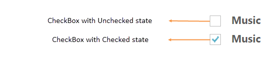
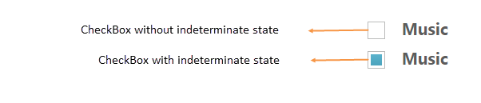
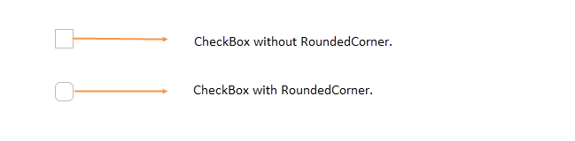

# Easy customization

## Checked status

Using **checked** property, you can set the state of Checkbox. When checked property is true then tick mark is displayed and Checkbox is in checked state. When it is false, the tick mark is not displayed and Checkbox is in unchecked state. When you want to use this **checked** property, then checkbox should be in non Tri-state and **enableTriState** property should be false.

The following steps explains you the details about rendering the Checkbox with above mentioned checked options, when the checkbox is in non tri-state.

In the **HTML** page, add the following input elements to configure Checkbox widget.

  

    <input type="checkbox" class="nodetext" id="checkbox_nonChecked" />
    <label for="checkbox_nonChecked" class="clslab">Music</label>
     
    <input type="checkbox" class="nodetext" id="checkbox_checked" />
    <label for="checkbox_checked" class="clslab">Music</label>

  
  
  

  
    $(function () {
        //Disables the checked status
        $("#checkbox_nonChecked").ejCheckBox({ checked: false });
        //Enables the checked status
        $("#checkbox_checked").ejCheckBox({ checked: true });
    });

  

Execute the above code to render the following output.

 

## Enable Tri-State

Sometimes, it is essential for you to represent the answer in partially true state. To represent the partially true types, an indeterminate state option is present. The state between checked and unchecked state is called indeterminate state. For example, a **Checkbox** presented to select files to send via [FTP](http://en.wikipedia.org/wiki/File_Transfer_Protocol) can use a [tree view](http://en.wikipedia.org/wiki/Tree_view) so that files can be selected one at a time, or by folder. When only some of the files in a folder are selected, then the checkbox for that folder could be in indeterminate state.

When you enable Tri-state, then the **Checkbox** includes the indeterminate state. The Checkbox has three states. **enableTriState** property specifies to enable or disable the Tri-State option for Checkbox. 

The following steps explains you the details about rendering the Checkbox with Tri-state options.

In the **HTML** page, add the following input elements to configure Checkbox widget.

  
 

    <input type="checkbox" class="nodetext" id="checkbox_nonTriState" />
    <label for="checkbox_nonTriState" class="clslab">Music</label>
     
    <input type="checkbox" class="nodetext" id="checkbox_triState" />
    <label for="checkbox_triState" class="clslab">Music</label>

  

  

    $(function () {
        //Disables the Tri- state for checkbox
        $("#checkbox_nonTriState").ejCheckBox({ enableTriState: false });
        //Enables the Tri- state for checkbox
        $("#checkbox_triState").ejCheckBox({ enableTriState: true, checkState:"indeterminate" });
    });

  

Execute the above code to render the following output.

 

## Check State

You require an option to set indeterminate state for Checkbox. By using Checkbox property, you can set any state that is illustrated in following table. Before using this property, enable the Tri-state for Checkbox. **enableTriState** property is set true.

List of check states

<table>
   <tr>
      <th>
         Check States
      </th>
      <th>
         Description
      </th>
   </tr>
   <tr>
      <td>
         check
      </td>
      <td>
         Check box will be in checked state
      </td>
   </tr>
   <tr>
      <td>
         uncheck
      </td>
      <td>
         Check box will be in un-checked state
      </td>
   </tr>
   <tr>
      <td>
         indeterminate
      </td>
      <td>
         Check box will be in indeterminate state
      </td>
   </tr>
</table>

The following steps explains you the details about rendering the **Checkbox** with specified checked state, when the checkbox is in tri-state.

In the **HTML** page, add the following input elements to configure **Checkbox** widget.

  

  

    <input type="checkbox" class="nodetext" id="check" />
    <label for="check" class="clslab">Checked state</label>
     
    <input type="checkbox" class="nodetext" id="uncheck" />
    <label for="uncheck" class="clslab">Unchecked state</label>
     
    <input type="checkbox" class="nodetext" id="indeterminate" />
    <label for="indeterminate" class="clslab">Indeterminate state</label>

  

  

    $(function () {
        //checkState property used to mention the state of checkbox
        $("#check").ejCheckBox({ enableTriState: true, checkState: "check" });
        $("#uncheck").ejCheckBox({ enableTriState: true, checkState: "uncheck" });
        $("#indeterminate").ejCheckBox({ enableTriState: true, checkState: "indeterminate" });
    });

  

Execute the above code to render the following output.

 

## Checkbox Size

You can render **Checkbox** in different sizes. The following table contains some predefined size option for rendering a **Checkbox** in easiest way. Each size option has different height and width. Mainly it avoids the complexity in rendering **Checkbox** with complex **CSS** class. 

List of checkbox size:

<table>
    <tr>
<th>CheckBox size</th><th>Description</th></tr>
<tr>
<td>small</td><td>
Creates checkbox with Built-in small size height, width specified.</td></tr>
<tr>
<td>
medium</td><td>
Creates checkbox with Built-in medium size height, width specified.</td></tr>
</table>

The following steps explains you the details about rendering the **Checkbox** with different size.

In the **HTML** page, add the following input elements to configure **Checkbox** widget.


  

    <input type="checkbox" class="nodetext" id="checkbox_small" />
    <label for="checkbox_small" class="clslab">Small size</label>
     
    <input type="checkbox" class="nodetext" id="checkbox_medium" />
    <label for="checkbox_medium" class="clslab">Medium size</label>



  

    $(function () {
        //size property is used to specify the checkbox size
        $("#checkbox_small").ejCheckBox({ size: "small" });
        $("#checkbox_medium").ejCheckBox({ size: "medium" });
    });

  

Execute the above code to render the following output.

 

## Text

It specifies the text content for **Checkbox**. In previous programs, separate label for each Checkbox is created. You can also set the text for checkbox using **text** property. Therefore, it is not essential to add label tag for each checkbox in **HTML** code.

The following steps explains you the details about rendering the Checkbox with text content and without writing label tag in **HTML** code

In the **HTML** page, add the following input elements to configure **Checkbox** widget.

  

  

    <input type="checkbox" class="nodetext" id="checkbox_text" />

  

  

 
    $(function () {
        //size property is used to set text for checkbox
        $("#checkbox_text").ejCheckBox({ text: "Music" });
    });

  

Execute the above code to render the following output.

 

## Rounded corner 

Specifies the corner of **Checkbox** in rounded shape. Checkbox doesn’t have rounded corner by default. To set rounded corner, you can enable **showRoundedCorner** property**.**

The following steps explains you the details about rendering the **Checkbox** with rounded corner.

In the **HTML** page, add the following input elements to configure **Checkbox** widget.

  

    <input type="checkbox" class="nodetext" id="checkbox_normalCorner" />
     
     
    <input type="checkbox" class="nodetext" id="checkbox_roundedCorner" />

  

  

    $(function () {
        $("#checkbox_normalCorner").ejCheckBox({ showRoundedCorner: false });
        $("#checkbox_roundedCorner").ejCheckBox({ showRoundedCorner: true });
    });

  

Execute the above code to render the following output.

 

## Styles Customization

CheckBox allows you to customize its appearance by using user-defined CSS and custom skin options such as colors and backgrounds. To apply custom themes, use  **CssClass** property. CssClass property sets the root class for CheckBox theme.

By using this CssClass, you can override the existing styles under the theme style sheet. The theme style sheet applies theme-specific styles like colors and backgrounds. From the root class, you can customize the CheckBox control theme.

In the following example, the border color and border width of the active CheckBox is customized through the custom classes to create the success, and danger indication with CheckBox.



        <input type="checkbox" class="nodetext" id="Check1" />
        <input type="checkbox" class="nodetext" id="Check2" />
  

  
 







