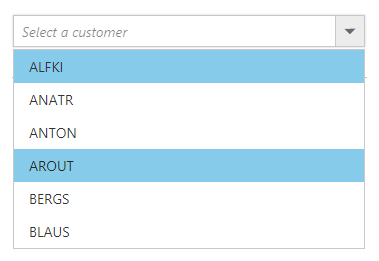

# Data Binding

The ComboBox loads the data either from local data sources or remote data services using the dataSource property. It supports the data type of array or DataManager.

The ComboBox also supports different kinds of data services such as OData, OData V4, and Web API, and data formats such as XML, JSON, and JSONP with the help of DataManager adaptors.

## Fields

The below listed fields are the data collection fields which maps fields for the data items of the ComboBox. 

| Fields | Type | Description |
|------|------|-------------|
| text |  `string` | Specifies the display text of each list item. |
| value |  `string` | Specifies the hidden data value mapped to each list item that should contain a unique value. |
| groupBy |  `string` | Specifies the category under which the list item has to be grouped. |
| iconCss |  `string` | Specifies the icon class of each list item. |

> When binding complex data to the ComboBox, fields should be mapped correctly. Otherwise, the selected item remains undefined.

## Binding Local Data

Local data can be represented in two ways as described below.

### 1. Array of Simple Data

The ComboBox has support to load array of primitive data such as strings and numbers. Here, both value and text field act the same.


	
	 <input type="text" tabindex="1" id="list" />
			

	
	
	
	
		


### 2. Array of JSON Data

The ComboBox can generate its list items through an array of complex data. For this, the appropriate columns should be mapped to the [fields](https://help.syncfusion.com/api/js/ejcombobox#members:fields) property.

In the following example, `Id` column and `Game` column from complex data have been mapped to the `value` field and `text` field, respectively.


	
<input type="text" tabindex="1" id="list" />
			

	
	
	
var sportsData = [
	{ id: 'level1', game: 'American Football' }, { id: 'level2', game: 'Badminton' },
	{ id: 'level3', game: 'Basketball' }, { id: 'level4', game: 'Cricket' },
	{ id: 'level5', game: 'Football' }, { id: 'level6', game: 'Golf' },
	{ id: 'level7', game: 'Hockey' }, { id: 'level8', game: 'Rugby' },
	{ id: 'level9', game: 'Snooker' }, { id: 'level10', game: 'Tennis' }
];
$(function () {
	$("#list").ejComboBox({
		dataSource: sportsData,
		fields: { text: 'game', value: 'id' },
		width: '250px',
		placeholder: 'Select a game',
		index: -1
	});
});			
		


## Binding Remote Data

The ComboBox supports retrieval of data from remote data services with the help of [DataManager](https://help.syncfusion.com/js/datamanager/getting-started) component. The [Query](https://help.syncfusion.com/api/js/ejquery) property is used to fetch data from the database and bind it to the ComboBox.

In the following sample, displayed first 6 contacts from the `customer` table of `Northwind` Data Service.


	
	 <input type="text" tabindex="1" id="list" />
			

	
	
	
		
		


