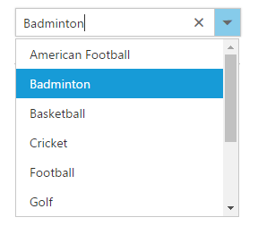

# Getting Started with JavaScript ComboBox

The external script dependencies of the ComboBox widget are,

* [jQuery 1.7.1](http://jquery.com/) and later versions.

And the internal script dependencies of the ComboBox widget are:

<table>
	<tr>
		<th>File </th>
		<th>Description / Usage </th>
	</tr>
	<tr>
		<td>ej.core.min.js</td>
		<td>Must be referred always before using all the JS controls.</td>
	</tr>
	<tr>
		<td>ej.data.min.js</td>
		<td>Used to handle data operation and should be used while binding data to JS controls.</td>
	</tr>
	<tr>
		<td>ej.combobox.min.js</td>
		<td>The ComboBox's main file</td>
	</tr>
	<tr>
		<td>ej.globalize.min.js</td>
		<td>processing specific source-side actions globally.</td>
	</tr>
</table>

For getting started you can use the ‘ej.web.all.min.js’ file, which encapsulates all the 'ej' controls and frameworks in one single file.  

For themes, you can use the ‘ej.web.all.min.css’ CDN link from the snippet given. To add the themes in your application, please refer [this link](https://help.syncfusion.com/js/theming-in-essential-javascript-components#adding-specific-theme-to-your-application).

## Preparing HTML Document

Create a new HTML file and add [CDN](https://help.syncfusion.com/js/cdn) links to the [JavaScript](https://help.syncfusion.com/js/dependencies) and [CSS](https://help.syncfusion.com/js/theming-in-essential-javascript-components) dependencies to your project.



    <!DOCTYPE html>

    <html>

    <head>

        <meta name="viewport" content="width=device-width, initial-scale=1.0" charset="utf-8" />

        <!-- style sheet for default theme(flat azure) -->

        <link href="http://cdn.syncfusion.com/{{ site.releaseversion }}/js/web/flat-azure/ej.web.all.min.css"
              rel="stylesheet" />

        <!--scripts-->

        

        

        

    </head>

    <body>

        <!--Place input element to create ComboBox-->

        

    </body>

    </html>



 N>  In production, we highly recommend you to use our [custom script generator](https://help.syncfusion.com/js/custom-script-generator#) to create custom script file with required controls and its dependencies only. Also to reduce the file size further please use [GZip compression](https://developers.google.com/web/fundamentals/performance/optimizing-content-efficiency/optimize-encoding-and-transfer?hl=en#text-compression-with-gzip) in your server. 

## Creating ComboBox

The ComboBox can be initialized through three different tags which described in [Initialize Tags](https://help.syncfusion.com/js/combobox/initialize-tags).

Add the HTML input element that needs to be initialized as ComboBox in sample.html.


	
	<input type="text" tabindex="1" id="list" />
			


## Binding Data Source

After initializing, populate the ComboBox with data using the [dataSource](https://help.syncfusion.com/api/js/ejcombobox#members:datasource) property. Here, sportsData object is passed to the ComboBox component.	
	

	
	<input type="text" tabindex="1" id="list" />
			

		
	

var sportsData = [
	{ id: 'level1', game: 'American Football' }, { id: 'level2', game: 'Badminton' },
	{ id: 'level3', game: 'Basketball' }, { id: 'level4', game: 'Cricket' },
	{ id: 'level5', game: 'Football' }, { id: 'level6', game: 'Golf' },
	{ id: 'level7', game: 'Hockey' }, { id: 'level8', game: 'Rugby' },
	{ id: 'level9', game: 'Snooker' }, { id: 'level10', game: 'Tennis' }
];
$(function () {
	$("#list").ejComboBox({
		dataSource: sportsData,
		fields: { text: 'game', value: 'id' },
		width: '250px',
		placeholder: 'Select a game',
		index: -1
	});
});			
		


After completing the configuration required to render a basic ComboBox, run the above sample to display the output in your default browser.
	

## Custom Values

The ComboBox allows the user to give input as custom value which is not required to present in predefined set of values. By default, this support is enabled by [allowCustom](https://help.syncfusion.com/api/js/ejcombobox#members:allowcustom) property. In this case, both text field and value field considered as same. The custom value will be sent to post back handler when a form is about to be submitted.


	
	 <input type="text" tabindex="1" id="list" />
			

	
	
	
	
		


## Configure the Popup List

By default, the width of the popup list automatically adjusts according to the ComboBox input element's width, and the height of the popup list has '300px'.

The height and width of the popup list can also be customized using the [popupHeight](https://help.syncfusion.com/api/js/ejcombobox#members:popupheight) and [popupWidth](https://help.syncfusion.com/api/js/ejcombobox#members:popupwidth) properties respectively.

In the following sample, popup list's width and height are configured.



	<input type="text" tabindex="1" id="list" />


	
	
	
	
		


