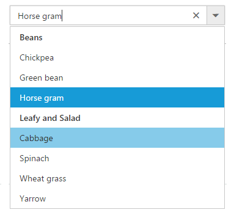

# Initialize Tags

The ComboBox can be initialized on two different tags as described in below. Though it is initialized in different tags, the UI appearance and built-in features behave in the same way.

*  Using an `<INPUT>` element 
*  Using a `<SELECT>` element 

## Using an Input Element

The ComboBox has also be rendered through `<input>` element with an array of either simple or complex data that is set through the dataSource property. It can retrieve data from local data sources as well as remote data services.

Detailed information about the data binding with an example is available in: [Data Binding to ComboBox](https://help.syncfusion.com/js/combobox/databinding)

## Using Select Element

When a ComboBox is initialized on SELECT element, the list items can be assigned through the option tag of the HTML `<select>` element.

	* The nested items are wrapped and grouped based on the <optgroup> tag that is available within the `<select>` element, by default.
	* You can preselect the option by setting the selected attribute to an option tag.



	<select id="selectElement">
	<optgroup label="Beans">
		<option value="1">Chickpea</option>
		<option value="2">Green bean</option>
		<option value="3" selected="selected">Horse gram</option>
	</optgroup>
	<optgroup label="Leafy and Salad">
		<option value="5">Cabbage</option>
		<option value="4">Spinach</option>
		<option value="6">Wheat grass</option>
		<option value="7">Yarrow</option>
	</optgroup>
	</select>




	
$(function () {
	$('#selectElement').ejComboBox({
		placeholder: "Select a vegetable"
	});
});



