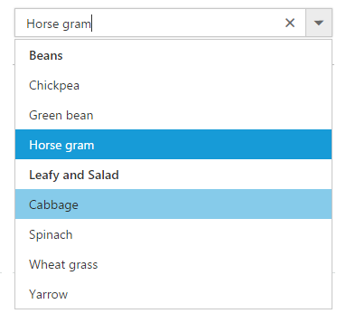

# Grouping

The ComboBox supports wrapping nested elements into a group based on different categories. The category of each list item can be mapped through the [groupBy](https://help.syncfusion.com/api/js/ejcombobox#members:fields-groupby) &nbsp;field in
the data table. The group header is displayed both as inline and fixed headers. The fixed group header content is updated dynamically on scrolling the popup list with its category value.

In the following sample, vegetables are grouped according on its category using `groupBy` field.


	
	 <input type="text" tabindex="1" id="list" />
			

	
	
	
var datasource = [
	{ vegetable: 'Cabbage', category: 'Leafy and Salad' }, { vegetable: 'Spinach', category: 'Leafy and Salad' },
	{ vegetable: 'Wheatgrass', category: 'Leafy and Salad' }, { vegetable: 'Yarrow', category: 'Leafy and Salad' },
	{ vegetable: 'Chickpea', category: 'Beans' }, { vegetable: 'Green bean', category: 'Beans' },
	{ vegetable: 'Horse gram', category: 'Beans' }, { vegetable: 'Garlic', category: 'Bulb and Stem' },
	{ vegetable: 'Nopal', category: 'Bulb and Stem' }, { vegetable: 'Onion', category: 'Bulb and Stem' }
];
$(function () {
	$('#list').ejComboBox({
		dataSource: datasource,
		fields: { groupBy: 'category', text: 'vegetable',value: 'vegetable' },
		placeholder: 'Select a vegetable',
		width: '250px',
		popupHeight: '200px',
		popupWidth: '250px'
	});
});	
		


## HTML Select

The ComboBox also supports grouping of list items under specific groups by initiating the `<select>` element using  `optgroup`. The nested items are wrapped based on the `<optgroup>` tag that is presents in the `<select>` element.



	

		<select id="selectElement">
		<optgroup label="Beans">
			<option value="1">Chickpea</option>
			<option value="2">Green bean</option>
			<option value="3" selected="selected">Horse gram</option>
		</optgroup>
		<optgroup label="Leafy and Salad">
			<option value="5">Cabbage</option>
			<option value="4">Spinach</option>
			<option value="6">Wheat grass</option>
			<option value="7">Yarrow</option>
		</optgroup>
		</select>
	




	
$(function () {
	$('#selectElement').ejComboBox({
		placeholder: "Select a vegetable"
	});
});



## Customization

The grouping header is also provided with customization option. This allows custom designing using the `groupTemplate` property for both inline and fixed headers as referred here: [Group Template support to ComboBox](https://help.syncfusion.com/js/combobox/template#group-template).
