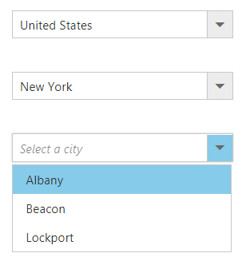
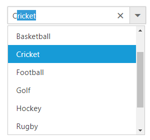

# How To

## Configure the Cascading ComboBox

The cascading ComboBox is a series of ComboBox, where the value of one ComboBox depends
upon  another's value. This can be configured by using the `change` event of the parent ComboBox.
Within that change event handler, data has to be loaded to the child ComboBox based on the selected
value of the parent ComboBox.

The following example, shows the cascade behavior of country, state, and city
ComboBox. Here, the `dataBind` method is used to reflect the property changes immediately
to the ComboBox.


	
    <input type="text" tabindex="1" id="list" />   
    <input type="text" tabindex="1" id="list2" />   
    <input type="text" tabindex="1" id="list3" />
			

	
	
	
		
		


## Show the list items with icons

You can render **icons** to the list items by mapping the
[iconCss](api-comboBox.html#fields-fieldsettings)
&nbsp;field. This `iconCss` field create a span in the list item with mapped class name
to allow styling as per your need.

In the following sample, icon classes are mapped with `iconCss` field.


	
	 <input type="text" tabindex="1" id="list" />
			

	
	
	
    var sortFormatData = [
        { class: 'asc-sort', type: 'Sort A to Z', id: '1' },
        { class: 'dsc-sort', type: 'Sort Z to A ', id: '2' },
        { class: 'filter', type: 'Filter', id: '3' },
        { class: 'clear', type: 'Clear', id: '4' }
    ];
    $(function () {
        $('#list').ejComboBox({
            dataSource: sortFormatData,
            // map the icon column to iconCSS field.
            fields: { text: 'type', iconCss: 'class', value: 'id' },
            placeholder: 'Select a format'
        });
    });	
		


	

    



## Autofill supported with ComboBox

The ComboBox supports the `autofill` behaviour with the help
of [autofill](api-comboBox.html#autofill-boolean) property. Whenever you change the input value,
the ComboBox will autocomplete your data by matching the typed character. Suppose, if no matches
found then, comboBox doesn't suggest any item.

In the following sample, showcase that how to work autofill with ComboBox.


	
	 <input type="text" tabindex="1" id="list" />
			

	
	
	
	var empList = [
		{ id: 'level1', game: 'American Football' }, { id: 'level2', game: 'Badminton' },
		{ id: 'level3', game: 'Basketball' }, { id: 'level4', game: 'Cricket' },
		{ id: 'level5', game: 'Football' }, { id: 'level6', game: 'Golf' },
		{ id: 'level7', game: 'Hockey' }, { id: 'level8', game: 'Rugby' },
		{ id: 'level9', game: 'Snooker' }, { id: 'level10', game: 'Tennis' }
	];
	$(function () {
		$("#list").ejComboBox({
			dataSource: empList,
			fields: { text: 'game', value: 'id' },
			width: '250px',
            autofill: true,
			placeholder: 'Select a game',
			index: -1
		});
	});			
		


