# Configuration and Deployment

## For Windows Users

### Install Location

The installer copies the required scripts, stylesheets and samples into the following location

`(installed location)\Syncfusion\Essential Studio\JavaScript\{{ site.releaseversion }}`

_For example, if you had chosen to install under `C:\Program Files (x86)`, then navigate to the below location, C:\Program Files (x86)\Syncfusion\Essential Studio\JavaScript\{{ site.releaseversion }}_

Within the root folder, the `assets` folder contains all the minified versions of scripts and stylesheets where as the `assets-src` folder contains the uncompressed version of the same files. The assets have been organized in the following folder structure

  * CSS - contains the style sheets for mobile and web components.
  * External - contains the external dependency files such as jQuery, JsRender etc.
  * Scripts - includes all the necessary widget scripts as well as culture scripts for Syncfusion Essential JS components.
  * TypeScript - includes the default type-definition file `ej.widgets.all.d.ts`.

N> jQuery.easing external dependency has been removed from version 14.3.0.49 onwards. Kindly include this jQuery.easing dependency for versions lesser than 14.3.0.49 in order to support animation effects.

## For Mac and Linux Users

The assets have been organized in the following folder structure

* Assets – contains all the necessary scripts and stylesheets.
* External – contains the external dependency files such as jQuery, JsRender etc.
* Samples  – contains sample code that demonstrate usage of all the components.

N>   **Mac** and **Linux** users will not be able to use the **Reporting and Business Intelligence** components since the controls have a server-side .NET dependency.
N>  Also, the exporting functionality available in some of the widgets like the grid will also not be available due to the server-side .NET dependencies.

## Configuring Syncfusion Bower Packages

### Overview

[Bower](http://bower.io) is a package manager for the Web. Syncfusion Bower package allows you to use the Syncfusion JavaScript Widgets in an efficient way.

I>Syncfusion JavaScript Bower package is available as [public Git Repository](https://github.com/syncfusion/JavaScript-Widgets) and also registered as Syncfusion-JavaScript in the Bower registry.

### Bower Installation

To configure the Bower in your machine you need to install [node, npm](http://nodejs.org) and [git](http://git-scm.org). For more information to configure the Bower package please refer the official site for [bower](http://bower.io/#install-bower). 
Syncfusion JavaScript Bower package can be configured in the following ways.

1. Using command prompt.

2. Using bower.json file.

3. From local directory.

#### Using command prompt

Perform the below steps to install Syncfusion Bower Package via command prompt in your web application.

1. Open your web project’s location in a command prompt window.

2. Then run the command Bower install <package name>.

   ~~~
   bower install syncfusion-javascript
   ~~~
   
   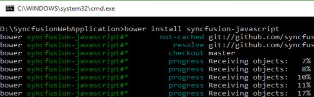

3. The Bower will install the Syncfusion JavaScript files into the project location to develop with Syncfusion controls.

N>To install a particular version of a Bower package, you need to provide the version as suffix of the package name while installing. For instance, run the below command, Eg: To install the package of version 13.3.0.18. 
N>'bower install Syncfusion-javascript#13.3.0.18'

#### Using bower.json file

In another way, you can add the packages to the bower.json file by simply specify the package name. This will install/restore the packages to your project. Please refer the below image.
 
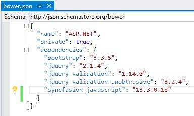

N>ASP.NET 5 (preview) projects have bower.json file by default. If your project doesn’t have bower.json file then run the below command from your project directory by Command prompt. 
N>'bower init'

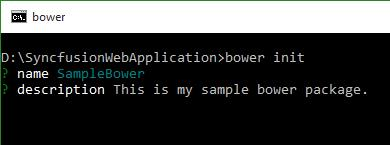

#### From local directory

You can install the Syncfusion Bower package from a local directory. To perform this follow the below steps.

1. Navigate the [Syncfusion JavaScript Bower repository](https://github.com/syncfusion/JavaScript-Widgets/) location on GitHub and download the repository as zip by clicking the “Download ZIP” button and extract the contents in your computer’s any of the local directory.

   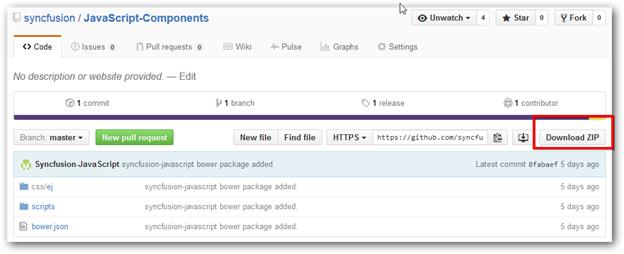

2. Then run the install command by providing the package content’s location. 

   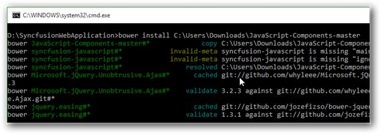

### Bower Update

To update the installed Bower packages, run the command Bower update <package name>.

~~~
bower update syncfusion-javascript
~~~

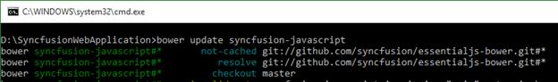

## Configuring Syncfusion npm Packages

### Overview

npm is the Package Manager for JavaScript. npm makes it easy for JavaScript developers to share and reuse the code and it makes it easy to update the code that you're sharing.

### Syncfusion npm package

Syncfusion JavaScript npm package is available as [public Git Repository](https://github.com/syncfusion/JavaScript-Widgets) and also registered as syncfusion-javaScript in the npm registry.

### Syncfusion npm Installation 

To configure the npm,  install the [Nodejs](http://nodejs.org/) and update the npm. For more information to configure the npm packages refer the official site of [npm](https://docs.npmjs.com/getting-started/installing-node). 

syncfusion-javascript npm package can be configured in following ways.

1. Using Command prompt

2. Using package.json file.

3. From local directory

#### Using command prompt

Follow the below steps to install Syncfusion JavaScript npm package via command prompt in required web application location.

1. Open project’s location in command prompt window.

2. Run the installation command for npm.

   ~~~
   npm install syncfusion-javascript
   ~~~

   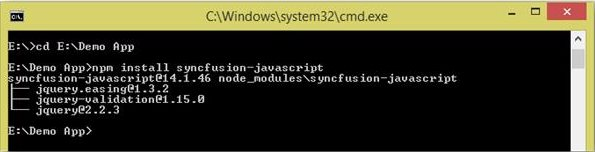

3. npm install the Syncfusion JavaScript assets into the project location to develop with Syncfusion controls.  

N> As per standard Syncfusion used the 3 digit version for npm packages. To install a particular version of npm package, provide the version as suffix of the package name while installing. For instance, run the below command, 
N> E.g. The below command installs Syncfusion JavaScript package of version 14.1.0.46. 
N> 'npm install Syncfusion-javascript@14.1.46'

#### Using package.json file

Add the Syncfusion JavaScript packages to the package.json by simply specify the package name. This will install/restore the package to the Visual Studio project. Refer the below image.

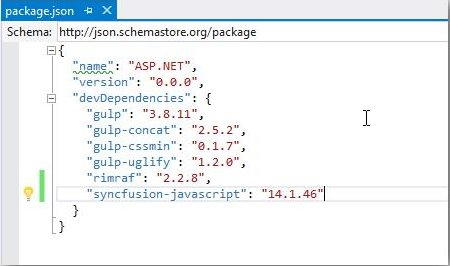

N> ASP.NET 5 (preview) projects have package.json file by default. Visual Studio project doesn’t have package.json file then, run the below command using the project command prompt.  
N> 'npm init'

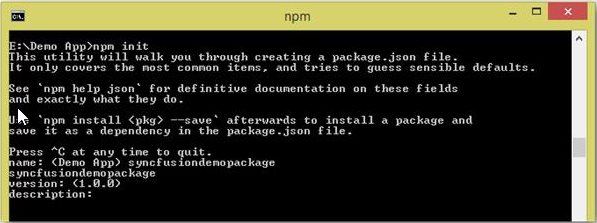

#### From Local Directory

Install the Syncfusion JavaScript npm package from a local directory.

1. Navigate the [Syncfusion JavaScript repository](https://github.com/syncfusion/JavaScript-Widgets) location on GitHub and download the repository as zip by clicking the “Download ZIP” button and extract the contents in your computer’s any of the local directory.

   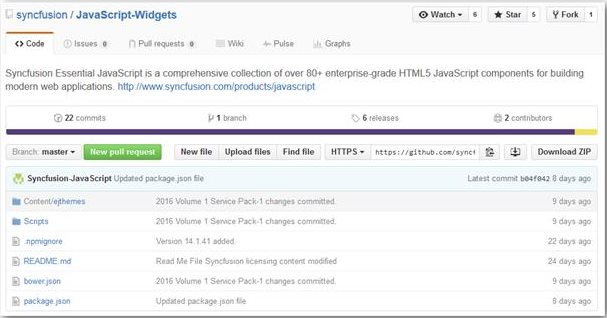

2. Run the install command by providing the package content location.

   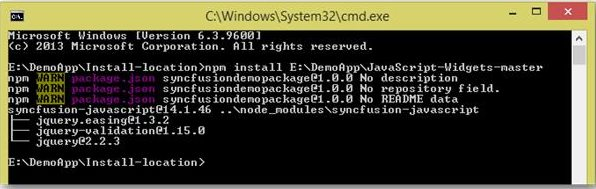

### npm Update

#### Updating global packages

To update the globally installed npm packages, run the below command to update the package by globally.

~~~
npm install g- syncfusion-javascript
~~~

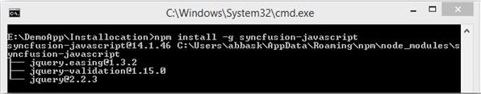

### Updating local packages

To update the locally installed npm packages, run the below command to update the package by local location.

~~~
npm update
~~~

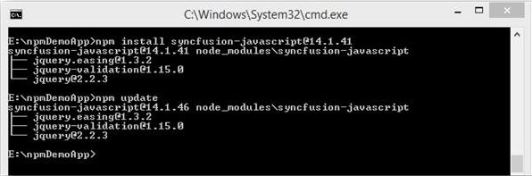

## Configuring Syncfusion JSPM Packages

### Overview

JSPM is a package manager for [SystemJS universal module loader](https://github.com/systemjs/systemjs), built on top of the dynamic [ES6 module loader](https://github.com/ModuleLoader/es6-module-loader). This can load any module format (ES6, AMD, CommonJS and globals) directly from any registry such as npm and GitHub with flat versioned dependency management. Any custom registry endpoints can be created through the Registry API.

### Syncfusion JavaScript JSPM

Syncfusion JavaScript JSPM package is available as [public Git Repository](https://github.com/syncfusion/JavaScript-Widgets) and also registered as Syncfusion-JavaScript in the npm registry too.

### Syncfusion JSPM Installation 

#### Using Command prompt 

Follow the below steps to install Syncfusion JavaScript JSPM package via command prompt in required web application location.

1. Open project’s location in command prompt window.

2. A) To install the Syncfusion JavaScript JSPM package via GitHub repository.

   ~~~
   jspm install syncfusion=github:syncfusion/Javascript-Widgets
   ~~~
   
   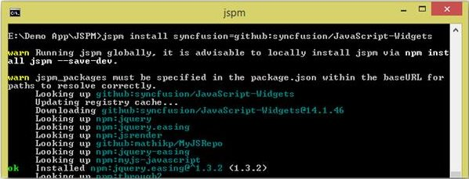

   B) To install the Syncfusion JavaScript JSPM package via npm repository.
   
   ~~~
   jspm install npm:syncfusion-javascript
   ~~~
   
N> As per standard Syncfusion used the 3 digit version for JSPM packages. To install a particular version of JSPM package, need to provide the version as suffix of the package name while installing. For instance, run the below command,  
N> E.g. The below command installs Syncfusion JavaScript package of version 14.1.0.46.  
N> 'JSPM install syncfusion=github:syncfusion/JavaScript-Widgets@14.1.46'

### JSPM Update

To update all the installed packages by using below command.

~~~
jspm update
~~~

To update specific package by using below commands.

~~~
jspm update npm:syncfusion-javascript
~~~

  (Or)
  
~~~
jspm update syncfusion=github:syncfusion/JavaScript-Widgets
~~~

## NuGet Packages Structure

The following structure is maintained for JavaScript platform NuGet packages from 2015 Volume 2(v13.2.0.29). If we cannot get the latest package updates, because of the installed Syncfusion NuGet packages prior version of 2015 Volume 2(V13.2.0.29). To update Syncfusion NuGet packages latest or above version of 2015 Volume 1 Service Pack-2(v13.1.0.30), uninstall the existing packages and install the following required package manually.

<table>
   <tr>
		<td colspan="1" rowspan="2">
			Categories/Package Name 
		</td>
		<td colspan="1" rowspan="2">
			Supported Controls 
		</td>
		<td colspan="1" rowspan="2">
			Assemblies 
		</td>
		<td colspan="2" rowspan="1">
			Assets 
		</td>
		<td>
			Dependencies 
		</td>
	</tr>
    <tr>
		<td>
			Scripts 
		</td>
		<td>
			CSS 
		</td>
		<td>
			 
		</td>
	</tr>
  	<tr>
		<td>
			Syncfusion.JavaScript 
		</td>
		<td>
			Grid Data Visualization Business Intelligence Layout Editors Navigation Notification Framework Data Science Miscellaneous Integration Report Viewer To know more information about the controls for above categories navigate the below link. {{'<http://www.syncfusion.com/javascript-ui-controls>'| markdownify }}   
		</td>
		<td>
			- 
		</td>
		<td>
			ej.mobile.all.min.js ej.unobtrusive.min.js ej.web.all.min.js ej.widget.angular.min.js ej.widget.ko.min.js ej.widgets.all.min.js canvg.js jquery.globalize.min.js jsrender.min.js rgbcolor.js   
		</td>
		<td>
			Web and Mobile Themes. 
		</td>
		<td>
			- 
		</td>
	</tr>
    <tr>
		<td>
			Syncfusion.JavaScript.PdfViewer 
		</td>
		<td>
			Pdf Viewer 
		</td>
		<td>
			EJ.PdfViewer 
		</td>
		<td>
			- 
		</td>
		<td>
			- 
		</td>
		<td>
			Syncfusion.JavaScript 
            Syncfusion.Web.FileFormatsBase 
		</td>
	</tr>
    <tr>
       <td>
			Syncfusion.JavaScript.DocumentEditor 
		</td>
		<td>
			Document Editor 
		</td>
		<td>
			EJ.DocumentEditor 
		</td>
		<td>
			- 
		</td>
		<td>
			- 
		</td>
		<td>
			Syncfusion.JavaScript 
            Syncfusion.Web.FileFormatsBase 
		</td>
	</tr>
	<tr>
       <td>
			Syncfusion.Web.FileFormats 
		</td>
		<td>
			DocIO XlsIO PDF PDF Viewer Presentation  
		</td>
		<td>
			DocToPDFConverter.Base ExcelToPDFConverter.Base PresentationToPDFConverter.Base HtmlConverter.Base OfficeChartToImageConverter.WPF ExcelChartToImageConverter.WPF SfChart.WPF Shared.WPF 
		</td>
		<td>
			- 
		</td>
		<td>
			- 
		</td>
		<td>
            Syncfusion.Web.FileFormatsBase 
		</td>
	</tr>
    <tr>
		<td>
			Syncfusion.Web.Base 
		</td>
    <td>
			- 
		</td>
		<td>
			Linq.Base EJ EJ.Export 
		</td>
		<td>
			- 
		</td>
		<td>
			- 
		</td>
		<td>
			Syncfusion.JavaScript 
		</td>
	</tr>
	<tr>
		<td>
			Syncfusion.Web.FileFormatsBase 
		</td>
		<td>
			- 
		</td>
		<td>
			Compression.Base XlsIO.Base Pdf.Base DocIO.Base OfficeChart.Base Presentation.Base 
		</td>
		<td>
			- 
		</td>
		<td>
			- 
		</td>
		<td>
			- 
		</td>
	</tr>
</table>