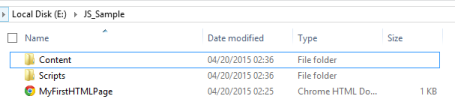
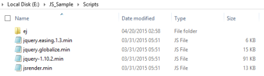
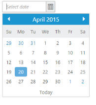
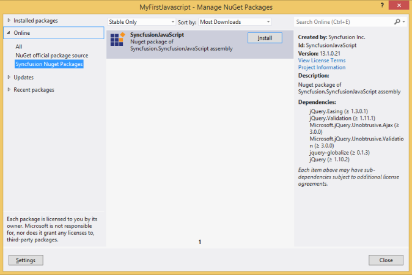
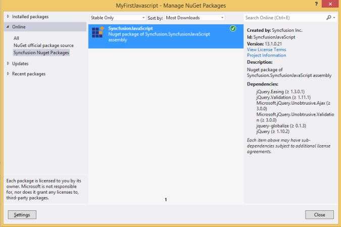
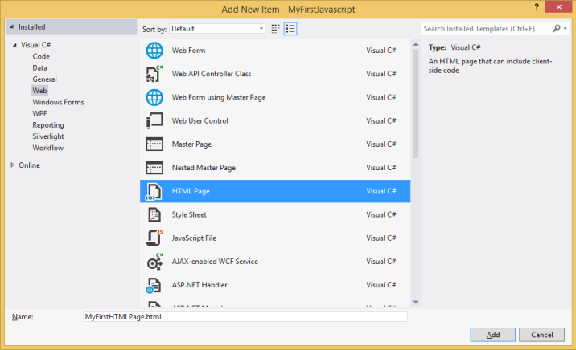

# Control Initialization

The Syncfusion controls can be initialized by using either of the following ways,

* Manual reference of scripts and style sheets in a HTML page.
* Using Syncfusion NuGet Package in Visual Studio for scripts and style sheet reference.
* Using CDN link for script and style sheet reference.
* Using Custom Script Generator (CSG) for specific scripts and style sheet reference.

## Manual reference of scripts and style sheets in a HTML page

Maintain the HTML page (where we usually place our control definition code) and also the required scripts & style sheets in a common folder structure.

### HTML file creation

Create a basic HTML file as shown below and place it in a separate folder.



<!DOCTYPE html>
  <html xmlns="http://www.w3.org/1999/xhtml">
       <head>
          <title>My first HTML page</title>
       </head>
       <body>    
       </body>
  </html>



For example, if you have created a folder named **JS_Sample** and placed the above HTML file into it, then create two new folders **Scripts** and **Content** under that root folder **JS_Sample** to maintain the scripts and style sheets respectively as shown below,
 

### Adding the required style sheets into Content folder

In the below specified location, you can find all the required web related theme folders. Copy the folder **web** in to the **Content\ej** folder of your application.

<b>(installed location)</b>\Syncfusion\Essential Studio\{{ site.releaseversion }}\JavaScript\assets\css

N>   The **common-images** folder is needed to be copied into your application mandatorily, as it includes all the common font icons and other images required for the control to render.

Now, Include the specific theme reference to your HTML file by referring the appropriate `ej.web.all.min.css` file from a particular theme folder (here, we have referred the **default-theme**), within the head section as shown below,



<!DOCTYPE html>
<html xmlns="http://www.w3.org/1999/xhtml">
    <head>
        <title>My first HTML page</title>
        <link href="Content/ej/web/default-theme/ej.web.all.min.css" rel="stylesheet" />
    </head>
    <body>   
         
    </body>
</html>



### Adding the required JavaScript files

Essential JS widgets requires the following external dependent scripts,

* jQuery (version supported from 1.7.1 to 3.1.0)
* jsrender.min.js

N> jQuery.easing external dependency has been removed from version 14.3.0.49 onwards. Kindly include this jQuery.easing dependency for versions lesser than 14.3.0.49 in order to support animation effects.

In the below specified location, you can find the dependent script files. Copy and paste it into the **Scripts** folder of your application,

<b>(installed location)</b>\Syncfusion\Essential Studio\{{ site.releaseversion }}\JavaScript\assets\external 

#### Supported jQuery Versions

The following table provides jQuery compatibility information.

<table class="props">
<thead>
<tr>
<th colspan="2">EJ Versions</th>
<th colspan="2">Compatible jQuery Versions</th>
</tr>
<tr>
<th>From</th>
<th>To</th>
<th>From</th>
<th>To</th>
</tr>
</thead>

<tbody>
<tr>
<td class="fromejversion">14.3.0.49</td>
<td class="toejversion">14.3.0.52</td>
<td class="fromjqueryversion">1.7.1</td>
<td class="tojqueryversion">3.1.0</td>
</tr>

<tr>
<td class="fromejversion">13.2.0.29</td>
<td class="toejversion">14.2.0.32</td>
<td class="fromjqueryversion">1.7.1</td>
<td class="tojqueryversion">2.2.4</td>
</tr>

<tr>
<td class="fromejversion">lower version</td>
<td class="toejversion">13.1.0.30</td>
<td class="fromjqueryversion">1.7.1</td>
<td class="tojqueryversion">2.1.3</td>
</tr>
</tbody>
</table>

> jQuery-2.1.4, jQuery-3.0.0 support has been given from ejVersion 13.2.0.29, 14.3.0.49 onwards respectively.

Apart from the above dependent scripts, you need to refer the **ej.web.all.min.js** file, which contains all the JavaScript components script and globalize library packed together in a minified format.

N> Syncfusion recommends not to use this file in the production environment as it contains all the controls and size will be huge. Please use our [Custom Script Generator](/js/include-only-the-needed-widgets) to generate only the needed scripts for the controls you have used in your application before going into production.

Copy the **ej.web.all.min.js** file into the **Scripts\\ej** folder.

<b>(installed location)</b>\ Syncfusion\Essential Studio\{{ site.releaseversion }}\JavaScript\assets\scripts\web

Script files copied into the Sample Project
{:.caption}

Include the script references in the head section of your HTML page as shown below,



<!DOCTYPE html>
<html xmlns="http://www.w3.org/1999/xhtml">
  <head>
    <title>My first HTML page</title>
    <link href="Content/ej/web/default-theme/ej.web.all.min.css" rel="stylesheet" />
    
    
    
  </head>
  <body>    
  </body>
</html>



N>   The order of the reference to the script files made in the above section should be maintained in the same manner as mentioned above.

### Adding Syncfusion Widget into your HTML page

Add the `<input>` element within the `<body>` section, which acts as a container for `ejDatePicker` widget to render and then initialize the `ejDatePicker` widget within the script section as shown below,



<!DOCTYPE html>
<html xmlns="http://www.w3.org/1999/xhtml">
    <head>
        <title>My first HTML page</title>
        <link href="Content/ej/web/default-theme/ej.web.all.min.css" rel="stylesheet" />
        
        
        
    </head>
    <body>     
        <!--Container for ejDatePicker widget-->
        <input id="startDate" type="text" /> 

        
    </body>
</html>



Open your HTML page in the web browser and the screen will display the DatePicker widget as shown below,

### Using different jquery versions into your HTML page

If the different versions of jQuery is used into your HTML page `$.noConflict` method is used to resolve the conflict. 

The following code example illustrates this for `ej controls` with different version of jquery is used.



<!DOCTYPE html>
<html xmlns="http://www.w3.org/1999/xhtml">
    <head>
        <title>My first HTML page</title>
        <link href="Content/ej/web/default-theme/ej.web.all.min.css" rel="stylesheet" />
        
        
        
        
        
    </head>
    <body>     
        <!--Container for ejDatePicker widget-->
        <input id="startDate" type="text" /> 

</body>
</html>



The following output is displayed as a result of the above code example.

## Using Syncfusion NuGet Package in Visual Studio for Scripts and style sheet reference

Using the NuGet Package method in Visual Studio automates the process of copying the required Script files and style sheets directly into your application.

### Configuring and Installing NuGet into your project

Configure the [Syncfusion NuGet Package for Essential JS](/js/installation-and-deployment#configuring-syncfusion-nuget-packages) in Visual Studio initially, before proceeding with the following installation procedure.

Right click on your project (for ex, ASP.NET Empty Web application) in the Solution explorer and navigate to `Manage NuGet Packages|Online|Syncfusion NuGet Packages`, which will display the list of available packages in it, as shown below.
 

Install the **SyncfusionJavaScript** package shown in the above image. 

The below image depicts that the NuGet Packages for JavaScript has been successfully installed into your project.
 

### Adding HTML page in your application

Right click on your Project in Solution Explorer. Select `Add|New Item|HTML Page` and add it to your application. The blank HTML page will be added.

 

### Adding reference to the required style sheets

Since the style sheets are automatically loaded into the Content folder of your application, include the specific theme reference to the newly created HTML file by referring the appropriate `ej.web.all.min.css` file from a particular theme folder (here, we have referred the **default-theme** and you can use whatever theme you need in the below highlighted code), within the `head` section as shown below,



<!DOCTYPE html>
<html xmlns="http://www.w3.org/1999/xhtml">
    <head>
        <title>My first HTML page</title>
        <link href="Content/ej/web/default-theme/ej.web.all.min.css" rel="stylesheet" />
    </head>
    <body>    
    </body>
</html>



### Adding reference to the required JavaScript files

Include the reference to the required JavaScript files in your HTML page as shown below,



    <!DOCTYPE html>
<html xmlns="http://www.w3.org/1999/xhtml">
<head>
    <title>My first HTML page</title>
    <link href="Content/ej/web/default-theme/ej.web.all.min.css" rel="stylesheet" />
    
    
    
</head>
<body>    
</body>
</html>



### Adding Syncfusion Widget into your HTML page

Finally, to add the Syncfusion datepicker widget into the HTML page, refer the same steps mentioned here in the [manual method](/js/control-initialization#adding-syncfusion-widget-into-your-html-page). 

## Using CDN link for script and style sheet reference 

With this method, you can skip the process of copying and pasting the required script and style sheets into your application and can directly provide the CDN link references for it.

### HTML file creation

Create a basic HTML file and directly refer all the required CDN links for the [scripts](/js/cdn#cdn-script-links) and [style sheets](/js/cdn#cdn-stylesheet-links) within the `<head>` section as shown below, 



<!DOCTYPE html>
<html xmlns="http://www.w3.org/1999/xhtml">
    <head>
        <title>My first HTML page</title>
        <link href="http://cdn.syncfusion.com/{{ site.releaseversion }}/js/web/flat-azure/ej.web.all.min.css" rel="stylesheet" />
        
        
         
    </head>
    <body>    
    </body>
</html>



### Adding Syncfusion Widget into your HTML page

Add the `<input>` element within the `<body>` section, which acts as a container for `ejDatePicker` widget to render and then initialize the `ejDatePicker` widget within the script section as shown below,



<!DOCTYPE html>
<html xmlns="http://www.w3.org/1999/xhtml">
    <head>
        <title>My first HTML page</title>
        <link href="http://cdn.syncfusion.com/{{ site.releaseversion }}/js/web/flat-azure/ej.web.all.min.css" rel="stylesheet" />
        
        
         
    </head>
    <body>     
        <!--Container for ejDatePicker widget-->
        <input id="startDate" type="text" /> 

        
    </body>
</html>



Open your HTML page in the web browser and the screen will display the DatePicker widget as shown below,
 

The DatePicker control is rendered with its default appearance now. You can then use its various available properties to set its value and also make use of its available events to trigger when necessary.

## Using Custom Script Generator (CSG) for specific scripts and style sheet reference

With this tool, you can create a single file that packs only the required scripts and css files. Both minified and unminified versions of the scripts and css can be downloaded from this tool.

For more reference on usage of this tool, please click [here](/js/custom-script-generator).

After downloading the necessary files from this tool, the folder structure will look like below and you need to create a HTML file inside it.
 

The folder will contain the scripts and content folder by default which will hold the required scripts and css respectively. Inside the HTML file, refer the scripts and css from the downloaded folders.

Refer this [section](/js/control-initialization#adding-reference-to-the-required-style-sheets) for css reference inside the HTML file and this [section](/js/control-initialization#adding-reference-to-the-required-javascript-files) for script reference inside the HTML file. After referring the scripts and css files, refer this [section](/js/control-initialization#adding-syncfusion-widget-into-your-html-page) to create the Syncfusion widget.

