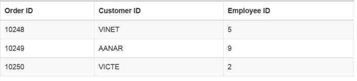
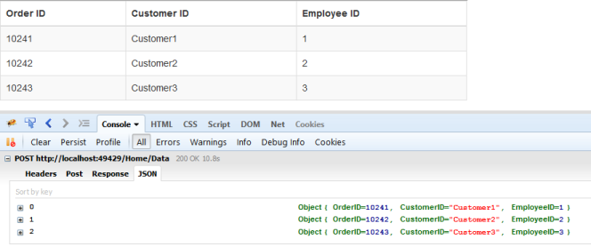
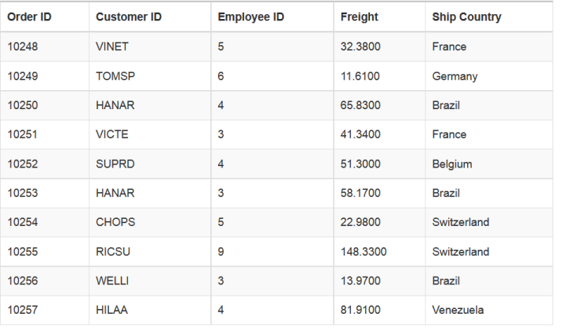
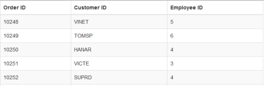
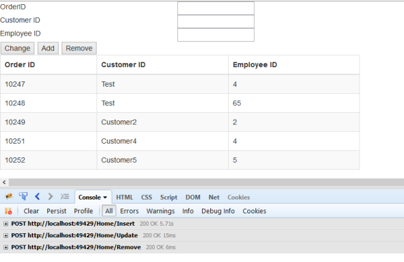
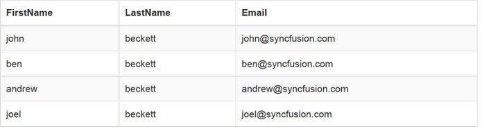
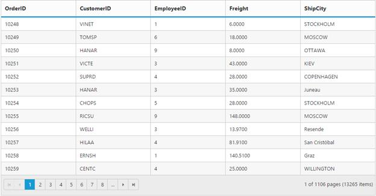

# Data Adaptors in JavaScript DataManager

**DataManger** uses adaptors to process data. There are three types of adaptors in **DataManger**. They are

* JSON Adaptor

* URL Adaptor

* OData Adaptor

Here, you can learn when and how each adaptor is used.

## JSON Adaptor

**JSONAdaptor** is used to process **JSON** data. It contains methods to process the given **JSON** data based on the queries. 

**JSONAdaptor** has the following unique in-built methods, 

<table>
    <tr>
        <th> Properties  </th>
        <th> Parameters  </th>
        <th> Description   </th>
    </tr>
     <tr>
        <td> processQuery(dataObj, query) </td>
        <td> 
            <table>
                <tr>  <td> dataObj </td> <td> Object </td> <td> ej.DataManager object </td> </tr>
                <tr>  <td> query </td> <td> ej.Query </td> <td>  Sets the default query for the data source </td> </tr>
            </table>
        </td>
        <td> Used to prepare query string for the request data </td>
    </tr>
    <tr>
        <td> processResponse(data, dataManagerObj, query, xhr) </td>
         <td> 
            <table>
                <tr>  <td> data </td> <td> Object </td> <td>  JSON data or JSON array </td> </tr>
                <tr>  <td> dataManagerObj </td> <td> Object </td> <td> ej.DataManager object </td> </tr>
                <tr>  <td> query </td> <td> ej.Query </td> <td>  Sets the default query for the data source </td> </tr>
                <tr>  <td> xhr </td> <td> Object </td> <td> XMLHTTPRequest object </td> </tr>
            </table>
        </td>
        <td> Used to precess the response which is return from the Data Source </td>
    </tr>
    <tr>
        <td> insert(dataObj, data) </td>
        <td> 
            <table>
                <tr>  <td> data </td> <td> Object </td> <td>  JSON data or JSON array </td> </tr>
                <tr>  <td> dataObj </td> <td> Object </td> <td> ej.DataManager object </td> </tr>
            </table>
        </td>
        <td> Inserts a data item in the data table. </td>
    </tr>
    <tr>
        <td> remove(dataObj, keyField, value, tableName) </td>
        <td> 
            <table>
                <tr>  <td> dataObj </td> <td> Object </td> <td>  ej.DataManager object </td> </tr>
                <tr>  <td> keyField </td> <td> String </td> <td> KeyColumn to find the data </td> </tr>
                <tr>  <td> String </td> <td> Object </td> <td> Specified value for the keyField</td> </tr>
                <tr>  <td> tableName </td> <td> String </td> <td> Name of the source table </td> </tr>
            </table>
        </td>
        <td> It is used to remove the data from the dataSource </td>
    </tr>
    <tr>
        <td> update(dataObj, keyField, value, tableName) </td>
        <td> 
            <table>
                <tr>  <td> dataObj </td> <td> Object </td> <td>  ej.DataManager object </td> </tr>
                <tr>  <td> keyField </td> <td> String </td> <td> KeyColumn to find the data </td> </tr>
                <tr>  <td> String </td> <td> Object </td> <td> Specified value for the keyField</td> </tr>
                <tr>  <td> tableName </td> <td> String </td> <td> Name of the source table </td> </tr>
            </table>
        </td>
        <td> Updates existing record and saves the changes to the table.. </td>
    </tr>
</table>

The following code example illustrates on how to use **JSONAdaptor**.



    

        <table id="table1" class="table table-striped table-bordered" style="width:700px">
            <thead>
            <tr>
                <th>Order ID</th>
                <th>Customer ID</th>
                <th>Employee ID</th>
            </tr>
            </thead>
            <tbody></tbody>
        </table>
    

    
    



The result of above code example is illustrated as follows.

 

## URL Adaptor

URL Adaptor of **DataManager** can be used when you are required to use remote service to retrieve data. It interacts with server-side for all **DataManager** Queries and **CRUD** operations. 

**UrlAdaptor** has the following unique in-built methods, 

<table>
    <tr>
        <th> Properties  </th>
        <th> Parameters  </th>
        <th> Description   </th>
    </tr>
     <tr>
        <td> processQuery(dataObj, query, hierarchyFilters) </td>
        <td> 
            <table>
                <tr>  <td> dataObj </td> <td> Object </td> <td> ej.DataManager object </td> </tr>
                <tr>  <td> query </td> <td> ej.Query </td> <td>  Sets the default query for the data source </td> </tr>
                <tr>  <td> hierarchyFilters </td> <td> ej.Query </td> <td> The hierarchical query can be provided by using the hierarchical function.  </td> </tr>
            </table>
        </td>
        <td> Used to prepare query string for the request data </td>
    </tr>
    <tr>
        <td> processResponse(data, dataManagerObj, query, xhr, request, changes) </td>
         <td> 
            <table>
                <tr>  <td> data </td> <td> Object </td> <td>  JSON data or JSON array of Result</td> </tr>
                <tr>  <td> dataManagerObj </td> <td> Object </td> <td> ej.DataManager object </td> </tr>
                <tr>  <td> query </td> <td> ej.Query </td> <td>  Sets the default query for the data source </td> </tr>
                <tr>  <td> xhr </td> <td> Object </td> <td> XMLHTTPRequest object </td> </tr>
                <tr>  <td> request </td> <td> Object </td> <td>  request object to the Data Source </td> </tr>
                <tr>  <td> changes </td> <td> Object </td> <td> Specified changes to the Data Source </td> </tr>
            </table>
        </td>
        <td> Used to precess the response which is return from the Data Source </td>
    </tr>
    <tr>
        <td> insert(dataObj, data, tableName, query) </td>
        <td> 
            <table>
                <tr>  <td> data </td> <td> Object </td> <td>  JSON data or JSON array </td> </tr>
                <tr>  <td> dataObj </td> <td> Object </td> <td> ej.DataManager object </td> </tr>
                <tr>  <td> tableName </td> <td> String </td> <td> Name of the source table </td> </tr>
                <tr>  <td> query </td> <td> ej.Query </td> <td>  Sets the default query for the data source </td> </tr>
            </table>
        </td>
        <td> Inserts a data item in the data table. </td>
    </tr>
    <tr>
        <td> remove(dataObj, keyField, value, tableName, query) </td>
        <td> 
            <table>
                <tr>  <td> dataObj </td> <td> Object </td> <td>  ej.DataManager object </td> </tr>
                <tr>  <td> keyField </td> <td> String </td> <td> KeyColumn to find the data </td> </tr>
                <tr>  <td> String </td> <td> Object </td> <td> Specified value for the keyField</td> </tr>
                <tr>  <td> tableName </td> <td> String </td> <td> Name of the source table </td> </tr>
                <tr>  <td> query </td> <td> ej.Query </td> <td>  Sets the default query for the data source </td> </tr>
            </table>
        </td>
        <td> It is used to remove the data from the dataSource </td>
    </tr>
    <tr>
        <td> update(dataObj, keyField, value, tableName, query) </td>
        <td> 
            <table>
                <tr>  <td> dataObj </td> <td> Object </td> <td>  ej.DataManager object </td> </tr>
                <tr>  <td> keyField </td> <td> String </td> <td> KeyColumn to find the data </td> </tr>
                <tr>  <td> String </td> <td> Object </td> <td> Specified value for the keyField</td> </tr>
                <tr>  <td> tableName </td> <td> String </td> <td> Name of the source table </td> </tr>
                <tr>  <td> query </td> <td> ej.Query </td> <td>  Sets the default query for the data source </td> </tr>
            </table>
        </td>
        <td> Updates existing record and saves the changes to the table.. </td>
    </tr>
</table>

Now, in the following code example the data is retrieved from **MVC** **Controller**. 



    

        <table id="table1" class="table table-striped table-bordered" style="width:700px">
            <thead>
            <tr>
                <th>Order ID</th>
                <th>Customer ID</th>
                <th>Employee ID</th>
            </tr>
            </thead>
            <tbody></tbody>
        </table>
    

    
    





    public class HomeController : Controller
    {
        public JsonResult Data(DataManager dataObj)
        {
            List<Object> data = new List<object>();
            for (int i = 1; i <= 10; i++)
            {
                data.Add(new { OrderID = 10240 + i, CustomerID = "Customer" + i, EmployeeID = i });
            }
            var records = data.Take(dataObj.Take); // take query of Data Manager

            return Json(records, JsonRequestBehavior.AllowGet);
        }
    }



The result of the above code example is illustrated as follows.

 

## OData Adaptor

**OData** Adaptor that is extended from **UrlAdaptor**, is used for consuming data through OData Service. You can use the following code example to use **OData** adaptor.

**ODataAdaptor** has the following unique in-built methods, 

<table>
    <tr>
        <th> Properties  </th>
        <th> Parameters  </th>
        <th> Description   </th>
    </tr>
    <tr>
        <td> processResponse(data, dataManagerObj, query, xhr, request, changes) </td>
         <td> 
            <table>
                <tr>  <td> data </td> <td> Object </td> <td>  JSON data or JSON array </td> </tr>
                <tr>  <td> dataManagerObj </td> <td> Object </td> <td> ej.DataManager object </td> </tr>
                <tr>  <td> query </td> <td> ej.Query </td> <td>  Sets the default query for the data source </td> </tr>
                <tr>  <td> xhr </td> <td> Object </td> <td> XMLHTTPRequest object </td> </tr>
                <tr>  <td> request </td> <td> Object </td> <td>  request object to the Data Source </td> </tr>
                <tr>  <td> changes </td> <td> Object </td> <td> Specified changes to the Data Source </td> </tr>
            </table>
        </td>
        <td> Used to precess the response which is return from the Data Source </td>
    </tr>
     <tr>
        <td> insert(dataObj, data, tableName) </td>
        <td> 
            <table>
                <tr>  <td> data </td> <td> Object </td> <td>  JSON data or JSON array </td> </tr>
                <tr>  <td> dataObj </td> <td> Object </td> <td> ej.DataManager object </td> </tr>
                <tr>  <td> tableName </td> <td> String </td> <td> Name of the source table </td> </tr>
            </table>
        </td>
        <td> Inserts a data item in the data table. </td>
    </tr>
    <tr>
        <td> remove(dataObj, keyField, value, tableName) </td>
        <td> 
            <table>
                <tr>  <td> dataObj </td> <td> Object </td> <td>  ej.DataManager object </td> </tr>
                <tr>  <td> keyField </td> <td> String </td> <td> KeyColumn to find the data </td> </tr>
                <tr>  <td> String </td> <td> Object </td> <td> Specified value for the keyField</td> </tr>
                <tr>  <td> tableName </td> <td> String </td> <td> Name of the source table </td> </tr>
            </table>
        </td>
        <td> It is used to remove the data from the dataSource </td>
    </tr>
    <tr>
        <td> update(dataObj, keyField, value, tableName) </td>
        <td> 
            <table>
                <tr>  <td> dataObj </td> <td> Object </td> <td>  ej.DataManager object </td> </tr>
                <tr>  <td> keyField </td> <td> String </td> <td> KeyColumn to find the data </td> </tr>
                <tr>  <td> String </td> <td> Object </td> <td> Specified value for the keyField</td> </tr>
                <tr>  <td> tableName </td> <td> String </td> <td> Name of the source table </td> </tr>
            </table>
        </td>
        <td> Updates existing record and saves the changes to the table.. </td>
    </tr>
</table>



    

        <table id="table1" class="table table-striped table-bordered" style="width:700px">
            <thead>
            <tr>
                <th>Order ID</th>
                <th>Customer ID</th>
                <th>Employee ID</th>
                <th>Freight</th>
                <th>Ship Country</th>
            </tr>
            </thead>
            <tbody></tbody>
        </table>
    

    
    



The result of the above code example is illustrated as follows.

 

## WebAPI Adaptor

**WebApi** Adaptor, extended from **ODataAdaptor**, of **DataManager** is used for retrieving data from WebApi service. 

**WebApiAdaptor** has the following unique in-built methods, 

<table>
    <tr>
        <th> Properties  </th>
        <th> Parameters  </th>
        <th> Description   </th>
    </tr>
    <tr>
        <td> processResponse(data, dataManagerObj, query, xhr, request, changes) </td>
         <td> 
            <table>
                <tr>  <td> data </td> <td> Object </td> <td>  JSON data or JSON array </td> </tr>
                <tr>  <td> dataManagerObj </td> <td> Object </td> <td> ej.DataManager object </td> </tr>
                <tr>  <td> query </td> <td> ej.Query </td> <td>  Sets the default query for the data source </td> </tr>
                <tr>  <td> xhr </td> <td> Object </td> <td> XMLHTTPRequest object </td> </tr>
                <tr>  <td> request </td> <td> Object </td> <td>  request object to the Data Source </td> </tr>
                <tr>  <td> changes </td> <td> Object </td> <td> Specified changes to the Data Source </td> </tr>
            </table>
        </td>
        <td> Used to precess the response which is return from the Data Source </td>
    </tr>
     <tr>
        <td> insert(dataObj, data, tableName) </td>
        <td> 
            <table>
                <tr>  <td> data </td> <td> Object </td> <td>  JSON data or JSON array </td> </tr>
                <tr>  <td> dataObj </td> <td> Object </td> <td> ej.DataManager object </td> </tr>
                <tr>  <td> tableName </td> <td> String </td> <td> Name of the source table </td> </tr>
            </table>
        </td>
        <td> Inserts a data item in the data table. </td>
    </tr>
    <tr>
        <td> remove(dataObj, keyField, value, tableName) </td>
        <td> 
            <table>
                <tr>  <td> dataObj </td> <td> Object </td> <td>  ej.DataManager object </td> </tr>
                <tr>  <td> keyField </td> <td> String </td> <td> KeyColumn to find the data </td> </tr>
                <tr>  <td> String </td> <td> Object </td> <td> Specified value for the keyField</td> </tr>
                <tr>  <td> tableName </td> <td> String </td> <td> Name of the source table </td> </tr>
            </table>
        </td>
        <td> It is used to remove the data from the dataSource </td>
    </tr>
    <tr>
        <td> update(dataObj, keyField, value, tableName) </td>
        <td> 
            <table>
                <tr>  <td> dataObj </td> <td> Object </td> <td>  ej.DataManager object </td> </tr>
                <tr>  <td> keyField </td> <td> String </td> <td> KeyColumn to find the data </td> </tr>
                <tr>  <td> String </td> <td> Object </td> <td> Specified value for the keyField</td> </tr>
                <tr>  <td> tableName </td> <td> String </td> <td> Name of the source table </td> </tr>
            </table>
        </td>
        <td> Updates existing record and saves the changes to the table.. </td>
    </tr>
</table>

Refer to the following code example.



    

        <table id="table1" class="table table-striped table-bordered" style="width:700px">
            <thead>
            <tr>
                <th>Order ID</th>
                <th>Customer ID</th>
                <th>Employee ID</th>
            </tr>
            </thead>
            <tbody></tbody>
        </table>
    

    
    



Result of the above code example is illustrated as follows.

 

## RemoteSave Adaptor

**RemoteSaveAdaptor**, extended from **JsonAdaptor** of **DataManager**, is used for binding local data and performs all **DataManager** queries in client-side. It interacts with server-side only for **CRUD** operations to pass the modified records. 

**JSONAdaptor** has the following unique in-built methods, 

<table>
    <tr>
        <th> Properties  </th>
        <th> Parameters  </th>
        <th> Description   </th>
    </tr>
    <tr>
        <td> insert(dataObj, data, tableName, query) </td>
        <td> 
            <table>
                <tr>  <td> data </td> <td> Object </td> <td>  JSON data or JSON array </td> </tr>
                <tr>  <td> dataObj </td> <td> Object </td> <td> ej.DataManager object </td> </tr>
                <tr>  <td> tableName </td> <td> String </td> <td> Name of the source table </td> </tr>
                <tr>  <td> query </td> <td> ej.Query </td> <td>  Sets the default query for the data source </td> </tr>
            </table>
        </td>
        <td> Inserts a data item in the data table. </td>
    </tr>
    <tr>
        <td> remove(dataObj, keyField, value, tableName, query) </td>
        <td> 
            <table>
                <tr>  <td> dataObj </td> <td> Object </td> <td>  ej.DataManager object </td> </tr>
                <tr>  <td> keyField </td> <td> String </td> <td> KeyColumn to find the data </td> </tr>
                <tr>  <td> String </td> <td> Object </td> <td> Specified value for the keyField</td> </tr>
                <tr>  <td> tableName </td> <td> String </td> <td> Name of the source table </td> </tr>
                <tr>  <td> query </td> <td> ej.Query </td> <td>  Sets the default query for the data source </td> </tr>
            </table>
        </td>
        <td> It is used to remove the data from the dataSource </td>
    </tr>
    <tr>
        <td> update(dataObj, keyField, value, tableName, query) </td>
        <td> 
            <table>
                <tr>  <td> dataObj </td> <td> Object </td> <td>  ej.DataManager object </td> </tr>
                <tr>  <td> keyField </td> <td> String </td> <td> KeyColumn to find the data </td> </tr>
                <tr>  <td> String </td> <td> Object </td> <td> Specified value for the keyField</td> </tr>
                <tr>  <td> tableName </td> <td> String </td> <td> Name of the source table </td> </tr>
                <tr>  <td> query </td> <td> ej.Query </td> <td>  Sets the default query for the data source </td> </tr>
            </table>
        </td>
        <td> Updates existing record and saves the changes to the table.. </td>
    </tr>
</table>

Refer to the following code example.



    

        

            

            OrderID
            

            

            <input id="OrderID" class="e-ejinputtext" type="text" value="" />
            

        

        

            

            Customer ID
            

            

            <input id="CustomerID" class="e-ejinputtext" type="text" value="" />
            

        

        

            

            Employee ID
            

            

            <input id="EmployeeID" class="e-ejinputtext" type="text" value="" />
            

        

        

            

            <input type="button" value="Change" />
            <input type="button" value="Add" />
            <input type="button" value="Remove" />
            

        

    

    

        <table id="table1" class="table table-striped table-bordered" style="width:700px">
            <thead>
            <tr>
                <th>Order ID</th>
                <th>Customer ID</th>
                <th>Employee ID</th>
            </tr>
            </thead>
            <tbody></tbody>
        </table>
    

    
    





    public class HomeController : Controller
    {
        public static IList<EditableOrder> Data()
        {
            IList<EditableOrder> records = (IList<EditableOrder>)System.Web.HttpContext.Current.Session["Orders"];

            if (records == null)
            {
                List<EditableOrder> temp = new List<EditableOrder>();
                for (int i = 1; i <= 5; i++)
                {
                    var order = new EditableOrder() { OrderID = 10247 + i, CustomerID = "Customer" + i, EmployeeID = i };
                    temp.Add(order);
                }
                System.Web.HttpContext.Current.Session["Orders"] = records = temp;
            }
            return records;
        }
        public JsonResult Update(EditableOrder value)
        {

            var record = Data().Where(o => o.OrderID == value.OrderID).FirstOrDefault();
            if (record != null)
            {
                record.OrderID = value.OrderID;
                record.CustomerID = value.CustomerID;
                record.EmployeeID = value.EmployeeID;
            }
            return Json(Data(), JsonRequestBehavior.AllowGet);
        }
        public JsonResult Insert(EditableOrder value)
        {
            Data().Insert(0, value);
            return Json(Data(), JsonRequestBehavior.AllowGet);
        }
        public JsonResult Remove(int key)
        {
            var record = Data().Where(o => o.OrderID == key).FirstOrDefault();
            Data().Remove(record);
            return Json(Data(), JsonRequestBehavior.AllowGet);
        }
    }



Result of the above code example is illustrated as follows.

 

## Custom Adaptor

Custom adaptor is a key technique to customize adaptors in **DataManager**. It is useful to write own adaptor. Normally **ej.Adaptor** is base class for all adaptors. Therefore you first inherit **ej.Adaptor** to develop customized one and then you override functionality in custom adaptor with base class. 

The following code example illustrates you on how to create custom adaptor.



    

        <table id="table1" class="table table-striped table-bordered" style="width:700px">
            <thead>
            <tr>
                <th>FirstName</th>
                <th>LastName</th>
                <th>Email</th>
            </tr>
            </thead>
            <tbody></tbody>
        </table>
    

    

    



Result of above code example is as follows.

 

Using Custom Adaptor, you can override the existing method of Extended Adaptor, 

<table>
    <tr>
        <th> Properties  </th>
        <th> Description   </th>
    </tr>
    <tr>
        <td> beforeSend </td>
        <td> Custom headers can be set using pre-request callback beforeSend, by using the setRequestHeader method can be used to modify the XMLHTTPRequest </td>
    </tr>
     <tr>
        <td> processQuery </td>
        <td> Used to prepare query string for the request data </td>
    </tr>
    <tr>
        <td> processResponse </td>
        <td> Used to precess the response which is return from the Data Source </td>
    </tr>
    <tr>
        <td> insert </td>
        <td> The insert method of the data manager is used to add a new record to the table </td>
    </tr>
    <tr>
        <td> remove </td>
        <td> The remove action submits the data items that should be deleted </td>
    </tr>
    <tr>
        <td> update </td>
        <td> The update method is used to update the modified changes made to a record in the data source of the DataManager. </td>
    </tr>
</table>

## Cache Adaptor

Cache Adaptor is used to cache the data of the visited pages. It prevents new requests for the previously visited pages. It can be enabled by using the `enableCaching` property. You can configure cache page size and duration of caching by using `cachingPageSize` and `timeTillExpiration` properties of the [`ej.DataManager`](https://help.syncfusion.com/api/js/ejdatamanager# "DataManager"). 

**CacheAdaptor** has the following unique in-built methods, 

<table>
    <tr>
        <th> Properties  </th>
        <th> Parameters  </th>
        <th> Description   </th>
    </tr>
     <tr>
        <td> processQuery(dataObj, query, hierarchyFilters) </td>
        <td> 
            <table>
                <tr>  <td> dataObj </td> <td> Object </td> <td> ej.DataManager object </td> </tr>
                <tr>  <td> query </td> <td> ej.Query </td> <td>  Sets the default query for the data source </td> </tr>
                <tr>  <td> hierarchyFilters </td> <td> ej.Query </td> <td> The hierarchical query can be provided by using the hierarchical function.  </td> </tr>
            </table>
        </td>
        <td> Used to prepare query string for the request data </td>
    </tr>
    <tr>
        <td> processResponse(data, dataManagerObj, query, xhr, request, changes) </td>
         <td> 
            <table>
                <tr>  <td> data </td> <td> Object </td> <td>  JSON data or JSON array </td> </tr>
                <tr>  <td> dataManagerObj </td> <td> Object </td> <td> ej.DataManager object </td> </tr>
                <tr>  <td> query </td> <td> ej.Query </td> <td>  Sets the default query for the data source </td> </tr>
                <tr>  <td> xhr </td> <td> Object </td> <td> XMLHTTPRequest object </td> </tr>
                <tr>  <td> request </td> <td> Object </td> <td>  Sets the default query for the data source </td> </tr>
                <tr>  <td> changes </td> <td> Object </td> <td> XMLHTTPRequest object </td> </tr>
            </table>
        </td>
        <td> Used to precess the response which is return from the Data Source </td>
    </tr>
    <tr>
        <td> insert(dataObj, data, tableName) </td>
        <td> 
            <table>
                <tr>  <td> data </td> <td> Object </td> <td>  JSON data or JSON array </td> </tr>
                <tr>  <td> dataObj </td> <td> Object </td> <td> ej.DataManager object </td> </tr>
                <tr>  <td> tableName </td> <td> String </td> <td> Name of the source table </td> </tr>
            </table>
        </td>
        <td> Inserts a data item in the data table. </td>
    </tr>
    <tr>
        <td> remove(dataObj, keyField, value, tableName) </td>
        <td> 
            <table>
                <tr>  <td> dataObj </td> <td> Object </td> <td>  ej.DataManager object </td> </tr>
                <tr>  <td> keyField </td> <td> String </td> <td> KeyColumn to find the data </td> </tr>
                <tr>  <td> String </td> <td> Object </td> <td> Specified value for the keyField</td> </tr>
                <tr>  <td> tableName </td> <td> String </td> <td> Name of the source table </td> </tr>
            </table>
        </td>
        <td> It is used to remove the data from the dataSource </td>
    </tr>
    <tr>
        <td> update(dataObj, keyField, value, tableName) </td>
        <td> 
            <table>
                <tr>  <td> dataObj </td> <td> Object </td> <td>  ej.DataManager object </td> </tr>
                <tr>  <td> keyField </td> <td> String </td> <td> KeyColumn to find the data </td> </tr>
                <tr>  <td> String </td> <td> Object </td> <td> Specified value for the keyField</td> </tr>
                <tr>  <td> tableName </td> <td> String </td> <td> Name of the source table </td> </tr>
            </table>
        </td>
        <td> Updates existing record and saves the changes to the table.. </td>
    </tr>
</table>



    





    $(function() {

        var dataManger = ej.DataManager({ 
            url: "http://mvc.syncfusion.com/Services/Northwnd.svc/Orders/",
            enableCaching: true, 
            cachingPageSize: 10, 
            timeTillExpiration: 120000 }); 

        $("#CacheGrid").ejGrid({
            dataSource: dataManger, 
            allowPaging: true, 
            columns: ["OrderID", "CustomerID", "EmployeeID", "Freight", "ShipCity"] 
        }); 
    });



Cache Adaptor has the following unique properties, 

<table>
    <tr>
        <th> Properties  </th>
        <th> Description   </th>
    </tr>
    <tr>
        <td> TimeTillExpiration </td>
        <td> Specifies the duration of cached pages in milliseconds </td>
    </tr>
    <tr>
        <td> CachingPageSize </td>
        <td> A number of pages to be cached </td>
    </tr>
</table>