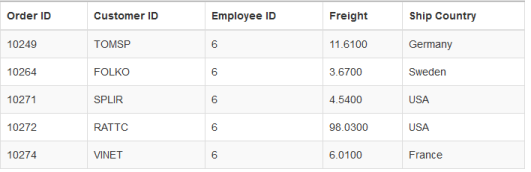

# Filtering

Filtering is a basic technique in **DataManager** query. The “where” query is used to filter some particular or related records from the data source to review details of records. 

## Filter Operators

Filter operators are generally used to specify the filter type. The various filter operators corresponding to the type of the column is listed in the following table.

<table>
<tr>
<th>
Column type</th><th>
Filter operators</th></tr>
<tr>
<td>
Number</td><td>
ej.FilterOperators.greaterThan ej.FilterOperators.greaterThanOrEqual ej.FilterOperators.lessThan ej.FilterOperators.lessThanOrEqual ej.FilterOperators.equal</td></tr>
<tr>
<td>
String</td><td>
ej.FilterOperators.startsWith ej.FilterOperators.endsWith ej.FilterOperators.contains ej.FilterOperators.equal ej.FilterOperators.notEqual</td></tr>
<tr>
<td>
Boolean</td><td>
ej.FilterOperators.equal ej.FilterOperators.notEqual</td></tr>
<tr>
<td>
Date</td><td>
ej.FilterOperators.greaterThan ej.FilterOperators.greaterThanOrEqual ej.FilterOperators.lessThan ej.FilterOperators.lessThanOrEqual ej.FilterOperators.equal</td></tr>
</table>

## lessThan

This operator is used to get the records with values less than that of the filter value.



    

        <table id="table1" class=" table table-striped table-bordered" style="width:700px">
            <thead>
                <tr>
                    <th>Order ID</th>
                    <th>Customer ID</th>
                    <th>Employee ID</th>
                    <th>Freight</th>
                    <th>Ship Country</th>
                </tr>
            </thead>
            <tbody></tbody>
        </table>
    

    
    



Result of the above code example is illustrated as follows.

 

## greaterThan

This operator is used to get the records with values greater than that of the filter value.



    

        <table id="table1" class=" table table-striped table-bordered" style="width:700px">
            <thead>
                <tr>
                    <th>Order ID</th>
                    <th>Customer ID</th>
                    <th>Employee ID</th>
                    <th>Freight</th>
                    <th>Ship Country</th>
                </tr>
            </thead>
            <tbody></tbody>
        </table>
    

    
    



Result of the above code example is illustrated as follows.

 

## lessThanOrEqual

This operator is used to get the records with values less than or equal to the filter value.



    

        <table id="table1" class=" table table-striped table-bordered" style="width:700px">
            <thead>
                <tr>
                    <th>Order ID</th>
                    <th>Customer ID</th>
                    <th>Employee ID</th>
                    <th>Freight</th>
                    <th>Ship Country</th>
                </tr>
            </thead>
            <tbody></tbody>
        </table>
    

    
    



Result of the above code example is illustrated as follows.

 

## greaterThanOrEqual

This operator is used to get the records with values greater than or equal to the filter value.



    

        <table id="table1" class=" table table-striped table-bordered" style="width:700px">
            <thead>
                <tr>
                    <th>Order ID</th>
                    <th>Customer ID</th>
                    <th>Employee ID</th>
                    <th>Freight</th>
                    <th>Ship Country</th>
                </tr>
            </thead>
            <tbody></tbody>
        </table>
    

    
    



Result of the above code example is illustrated as follows.

 

## equal

This operator is used to get the records with values equal to that of the filter value.



    

        <table id="table1" class=" table table-striped table-bordered" style="width:700px">
            <thead>
                <tr>
                    <th>Order ID</th>
                    <th>Customer ID</th>
                    <th>Employee ID</th>
                    <th>Freight</th>
                    <th>Ship Country</th>
                </tr>
            </thead>
            <tbody></tbody>
        </table>
    

    
    



Result of the above code example is illustrated as follows.

 

## notEqual

This operator is used to get the records with values not equal to that of the filter value specified.



    

        <table id="table1" class=" table table-striped table-bordered" style="width:700px">
            <thead>
                <tr>
                    <th>Order ID</th>
                    <th>Customer ID</th>
                    <th>Employee ID</th>
                    <th>Freight</th>
                    <th>Ship Country</th>
                </tr>
            </thead>
            <tbody></tbody>
        </table>
    

    
    



Result of the above code example is illustrated as follows.

 

## contains

This operator is used to get the records that contains the filter value.



    

        <table id="table1" class=" table table-striped table-bordered" style="width:700px">
            <thead>
                <tr>
                    <th>Order ID</th>
                    <th>Customer ID</th>
                    <th>Employee ID</th>
                    <th>Freight</th>
                    <th>Ship Country</th>
                </tr>
            </thead>
            <tbody></tbody>
        </table>
    

    
    



Result of the above code example is illustrated as follows.

 

## startswith

This operator is used to get the records that starts with the filter value specified.



    

        <table id="table1" class=" table table-striped table-bordered" style="width:700px">
            <thead>
                <tr>
                    <th>Order ID</th>
                    <th>Customer ID</th>
                    <th>Employee ID</th>
                    <th>Freight</th>
                    <th>Ship Country</th>
                </tr>
            </thead>
            <tbody></tbody>
        </table>
    

    
    



Result of the above code example is illustrated as follows.

 

## endswith

This operator is used to get the records that ends with the filter value specified.



    

        <table id="table1" class=" table table-striped table-bordered" style="width:700px">
            <thead>
                <tr>
                    <th>Order ID</th>
                    <th>Customer ID</th>
                    <th>Employee ID</th>
                    <th>Freight</th>
                    <th>Ship Country</th>
                </tr>
            </thead>
            <tbody></tbody>
        </table>
    

    
        



Result of the above code example is illustrated as follows.

 

## and predicate

The `and` predicate is used to add n-number of predicates with “and” condition and filter the data.



    

        <table id="table1" class=" table table-striped table-bordered" style="width:700px">
            <thead>
                <tr>
                    <th>Order ID</th>
                    <th>Customer ID</th>
                    <th>Employee ID</th>
                    <th>Freight</th>
                    <th>Ship Country</th>
                </tr>
            </thead>
            <tbody></tbody>
        </table>
    

    
    



Result of the above code example is illustrated as follows.

 

## or predicate

Using this method you can add n-number of predicates with `or` condition and filter the data.



    

        <table id="table1" class=" table table-striped table-bordered" style="width:700px">
            <thead>
                <tr>
                    <th>Order ID</th>
                    <th>Customer ID</th>
                    <th>Employee ID</th>
                    <th>Freight</th>
                    <th>Ship Country</th>
                </tr>
            </thead>
            <tbody></tbody>
        </table>
    

    
    



Result of the above code example is illustrated as follows.

 

