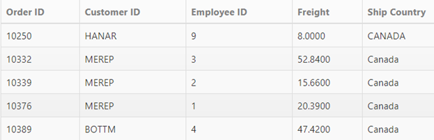
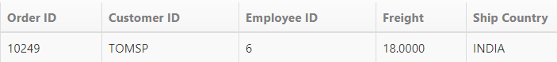
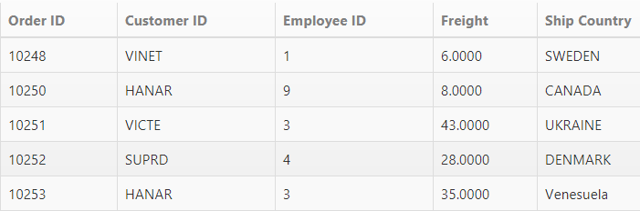
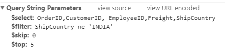
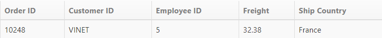
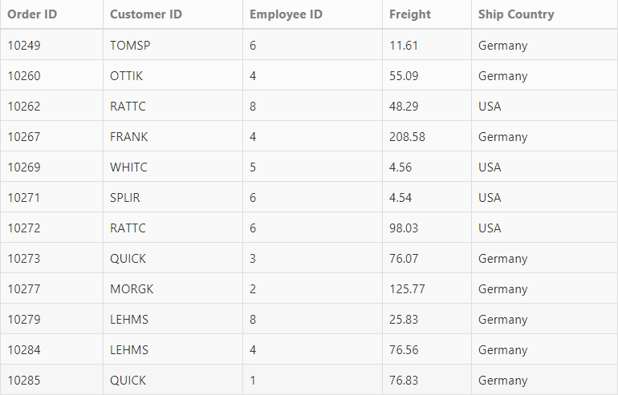

# Filtering

Filtering is a basic technique in **DataManager** query. The “where” query is used to filter some particular or related records from the data source to review details of records. 

## Filter Operators

Filter operators are generally used to specify the filter type. The various filter operators corresponding to the type of the column is listed in the following table.

<table>
<tr>
<th>
Column type</th><th>
Filter operators</th></tr>
<tr>
<td>
Number</td><td>
ej.FilterOperators.greaterThan ej.FilterOperators.greaterThanOrEqual ej.FilterOperators.lessThan ej.FilterOperators.lessThanOrEqual ej.FilterOperators.equal</td></tr>
<tr>
<td>
String</td><td>
ej.FilterOperators.startsWith ej.FilterOperators.endsWith ej.FilterOperators.contains ej.FilterOperators.equal ej.FilterOperators.notEqual</td></tr>
<tr>
<td>
Boolean</td><td>
ej.FilterOperators.equal ej.FilterOperators.notEqual</td></tr>
<tr>
<td>
Date</td><td>
ej.FilterOperators.greaterThan ej.FilterOperators.greaterThanOrEqual ej.FilterOperators.lessThan ej.FilterOperators.lessThanOrEqual ej.FilterOperators.equal</td></tr>
</table>

## lessThan

This operator is used to get the records with values less than that of the filter value.



    

        <table id="table1" class=" table table-striped table-bordered" style="width:700px">
            <thead>
                <tr>
                    <th>Order ID</th>
                    <th>Customer ID</th>
                    <th>Employee ID</th>
                    <th>Freight</th>
                    <th>Ship Country</th>
                </tr>
            </thead>
            <tbody></tbody>
        </table>
    

    
    



Result of the above code example is illustrated as follows.

 

## greaterThan

This operator is used to get the records with values greater than that of the filter value.



    

        <table id="table1" class=" table table-striped table-bordered" style="width:700px">
            <thead>
                <tr>
                    <th>Order ID</th>
                    <th>Customer ID</th>
                    <th>Employee ID</th>
                    <th>Freight</th>
                    <th>Ship Country</th>
                </tr>
            </thead>
            <tbody></tbody>
        </table>
    

    
    



Result of the above code example is illustrated as follows.

 

## lessThanOrEqual

This operator is used to get the records with values less than or equal to the filter value.



    

        <table id="table1" class=" table table-striped table-bordered" style="width:700px">
            <thead>
                <tr>
                    <th>Order ID</th>
                    <th>Customer ID</th>
                    <th>Employee ID</th>
                    <th>Freight</th>
                    <th>Ship Country</th>
                </tr>
            </thead>
            <tbody></tbody>
        </table>
    

    
    



Result of the above code example is illustrated as follows.

 

## greaterThanOrEqual

This operator is used to get the records with values greater than or equal to the filter value.



    

        <table id="table1" class=" table table-striped table-bordered" style="width:700px">
            <thead>
                <tr>
                    <th>Order ID</th>
                    <th>Customer ID</th>
                    <th>Employee ID</th>
                    <th>Freight</th>
                    <th>Ship Country</th>
                </tr>
            </thead>
            <tbody></tbody>
        </table>
    

    
    



Result of the above code example is illustrated as follows.

 

## equal

This operator is used to get the records with values equal to that of the filter value.



    

        <table id="table1" class=" table table-striped table-bordered" style="width:700px">
            <thead>
                <tr>
                    <th>Order ID</th>
                    <th>Customer ID</th>
                    <th>Employee ID</th>
                    <th>Freight</th>
                    <th>Ship Country</th>
                </tr>
            </thead>
            <tbody></tbody>
        </table>
    

    
    



Result of the above code example is illustrated as follows.

 

## notEqual

This operator is used to get the records with values not equal to that of the filter value specified.



    

        <table id="table1" class=" table table-striped table-bordered" style="width:700px">
            <thead>
                <tr>
                    <th>Order ID</th>
                    <th>Customer ID</th>
                    <th>Employee ID</th>
                    <th>Freight</th>
                    <th>Ship Country</th>
                </tr>
            </thead>
            <tbody></tbody>
        </table>
    

    
    



Result of the above code example is illustrated as follows.

 

## contains

This operator is used to get the records that contains the filter value.



    

        <table id="table1" class=" table table-striped table-bordered" style="width:700px">
            <thead>
                <tr>
                    <th>Order ID</th>
                    <th>Customer ID</th>
                    <th>Employee ID</th>
                    <th>Freight</th>
                    <th>Ship Country</th>
                </tr>
            </thead>
            <tbody></tbody>
        </table>
    

    
    



Result of the above code example is illustrated as follows.

 

## startswith

This operator is used to get the records that starts with the filter value specified.



    

        <table id="table1" class=" table table-striped table-bordered" style="width:700px">
            <thead>
                <tr>
                    <th>Order ID</th>
                    <th>Customer ID</th>
                    <th>Employee ID</th>
                    <th>Freight</th>
                    <th>Ship Country</th>
                </tr>
            </thead>
            <tbody></tbody>
        </table>
    

    
    



Result of the above code example is illustrated as follows.

 

## endswith

This operator is used to get the records that ends with the filter value specified.



    

        <table id="table1" class=" table table-striped table-bordered" style="width:700px">
            <thead>
                <tr>
                    <th>Order ID</th>
                    <th>Customer ID</th>
                    <th>Employee ID</th>
                    <th>Freight</th>
                    <th>Ship Country</th>
                </tr>
            </thead>
            <tbody></tbody>
        </table>
    

    
        



Result of the above code example is illustrated as follows.

 

## and predicate

The `and` predicate is used to add n-number of predicates with “and” condition and filter the data.



    

        <table id="table1" class=" table table-striped table-bordered" style="width:700px">
            <thead>
                <tr>
                    <th>Order ID</th>
                    <th>Customer ID</th>
                    <th>Employee ID</th>
                    <th>Freight</th>
                    <th>Ship Country</th>
                </tr>
            </thead>
            <tbody></tbody>
        </table>
    

    
    



Result of the above code example is illustrated as follows.

 

## or predicate

Using this method you can add n-number of predicates with `or` condition and filter the data.



    

        <table id="table1" class=" table table-striped table-bordered" style="width:700px">
            <thead>
                <tr>
                    <th>Order ID</th>
                    <th>Customer ID</th>
                    <th>Employee ID</th>
                    <th>Freight</th>
                    <th>Ship Country</th>
                </tr>
            </thead>
            <tbody></tbody>
        </table>
    

    
    



Result of the above code example is illustrated as follows.

 

## Containment Operators

### notcontains

This operator is used to get the records that not contains the filter value.



    

        <table id="table1" class=" table table-striped table-bordered" style="width:700px">
            <thead>
                <tr>
                    <th>Order ID</th>
                    <th>Customer ID</th>
                    <th>Employee ID</th>
                    <th>Freight</th>
                    <th>Ship Country</th>
                </tr>
            </thead>
            <tbody></tbody>
        </table>
    

    
    



 

### contains

This operator is used to get the records that contains the filter value.



    

        <table id="table1" class=" table table-striped table-bordered" style="width:700px">
            <thead>
                <tr>
                    <th>Order ID</th>
                    <th>Customer ID</th>
                    <th>Employee ID</th>
                    <th>Freight</th>
                    <th>Ship Country</th>
                </tr>
            </thead>
            <tbody></tbody>
        </table>
    

    
    



 

### in

This operator used to fetch the records with value match with the given filter value. 



    

        <table id="table1" class=" table table-striped table-bordered" style="width:700px">
            <thead>
                <tr>
                    <th>Order ID</th>
                    <th>Customer ID</th>
                    <th>Employee ID</th>
                    <th>Freight</th>
                    <th>Ship Country</th>
                </tr>
            </thead>
            <tbody></tbody>
        </table>
    

    
    



 

### notin

This operator used to fetch the records with value not match with the given filter value. 



    

        <table id="table1" class=" table table-striped table-bordered" style="width:700px">
            <thead>
                <tr>
                    <th>Order ID</th>
                    <th>Customer ID</th>
                    <th>Employee ID</th>
                    <th>Freight</th>
                    <th>Ship Country</th>
                </tr>
            </thead>
            <tbody></tbody>
        </table>
    

    
    



 

 

## Lambda Operators

### all

The ALL operator returns true if all the sub query values meet the condition. This operator used to fetch the records of the fields match with the given value’s fields.



    

        <table id="table1" class=" table table-striped table-bordered" style="width:700px">
            <thead>
                <tr>
                    <th>Order ID</th>
                    <th>Customer ID</th>
                    <th>Employee ID</th>
                    <th>Freight</th>
                    <th>Ship Country</th>
                </tr>
            </thead>
            <tbody></tbody>
        </table>
    

    
    



 

### any

The ANY operator returns true if any of the sub query values meet the condition. The returned data match with any one of the field in existing table.



    

        <table id="table1" class=" table table-striped table-bordered" style="width:700px">
            <thead>
                <tr>
                    <th>Order ID</th>
                    <th>Customer ID</th>
                    <th>Employee ID</th>
                    <th>Freight</th>
                    <th>Ship Country</th>
                </tr>
            </thead>
            <tbody></tbody>
        </table>
    

    
    



 