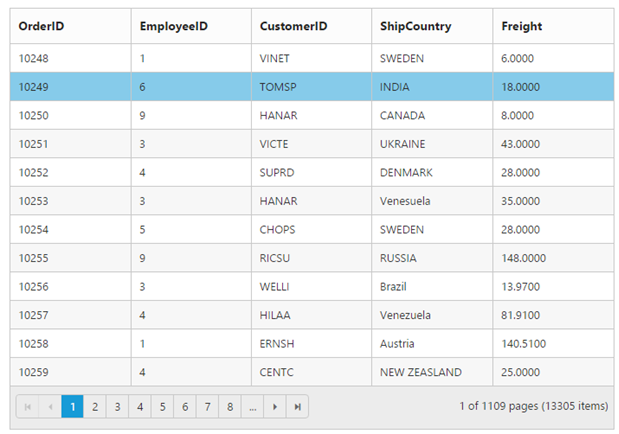

# Getting Started with JavaScript DataManager 

## Create your DataManager in JavaScript

**DataManager** is used to manage relational data in **JavaScript**. It supports **CRUD** (Create, Read, Update, and Destroy) in individual requests and Batch. **DataManager** uses two different classes, **ej.DataManager** for processing, and **ej.Query** for serving data. **ej.DataManager** communicates with data source and **ej.Query** generates data queries that are read by **DataManager**. 

## Configure Demo Application

This section briefly describes how to make a connection to **WCF “Northwind” OData** service and generate a report with top five orders from customer **HANAR** with higher “Freight” charges.  In this application scenario, you can learn how to do paging, filtering and sorting in **DataManager** using **ej.Query**.

Create an **HTML** file. Add the following reference code to the required libraries.



<body>
   <!-- the following table is used for demo purpose -->
   <table class="table table-bordered">
      <thead>
         <tr>
            <th>Order ID</th>
            <th>Customer ID</th>
            <th>Ship Name</th>
            <th>Ship City</th>
            <th>Freight</th>
         </tr>
      </thead>
      <tbody></tbody>
   </table>
   
</body>



## Create Connection

To define connection to data source, you can use **ej.DataManager** class. The data source can be local or remote. Local data source is the local **JavaScript** array and remote data source is any web services. 

The local array is set as data source using the following code example.



//jsonArray is local JavaScript array reference
var dataManager = ej.DataManager(window.jsonArray);



In this application, as you have web service for **NorthWind** database, you can assign the web service **URL** link to the **URL** property of **ejDataManager,** and you can enable **crossDomain** to retrieve data from another domain.



var dataManager = ej.DataManager({
     url: "http://mvc.syncfusion.com/Services/Northwnd.svc/Orders/",
     crossDomain: true
});



You can use **ej.Query** to generate the report from web service.

## Filter

You can generate the **Filter** query to filter the **CustomerID** column based on **VINET** value and it is executed using the **DataManager.**

The [where](https://help.syncfusion.com/api/js/ejquery#methods:where) function is used to filter the records based on the specified filter condition.

The [select](https://help.syncfusion.com/api/js/ejquery#methods:select) property of **ejQuery**, is used to retrieve the specified columns from the data source.

The [executeQuery](https://help.syncfusion.com/api/js/ejdatamanager#methods:executequery) property is used to process the data based on the query.



<body>
    
</body>



When you execute the filter query and binding the result to the table, the following table is displayed.

<table>
   <tr>
      <td>
         <b>Order ID</b>
      </td>
      <td>
         <b>Customer ID</b>
      </td>
      <td>
         <b>Ship Name</b>
      </td>
      <td>
         <b>Ship City</b>
      </td>
      <td>
         <b>Freight</b>
      </td>
   </tr>
   <tr>
      <td>
         10250
      </td>
      <td>
         HANAR
      </td>
      <td>
         Hanari Carnes
      </td>
      <td>
         Rio de Janeiro
      </td>
      <td>
         65.8300
      </td>
   </tr>
   <tr>
      <td>
         10253
      </td>
      <td>
         HANAR
      </td>
      <td>
         Hanari Carnes
      </td>
      <td>
         Rio de Janeiro
      </td>
      <td>
         58.1700
      </td>
   </tr>
   <tr>
      <td>
         10541
      </td>
      <td>
         HANAR
      </td>
      <td>
         Hanari Carnes
      </td>
      <td>
         Rio de Janeiro
      </td>
      <td>
         68.6500
      </td>
   </tr>
   <tr>
      <td>
         10645
      </td>
      <td>
         HANAR
      </td>
      <td>
         Hanari Carnes
      </td>
      <td>
         Rio de Janeiro
      </td>
      <td>
         12.4100
      </td>
   </tr>
   <tr>
      <td>
         10690
      </td>
      <td>
         HANAR
      </td>
      <td>
         Hanari Carnes
      </td>
      <td>
         Rio de Janeiro
      </td>
      <td>
         15.8000
      </td>
   </tr>
   <tr>
      <td>
         10770
      </td>
      <td>
         HANAR
      </td>
      <td>
         Hanari Carnes
      </td>
      <td>
         Rio de Janeiro
      </td>
      <td>
         5.3200
      </td>
   </tr>
   <tr>
      <td>
         10783
      </td>
      <td>
         HANAR
      </td>
      <td>
         Hanari Carnes
      </td>
      <td>
         Rio de Janeiro
      </td>
      <td>
         124.9800
      </td>
   </tr>
   <tr>
      <td>
         10886
      </td>
      <td>
         HANAR
      </td>
      <td>
         Hanari Carnes
      </td>
      <td>
         Rio de Janeiro
      </td>
      <td>
         4.9900
      </td>
   </tr>
   <tr>
      <td>
         10903
      </td>
      <td>
         HANAR
      </td>
      <td>
         Hanari Carnes
      </td>
      <td>
         Rio de Janeiro
      </td>
      <td>
         36.7100
      </td>
   </tr>
   <tr>
      <td>
         10922
      </td>
      <td>
         HANAR
      </td>
      <td>
         Hanari Carnes
      </td>
      <td>
         Rio de Janeiro
      </td>
      <td>
         62.7400
      </td>
   </tr>
   <tr>
      <td>
         10925
      </td>
      <td>
         HANAR
      </td>
      <td>
         Hanari Carnes
      </td>
      <td>
         Rio de Janeiro
      </td>
      <td>
         2.2700
      </td>
   </tr>
   <tr>
      <td>
         10981
      </td>
      <td>
         HANAR
      </td>
      <td>
         Hanari Carnes
      </td>
      <td>
         Rio de Janeiro
      </td>
      <td>
         193.3700
      </td>
   </tr>
   <tr>
      <td>
         11022
      </td>
      <td>
         HANAR
      </td>
      <td>
         Hanari Carnes
      </td>
      <td>
         Rio de Janeiro
      </td>
      <td>
         6.2700
      </td>
   </tr>
   <tr>
      <td>
         11052
      </td>
      <td>
         HANAR
      </td>
      <td>
         Hanari Carnes
      </td>
      <td>
         Rio de Janeiro
      </td>
      <td>
         67.2600
      </td>
   </tr>
</table>

## Sort

You can generate the **Sort** query to sort the **Freight** column in descending order and that is executed using the **DataManager**. 

The [sortBy](https://help.syncfusion.com/api/js/ejquery#methods:sortby) property of **ejQuery** is used to sort the records based on the field and direction specified.



<body>
   
</body>



When you execute the sort query and binding the result to the table, the following table is displayed.

<table>
   <tr>
      <td>
         <b>Order ID</b>
      </td>
      <td>
         <b>Customer ID</b>
      </td>
      <td>
         <b>Ship Name</b>
      </td>
      <td>
         <b>Ship City</b>
      </td>
      <td>
         <b>Freight</b>
      </td>
   </tr>
   <tr>
      <td>
         10981
      </td>
      <td>
         HANAR
      </td>
      <td>
         Hanari Carnes
      </td>
      <td>
         Rio de Janeiro
      </td>
      <td>
         193.3700
      </td>
   </tr>
   <tr>
      <td>
         10783
      </td>
      <td>
         HANAR
      </td>
      <td>
         Hanari Carnes
      </td>
      <td>
         Rio de Janeiro
      </td>
      <td>
         124.9800
      </td>
   </tr>
   <tr>
      <td>
         10541
      </td>
      <td>
         HANAR
      </td>
      <td>
         Hanari Carnes
      </td>
      <td>
         Rio de Janeiro
      </td>
      <td>
         68.6500
      </td>
   </tr>
   <tr>
      <td>
         11052
      </td>
      <td>
         HANAR
      </td>
      <td>
         Hanari Carnes
      </td>
      <td>
         Rio de Janeiro
      </td>
      <td>
         67.2600
      </td>
   </tr>
   <tr>
      <td>
         10250
      </td>
      <td>
         HANAR
      </td>
      <td>
         Hanari Carnes
      </td>
      <td>
         Rio de Janeiro
      </td>
      <td>
         65.8300
      </td>
   </tr>
   <tr>
      <td>
         10922
      </td>
      <td>
         HANAR
      </td>
      <td>
         Hanari Carnes
      </td>
      <td>
         Rio de Janeiro
      </td>
      <td>
         62.7400
      </td>
   </tr>
   <tr>
      <td>
         10253
      </td>
      <td>
         HANAR
      </td>
      <td>
         Hanari Carnes
      </td>
      <td>
         Rio de Janeiro
      </td>
      <td>
         58.1700
      </td>
   </tr>
   <tr>
      <td>
         10903
      </td>
      <td>
         HANAR
      </td>
      <td>
         Hanari Carnes
      </td>
      <td>
         Rio de Janeiro
      </td>
      <td>
         36.7100
      </td>
   </tr>
   <tr>
      <td>
         10690
      </td>
      <td>
         HANAR
      </td>
      <td>
         Hanari Carnes
      </td>
      <td>
         Rio de Janeiro
      </td>
      <td>
         15.8000
      </td>
   </tr>
   <tr>
      <td>
         10645
      </td>
      <td>
         HANAR
      </td>
      <td>
         Hanari Carnes
      </td>
      <td>
         Rio de Janeiro
      </td>
      <td>
         12.4100
      </td>
   </tr>
   <tr>
      <td>
         11022
      </td>
      <td>
         HANAR
      </td>
      <td>
         Hanari Carnes
      </td>
      <td>
         Rio de Janeiro
      </td>
      <td>
         6.2700
      </td>
   </tr>
   <tr>
      <td>
         10770
      </td>
      <td>
         HANAR
      </td>
      <td>
         Hanari Carnes
      </td>
      <td>
         Rio de Janeiro
      </td>
      <td>
         5.3200
      </td>
   </tr>
   <tr>
      <td>
         10886
      </td>
      <td>
         HANAR
      </td>
      <td>
         Hanari Carnes
      </td>
      <td>
         Rio de Janeiro
      </td>
      <td>
         4.9900
      </td>
   </tr>
   <tr>
      <td>
         10925
      </td>
      <td>
         HANAR
      </td>
      <td>
         Hanari Carnes
      </td>
      <td>
         Rio de Janeiro
      </td>
      <td>
         2.2700
      </td>
   </tr>
</table>

## Page
You can generate the **Paging** query to get the top four orders and it is executed using the **DataManager**.  
The [page](https://help.syncfusion.com/api/js/ejquery#methods:page) property of **ejQuery** is used to retrieve the records based on the given **pageIndex** and **pageSize**.



<body>
   
</body>



When you execute the paging query and binding the result to the table, the following table is displayed.
<table>
   <tr>
      <th>
         <b>Order ID</b>
      </th>
      <th>
         <b>Customer ID</b>
      </th>
      <th>
         <b>Ship Name</b>
      </th>
      <th>
         <b>Ship City</b>
      </th>
      <th>
         <b>Freight</b>
      </th>
   </tr>
   <tr>
      <td>
         10981
      </td>
      <td>
         HANAR
      </td>
      <td>
         Hanari Carnes
      </td>
      <td>
         Rio de Janeiro
      </td>
      <td>
         193.3700
      </td>
   </tr>
   <tr>
      <td>
         10783
      </td>
      <td>
         HANAR
      </td>
      <td>
         Hanari Carnes
      </td>
      <td>
         Rio de Janeiro
      </td>
      <td>
         124.9800
      </td>
   </tr>
   <tr>
      <td>
         10541
      </td>
      <td>
         HANAR
      </td>
      <td>
         Hanari Carnes
      </td>
      <td>
         Rio de Janeiro
      </td>
      <td>
         68.6500
      </td>
   </tr>
   <tr>
      <td>
         11052
      </td>
      <td>
         HANAR
      </td>
      <td>
         Hanari Carnes
      </td>
      <td>
         Rio de Janeiro
      </td>
      <td>
         67.2600
      </td>
   </tr>
   <tr>
      <td>
         10250
      </td>
      <td>
         HANAR
      </td>
      <td>
         Hanari Carnes
      </td>
      <td>
         Rio de Janeiro
      </td>
      <td>
         65.8300
      </td>
   </tr>
</table>

## Widget Binding 

Many Syncfusion UI widgets support data binding, and the Syncfusion DataManager is an ideal binding source for both local and remote data.

### Local DataSource

A DataSource can be created in-line with other Syncfusion UI widget configuration settings, as demonstrated in the example below.
[executeLocal](https://help.syncfusion.com/api/js/ejdatamanager#methods:executelocal) method is used to get the local json array.





### Remote DataSource

To bind remote data to Grid Control, you can assign a service data as an instance of ej.DataManager to the dataSource property.





