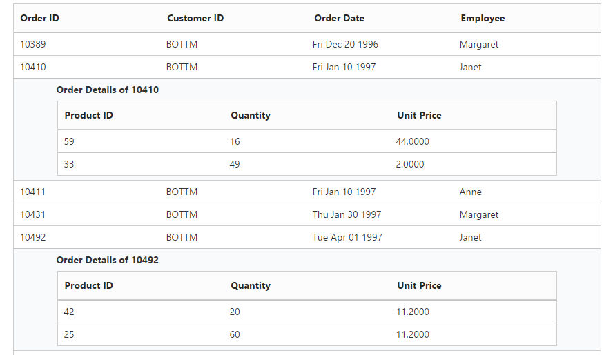

# Hierarchical Query

The **DataManager** contains support to manage the hierarchical query. The hierarchical queries are commonly required when you use foreign key binding. The hierarchical query can be provided using the **hierarchical** function. This method accepts two parameters such as the query and the selector function. 

## ForeignKey

The [foreignkey](https://help.syncfusion.com/api/js/ejquery#methods:foreignkey) method of **ej.Query** can be used to refer another table fields. The foreignkey method accepts one parameter that is the foreign key value. 

The following code example illustrates the hierarchical query and foreignkey method. 



    

        

            <table class="e-table">
                <colgroup>
                    <col style="width:25%" />
                    <col style="width:25%"/>
                    <col style="width:25%"/>
                    <col style="width:25%"/>
                </colgroup>
            <thead>
                <tr>
                    <th class="e-headercell">
Order ID
</th>
                    <th class="e-headercell">
Customer ID
</th>
                    <th class="e-headercell">
Order Date
</th>
                    <th class="e-headercell">
Employee
</th>
                </tr>
            </thead>
            </table>
        

        

            <table class="e-table">
                <tbody>

                </tbody>
            </table>
        

    

    

    
    



The result for the above code example is illustrated as follows.

 

