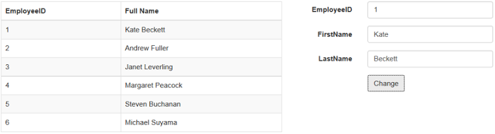

# KO ResultSet

The **DataManager** contains a default method to subscribe the view model properties as KO observable. This is done at the success of the **executeQuery** using the **getKnockoutModel.** You can also provide computed properties to the view model using the getKnockoutModel.

The following code example illustrates on how the model is made observable and updated.



    

        

            

                <table id="table1" class="table table-striped table-bordered" style="width:700px">
                    <thead>
                        <tr>
                            <th>EmployeeID</th>
                            <th>Full Name</th>
                        </tr>
                    </thead>
                    <tbody data-bind="foreach: employees">
                        <tr>
                            <td data-bind="text: EmployeeID"></td>
                            <td data-bind="text: FullName"></td>
                        </tr>
                    </tbody>
                </table>
            

            

                <form class="form-horizontal" role="form">
                    

                        <label class="col-sm-4 control-label">EmployeeID</label>
                        

                            <input type="text" class="form-control" id="empId">
                        

                    

                    

                        <label class="col-sm-4 control-label">FirstName</label>
                        

                            <input type="text" class="form-control" id="first">
                        

                    

                    

                        <label class="col-sm-4 control-label">LastName</label>
                        

                            <input type="text" class="form-control" id="last">
                        

                    

                    

                        

                            <button type="button" id="formSubmit" class="btn btn-default">Change</button>
                        

                    

                </form>
            

      

   

    



The result of the above code example is illustrated as follows.

Before changing the model, EmployeeID 1 has FullName value as Nancy Davolio. After changing, the result is as follows.

 

