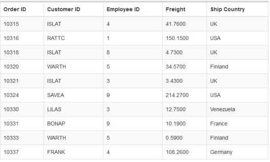
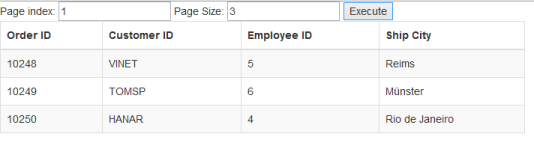
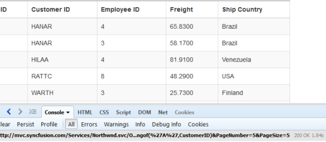
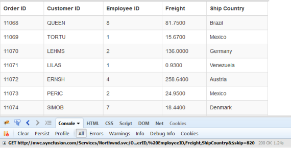
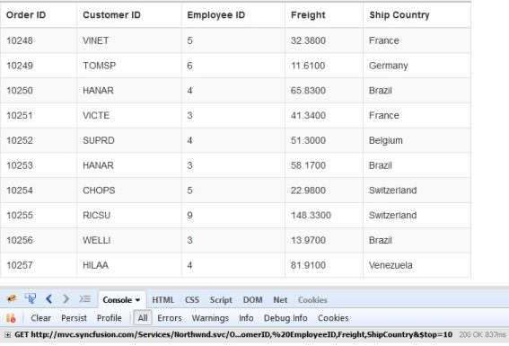
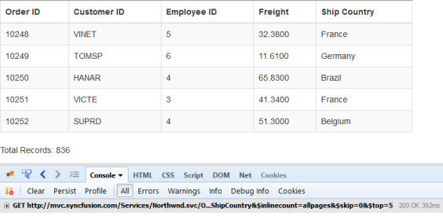
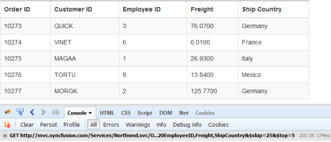

# Paging

Paging is a very important query in **DataManager** that is used to display only some records from the large data source. Here, you can learn the paging query using [page](https://help.syncfusion.com/api/js/ejquery#methods:page) option in detail.

## Default

The paging index and the paging size parameters of the paging query determines the number of records to be retrieved from the data source of the **DataManager**.

Refer to the following code example for the paging options.



    

        <table id="table1" class="table table-striped table-bordered" style="width:700px">
            <thead>
                <tr>
                    <th>Order ID</th>
                    <th>Customer ID</th>
                    <th>Employee ID</th>
                    <th>Freight</th>
                    <th>Ship Country</th>
                </tr>
            </thead>
            <tbody></tbody>
        </table>
    

    
    



Result for the above code example is illustrated as follows.

 

## Dynamic Paging

The paging operation can be dynamically performed using the **DataManager**. With the help of an external button click event, the required page records can be obtained and processed accordingly. The following code example illustrates the dynamic paging.



    Page index: <input type="text" value="1" id="index"/>
    Page Size: <input type="text" value="1" id="size"/>
    <input type="button" value="Execute" id="paging"/>
     
    

        <table id="table1" class="table table-striped table-bordered" style="width:700px">
            <thead>
                <tr>
                    <th>Order ID</th>
                    <th>Customer ID</th>
                    <th>Employee ID</th>
                    <th>Ship City</th>
                </tr>
            </thead>
            <tbody></tbody>
        </table>
    

    
    



Result of above code example is illustrated as follows.

 

## Custom paging

In this section, you can learn how to use customized paging. The following code example illustrates the custom paging.



    

        <table id="table1" class="table table-striped table-bordered" style="width:700px">
            <thead>
                <tr>
                <th>Order ID</th>
                <th>Customer ID</th>
                <th>Employee ID</th>
                <th>Freight</th>
                <th>Ship Country</th>
                </tr>
            </thead>
            <tbody></tbody>
        </table>
    

    
    



Result of above code example is illustrated as follows.

 

## Skip

The [skip](https://help.syncfusion.com/api/js/ejquery#methods:skip) query is used to skip some number of records.



    

        <table id="table1" class="table table-striped table-bordered" style="width:700px">
            <thead>
                <tr>
                    <th>Order ID</th>
                    <th>Customer ID</th>
                    <th>Employee ID</th>
                    <th>Freight</th>
                    <th>Ship Country</th>
                </tr>
            </thead>
            <tbody></tbody>
        </table>
    

    
    



Result of the above code example is illustrated as follows.

 

## Take

The [take](https://help.syncfusion.com/api/js/ejquery#methods:take) query is used to get some certain number of records from the data source of the **DataManager**.



    

        <table id="table1 class="table table-striped table-bordered" style="width:700px">
            <thead>
                <tr>
                    <th>Order ID</th>
                    <th>Customer ID</th>
                    <th>Employee ID</th>
                    <th>Freight</th>
                    <th>Ship Country</th>
                </tr>
            </thead>
            <tbody></tbody>
        </table>
    

    
    



Result of the above code example is illustrated as follows.

 

## RequiresCount

The [requiresCount](https://help.syncfusion.com/api/js/ejquery#methods:requirescount) query is used to get the count of the total number of records in the data source of the **DataManager**.



    

        <table id="table1" class="table table-striped table-bordered" style="width:700px">
            <thead>
                <tr>
                    <th>Order ID</th>
                    <th>Customer ID</th>
                    <th>Employee ID</th>
                    <th>Freight</th>
                    <th>Ship Country</th>
                </tr>
            </thead>
            <tbody></tbody>
        </table>
        Total Records: 
    

    
    



Result of the above code example is illustrated as follows.

 

## Range

The [range](https://help.syncfusion.com/api/js/ejquery#methods:range) query is used to get some particular range of records from the data source of the **DataManager**.



    

        <table id="table1" class="table table-striped table-bordered" style="width:700px">
            <thead>
                <tr>
                    <th>Order ID</th>
                    <th>Customer ID</th>
                    <th>Employee ID</th>
                    <th>Freight</th>
                    <th>Ship Country</th>
                </tr>
            </thead>
            <tbody></tbody>
        </table>
    

    
    



Result of the above code example is illustrated as follows.

 

