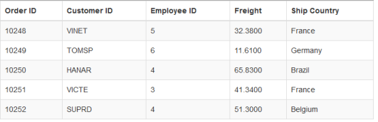
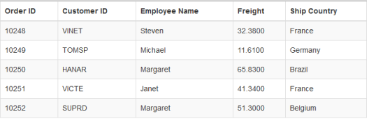

# Query in JavaScript DataManager

**DataManager** provides support for multiple queries in order to perform various operations like filtering, sorting, cloning, expanding, searching, grouping etc., in the data source. Here, you can learn the query options in detail.

## Select

The `select` query of the data manager is used to select only some particular fields or columns from the data source. The following code example illustrates on how to select only particular fields using the select query.



    

        <table id="table1" class=" table table-striped table-bordered" style="width:700px">
            <thead>
                <tr>
                    <th>Order ID</th>
                    <th>Customer ID</th>
                    <th>Employee ID</th>
                    <th>Freight</th>
                    <th>Ship Country</th>
                </tr>
            </thead>
            <tbody></tbody>
        </table>
    

    
    



Result of the above code example is illustrated as follows.

## From

The [from](https://help.syncfusion.com/api/js/ejquery#methods:from) query of the data manager is used to select the table from where the data is retrieved and bound to the table. The following code example illustrates on how to use the `from` query.



    

        <table id="table1" class=" table table-striped table-bordered" style="width:700px">
            <thead>
                <tr>
                    <th>Order ID</th>
                    <th>Customer ID</th>
                    <th>Employee ID</th>
                    <th>Freight</th>
                    <th>Ship Country</th>
                </tr>
            </thead>
            <tbody></tbody>
        </table>
    

    
    



Result of the above code example is illustrated as follows.

## Clone

The [clone](https://help.syncfusion.com/api/js/ejquery#methods:clone) query of the data manager is used to duplicate the query. The following code example illustrates on how to `clone` a query.



    

        <table id="table1" class=" table table-striped table-bordered" style="width:700px">
            <thead>
                <tr>
                    <th>Order ID</th>
                    <th>Customer ID</th>
                    <th>Employee ID</th>
                    <th>Freight</th>
                    <th>Ship Country</th>
                </tr>
            </thead>
            <tbody></tbody>
        </table>
    

    
    



Result of the above code example is illustrated as follows.

## Expand

The [expand](https://help.syncfusion.com/api/js/ejquery#methods:expand) query of the data manager is used to perform complex data binding.



    

        <table id="table1" class=" table table-striped table-bordered" style="width:700px">
            <thead>
                <tr>
                    <th>Order ID</th>
                    <th>Customer ID</th>
                    <th>Employee Name</th>
                    <th>Freight</th>
                    <th>Ship Country</th>
                </tr>
            </thead>
            <tbody></tbody>
        </table>
    

    
    



Result of the above code example is illustrated as follows.

