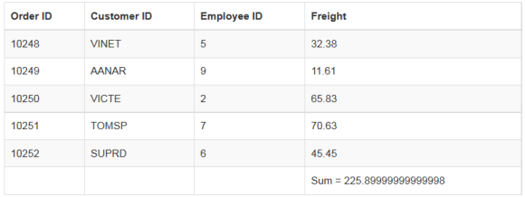
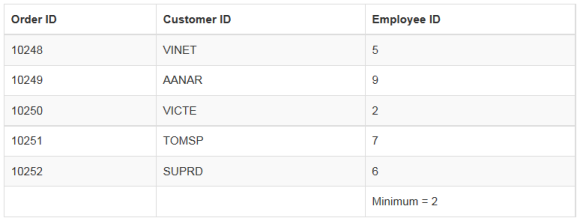
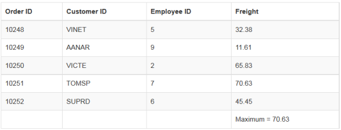
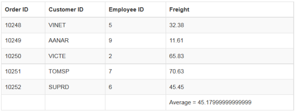
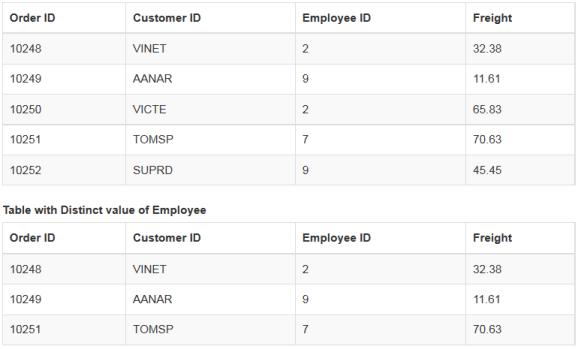

# Summary 

Summary is a key feature in **DataManager** that helps to aggregate any data. **DataManager** provides several summary type by default, they are as follows.

* Sum

* Average 

* Minimum

* Maximum

* Distinct

The ej provided several data utilization methods to achieve summary. 

## Sum

The `Sum` summary type provides the sum of the data. The Sum data utilization method accepts two parameters, they are **JSON** data and the field name where the sum is calculated. The following code example illustrates the Default Summary Types.



    

        <table id="table1" class="table table-striped table-bordered" style="width:700px">
            <thead>
            <tr>
                <th>Order ID</th>
                <th>Customer ID</th>
                <th>Employee ID</th>
                <th>Freight</th>
            </tr>
            </thead>
            <tbody></tbody>
        </table>
    

    
    



The result of the above code example is illustrated as follows.

 

## Min

The Minimum of a particular field can be calculated using the `ej.min` data utilization method and this method accepts the arguments such as **JSON** data/array, field name and the comparer used for the comparison. When the data to the min method is a **JSON** array then the whole record is returned.

The minimum of particular field can be calculated as follows.



    

        <table id="table1" class="table table-striped table-bordered" style="width:700px">
            <thead>
            <tr>
                <th>Order ID</th>
                <th>Customer ID</th>
                <th>Employee ID</th>
            </tr>
            </thead>
            <tbody></tbody>
        </table>
    

    
    



The result of the above code example is illustrated as follows.

 

## Max

The Maximum of a particular field can be calculated using the `ej.max` data utilization method and this method accepts the arguments such as **JSON** data/array, field name and the comparer used for the comparison. When the data to the max method is a **JSON** array then the whole record is returned.

The maximum of particular field can be calculated as follows.



    

        <table id="table1" class="table table-striped table-bordered" style="width:700px">
            <thead>
            <tr>
                <th>Order ID</th>
                <th>Customer ID</th>
                <th>Employee ID</th>
                <th>Freight</th>
            </tr>
            </thead>
            <tbody></tbody>
        </table>
    

    
    



The result for the above code example is illustrated as follows.

 

## Avg

The Average summary type provides the average of the given data. The Average data utilization method accepts two parameters, they are **JSON**/Array data and the field name where the sum is calculated. Use the following code example for calculating the average of given **JSON** data.



    

        <table id="table1" class="table table-striped table-bordered" style="width:700px">
            <thead>
            <tr>
                <th>Order ID</th>
                <th>Customer ID</th>
                <th>Employee ID</th>
                <th>Freight</th>
            </tr>
            </thead>
            <tbody></tbody>
        </table>
    

    
    



The result of the above code example is illustrated as follows.

 

## Distinct

In a data, a field may contain many duplicate values; and sometimes you only require to list the different (distinct) values. This can be achieved by using the **ej.distinct** method. This method accepts three parameters such as **JSON**/Array data, fieldname that you want to fetch as distinct and the third boolean parameter when set as true, returns the whole record when the data is a **JSON** array. 

The following code example illustrates how to use the `ej.distinct` method. In the following code, the third param of distinct method is set as true and hence it fetches the whole record from the provided data.



    

        <table id="table1" class="table table-striped table-bordered" style="width:700px">
            <thead>
            <tr>
                <th>Order ID</th>
                <th>Customer ID</th>
                <th>Employee ID</th>
                <th>Freight</th>
            </tr>
            </thead>
            <tbody></tbody>
        </table>
        <label>Table with Distinct value of Employee</label>
        <table id="distinct" class="table table-striped table-bordered" style="width:700px">
            <thead>
            <tr>
                <th>Order ID</th>
                <th>Customer ID</th>
                <th>Employee ID</th>
                <th>Freight</th>
            </tr>
            </thead>
            <tbody></tbody>
        </table>
    

    
    



The result for the above code example is illustrated as follows.

 

