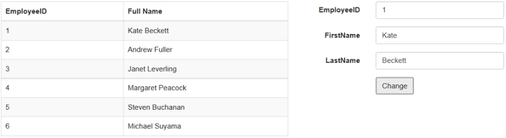

# Table Model

The **DataManager** contains a default support to bind a TableModel to the element. You can make the data observable using the **getTableModel** method. The **getTableModel** method also accept extra properties or properties with computed value that can be added to the TableModel. In the view, you can create a simple view by using the bindings **getTableModel**

Then the model is bound with the element using the **bindTo.** 



    

        

            

                <table id="table1" class="table table-striped table-bordered" style="width:700px">
                    <thead>
                        <tr>
                            <th>EmployeeID</th>
                            <th>Full Name</th>
                        </tr>
                    </thead>
                    <tbody id="tbody1">
                        <tr>
                            <td ej-observe="EmployeeID" ej-computed="EmployeeIndex"></td>
                            <td ej-computed="FullName"></td>
                        </tr>
                    </tbody>
                </table>
            

            

                <form class="form-horizontal" role="form">
                    

                        <label class="col-sm-4 control-label">EmployeeID</label>
                        

                            <input type="text" class="form-control" id="empId">
                        

                    

                    

                        <label class="col-sm-4 control-label">FirstName</label>
                        

                            <input type="text" class="form-control" id="first">
                        

                    

                    

                        <label class="col-sm-4 control-label">LastName</label>
                        

                            <input type="text" class="form-control" id="last">
                        

                    

                    

                        

                            <button type="button" id="formSubmit" class="btn btn-default">Change</button>
                        

                    

                </form>
            

        

    

    



The result for the above code example is illustrated as follows.

 

[Sample Link](http://jsplayground.syncfusion.com/2clbqjhr)

