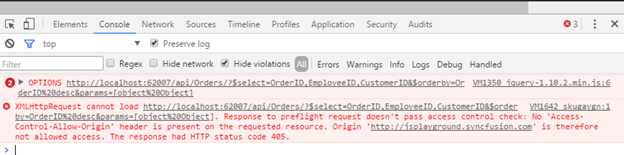

# CORS Data Fetching

The Cross-Origin Resource Sharing (CORS) mechanism gives web servers cross-domain access controls, which enable secure cross-domain data transfers. Modern browsers use CORS in an API container - such as XMLHttpRequest or Fetch - to mitigate risks of cross-origin HTTP requests.

## SAME-ORIGIN POLICY

This is a security policy who defines the rules of how a web page can access an external resource (e.g. fonts, AJAX requests). Under the same-origin policy, web browsers do not permit a web page to access resources who origin differ than that of the current page. The origin is considered to be different when the scheme, hostname or port of the resource do not match that of the page. Overcoming the limitations of same-origin security policy is possible using a technique called Cross-origin resource sharing or simply CORS.

 

## Access-Control-Allow-Origin

Cross-domain requests require mutual consent between the Web page and the server. You can initiate a cross-domain request in your Web page and opening a connection to a particular domain. The browser will request data from the domain's server by sending an Origin header with the value of the origin. It will only complete the connection if the server responds with an Access-Control-Allow-Origin header of either * or the exact URL of the requesting page.
When you set, Access-Control-Allow-Origin value as “site1.com”.

With this configuration, only scripts that originate from http://site1.com are allowed to load resources. Any other domain trying to use AJAX to load resources will be given the standard security error message. In this way, site owners can limit which domains are allowed to load their resources with CORS.

Alternatively, site owners can grant wide-open access with the always ready to party asterisk: __Access-Control-Allow-Origin: *__.



    <system.webServer>
        <httpProtocol>
            <customHeaders>
                <add name="Access-Control-Allow-Origin" value="*" />
            </customHeaders>
        </httpProtocol>
    </system.webServer>



Now, any site that wants to load a resource directly using AJAX can do so without getting the browser security error. It's a very helpful technique for modern apps that often load data using JavaScript, and hopefully more modern web APIs will start to support CORS.

## Access-Control-Request-Method

The Access-Control-Request-Method is used when issuing a preflight request to let the server know what HTTP method will be used when the actual request is made.



    <httpProtocol>
        <customHeaders>
            <add name="Access-Control-Allow-Methods" value="GET, POST, PUT, DELETE, OPTIONS" />
        </customHeaders>
    </httpProtocol>



N> 
Preflightedrequests:  
Setting custom headers to XHR triggers a preflight request. With simple words this mean that preflight request first sends an HTTP request by the OPTIONS method to the resource on the remote domain, to make sure that the request is safe to send. According W3C for non-same origin requests using the HTTP GET method a preflight request is made when headers other than Accept and Accept-Language are set.

## Access-Control-Request-Headers

The Access-Control-Request-Headers header is used when issuing a preflight request to let the server know what HTTP headers will be used when the actual request is made.



    <httpProtocol>
        <customHeaders>
            <add name="Access-Control-Allow-Headers" value="*" />
        </customHeaders>
    </httpProtocol>



 [For more details, please refer to this link:] (#https://developer.mozilla.org/en-US/docs/Web/HTTP/Access_control_CORS#Access-Control-Allow-Headers)