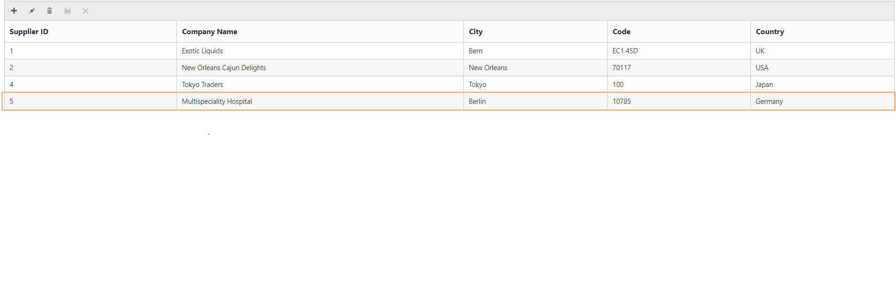
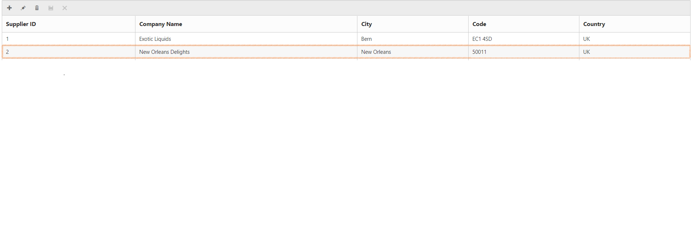
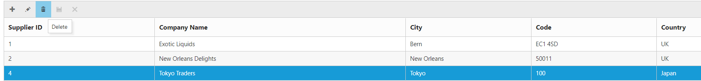

# How To

## How I can call and bind to a WebService.asmx

Create a sample using ASP.NET Web Services



    public class WebService1 : System.Web.Services.WebService
    {
        static string cons = ConfigurationManager.ConnectionStrings["SQLConnectionString"].ConnectionString;
        static SqlConnection con = new SqlConnection(cons);

        [WebMethod]
        public DataTable Get()
        {
            SqlCommand getData = new SqlCommand();
            getData.CommandText = "USP_DEV_ChangeLog_Select"; // Stored procedure for retrieve data from suppliers table
            getData.CommandType = CommandType.StoredProcedure;
            getData.Connection = con;
            if (con.State != ConnectionState.Open)
                con.Open();
            DataTable sqlData = new DataTable();
            SqlDataAdapter sqlAdapter = new SqlDataAdapter(getData);
            sqlData.TableName = "Suppliers";
            sqlAdapter.Fill(sqlData);
            return sqlData;
        }
    }



In the above code snippet, we have created web services by using the ASP.NET web service and bound dataSource to Grid, in code behind GetDataSource method.



    [WebMethod]
    [ScriptMethod(ResponseFormat = ResponseFormat.Json)] // Return the JSON formatted result
    public static object GetDataSource()
    {
        CRUD_Service.WebService1 service = new CRUD_Service.WebService1();
        var sqlData = service.Get();   // Get data from web services
        DataResult result = new DataResult();
        List<EditableCustomer> data = (from onDemand in sqlData.AsEnumerable() // Perform skip take for on demand load paging
                                        select new EditableCustomer
                                        {
                                            SupplierID = onDemand.ItemArray[0].ToString(),
                                            CompanyName = onDemand.ItemArray[1].ToString(),
                                            City = onDemand.ItemArray[5].ToString(),
                                            PostalCode = onDemand.ItemArray[7].ToString(),
                                            Country = onDemand.ItemArray[8].ToString()
                                        }).ToList();

        con.Close();
        return data;
    }





    var dataManager = ej.DataManager({

                url: "Default.aspx/GetDataSource",
                offline: true, 
                adaptor: "UrlAdaptor"

            });



## How do I control communication errors with the web service?

We can handle the error or any exception using fail event of ejDataManager during the post back. The fail method gets invoked when there is any error while making the request or an exception. 
Please refer to the below code example.



    



## How-to use DataManager consume WCF-RESTful with and without parameter?

We have created a simple Grid sample which is loaded with the data from the WCF RESTful service using DataManager.

In the above sample, we have created two Grids and a WCF RESTful service with two method “GetDataWithParam” and “GetDataWithOutParam”.  Those methods are implemented from the interface IOrder.



    //The method GetDataWithOutParam will be invoked when the URI is as defined in the UriTemplate as follow.

    [OperationContract]

    [WebGet(UriTemplate = "Orders",ResponseFormat = WebMessageFormat.Json)] //Call the method without parameter

    string GetDataWithOutParam();

 
    //The method GetDataWithParam will be invoked when a request is made without parameter.

    [OperationContract]

    [WebInvoke(Method = "POST", UriTemplate = "Orders", RequestFormat = WebMessageFormat.Json,

    ResponseFormat = WebMessageFormat.Json, BodyStyle = WebMessageBodyStyle.WrappedRequest)] //Call the method with parameter

    string GetDataWithParam(int take,int skip);



To request the web service without parameter using DataManager, please refer the following code snippet. In the below code snippet, request will be made to the web service using executeQuery method.



    var data1 = ej.DataManager({ url: "/Order.svc/Orders" });

                var query = new ej.Query();
                var dataObj = data1.executeQuery(query); //Request the webService
                dataObj.done(function (e) {

                    $("#Grid").ejGrid({
                        dataSource: e.result
                    });

                });



To request the WCF service with parameter, please refer the following code snippet. we have used the ej.Query() to add parameters and configured the DataManager using the UrlAdaptor and hence POST request will be send to the WCF RESTful Service with parameter skip and take.



    var data2 = ej.DataManager({ url: "/Order.svc/Orders" });

            data2.adaptor = new ej.UrlAdaptor();

            var query1 = new ej.Query().skip(5).take(30); //Adding parameter to be send to the web service

            var dataManagerObj = data2.executeQuery(query1) //Request the web service

            dataManagerObj.done(function (e) {

                $("#Grid1").ejGrid({
                    dataSource: e.result
                });

            });



Now the request will have made to the web service with parameter value skip as 5 and take as 30.

For getting started with WCF OData service please refer [link](http://msdn.microsoft.com/en-us/data/odata.aspx).

## Can I use ESRI Rest Web Services in url of DataManager?

Yes, you can use ESRI Rest web services in url of DataManager. We have used a demo service from the site in our DataManager and prepared a sample with custom DataAdaptor in Datamanager. 
Refer to the following link for the sample: 

Playground sample : [Demo](http://jsplayground.syncfusion.com/jr2cgadj)

## CRUD Operations using Stored Procedures

By default, DataManager supports the CRUD (Create, Read, Update, Destroy) data operations with Syncfusion UI widgets such as Grid, ListView etc. This section explain about how to perform CRUD operations in Grid using Stored procedures 


     
    

     



In the aspx page add the below code for CRUD Operations



    public partial class _Default : Page
    {

        static string cons = ConfigurationManager.ConnectionStrings["SQLConnectionString"].ConnectionString;
        static SqlConnection con = new SqlConnection(cons);
        protected void Page_Load(object sender, EventArgs e)
        {

        }
        [WebMethod]
        [ScriptMethod(ResponseFormat = ResponseFormat.Json)] // Return the JSON formatted result
        public static object GetDataSource(int skip, int take)
        {
            SqlCommand getData = new SqlCommand();
            getData.CommandText = "SP_GetData"; // Stored procedure for retrieve data from suppliers table
            getData.CommandType = CommandType.StoredProcedure;
            getData.Connection = con;
            if (con.State != ConnectionState.Open)
                con.Open();
            DataTable sqldata = new DataTable();
            SqlDataAdapter sqladapter = new SqlDataAdapter(getData);
            sqladapter.Fill(sqldata);
            DataResult result = new DataResult();
            List<EditableCustomer> data = (from order in sqldata.AsEnumerable().Skip(skip).Take(take) // Perform skip take for on demand page load
                                           select new EditableCustomer
                                           {
                                               SupplierID = order.ItemArray[0].ToString(),
                                               CompanyName = order.ItemArray[1].ToString(),
                                               City = order.ItemArray[5].ToString(),
                                               PostalCode = order.ItemArray[7].ToString(),
                                               Country = order.ItemArray[8].ToString()
                                           }).ToList();

            result.result = data;
            result.count = sqldata.Rows.Count;
            con.Close();
            return result; // return value must have result, count object from DataResult class            
        }
        public class DataResult
        {
            public IEnumerable result { get; set; }
            public int count { get; set; }
        }
        [WebMethod]
        public static void Update(EditableCustomer value)
        {
            ExecuteToSQL("SP_Update", 0, value, "update");  // SP_Update stored procedure      
        }
        [WebMethod]
        public static void Insert(EditableCustomer value)
        {
            ExecuteToSQL("SP_Insert", 0, value, "insert"); // SP_Insert stored procedure
        }
        [WebMethod]
        public static void Remove(int key)
        {
            ExecuteToSQL("SP_Delete", key, null, "remove"); // SP_Delete stored procedure
        }

        public static void ExecuteToSQL(string commandText, int key, EditableCustomer customer, string requestType)
        {
            SqlCommand sqlCommand = new SqlCommand();
            sqlCommand.CommandText = commandText; // Stored procedure for editing actions
            sqlCommand.CommandType = CommandType.StoredProcedure;
            if (requestType == "remove")
            {
                sqlCommand.Parameters.Add(new SqlParameter("@SupplierID", key)); // Pass parameter to SP_Remove stored procedure
            }
            // Pass parameter to SP_Insert and SP_Update stored procedures
            else if (requestType == "insert" || requestType == "update")
            {
                sqlCommand.Parameters.Add(new SqlParameter("@SupplierID", customer.SupplierID));
                sqlCommand.Parameters.Add(new SqlParameter("@CompanyName", customer.CompanyName));
                sqlCommand.Parameters.Add(new SqlParameter("@City", customer.City));
                sqlCommand.Parameters.Add(new SqlParameter("@PostalCode", customer.PostalCode));
                sqlCommand.Parameters.Add(new SqlParameter("@Country", customer.Country));
            }
            sqlCommand.Connection = con;
            if (con.State != ConnectionState.Open)
                con.Open();
            sqlCommand.ExecuteNonQuery();
            con.Close();
        }
    }

    public class EditableCustomer
    {
        public string SupplierID { get; set; }

        public string CompanyName { get; set; }
        
        public string City { get; set; }
        
        public string PostalCode { get; set; }
       
        public string Country { get; set; }
       
    }



The output of above code will be as shown below 

 

Insert:

 

After Insertion:

 

Edit:

 

After Edit:

 

Delete:

 

After Deletion:

 