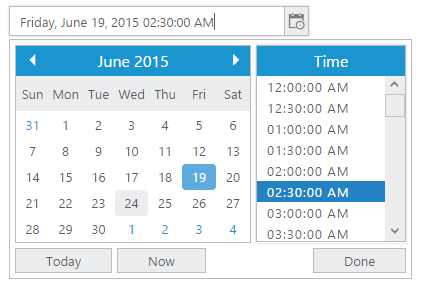
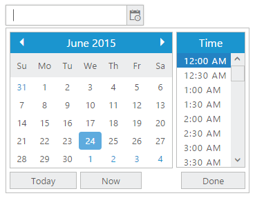

# Display format in JQuery DateTimePicker widget

**DateTimePicker** allows you to define the text representation of a date and time value to be displayed in the [DateTimePicker](https://www.syncfusion.com/javascript-ui-controls/js-datetime-picker) control. The format specified is achieved by the **dateTimeFormat** property. Default value of this property is **M/d/yyyy h: mm tt**. To change the “Time Popup” display format, “timeDisplayFormat” is used here. The default value of this property is “**h:mm t**”. 

If your company’s website is going to be used all over the world, following the **UTC** time is better. Main benefit of UTC Time is that the time is always guaranteed to be _consistent_. In other words, whenever the time zone of customer is changed you don't have to go back or forth in time from the logging time of the customer to your time zone.

DateTime format

<table>
   <tr>
      <th>
         Format
      </th>
      <th>
         Display in DateTimePicker
      </th>
   </tr>
   <tr>
      <td>
         Short Date and Time– d/M/yy h:mm tt
      </td>
      <td>
         9/12/2014 2:04 PM
      </td>
   </tr>
   <tr>
      <td>
         Medium Date-d MMM yy h:mm tt
      </td>
      <td>
         12 Sep 14 2:04: PM
      </td>
   </tr>
   <tr>
      <td>
         Full Date and short time - dddd, MMMM dd, yyyy HH:mm tt
      </td>
      <td>
         Friday, September 12,2014 2:04 PM
      </td>
   </tr>
   <tr>
      <td>
         Full Date and Long Time - dddd, MMMM dd, yyyy HH:mm:ss tt
      </td>
      <td>
         Friday, September 12,2014 2:04:00 PM
      </td>
   </tr>
   <tr>
      <td>
         UTC - yyyy-MM-dThh:mm:ssz
      </td>
      <td>
         2014-09-12T2:04:00+5
      </td>
   </tr>
</table>

You can also customize the format. Refer the following list to create your custom format for **DateTimePicker**.

* d - Day of the month.
* ddd - Short name of day of the week.
* dddd - Full name of day of the week.
* M – The month, from 1 through 12.
* MMM- Short name of Month.
* MMMM- Long name of the Month.
* yy - Last two digit if year.
* yyyy - Full Year.
* hh – Hour.
* mm – Minutes.
* ss – Seconds.
* tt - The AM/PM designator.

In the following example, set **dateTimeFormat** to **full datetime** format.

Add the following code in your **HTML** page.


  

   <input type="text" id="dateTime" />





    // Add the code in your script section to render the DateTimePicker
    $('#dateTime').ejDateTimePicker({
       dateTimeFormat: "dddd, MMMM dd, yyyy hh:mm:ss tt",
       timePopupWidth: "150px",
       timeDisplayFormat: "hh:mm:ss tt",
       width: '300px'
    });



## Day Header format

You can change the format for the days of the week names using **Day Header format** property. By default in our **DateTimePicker** day of the week format in **showHeaderMin** format. For example, **Sun** for **Sunday**. To know the different types of day format refer the following table.

showHeaderMin

<table>
   <tr>
      <th>
         Header Format types 
      </th>
      <th>
         Description
      </th>
   </tr>
   <tr>
      <td>
         showHeaderNone
      </td>
      <td>
         Removes the day header
      </td>
   </tr>
   <tr>
      <td>
         showHeaderShort
      </td>
      <td>
         Shows the day header format in min like Su, Mo, Tu …
      </td>
   </tr>
   <tr>
      <td>
         showHeaderMin
      </td>
      <td>
         Shows the day header format in short like Sun, Mon, Tue …
      </td>
   </tr>
   <tr>
      <td>
         showHeaderLong
      </td>
      <td>
         Shows the day header format in long like Sunday, Monday, Tuesday …
      </td>
   </tr>
</table>

You can also customize the format according to your needs. This is achieved by changing the day names information in the culture script file. This is explained later under the Localization section of this document. In the following sample is displayed, the short name of the day of the week, by setting day header format as **showHeaderShort**.

Add the following code in your **HTML** page.


  

   <input type="text" id="dateTime" />





    // Add the code in your script section to render the DateTimePicker with short header
    $('#dateTime').ejDateTimePicker({
       dayHeaderFormat: "showHeaderShort",
       width: '200px',
    });


  

## Drilldown and Meridian

We can drill down up to time interval on selected date with meridian details.you can utilize this option by make use of [timeDrillDown](https://help.syncfusion.com/api/js/ejdatetimepicker#members:timedrilldown) property.


    
    $('#dateTime').ejDateTimePicker({
        width: '100%',
        timeDrillDown: {
         enabled: true,
         interval: 5,
         showMeridian: false
        },
    });





    $('#dateTime').ejDateTimePicker({
        width: '100%',
        timeDrillDown: {
         enabled: true,
         interval: 5,
         showMeridian: true
        },
    });



Execute the above code to render the following outputs.

