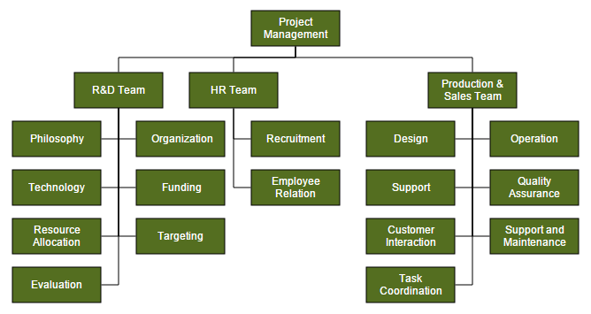
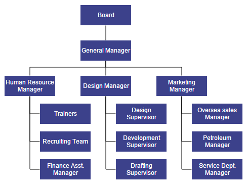
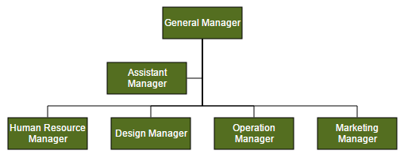
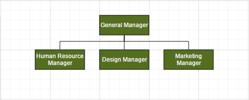

# Automatic Layout

Diagram provides support to auto-arrange the nodes in the Diagram area that is referred as **Layout**. It includes the following layout modes.

* Hierarchical Layout
* Organization Chart
* Radial Tree
* Symmetric Layout

## Hierarchical Layout

The Hierarchical Tree Layout arranges nodes in a tree-like structure, where the nodes in the hierarchical layout may have multiple parents. There is no need to specify the layout root.
To arrange the nodes in hierarchical structure, you need to specify the layout [type](/api/js/ejdiagram#members:layout-type "type") as hierarchical tree. The following example shows how to arrange the nodes in a hierarchical structure.
 


//Initializes data source
var data = [
	{Name: "Steve-Ceo"},
	{Name: "Kevin-Manager", ReportingPerson: "Steve-Ceo"},
	{Name: "Peter-Manager", ReportingPerson: "Steve-Ceo"},
	{Name: "John- Manager", ReportingPerson: "Peter-Manager"},
	{Name: "Mary-CSE ", ReportingPerson: "Peter-Manager"},
	{Name: "Jim-CSE ", ReportingPerson: "Kevin-Manager"},
	{Name: "Martin-CSE", ReportingPerson: "Kevin-Manager"}
];

var type = ej.datavisualization.Diagram.LayoutTypes;

//Binds custom JSON with node
function nodeTemplate(diagram, node) {
	node.labels[0].text = node.Name;
}

$("#diagram").ejDiagram({
	//Uses layout to auto-arrange nodes on the Diagram page
	layout: {
		//Sets layout type
		type: type.HierarchicalTree
	},

	//Sets the default properties for nodes and connectors
	defaultSettings: {
		node: {
			width: 100,
			height: 40,
			fillColor: "darkcyan",
			labels: [{
				name: "label1",
				bold: true,
				fontColor: "white"
			}]
		},
		connector: {
			segments: [{
				"type": "orthogonal"
			}],
			targetDecorator: {
				shape: "none"
			}
		}
	},

	//Initializes the node template.
	nodeTemplate: nodeTemplate,

	//Configures data source for Diagram
	dataSourceSettings: {
		//Defines the unique field
		id: "Name",

		//Defines the relationship
		parent: "ReportingPerson",

		//Specifies the dataSource
		dataSource: data
	}
});



N> You can ignore a particular Node from layout arrangement by setting its [excludeFromLayout](/api/js/ejdiagram#members:nodes-excludefromlayout "excludeFromLayout") property as true.

## Radial Tree Layout

The Radial Tree layout arranges nodes on a virtual concentric circles around a root node. Sub-trees formed by the branching of child nodes are located radially around the child nodes. This arrangement results in an ever-expanding concentric arrangement with radial proximity to the root node indicating the node level in the hierarchy. You can use layout [root](/api/js/ejdiagram#members:layout-root "root") property to define the root node of the layout. When no root node is set, the algorithm automatically considers one of the Diagram nodes as the root node.

To arrange nodes in a radial tree structure, you need to set the [type](/api/js/ejdiagram#members:layout-type "type") of the layout as `radialtree`. The following code illustrates how to arrange the nodes in a radial tree structure.



//Initializes data source
var data = [
	{Id: "parent", ImageUrl: "images/Clayton.png"},
	{Id: 1, ImageUrl: "images/image55.png", ReportingPerson: "parent"},
	{Id: 2, ImageUrl: "images/Robin.PNG", ReportingPerson: "parent"},
	{Id: 3, ImageUrl: "images/Robin.PNG", ReportingPerson: "parent"},
	{Id: 4, ImageUrl: "images/Paul.png", ReportingPerson: "parent"},
	{Id: 5, ImageUrl: "images/image53.png", ReportingPerson: "parent"},
	{Id: 6, ImageUrl: "images/Maria.png", ReportingPerson: "parent"},
	{Id: 7, ImageUrl: "images/Jenny.png", ReportingPerson: 3},
	{Id: 8, ImageUrl: "images/Thomas.PNG", ReportingPerson: "parent"},
	{Id: 9, ImageUrl: "images/Jenny.png", ReportingPerson: 2},
	{Id: 10, ImageUrl: "images/Thomas.png", ReportingPerson: 2},
	{Id: 11, ImageUrl: "images/Maria.PNG", ReportingPerson: 4},
	{Id: 12, ImageUrl: "images/Thomas.PNG", ReportingPerson: 1},
	{Id: 13, ImageUrl: "images/Clayton.png", ReportingPerson: 6},
	{Id: 14, ImageUrl: "images/Jenny.png", ReportingPerson: 3},
	{Id: 15, ImageUrl: "images/Thomas.png", ReportingPerson: 3},
	{Id: 16, ImageUrl: "images/John.png", ReportingPerson: 6},
	{Id: 17, ImageUrl: "images/Jenny.png", ReportingPerson: 4},
	{Id: 18, ImageUrl: "images/Robin.png", ReportingPerson: 4},
	{Id: 19, ImageUrl: "images/Clayton.png", ReportingPerson: 4},
	{Id: 20, ImageUrl: "images/image57.png", ReportingPerson: 12},
	{Id: 21, ImageUrl: "images/Robin.png", ReportingPerson: 5},
	{Id: 22, ImageUrl: "images/image51.png", ReportingPerson: 6},
	{Id: 23, ImageUrl: "images/image55.png", ReportingPerson: 19},
	{Id: 24, ImageUrl: "images/Thomas.png", ReportingPerson: 8},
	{Id: 25, ImageUrl: "images/image56.png", ReportingPerson: 8},
	{Id: 26, ImageUrl: "images/image55.png", ReportingPerson: 1},
	{Id: 27, ImageUrl: "images/image57.png", ReportingPerson: 13},
	{Id: 28, ImageUrl: "images/Robin.PNG", ReportingPerson: 12},
	{Id: 29, ImageUrl: "images/Thomas.PNG", ReportingPerson: 13},
	{Id: 30, ImageUrl: "images/image57.png",ReportingPerson: 19}
];

//Binds custom JSON with node
function nodeTemplate(diagram, node) {
	node.name = node.Id;
	node.source = node.ImageUrl;
}

$("#diagram").ejDiagram({
	width: "100%",
	height: "700px",

	//Uses layout to auto-arrange nodes on the Diagram page
	layout: {
		type: "radialtree",
		horizontalSpacing: 30,
		verticalSpacing: 30
	},

	//Sets the default properties of the nodes
	defaultSettings: {
		node: {
			width: 50,
			height: 50,
			borderColor: "transparent",
			type: "image"
		}
	},

	nodeTemplate: nodeTemplate,

	//Configures data source for Diagram
	dataSourceSettings: {
		id: "Id",
		parent: "ReportingPerson",
		dataSource: data
	},
});



## Organizational Chart

An **organizational chart** is a Diagram that displays the structure of an organization and relationships. To create an organizational chart, [type](/api/js/ejdiagram#members:layout-type "type") of layout should be set as `organizationalchart`.
The following code example illustrates how to create an organizational chart.



//Initializes data source
var data = [
	{Id: "parent", Role: "Project Management"},
	{Id: 1, Role: "R&D Team", Team: "parent"},
	{Id: 3, Role: "Philosophy", Team: "1"},
	{Id: 4, Role: "Organization", Team: "1"},
	{Id: 5, Role: "Technology", Team: "1"},
	{Id: 7, Role: "Funding", Team: "1"},
	{Id: 8, Role: "Resource Allocation", Team: "1"},
	{Id: 9, Role: "Targeting", Team: "1"},
	{Id: 11, Role: "Evaluation", Team: "1"},
	{Id: 156, Role: "HR Team", Team: "parent"},
	{Id: 13, Role: "Recruitment", Team: "156"},
	{Id: 113, Role: "Training", Team: "12"},
	{Id: 112, Role: "Employee Relation", Team: "156"},
	{Id: 14, Role: "Record Keeping", Team: "12"},
	{Id: 15, Role: "Compensations & Benefits", Team: "12"},
	{Id: 16, Role: "Compliances", Team: "12"},
	{Id: 17, Role: "Production & Sales Team", Team: "parent"},
	{Id: 119, Role: "Design", Team: "17"},
	{Id: 19, Role: "Operation", Team: "17"},
	{Id: 20, Role: "Support", Team: "17"},
	{Id: 21, Role: "Quality Assurance", Team: "17"},
	{Id: 23, Role: "Customer Interaction", Team: "17"},
	{Id: 24, Role: "Support and Maintenance", Team: "17"},
	{Id: 25, Role: "Task Coordination", Team: "17"}
];

//Binds JSON data with node
function nodeTemplate(diagram, node) {
	node.labels[0].text = node.Role;
}

//Initializes Diagram
$("#diagram").ejDiagram({
	//Defines default layout as organizational chart
	layout: {
		type: "organizationalchart"
	},

	defaultSettings: {
		//Sets the default properties of the node.
		node: {
			width: 100,
			height: 40,
			fillColor: "#546e20",
			labels: [{
				name: "label1",
				fontColor: "white"
			}]
		},

		//Sets the default properties of the connector.
		connector: {
			segments: [{
				"type": "orthogonal"
			}],
			targetDecorator: {
				shape: "none"
			}
		}
	},

	nodeTemplate: nodeTemplate,

	//Configures data source for Diagram
	dataSourceSettings: {
		id: "Id",
		parent: "Team",
		dataSource: data
	},
});



Organizational chart layout starts parsing from root and iterate through all its child elements. ‘getLayoutInfo’ method provides necessary information of a node’s children and the way to arrange (direction, orientation, offsets, etc.) them. You can customize the arrangements by overriding this function as explained.

### GetLayoutInfo

You can set Chart orientations, chart types, and offset to be left between parent and child nodes by overriding the method, diagram.model.layout.getLayoutInfo. The [getLayoutInfo](/api/js/ejdiagram#members:layout-getlayoutinfo "getLayoutInfo") method is called to configure every subtree of the organizational chart. It takes the following arguments.

* `diagram`: Reference of diagram
* `node`: Parent node to that options are to be customized
* `options`: object to set the customizable properties

The following code example illustrates how to define the method getLayoutInfo.



var chartOrientations = ej.datavisualization.Diagram.ChartOrientations;
var chartTypes = ej.datavisualization.Diagram.ChartTypes;

//Defines getLayoutInfo
function getLayoutInfo(diagram, node, options) {
	options.orientation = chartOrientations.Vertical;

	//Configures the sub tree of the node vertically at right-side.
	options.type = chartTypes.Right;
	options.offset = 10;
}

//Initializes Diagram
$("#diagram").ejDiagram({
	//Uses automatic layout to arrange elements
	layout: {
		type: "organizationalchart",
		getLayoutInfo: getLayoutInfo
	}
});



The following table illustrates the properties that "options" argument takes.

Property|Description|Default Value
---|---|---
options.children|Contains the list of child nodes. Children collection can be modified.|Array of child nodes
options.assistants|By default, the collection is empty. When any of the child nodes have to be set as "Assistant", you can remove from children collection and have to insert into assistants collection. |Empty array
options.orientation|Gets or sets the organizational chart orientation. |ChartOrientation.Vertical
options.type|Gets or sets the chart organizational chart type |For horizontal chart orientation:ChartType.Center For Vertical chart orientation:ChartType.Alternate
options.offset|Offset is the horizontal space to be left between parent and child nodes.|20 pixels.Applicable only for vertical chart orientations.
options.hasSubTree|Gets whether the node contains sub trees.|Boolean
options.level|Gets the depth of the node from layout root|Number
options.enableRouting|By default, Connections are routed based on the chart type and orientations.This property gets or sets whether default routing is to be enabled or disabled.|true
options.rows|Sets the number of rows on which the child nodes will be arranged. Applicable only for balanced type horizontal tree |Number

The following table illustrates the different chart orientations and chart types.

| Orientation | Type | Description | Example |
|---|---|---|---|
| Horizontal | Left | Arranges the child nodes horizontally at the left side of parent. |  |
| | Right | Arranges the child nodes horizontally at the right side of parent. |  |
| | Center | Arranges the children like standard tree layout orientation. |  |
| | Balanced | Arranges the leaf-level child nodes in multiple rows. |  |
| Vertical | Left | Vertically arranges the children at the left side of parent |  |
| | Right | Vertically arranges the children at the right side of parent |  |
| | Alternate | Vertically arranges the children at both left and right sides of parent |  |

The following code example illustrates how to set the vertical right arrangement to the leaf level trees.



//Initializes data source
var data = [
	{ Id: "parent", Role: "Board" },
	{ Id: "1", Role: "General Manager", Manager: "parent" },
	{ Id: "2", Role: "Human Resource Manager", Manager: "1" },
	{ Id: "3", Role: "Trainers", Manager: "2" },
	{ Id: "4", Role: "Recruiting Team", Manager: "2" },
	{ Id: "5", Role: "Finance Asst. Manager", Manager: "2" },
	{ Id: "6", Role: "Design Manager", Manager: "1" },
	{ Id: "7", Role: "Design Supervisor", Manager: "6" },
	{ Id: "8", Role: "Development Supervisor", Manager: "6" },
	{ Id: "9", Role: "Drafting Supervisor", Manager: "6" },
	{ Id: "10", Role: "Marketing Manager", Manager: "1" },
	{ Id: "11", Role: "Oversea sales Manager", Manager: "10" },
	{ Id: "12", Role: "Petroleum Manager", Manager: "10" },
	{ Id: "13", Role: "Service Dept. Manager", Manager: "10" },
];

var chartOrientations = ej.datavisualization.Diagram.ChartOrientations;
var chartTypes = ej.datavisualization.Diagram.ChartTypes;

//Creates the node template
function nodeTemplate(diagram, node) {
	node.labels[0].text = node.Role;
}

function getLayoutInfo(diagram, node, options) {
	if (!options.hasSubTree) {
		options.type = chartTypes.Right;
		options.orientation = chartOrientations.Vertical;
	}
}

//Initializes Diagram
$("#diagram").ejDiagram({
	//Defines default layout as organizational chart
	layout: {
		type: "organizationalchart",
		getLayoutInfo: getLayoutInfo
	},
	defaultSettings: {
		node: {
			width: 100,
			height: 40,
			fillColor: "#3c418B",
			borderColor: "transparent",
			labels: [{
				fontColor: "white"
			}]
		},
		connector: {
			segments: [{
				"type": "orthogonal"
			}],
			targetDecorator: {
				shape: "none"
			}
		}
	},
	//Initialize the node template.
	nodeTemplate: nodeTemplate,
	//configure data source for diagram
	dataSourceSettings: {
		id: "Id",
		parent: "Manager",
		dataSource: data
	},
});



### GetConnectorSegments

You can customize the connector segments based on source and target nodes by overriding the method, diagram.model.layout.getConnectorSegments and it can be used only when the layout type set as `organizationalchart`. please refer to [getConnectorSegments](/api/js/ejdiagram#members:layout-getconnectorsegments "getConnectorSegments") to know more details about its argument and usage.

### Assistant

**Assistants** are child item that have a different relationship with the parent node. They are laid out in a dedicated part of the tree. You can specify a node as an assistant of its parent by adding it to `assistants` property of the argument "options".

The following code example illustrates how to add assistants to layout.



//Initializes data source
var data = [
	{ Id: 1, Role: "General Manager" },
	{ Id: 2, Role: "Assistant Manager", Team: 1 },
	{ Id: 3, Role: "Human Resource Manager", Team: 1 },
	{ Id: 4, Role: "Design Manager", Team: 1 },
	{ Id: 5, Role: "Operation Manager", Team: 1 },
	{ Id: 6, Role: "Marketing Manager", Team: 1 }
];

//Creates the node template
function nodeTemplate(diagram, node) {
	node.labels[0].text = node.Role;
}

//Defines getLayoutInfo
function getLayoutInfo(diagram, node, options) {
	if (node.labels[0].text == "General Manager") {
		options.assistants.push(options.children[0]);
		options.children.splice(0, 1);
	}
	options.orientation = "horizontal";
	options.type = "center"
}

//Initializes Diagram
$("#diagram").ejDiagram({
	//Defines default layout as organizational chart
	layout: {
		type: "organizationalchart",
		getLayoutInfo: getLayoutInfo
	},
	defaultSettings: {
		node: {
			width: 100,
			height: 40,
			fillColor: "#546e20",
			labels: [{
				name: "label1",
				fontColor: "white"
			}]
		},
		connector: {
			segments: [{
				"type": "orthogonal"
			}],
			targetDecorator: {
				shape: "none"
			}
		}
	},
	nodeTemplate: nodeTemplate,
	dataSourceSettings: {
		id: "Id",
		parent: "Team",
		dataSource: data
	},
});



##  Symmetric Layout

The symmetric layout has been formed using nodes position by closer together or pushing them further apart. This is repeated iteratively until the system comes to an equilibrium state. 

The layout's [springLength](/api/js/ejdiagram#members:layout-springlength "springLength") defined as how long edges should be, ideally. This will be the resting length for the springs. Edge attraction and vertex repulsion forces to be defined by using layout's [springFactor](/api/js/ejdiagram#members:layout-springfactor "springFactor"), the more sibling nodes repel each other. The relative positions do not change anymore from one iteration to the next.  We can specify the no of iteration by using layout's [maxIteration](/api/js/ejdiagram#members:layout-maxiteration "maxIteration"). 

The following code illustrates how to arrange the nodes in a radial tree structure. 



        var nodes = [];
        var connectors = [];
        // creating the connection between the layout nodes and connectors.
        function connectNodes(parentNode, childNode) {
            var connector = {
                name: parentNode.name + childNode.name,
                sourceNode: parentNode.name,
                targetNode: childNode.name,
                targetDecorator: { shape: "none" }
            };
            return connector;
        }

        // creating the layout nodes as rectangle in shape.
        function getRectangle(name) {
            var node = {
                name: name, height: 25, width: 25, borderColor: "#5e5e5e", borderWidth: 1, fillColor: "#ff6329", shape: "ellipse"
            };
            return node;
        }

        // creating the symmetrical layout child elements hierarchy.
        function populateNodes() {
            var parentRect = getRectangle("p");
            nodes.push(parentRect);
            for (var i = 0; i < 2; i++) {
                var childRect_i = getRectangle("c" + i);
                nodes.push(childRect_i);
                for (var j = 0; j < 2; j++) {
                    var childRect_j = getRectangle("c" + i + j);
                    nodes.push(childRect_j);
                    for (var k = 0; k < 6; k++) {
                        var childRect_k = getRectangle("c" + i + j + k);
                        nodes.push(childRect_k);
                        connectors.push(connectNodes(childRect_j, childRect_k));
                    }
                    connectors.push(connectNodes(childRect_i, childRect_j));
                }
                connectors.push(connectNodes(parentRect, childRect_i));
            }
            return nodes;
        }

        $("#diagram").ejDiagram({
            //sets the layout child elements
            nodes: populateNodes(),
            connectors: connectors,
            //sets the layout as symmetric layout
            layout: {
                type: ej.datavisualization.Diagram.LayoutTypes.SymmetricLayout,
                springLength: 80,
                margin: {
                    left: 0,
                    top: 20,
                },
                springFactor: .8,
                maxIteration: 500
            }
        });



## Customize Layout

Orientation, spacings, and position of layout can be customized with a set of properties.

To explore layout properties, refer to [Layout Properties](/api/js/ejdiagram#members:layout "Layout Properties").

### Layout Bounds

Diagram provides support to align the layout within any custom rectangular area. For more information about bounds, refer to [bounds](/api/js/ejdiagram#members:layout-bounds "bounds")

### Layout Alignment

You can align the layout anywhere over the layout bounds/viewport using the [horizontalAlignment](/api/js/ejdiagram#members:layout-horizontalalignment "horizontalAlignment") and [verticalAlignment](/api/js/ejdiagram#members:layout-verticalalignment "verticalAlignment") properties of layout.

The following code illustrates how to align the layout at the top left of the layout bounds.



var type = ej.datavisualization.Diagram.LayoutTypes;
var orientation = ej.datavisualization.Diagram.LayoutOrientations;

$("#diagram").ejDiagram({
	layout: {
		
		//Sets the type of the layout
		type: type.HierarchicalTree,
		orientation: orientation.TopToBottom,
		horizontalSpacing: 25,
		verticalSpacing: 30,
		
		//Sets the layout bounds
		bounds:{x:0,y:0,width:500,height:500},
		
		//Sets the alignment of the layout
		horizontalALignment:ej.datavisualization.Diagram.HorizontalAlignment.Left,
		verticalAlignment:ej.datavisualization.Diagram.VerticalAlignment.Top,
	},
	defaultSettings: {
		//Sets the default properties of the node.
		//Sets the default properties of the connector.
	},

	//Initializes the node template.
	nodeTemplate: nodeTemplate,

	//Configures data source for Diagram
	dataSourceSettings: {
		//Specifies the dataSource
	}
});



### Layout Spacing

Layout provides support to add space horizontally and vertically between the nodes. The [horizontalSpacing](/api/js/ejdiagram#members:layout-horizontalspacing "horizontalSpacing") and [verticalSpacing](/api/js/ejdiagram#members:layout-verticalspacing "verticalSpacing") property of the layout allows you to set the space between the nodes in horizontally and vertically.

### Layout Margin

Layout provides support to add some blank space between the layout bounds/viewport and the layout. The [margin](/api/js/ejdiagram#members:layout-margin "margin") property of the layout allows you to set the blank space.

The following code illustrates how to set the layout margin.



var type = ej.datavisualization.Diagram.LayoutTypes;
var orientation = ej.datavisualization.Diagram.LayoutOrientations;

$("#diagram").ejDiagram({
	layout: {
	
		type: type.HierarchicalTree,
		orientation: orientation.TopToBottom,
		bounds:{x:0,y:0,width:500,height:500},
		horizontalSpacing: 25,
		verticalSpacing: 30,
		horizontalALignment:ej.datavisualization.Diagram.HorizontalAlignment.Left,
		verticalAlignment:ej.datavisualization.Diagram.VerticalAlignment.Top,
		
		//Sets the margin
		margin:{left:10,right:10,top:10,bottom:10}
	},
	defaultSettings: {
		//Sets the default properties of the node.
		//Sets the default properties of the connector.
	},

	//Initializes the node template.
	nodeTemplate: nodeTemplate,

	//Configures data source for Diagram
	dataSourceSettings: {
		//Specifies the dataSource
	}
});



### Layout Orientation

Diagram provides support to customize the orientation of layout. You can set the desired orientation using [layout.orientation](/api/js/ejdiagram#members:layout-orientation "layout.orientation").

The following code illustrates how to arrange the nodes in a "BottomToTop" orientation.



var type = ej.datavisualization.Diagram.LayoutTypes;
var orientation = ej.datavisualization.Diagram.LayoutOrientations;

$("#diagram").ejDiagram({
	layout: {
		//Sets the type of the layout
		type: type.HierarchicalTree,

		//Sets the orientation
		orientation: orientation.BottomToTop,

		//Sets the space to be horizontally left between nodes
		horizontalSpacing: 20,

		//Sets the space to be vertically left between nodes
		verticalSpacing: 20
	},
	defaultSettings: {
		//Sets the default properties of the node.
		//Sets the default properties of the connector.
	},

	//Initializes the node template.
	nodeTemplate: nodeTemplate,

	//Configures data source for Diagram
	dataSourceSettings: {
		//Specifies the dataSource
	}
});



### Fixed Node

Layout provides support to arrange the nodes with reference to the position of a fixed node and the fixed node has to be set to the [fixedNode](/api/js/ejdiagram#members:layout-fixednode "fixedNode") of the layout property.
This is helpful when you try to expand/collapse a node. It might be expected that the position of the double-clicked node should not be changed.



//Initializes data source
var data = [{
	name: "parent",
	Role: "General Manager",
	offsetX: 250,
	offsetY: 50
}, {
	name: "1",
	Role: "Human Resource Manager",
	Manager: "parent"
}, {
	name: "2",
	Role: "Design Manager",
	Manager: "parent",
}, {
	name: "3",
	Role: "Marketing Manager",
	Manager: "parent",
}];

//Creates the node template
function nodeTemplate(diagram, node) {
	node.labels[0].text = node.Role;
}

//Defines getLayoutInfo
function getLayoutInfo(diagram, node, options) {
	options.orientation = "horizontal";
	options.type = "center"
}

//Initializes Diagram
$("#DiagramContent").ejDiagram({
	//Defines default layout as organizational chart
	layout: {
		type: "organizationalchart",
		fixedNode: "parent",
		getLayoutInfo: getLayoutInfo
	},

	defaultSettings: {
		//Sets the default properties of the node.
		//Sets the default properties of the connector.
	},

	nodeTemplate: nodeTemplate,

	//Configures data source for diagram
	dataSourceSettings: {
		//Specifies the dataSource
	}
});



### Expand and collapse

Diagram allows to expand/collapse the sub trees of a layout. The node's [isExpanded](/api/js/ejdiagram#members:nodes-isexpanded "isExpanded") property allows you to expand/collapse its children. The following code example shows how to expand/collapse the children of a node.



//Initializes Diagram
$("#diagram").ejDiagram({
	//Defines default layout as organizational chart
	layout: {
		type: "organizationalchart", fixedNode: "node1"
	},

	//Defines double click event
	doubleClick: onDoubleClick
});

function onDoubleClick(args) {
	var diagram = $("#diagram").ejDiagram("instance");
	var node = args.element;

	// Sets the double clicked node as fixed node
	$("#diagram").ejDiagram({ layout: { fixedNode: node.name } });

	//Expands/collapses the children of node
	diagram.updateNode(node.name, { isExpanded: !node.isExpanded });
}



In above example, while expanding/collapsing a node, it is set as fixed node in order to prevent it from repositioning.

### Refresh layout

Diagram allows to refresh the layout at runtime. To refresh the layout, refer to [Refresh layout](/api/js/ejdiagram#methods:layout "Refresh layout").

### nodeTemplate

The [nodeTemplate](/api/js/ejdiagram#members:nodetemplate "nodeTemplate") function is provided for the purpose of customizing nodes.It will be called for each node on node initialization. In this function, we can customize the node style and its properties and can bind the custom JSON with node.  



	


### connectorTemplate

The [connectorTemplate](/api/js/ejdiagram#members:connectortemplate "connectorTemplate") function is provided for the purpose of customizing connectors.It will be called for each connector on connector initialization. In this function, we can customize the connector style and its properties and can bind the custom JSON with connector.



            

