### BPMN Shapes

BPMN shapes are used to represent the internal business procedure in a graphical notation and enables you to communicate the procedures in a standard manner. To create a BPMN shape, the [type](/api/js/ejdiagram#members:nodes-type "type") of the node should be set as "bpmn" and its [shape](/api/js/ejdiagram#members:nodes-shape "shape") should be set as any one of the built-in shape. [BPMN Shapes](/api/js/global#bpmnshapes "BPMN Shapes"). The following code example illustrates how to create a simple business process. 



$("#diagram").ejDiagram({
	width: "100%",
	height: "100%",
	pageSettings: {
		scrollLimit: "diagram"
	},
	nodes: [{
		name: "node",
		width: 100,
		height: 100,
		offsetX: 100,
		offsetY: 100,
		borderWidth: 2,
		borderColor: "black",
		labels: [{
			text: "End Event"
		}],
		//Sets the type of shape as BPMN
		type: ej.datavisualization.Diagram.Shapes.BPMN,
		//Sets the type of bpmn shape
		shape: ej.datavisualization.Diagram.BPMNShapes.Event,
		//Sets type of the Event
		event: ej.datavisualization.Diagram.BPMNEvents.End
	}],
});



N> The default value for the property `shape` is "event".

The list of BPMN shapes are as follows.

| Shape | Image |
|---|---|
| Event |  |
| Gateway |  |
| Task |  |
| Message |  |
| DataSource |  |
| DataObject |  |
| Group |  |

The BPMN shapes and its types are explained as follows.

### Event 

An event is notated with a circle and it represents an event in a business process. The type of events are as follows.

* Start
* End
* Intermediate

The [event](/api/js/ejdiagram#members:nodes-event "event")  property of the node allows you to define the type of the event. The default value of the `event` is "start". The following code example illustrates how to create a BPMN Event.



$("#diagram").ejDiagram({
	width: "100%",
	height: "100%",
	pageSettings: {
		scrollLimit: "diagram"
	},
	nodes: [{
		name: "node",
		width: 100,
		height: 100,
		offsetX: 100,
		offsetY: 100,
		borderWidth: 2,
		borderColor: "black",
		//Sets the type as BPMN
		type: ej.datavisualization.Diagram.Shapes.BPMN,
		//Sets the shape as BPMN Event
		shape: ej.datavisualization.Diagram.BPMNShapes.Event,
		//Sets type of the Event
		event: ej.datavisualization.Diagram.BPMNEvents.End,
		//Sets sub-type of the Event
		trigger: ej.datavisualization.Diagram.BPMNTriggers.None
	}],
});



Event triggers are notated as icons inside the circle and they represent the specific details of the process. The [trigger](/api/js/ejdiagram#members:nodes-trigger "trigger") property of node allows you to set the type of trigger and by default, it is set as "none". The following table illustrates the type of event triggers.

| Triggers | Start | Non-Interrupting Start | Intermediate | Non-Interrupting Intermediate | Throwing Intermediate | End |
| --- | --- | --- | --- | --- | --- | --- |
| None |  | 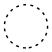 |  | 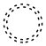 |   |  |
| Message |  |  |  |  |  |  |
| Timer |  |  |  |  |   |   |
| Conditional |  |  |  |  |   |   |
| Link |   |   |  |   |  |   |
| Signal |  |  |  |  |  |  |
| Error |  |   |  |   |   |  |
| Escalation |  |  |  |  |  |  |
| Termination |   |   |   |   |   |  |
| Compensation |  |   |  |   |  |  |
| Cancel |   |   |  |   |   |  |
| Multiple |  | 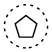 | 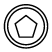 |  |  |  |
| Parallel |  |  |  |  |   |   |

### Gateway

Gateway is used to control the flow of a process. It is represented as a diamond shape. To create a gateway, the [shape](/api/js/ejdiagram#members:nodes-shape "shape") property of node should be set as "gateway" and the [gateway](/api/js/ejdiagram#members:nodes-gateway "gateway") property can be set with any of the appropriate [Gateways](/api/js/global#bpmngateways "Gateways"). The following code example illustrates how to create a BPMN Gateway.



$("#diagram").ejDiagram({
	width: "100%",
	height: "100%",
	pageSettings: {
		scrollLimit: "diagram"
	},
	nodes: [{
		name: "node",
		width: 100,
		height: 100,
		offsetX: 100,
		offsetY: 100,
		borderWidth: 2,
		borderColor: "black",
		type: ej.datavisualization.Diagram.Shapes.BPMN,
		//Sets the shape as Gateway
		shape: ej.datavisualization.Diagram.BPMNShapes.Gateway,
		//Sets the type of BPMN Gateway
		gateway: ej.datavisualization.Diagram.BPMNGateways.None,
	}],
});



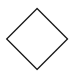

N> By default, the `gateway` will be set as "none".

There are several types of gateways as tabulated

| Gateways | Image |
|---|---|
| Exclusive |  |
| Parallel |  |
| Inclusive |  |
| Complex | 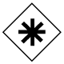 |
| EventBased |  |
| ExclusiveEventBased |  |
| ParallelEventBased |  |

### Activity

The activity is the task that is performed in a business process. It is represented by a rounded rectangle.

There are two types of activities .They are listed as follows.

* Task – Occurs within a process and it is not broken down to finer level of detail.
* Subprocess – Occurs within a process and it is broken down to finer level of detail.

To create a BPMN activity, you need to set the [shape](/api/js/ejdiagram#members:nodes-shape "shape") as "activity". You also need to set the type of the [BPMN Activity](/api/js/global#bpmnactivity "BPMN Activity") by using the [activity](/api/js/ejdiagram#members:nodes-activity "activity") property of node. By default, the type of the `activity` is set as "task". The following code example illustrates how to create an activity.



$("#diagram").ejDiagram({
	width: "100%",
	height: "100%",
	pageSettings: {
		scrollLimit: "diagram"
	},
	nodes: [{
		name: "node",
		width: 100,
		height: 100,
		offsetX: 100,
		offsetY: 100,
		borderWidth: 2,
		borderColor: "black",
		type: ej.datavisualization.Diagram.Shapes.BPMN,
		//Sets the bpmn shape as activity
		shape: ej.datavisualization.Diagram.BPMNShapes.Activity,
		//Sets the type of BPMN Activity
		activity: ej.datavisualization.Diagram.BPMNActivity.Task,
	}],
});



The different activities of BPMN process are listed as follows.

#### Tasks

The [task](/api/js/ejdiagram#members:nodes-task "task") property of node allows you to define the [type](/api/js/ejdiagram#members:nodes-tasks-type "type") of task such as sending, receiving, user based task etc… By default, the `type` property of task is set as "none". The following code illustrates how to create different types of BPMN tasks. 
The [events](/api/js/ejdiagram#members:nodes-tasks-events "events") property of tasks allows to represent these results as an event attached to the task.



$("#diagram").ejDiagram({
	width: "100%",
	height: "100%",
	pageSettings: {
		scrollLimit: "diagram"
	},
	nodes: [{
		name: "task",
		width: 100,
		height: 100,
		offsetX: 100,
		offsetY: 100,
		borderWidth: 2,
		borderColor: "black",
		type: ej.datavisualization.Diagram.Shapes.BPMN,
		//Sets the type of bpmn shape
		shape: ej.datavisualization.Diagram.BPMNShapes.Activity,
		//Sets the type of BPMN Activity
		activity: ej.datavisualization.Diagram.BPMNActivity.Task,
		//Sets the type of BPMN Task Activity
		task: {
			type: ej.datavisualization.Diagram.BPMNTasks.Send
		}
	}]
});



The various types of BPMN tasks are tabulated as follows.

| Task Type | Image |
|---|---|
| Service |  |
| Send |  |
| Receive |  |
| Instantiating Receive | 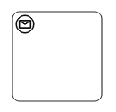 |
| Manual |  |
| Business Rule |  |
| User | 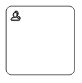 |
| Script |  |

#### Subprocess

A [sub-process](/api/js/ejdiagram#members:nodes-subprocess "sub-process") is a group of tasks which is used to hide or reveal details of additional levels which can be done using [collapsed](/api/js/ejdiagram#members:nodes-subprocess-collapsed "collapsed") property .

 

$("#diagram").ejDiagram({
	width: "100%",
	height: "100%",
	pageSettings: {
		scrollLimit: "diagram"
	},
	nodes: [{
		name: "node",
		width: 100,
		height: 100,
		offsetX: 100,
		offsetY: 100,
		borderWidth: 2,
		borderColor: "black",
		type: ej.datavisualization.Diagram.Shapes.BPMN,
		//Sets the type of bpmn shape
		shape: ej.datavisualization.Diagram.BPMNShapes.Activity,
		//Sets the type of BPMN Activity
		activity: ej.datavisualization.Diagram.BPMNActivity.SubProcess,
		//Sets the state of BPMN Subprocess
		subProcess: {
			collapsed: true,
		}
	}]
});



The different types of subprocess are as follows. 

* Event Subprocess
* Transaction 

##### Event Subprocess

A Sub-process is defined as an Event Sub-process when it is triggered by an event. An event-subprocess is placed within another subprocess which is not part of the normal flow of its parent process . You can set event to a sub-process with the [event](/api/js/ejdiagram#members:nodes-subprocess-event "event") and [trigger](/api/js/ejdiagram#members:nodes-subprocess-trigger "trigger") property of subprocess. The [type](/api/js/ejdiagram#members:nodes-subprocess-type "type") property of sub-process allows you to define type of sub-process whether it should be event sub-process or transaction sub-process.



$("#diagram").ejDiagram({
	width: "100%",
	height: "100%",
	pageSettings: {
		scrollLimit: "diagram"
	},
	nodes: [{
		name: "eventSubProcess",
		width: 100,
		height: 100,
		offsetX: 100,
		offsetY: 100,
		borderWidth: 2,
		borderColor: "black",
		type: ej.datavisualization.Diagram.Shapes.BPMN,
		shape: ej.datavisualization.Diagram.BPMNShapes.Activity,
		activity: ej.datavisualization.Diagram.BPMNActivity.SubProcess,
		//Creates event subprocess
		subProcess: {
			type: ej.datavisualization.Diagram.BPMNSubProcessTypes.Event,
			event: ej.datavisualization.Diagram.BPMNEvents.Start,
			trigger: ej.datavisualization.Diagram.BPMNTriggers.Message
		}
	}]
});



##### Transaction Subprocess

* An transaction is a set of activities that logically belong together, in which all contained activities must complete their parts of the transaction; otherwise the process is undone. The execution result of a transaction is one of Successful Completion, Unsuccessful Completion (Cancel), and Hazard (Exception). The [events](/api/js/ejdiagram#members:nodes-subprocess-events "events") property of subprocess allows to represent these results as an event attached to the subprocess. 

* The [event](/api/js/ejdiagram#members:nodes-subprocess-events-event "event") object allows you define the type of event by which the sub-process will be triggered. Also you can define [name](/api/js/ejdiagram#members:nodes-subprocess-events-name "name") of the event to identify the event at runtime.

* The event's [offset](/api/js/ejdiagram#members:nodes-subprocess-events-offset "offset") property is used to set the fraction/ratio(relative to parent) that defines the position of the event shape.

* The [trigger](/api/js/ejdiagram#members:nodes-subprocess-events-trigger "trigger") property defines the type of the event trigger.

* You can also use define ports and labels to sub-process events by using event's [ports](/api/js/ejdiagram#members:nodes-subprocess-events-ports "ports") and [labels](/api/js/ejdiagram#members:nodes-subprocess-events-labels "labels") properties.

 

$("#diagram").ejDiagram({
	width: "100%",
	height: "100%",
	pageSettings: {
		scrollLimit: "diagram"
	},
	nodes: [{
		name: "transactionSubProcess",
		width: 130,
		height: 100,
		offsetX: 100,
		offsetY: 100,
		borderWidth: 2,
		borderColor: "black",
		type: ej.datavisualization.Diagram.Shapes.BPMN,
		shape: ej.datavisualization.Diagram.BPMNShapes.Activity,
		activity: ej.datavisualization.Diagram.BPMNActivity.SubProcess,
		//Creates transaction subprocess
		subProcess: {
			type: ej.datavisualization.Diagram.BPMNSubProcessTypes.Transaction,
			// Defines a collection of events to be attached 
			events: [
				//Defines type of the event and the position relative to the subprocess. 
				{ event: "intermediate", trigger: "cancel", offset: { x: 0.25, y: 1 } },
				{ event: "intermediate", trigger: "error", offset: { x: 0.75, y: 1 } }
			]
		}
	}]
});



#### Processes 

[processes](/api/js/ejdiagram#members:nodes-subprocess-processes "processes") is a array collection that defines the children values for BPMN subprocess.





#### Loop

Loop is a task that is internally being looped. The [loop](/api/js/ejdiagram#members:nodes-tasks-loop "loop") property of task allows you to define the type of loop. The default value for `loop` is "none". 
You can define the [loop](/api/js/ejdiagram#members:nodes-subprocess-loop "loop") property in subprocess BPMN shape as shown in the below code.



var diagram = $("#diagram").ejDiagram("instance");

var node = {
	name: "task",
	width: 100,
	height: 100,
	offsetX: 100,
	offsetY: 100,
	borderWidth: 2,
	borderColor: "black",
	type: ej.datavisualization.Diagram.Shapes.BPMN,
	//Sets the type of BPMN shape
	shape: ej.datavisualization.Diagram.BPMNShapes.Activity,
	//Sets the type of BPMN Activity
	activity: ej.datavisualization.Diagram.BPMNActivity.Task,
	//Sets the type of bpmn loops.
	task: {
		loop: ej.datavisualization.Diagram.BPMNLoops.Standard
	}
};
diagram.add(node);

node = {
	name: "subprocess",
	width: 100,
	height: 100,
	offsetX: 300,
	offsetY: 100,
	borderWidth: 2,
	borderColor: "black",
	type: ej.datavisualization.Diagram.Shapes.BPMN,
	shape: ej.datavisualization.Diagram.BPMNShapes.Activity,
	//Sets the type of BPMN activity
	activity: ej.datavisualization.Diagram.BPMNActivity.SubProcess,
	//Sets the type of bpmn loops.
	subProcess: {
		loop: ej.datavisualization.Diagram.BPMNLoops.Standard
	}
};
diagram.add(node);



The following table contains various types of BPMN loops.

| Loops | Task | SubProcess |
|---|---|---|
| Standard |  |  |
| SequenceMultiInstance |  | 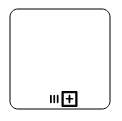 |
| ParallelMultiInstance |  | 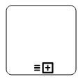 |

#### Compensation

Compensation is triggered when operation is partially failed and you can enable it with the [compensation](/api/js/ejdiagram#members:nodes-tasks-compensation "compensation") property of task and [compensation](/api/js/ejdiagram#members:nodes-subprocess-compensation "compensation") property of subprocess.



var nodes = [];

nodes.push({
	name: "task",
	width: 100,
	height: 100,
	offsetX: 100,
	offsetY: 100,
	borderWidth: 2,
	borderColor: "black",
	type: ej.datavisualization.Diagram.Shapes.BPMN,
	shape: ej.datavisualization.Diagram.BPMNShapes.Activity
	//Sets the type of BPMN Activity
	activity: ej.datavisualization.Diagram.BPMNActivity.Task,
	//Creates compensation task
	task: {
		compensation: true
	}
});

nodes.push({
	name: "subprocess",
	width: 100,
	height: 100,
	offsetX: 300,
	offsetY: 100,
	borderWidth: 2,
	borderColor: "black",
	type: ej.datavisualization.Diagram.Shapes.BPMN,
	shape: ej.datavisualization.Diagram.BPMNShapes.Activity,
	//Sets the type of BPMN Activity
	activity: ej.datavisualization.Diagram.BPMNActivity.SubProcess,
	//Creates compensation subprocess 
	subProcess: {
		compensation: true
	}
});

$("#diagram").ejDiagram({
	width: "100%",
	height: "100%",
	pageSettings: {
		scrollLimit: "diagram"
	},
	nodes: nodes
});



#### Call

A call activity is a global sub-process that is reused at various points of the business flow and you can set it with the [call](/api/js/ejdiagram#members:nodes-tasks-call "call") property of task.



$("#diagram").ejDiagram({
	width: "100%",
	height: "100%",
	pageSettings: {
		scrollLimit: "diagram"
	},
	nodes: [{
		name: "task",
		width: 100,
		height: 100,
		offsetX: 100,
		offsetY: 100,
		borderWidth: 2,
		borderColor: "black",
		type: ej.datavisualization.Diagram.Shapes.BPMN,
		shape: ej.datavisualization.Diagram.BPMNShapes.Activity,
		//Sets the type of BPMN Activity
		activity: ej.datavisualization.Diagram.BPMNActivity.Task,
		//Creates a call task
		task: {
			call: true
		}
	}]
});



#### Ad-Hoc

An ad hoc subprocess is a group of tasks that are executed in any order or skipped in order to fulfill the end condition and you can set it with the [adhoc](/api/js/ejdiagram#members:nodes-subprocess-adhoc "adhoc") property of subprocess. 



$("#diagram").ejDiagram({
	width: "100%",
	height: "100%",
	pageSettings: {
		scrollLimit: "diagram"
	},
	nodes: [{
		name: "task",
		width: 100,
		height: 100,
		offsetX: 100,
		offsetY: 100,
		borderWidth: 2,
		borderColor: "black",
		type: ej.datavisualization.Diagram.Shapes.BPMN,
		shape: ej.datavisualization.Diagram.BPMNShapes.Activity,
		activity: ej.datavisualization.Diagram.BPMNActivity.SubProcess,
		//Creates ad hoc subprocess
		subProcess: {
			adhoc: true
		}
	}]
});



#### Boundary

Boundary represents the type of task that is being processed. The [boundary](/api/js/ejdiagram#members:nodes-subprocess-boundary "boundary") property of sub process allows you to define the type of boundary. By default, it is set as "default".



$("#diagram").ejDiagram({
	width: "100%",
	height: "100%",
	pageSettings: {
		scrollLimit: "diagram"
	},
	nodes: [{
		name: "task",
		width: 100,
		height: 100,
		offsetX: 100,
		offsetY: 100,
		borderWidth: 2,
		borderColor: "black",
		type: ej.datavisualization.Diagram.Shapes.BPMN,
		shape: ej.datavisualization.Diagram.BPMNShapes.Activity,
		activity: ej.datavisualization.Diagram.BPMNActivity.SubProcess,
		//Adds boundary to a subprocess 
		subProcess: {
			boundary: ej.datavisualization.Diagram.BPMNBoundary.Call
		}
	}]
});



The following table contains various types of BPMN boundaries.

| Boundary | Image |
|---|---|
| Call |  |
| Event |  |
| Default | 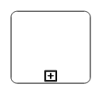 |

### Data

A data object represents information flowing through the process, such as data placed into the process, data resulting from the process, data that needs to be collected, or data that must be stored. To define a [data](/api/js/ejdiagram#members:nodes-data "data") object, set the [shape](/api/js/ejdiagram#members:nodes-shape "shape")  as "dataobject" and [type](/api/js/ejdiagram#members:nodes-data-type "type") property defines whether data is an input or a output. You can create multiple instances of data object with the [collection](/api/js/ejdiagram#members:nodes-data-collection "collection") property of data.



$("#diagram").ejDiagram({
	width: "100%",
	height: "100%",
	pageSettings: {
		scrollLimit: "diagram"
	},
	nodes: [{
		name: "dataObject",
		width: 75,
		height: 100,
		offsetX: 100,
		offsetY: 100,
		borderWidth: 2,
		borderColor: "black",
		//Sets the type of the shape
		type: ej.datavisualization.Diagram.Shapes.BPMN,
		//Sets the type of BPMN Shape
		shape: ej.datavisualization.Diagram.BPMNShapes.DataObject,
		//Sets collection as true when Dataobject is not a Single instance
		data: {
			type: ej.datavisualization.Diagram.BPMNDataObjects.Input,
			collection: true
		}
	}]
});



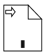

The following table contains various representation of BPMN Data Object.

| Boundary | Image |
|---|---|
| Collection Data Object |  |
| Data Input |  |
| Data Ouptput |  |

### Datasource

DataSource is used to store or access data associated with a business process. To create a data source, set the [shape](/api/js/ejdiagram#members:nodes-shape "shape") as "datasource". The following code example illustrate how to create data source.



$("#diagram").ejDiagram({
	width: "100%",
	height: "100%",
	pageSettings: {
		scrollLimit: "diagram"
	},
	nodes: [{
		name: "dataSource",
		width: 100,
		height: 100,
		offsetX: 100,
		offsetY: 100,
		borderWidth: 2,
		borderColor: "black",
		//Sets type of the shape
		type: ej.datavisualization.Diagram.Shapes.BPMN,
		//Sets the type of bpmn shape
		shape: ej.datavisualization.Diagram.BPMNShapes.DataSource,
	}]
});



### Artifact

Artifact is used to show additional information about a Process in order to make it easier to understand. There are 2 types of artifacts in BPMN.

* Text Annotation
* Group

#### Text Annotation

* A BPMN object can be associated with a text annotation which does not affect the flow but gives details about objects within a flow. The [annotation](/api/js/ejdiagram#members:nodes-annotation "annotation") property of the node is used to connect an annotation element to the BPNN node.

* The annotation [angle](/api/js/ejdiagram#members:nodes-annotation-angle "angle") property is used to set the angle between the BPMN shape and the annotation.

* The annotation [direction](/api/js/ejdiagram#members:nodes-annotation-direction "direction") property is used to set direction of the text annotation.

* To set the size for text annotation, use [width](/api/js/ejdiagram#members:nodes-annotation-width "width") and [height](/api/js/ejdiagram#members:nodes-annotation-height "height") properties.

* The annotation [length](/api/js/ejdiagram#members:nodes-annotation-length "length") property is used to set the distance between the BPMN shape and the annotation.

* The annotation [text](/api/js/ejdiagram#members:nodes-annotation-text "text") property defines the additional information about the flow object in a BPMN Process.

 

$("#diagram").ejDiagram({
	width: "100%",
	height: "100%",
	pageSettings: {
		scrollLimit: "diagram"
	},
	nodes: [{
		name: "data",
		width: 75,
		height: 100,
		offsetX: 100,
		offsetY: 100,
		borderWidth: 2,
		borderColor: "black",
		//Sets type of the shape
		type: ej.datavisualization.Diagram.Shapes.BPMN,
		//Sets the type of bpmn shape
		shape: ej.datavisualization.Diagram.BPMNShapes.DataObject,
		//Sets collection as true when Dataobject is not a Single instance
		data: { collection: true },
		annotation: {
			//Sets the text to annotate the bpmn shape
			text: "Data Collection",
			//Sets the angle between the bpmn shape and the annotation
			angle: 45,
			//Sets the dimensions of the text
			width: 100, height: 40,
			//Sets the distance between the bpmn shape and the annotation 
			length: 150
		} 
	}]
});



#### Group

A group is used to frame a part of the diagram, shows that elements included in it are logically belong together and don't have any other semantics other than organizing elements. To create a Group, the [shape](/api/js/ejdiagram#members:nodes-shape "shape") property of node should be set as "group". The following code example illustrates how to create a BPMN Group.

 

$("#diagram").ejDiagram({
	width: "100%",
	height: "100%",
	pageSettings: {
		scrollLimit: "diagram"
	},
	nodes: [{
		name: "group",
		width: 100,
		height: 100,
		offsetX: 100,
		offsetY: 100,
		borderWidth: 2,
		borderColor: "black",
		//Sets type of the shape
		type: ej.datavisualization.Diagram.Shapes.BPMN,
		//Sets the type of bpmn shape
		shape: ej.datavisualization.Diagram.BPMNShapes.Group, 
	}]
});



#### BPMN Flows

BPMN Flows are lines that connects BPMN flow objects.

### Association

BPMN Association flow is used to link flow objects with its corresponding text or artifact. An association is represented as a dotted graphical line with opened arrow. The type of association are as follows.

* Directional
* BiDirectional
* Default

The [association](/api/js/ejdiagram#members:connectors-shape-flow-association "association") property allows you to define the type of association.The following code example illustrates how to create an association.



 $("#diagram").ejDiagram({
	width: "100%",
	height: "100%",
	pageSettings: {
		scrollLimit: "diagram"
	},
    connectors: [{
        name: "connect1", 
        sourcePoint:{
               x:100,
               y:200
             }, 
         targetPoint: 
            {
               x:300
               ,y:200
             }, 
          segments: [{ 
                type: "straight" 
              }], 
           shape: {
                  type: "bpmn",
				  //Sets the type of the flow as association
                  flow: "association",
				  //Sets the type of association
                  association: "bidirectional"
              }
	}]
});	



The following table demonstrates the visual representation of assosiation flows.

| Association | Image |
|---|---|
| Default |  |
| Directional |  |
| BiDirectional |  |

N> The default value for the property `association` is "default".

### Sequence

A Sequence flow shows the order in which the activities are performed in a BPMN Process and is represented with a solid graphical line.The type of sequence are as follows.

* Normal
* Conditional
* Default

The [sequence](/api/js/ejdiagram#members:connectors-shape-sequence "sequence") property allows you to define the type of sequence.The following code example illustrates how to create a sequence flow.



 $("#diagram").ejDiagram({
	width: "100%",
	height: "100%",
	pageSettings: {
		scrollLimit: "diagram"
	},
    connectors: [{
        name: "connect1", 
        sourcePoint:{
               x:100,
               y:200
             }, 
         targetPoint: 
            {
               x:300
               ,y:200
             }, 
          segments: [{ 
                type: "straight" 
              }], 
           shape: {
                  type: "bpmn",
                  flow: "sequence",
				  //Sets the type of sequence flow
                  sequence: "conditional"
              }
	}]
});	



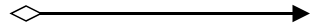

The following table contains various representation of sequence flows.

| Sequence | Image |
|---|---|
| Default |  |
| Conditional |  |
| Normal |  |

N> The default value for the property `sequence` is "normal".

### Message

A Message flow shows the flow of messages between two Participents.A message flow is represented by dashed line.The type of message are as follows.

* InitiatingMessage
* NonInitiatingMessage
* Default

The [message](/api/js/ejdiagram#members:connectors-shape-message "message") property allows you to define the type of message.The following code example illustrates how to define a message flow.



 $("#diagram").ejDiagram({
	width: "100%",
	height: "100%",
	pageSettings: {
		scrollLimit: "diagram"
	},
    connectors: [{
        name: "connect1", 
        sourcePoint:{
               x:100,
               y:200
             }, 
         targetPoint: 
            {
               x:300
               ,y:200
             }, 
          segments: [{ 
                type: "straight" 
              }], 
           shape: {
                  type: "bpmn",
                  flow: "message",
				  //Sets the type of message flow
                  message: "initiatingmessage"
              }
	}]
});	



The following table contains various representation of message flows.

| Message | Image |
|---|---|
| Default |  |
| InitiatingMessage |  |
| NonInitiatingMessage | 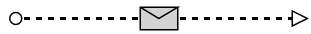 |

N> The default value for the property `message` is "default".