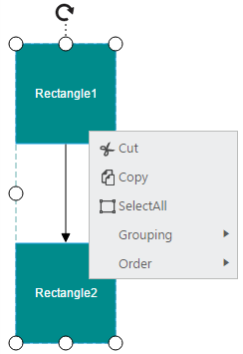
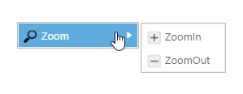

# Context Menu

In graphical user interface (GUI), a context menu is a type of menu that appears when you perform right-click operation. Nested level of context menu items can be created.
Diagram provides some in-built context menu items and allows to define custom menu items through [contextMenu](/api/js/ejdiagram#members:contextmenu "contextMenu") property.

## Default Context Menu

The [enableContextMenu](/api/js/ejdiagram#members:enablecontextmenu "enableContextMenu") property helps you to enable/disable the context menu. Diagram provides some default context menu items to ease the execution of some frequently used commands.
The following code illustrates how to enable the default context menu items.



$("#DiagramContent").ejDiagram({
	width: "700px",
	height: "600px",
	//Enables the context menu
	enableContextMenu: true
});



## Customize Context Menu

* Apart from the default context menu items, you can define some additional context menu items. Those additional items have to be defined and added to [items](/api/js/ejdiagram#members:contextmenu-items "items") property of the context menu. 

* Sub menu items for context menu can set using [subItems](/api/js/ejdiagram#members:contextmenu-items-subitems "subItems") property of the items.

* You can set text and name for context menu item using contextMenu [text](/api/js/ejdiagram#members:contextmenu-items-text "text") and [name](/api/js/ejdiagram#members:contextmenu-items-name "name") properties respectively.

* You can set an image for the contextMenu item using contextMenu [imageUrl](/api/js/ejdiagram#members:contextmenu-items-imageurl "imageUrl") property.

* The [cssClass](/api/js/ejdiagram#members:contextmenu-items-cssclass "cssClass") property used to customize the style of contextMenu item using user defined CSS class.

The following code example illustrate how to add custom context menu items.







$("#DiagramContent").ejDiagram({
	width: "700px",
	height: "600px",
	//Enables the context menu
	enableContextMenu: true,
	contextMenu: {
		// Defines the custom context menu items
		items: [{
			name: "zoom",
			// Text to be displayed
			text: "Zoom",
			// Defines the sub items
			subItems: [{
				name: "zoomIn",
				text: "ZoomIn",
				// Sets the image src for the item
				imageUrl: "Images/zoom.png",
				// Sets the cssClass for the item
				 cssClass:"menuBackgroundSize",
			},{
				name: "zoomOut",
				text: "Zoom Out",
				imageUrl: "Images/zoomOut.png"
			}]
		}],
		// Hides the default context menu items
		showCustomMenuItemsOnly: true
	}
});



When you want to display only your custom context menu items, you can set true to the [showCustomMenuItemsOnly](/api/js/ejdiagram#members:contextmenu-showcustommenuitemsonly "showCustomMenuItemsOnly") property.

Icons of context menu items can be customized by overriding the default context menu item style.
The following code example illustrates how to customize the icon of context menu items.





## Context Menu Events

You would be notified with events when you try to open the context menu items[contextMenuBeforeOpen](/api/js/ejdiagram#events:contextmenubeforeopen "contextMenuBeforeOpen") and when you click the menu items[contextMenuClick](/api/js/ejdiagram#events:contextmenuclick "contextMenuClick"). The following code example illustrates how to define those events.



$("#DiagramContent").ejDiagram({
	contextMenu: {
		items: [{
			name: "zoom",
			text: "zoom"
		}],

		contextMenuBeforeOpen: function(args) {
			//do your custom action here.
		},

		contextMenuClick: function(args) {
			switch (args.text) {
				case "zoom":
					//do your custom action here.
				break;
			}
		}
	}
});

