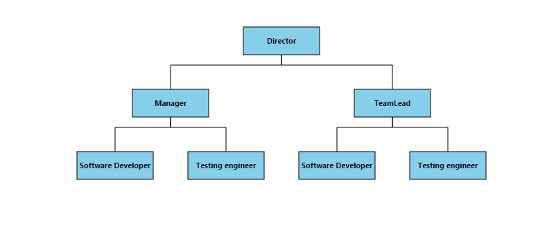
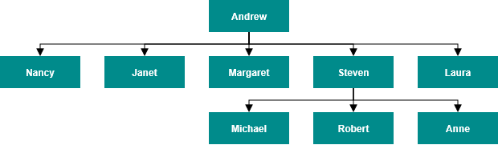
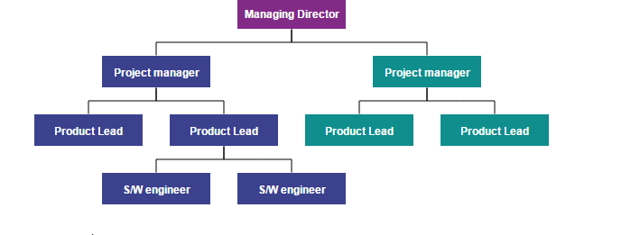

# Data Binding

* Diagram can be populated with the nodes and connectors based on the information provided from an external data source.

* Diagram exposes its specific data-related properties allowing you to specify the data source fields from where the node information has to be retrieved from.

* The dataSourceSettings [dataSource](/api/js/ejdiagram#members:datasourcesettings-dataSource "dataSource") property is used to define the data source either as a collection of objects or as an instance of ej.DataManager which is needs to be populated as diagram.

* The dataSourceSettings [id](/api/js/ejdiagram#members:datasourcesettings-id "id") property is used to define the unique field of each JSON data.

* The dataSourceSettings [parent](/api/js/ejdiagram#members:datasourcesettings-parent "parent") property is used to defines the parent field which builds the relationship between id and parent field.

* The dataSourceSettings [root](/api/js/ejdiagram#members:datasourcesettings-root "root") property is used to define root node for the diagram populated from the datasource.

* To explore those properties, see [DataSourceSettings](/api/js/ejdiagram#members:datasourcesettings "DataSourceSettings")

* Diagram supports three different kinds of Data binding.
	* Local Data
	* Remote Data
	* HTML Table Data

## Local Data

Diagram can be populated based on the user defined JSON data (**Local Data**) by mapping the relevant data source fields.
 
To map the user defined JSON data with Diagram, you have to configure the fields of [dataSourceSettings](/api/js/ejdiagram#members:datasourcesettings "dataSourceSettings"). The following code example illustrates how to bind local data with the Diagram.



//Initializes local data

var data = [{
	"Name": "Director"
},{
	"Name": "Manager",
	"ReportingPerson": "Director"
},{
	"Name": "TeamLead",
	"ReportingPerson": "Director"
},{
	"Name": "Software Developer",
	"ReportingPerson": "TeamLead"
},{
	"Name": "Testing engineer",
	"ReportingPerson": "TeamLead"
},{
	"Name": "Software Developer",
	"ReportingPerson": "Manager"
},{
	"Name": "Testing engineer",
	"ReportingPerson": "Manager"
}];

//Binds the JSON(local data) with node

function nodeTemplate(diagram, node) {
	// Sets the Name field of JSON data as label.
	node.labels[0].text = node.Name;
}

$(function() {
	//Initializes Diagram
	$("#diagram").ejDiagram({
		//Uses automatic layout to arrange elements on the page
		layout: {
			type: "hierarchicaltree"
		},
		//Sets the default properties for nodes and connectors.
		defaultSettings: {
			node: {
				width: 100,
				height: 40,
				fillColor: "darkcyan",
				labels: [{
					name: "label1",
					bold: true,
					fontColor: "white"
				}]
			},
			connector: {
				segments: [{
					type: "orthogonal"
				}],
				targetDecorator: {
					shape: "none"
				}
			}
		},
		//Initializes the node template.
		nodeTemplate: nodeTemplate,
		//Configures data source for Diagram
		dataSourceSettings: {
			// Defines the unique field of each JSON data
			id: "Name",
			// Defines the parent field which builds the relationship
			parent: "ReportingPerson",
			//Sets the local data source to the diagram.
			dataSource: data
		}
	});
});



## Remote Data

You can bind the Diagram with Remote Data by using dataManager.

* DataManager supports the following types of data-binding: JSON, Web Services, oData.
* It uses two different classes: ej.DataManager for processing and ej.Query for serving data. ej.DataManager communicates with data source and ej.Query generates data queries that are read by the dataManager.

* The dataSourceSettings [query](/api/js/ejdiagram#members:datasourcesettings-query "query") property is used to retrieve a set of data from the specified datasource.

* The dataSourceSettings [tableName](/api/js/ejdiagram#members:datasourcesettings-tablename "tableName") is used to describe the name of the table on which the specified query has to be executed.

* To learn more, refer to [Data Manager](/js/DataManager/Getting-Started "Data Manager").

To bind remote data to the Diagram, you have to configure the fields of [dataSourceSettings](/api/js/ejdiagram#members:datasourcesettings "dataSourceSettings"). The following code illustrates how to bind remote data to the Diagram.



$(function() {
	//Initializes Diagram
	$("#diagram").ejDiagram({
		//Binds the custom JSON fields with node
		nodeTemplate: nodeTemplate,
		//Initializes automatic layout
		layout: {
			type: "hierarchicaltree"
		},
		//Sets the default properties for nodes and connectors
		defaultSettings: {
			node: {
				width: 100,
				height: 40,
				fillColor: "darkcyan",
				labels: [{
					name: "label1",
					bold: true,
					fontColor: "white"
				}],
				borderColor: "none"
			},
			connector: {
				segments: [{
					type: "orthogonal"
				}]
			}
		},
		//Configures data source
		dataSourceSettings: {
			//Initializes the data manager
			dataSource: ej.DataManager({
				// Specifies the remote data service
				url: "[http://mvc.syncfusion.com/Services/Northwnd.svc/](http://mvc.syncfusion.com/Services/Northwnd.svc/)"
			}),
			//Defines the query to retrieve data
			query: ej.Query().from("Employees").select("EmployeeID, ReportsTo, FirstName"),
			// Defines the table name
			tableName: "Employees",
			// Defines the unique field
			id: "EmployeeID",
			// Define the field to relate objects
			parent: "ReportsTo"
		}
	});
});

//Binds custom JSON with node

function nodeTemplate(diagram, node) {
	node.labels[0].text = node.FirstName;
}



## HTML Table Data

The Diagram provides support to populate the Diagram from the **HTML table**. It is flexible to convert HTML table to Diagram by using **Data Manager**.

The following code illustrates how to convert HTML table to the Diagram.


<!-- HTML Table -->
<table id="binding">
	<thead>
		<tr>
			<th>Id</th>
			<th>Designation</th>
			<th>Color</th>
			<th>ReportingPerson</th>
		</tr>
	</thead>
	<tbody>
		<tr>
			<td>parent</td>
			<td>Managing Director</td>
			<td>#822b86</td>
			<td>null</td>
		</tr>
		<tr>
			<td>1</td>
			<td>Project manager</td>
			<td>#3c418d</td>
			<td>parent</td>
		</tr>
		<tr>
			<td>2</td>
			<td>Project manager</td>
			<td>#108d8d</td>
			<td>parent</td>
		</tr>
		<tr>
			<td>3</td>
			<td>Product Lead</td>
			<td>#3c418d</td>
			<td>1</td>
		</tr>
		<tr>
			<td>4</td>
			<td>Product Lead</td>
			<td>#3c418d</td>
			<td>1</td>
		</tr>
		<tr>
			<td>5</td>
			<td>Product Lead</td>
			<td>#108d8d</td>
			<td>2</td>
		</tr>
		<tr>
			<td>6</td>
			<td>Product Lead</td>
			<td>#108d8d</td>
			<td>2</td>
		</tr>
		<tr>
			<td>7</td>
			<td>S/W engineer</td>
			<td>#3c418d</td>
			<td>4</td>
		</tr>
		<tr>
			<td>8</td>
			<td>S/W engineer</td>
			<td>#3c418d</td>
			<td>4</td>
		</tr>
	</tbody>
</table>



//Binds custom JSON with node

function nodeTemplate(diagram, node) {
	node.labels[0].text = node.Designation;
	node.fillColor = node.Color;
}

$(function() {
	//Initializes Diagram
	$("#diagram").ejDiagram({
		width: "100%",
		height: "600px",
		layout: {
			type: "hierarchicaltree"
		},
		defaultSettings: {
			//Sets the default properties for nodes and connectors.
			node: {
				width: 120,
				height: 40,
				shape: "rectangle",
				borderColor: "transparent",
				labels: [{
					name: "label1",
					fontColor: "#ffffff"
				}]
			},
			connector: {
				segments: [{
					"type": "orthogonal"
				}],
				targetDecorator: {
					fillColor: "#4F4F4F",
					borderColor: "#4F4F4F"
				}
			}
		},
		//Initializes the node template.
		nodeTemplate: nodeTemplate,
		//Configures data source for Diagram
		dataSourceSettings: {
			id: "Id",
			parent: "ReportingPerson",
			//Defines data source with html table
			dataSource: ej.DataManager($("#binding")),
		}
	});
});



## CRUD

* This feature allows the user to read the DataSource and perform add/edit/delete the data in datasource at runtime.

## Read DataSource

* This feature allows you to define nodes and connectors collection in the dataSource and connectionDataSource respectively.
* We can set the data collection in the model’s dataSourceSettings [dataSource](/api/js/ejdiagram#members:datasourcesettings-datasource "dataSource") property. The nodes will be generated based on the data specified in the dataSource. 
* We can set the connector collection in the model’s dataSourceSettings [connectionDataSource](/api/js/ejdiagram#members:datasourcesettings-connectiondatasource "connectionDataSource") property.
* The dataSourceSettings connectionDataSource [dataSource](/api/js/ejdiagram#members:datasourcesettings-connectiondatasource-datasource "dataSource") property is used to set an datasource for the connection datasource items.
* If we have a data (data will be set in the dataSource property) with parent relationship in the database and also defined the connector in the connectionDataSource simultaneously, then the connectors set in the connectionDataSource will be considered as a priority to render the connector.

* The dataSourceSettings.crudAction's [read](/api/js/ejdiagram#members:datasourcesettings-crudaction-read "read") property specifies the method which is used to read the data source and its populate the nodes in the diagram.

* The connectionDataSource.crudAction's [read](/api/js/ejdiagram#members:datasourcesettings-connectiondatasource-crudaction-read "read") specifies the method which is used to read the data source and its populates the connectors in the diagram.

* The dataSourceSettings's [id](/api/js/ejdiagram#members:datasourcesettings-id "id") property and connectionDataSource's [id](/api/js/ejdiagram#members:datasourcesettings-connectiondatasource-id "id") property is used to define the unique field of each JSON data.

* The connectionDataSource's [sourceNode](/api/js/ejdiagram#members:datasourcesettings-connectiondatasource-sourcenode "sourceNode") and [targetNode](/api/js/ejdiagram#members:datasourcesettings-connectiondatasource-targetnode "targetNode") properties is used to set an sourceNode and targetNode for connection data source item.

* The connectionDataSource's [sourcePointX](/api/js/ejdiagram#members:datasourcesettings-connectiondatasource-sourcepointx "sourcePointX"), [sourcePointY](/api/js/ejdiagram#members:datasourcesettings-connectiondatasource-sourcepointy "sourcePointY"), [targetPointX](/api/js/ejdiagram#members:datasourcesettings-connectiondatasource-targetpointx "targetPointX") and [targetPointY](/api/js/ejdiagram#members:datasourcesettings-connectiondatasource-targetpointy "targetPointY") properties are used to define the sourcePoint and targetPoint values for connector from data source.

* You can use dataSourceSettings [customFields](/api/js/ejdiagram#members:datasourcesettings-customfields "customFields") property is used to maintain the additional information for nodes.

* Similarly, connectionDataSource's [customFields](/api/js/ejdiagram#members:datasourcesettings-connectiondatasource-customfields "customFields") is used to maintain the additional information for connectors.

The below code example illustrates how to define custom fields in dataSource and connectionDataSource.


 
	$("#diagram").ejDiagram({
		dataSourceSettings: {
               //set the data collection
               dataSource: Data,
               //bind the column name to the Id property which generates the unique name for the object
               id: "Name",
               //Specify the custom property/columns which is available in the DataSource.
               customFields:
               [
                   "Description",
                   "Color"
               ],
               connectionDataSource:
               {
                   //set the connector collection
                   dataSource: Data,
                   //bind the column name to the Id property which generates the unique name for the object 
                   id: "Name",
                   sourceNode: "SourceNode",
                   targetNode: "TargetNode",

                   //Specify the custom property/columns which is available in the ConnectionDataSource.
                   customFields:
                   [
                     "Description",
                     "Color"
                   ],
               }
		}
	});


## How to perform Editing at runtime

* The dataSourceSettings [crudAction](/api/js/ejdiagram#members:datasourcesettings-crudaction "crudAction") object allows you to define the method which is used to get the changes done in the datasource defined for shapes from client side to the server side. 

* Similarly, the connectionDataSource [crudAction](/api/js/ejdiagram#members:datasourcesettings-connectiondatasource-crudaction "crudAction") object allows you to define the method which is used to get the changes done in the datasource defined for connectors from client side to the server side. 

## InsertData

* The dataSourceSettings.crudAction's [create](/api/js/ejdiagram#members:datasourcesettings-crudaction-create "create") property specifies the method which is used to get the nodes added from client side to the server side. 
* The connectionDataSource.crudAction's [create](/api/js/ejdiagram#members:datasourcesettings-connectiondatasource-crudaction-create "create") specifies the method which is used to get the connectors added from client side to the server side.

* The following code example illustrates how to send the newly added/inserted data from client to server side.



	$("#diagram").ejDiagram({
		dataSourceSettings: {
			crudAction:
			{
				create: "http://js.syncfusion.com/demos/ejServices/api/Diagram/InsertShape",                    
			},
			connectionDataSource:
			{
				crudAction: {
					create: "http://js.syncfusion.com/demos/ejServices/api/Diagram/InsertConnector",
				}
			}
		}
	});

var diagram = $("#diagram").ejDiagram("instance");
//Sends the newly added nodes/connectors from client side to the server side through the URL which is specified in server side.
diagram.insertData();



## UpdateData

* The dataSourceSettings.crudAction's [update](/api/js/ejdiagram#members:datasourcesettings-crudaction-update "update") property specifies the method which is used to get the modified nodes from client side to the server side. 

* The connectionDataSource.crudAction's [update](/api/js/ejdiagram#members:datasourcesettings-connectiondatasource-crudaction-update "update") specifies the method which is used to get the modified connectors from client side to the server side.

* The following code example illustrates how to send the updated data from client to the server side.



	$("#diagram").ejDiagram({
		dataSourceSettings: {
			crudAction:
			{                  
				update: "http://js.syncfusion.com/demos/ejServices/api/Diagram/UpdateShape",
			},
			connectionDataSource:
			{
				crudAction: {
					update: "http://js.syncfusion.com/demos/ejServices/api/Diagram/UpdateConnector",                        
				}
			}
		}
	});

var diagram = $("#diagram").ejDiagram("instance");
//Sends the updated nodes/connectors from client side to the server side through the URL which is specified in server side.
diagram.updateData();



## DeleteData

* The dataSourceSettings.crudAction's [destroy](/api/js/ejdiagram#members:datasourcesettings-crudaction-destroy "destroy") property specifies the method which is used to get the deleted nodes from client side to the server side. 

* The connectionDataSource.crudAction's [destroy](/api/js/ejdiagram#members:datasourcesettings-connectiondatasource-crudaction-destroy "destroy") specifies the method which is used to get the deleted connectors from client side to the server side.

The following code example illustrates how to send the deleted data from client to the server side.



	$("#diagram").ejDiagram({
		dataSourceSettings: {
			crudAction:
			{
				destroy: "http://js.syncfusion.com/demos/ejServices/api/Diagram/DeleteShape"
			},
			connectionDataSource:
			{
				crudAction: {
					destroy: "http://js.syncfusion.com/demos/ejServices/api/Diagram/DeleteConnector"
				}
			}
		}
	});

var diagram = $("#diagram").ejDiagram("instance");
//Sends the deleted nodes/connectors from client side to the server side through the URL which is specified in server side.
diagram.removeData();

