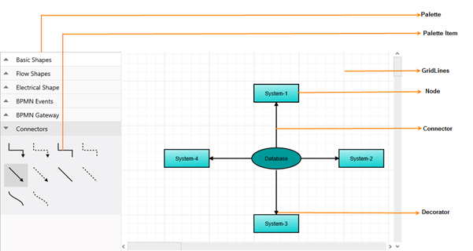
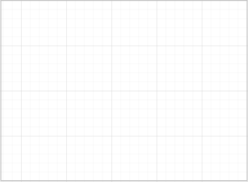
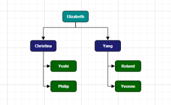
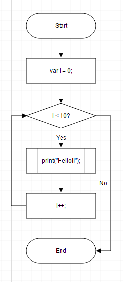

# Getting Started

Getting started with your Essential JavaScript Diagram is easy. You can start by creating a simple Flow Diagram.

## Flow Diagram

### Initialize Diagram

1\. Create an `HTML` file and add the necessary script references and style sheets in the `Head` tag as shown in the following code example.



<!DOCTYPE html>
<html>
<head>
	<title>Getting Started With Diagram Control For Javascript</title>
	<!-- jQuery Script -->
	
	
	<!--script to create Diagram-->
	
</head>
<body></body>
</html>



2\. Add a placeholder `div` element that can be used to initialize the diagram widget as shown below.
3\. Use [width](/api/js/ejdiagram#members:width "width") and [height](/api/js/ejdiagram#members:height "height") property of the diagram allows you to define the size of the diagram.



<body>
	

	
</body>



4\. This creates an empty diagram

The [create](/api/js/ejdiagram#events:create "create") event gets triggered once the diagram is created.

### Create and add Node

Let us create and add a `node` (JSON data) with specific position, size, label and shape.


// a node is created and stored in nodes array.
var nodes = [{
	// Unique name for the node
	name: "Start",
	// Position of the node
	offsetX: 300,
	offsetY: 50,
	// Size of the node
	width: 140,
	height: 50,
	// Text(label) added to the node
	labels: [{
		text: "Start"
	}],
	// Shape for the node
	type: "flow",
	shape: "terminator"
}];

$("#diagram").ejDiagram({
	width: "100%",
	height: "600px",
	// Add node
	nodes: nodes,
});



N> `labels` property is an array, which indicates that more than one label can be added to a node.

Added node will be displayed in diagram as shown below.

### Connect nodes

* Create another `node` with another set of data.



var nodes =
[
	{
		name: "Start", offsetX: 300, width: 140, height: 50, offsetY: 50,
		labels: [{ text: "Start" }], type: "flow", shape: "terminator"
	},
	{
		name: "Init", offsetX: 300, width: 140, height: 50, offsetY: 140,
		labels: [{ text: "var i = 0;" }], type: "flow", shape: "process"
	},
];



* Connect these two nodes by adding a `connector` into `diagram.connectors` collection with reference to source and target end.



var connectors = [{
	// Unique name for the connector
	name: "connector1",

	// Source and Target node's name to which connector needs to be connected.
	sourceNode: "Start",
	targetNode: "Init",

	// An empty orthogonal segment
	segments: [{ type: "orthogonal" }]
}];

$("#diagram").ejDiagram({
	width: "100%",
	height: "600px",
	nodes: nodes,
	connectors: connectors,
});



* `Connector` connects the two nodes as shown below.

* Default values for all nodes and connectors can be set using [defaultSettings](/api/js/ejdiagram#members:defaultsettings "defaultSettings") property. For example if all nodes have same `width` and `height`, we can move such properties into `defaultSettings`. 

* The defaultSettings [node](/api/js/ejdiagram#members:defaultsettings-node "node") property is used to define the default node properties.
* The defaultSettings [connector](/api/js/ejdiagram#members:defaultsettings-connector "connector") property is used to define the default connector properties.
* The defaultSettings [group](/api/js/ejdiagram#members:defaultsettings-group "group") property is used to define the default group properties.

Above code can be rewritten as shown below.



var nodes = [{
	name: "Start",
	offsetY: 50,
	labels: [{ text: "Start" }],
	type: "flow",
	shape: "terminator"
},{
	name: "Init",
	offsetY: 140,
	labels: [{ text: "var i = 0;" }],
	type: "flow",
	shape: "process"
}];

var connectors = [{
	name: "connector1",
	sourceNode: "Start",
	targetNode: "Init"
}];

$("#diagram").ejDiagram({
	width: "100%",
	height: "600px",
	nodes: nodes,
	connectors: connectors,
	// Common values of all nodes and connectors define using defaultSettings
	defaultSettings: {
		node: {
			offsetX: 300,
			width: 140,
			height: 50
		},
		connector: {
			labels: [{ "fillColor": "white" }],
			segments: [{ type: "orthogonal" }]
		},
	}
});



### Complete flow diagram

Similarly we can add required nodes and connectors to form a complete flow diagram.



var nodes =
[
	{ name: "Start", offsetY: 50, labels: [{ text: "Start" }], shape: "terminator" },
	{ name: "Init", offsetY: 140, labels: [{ text: "var i = 0;" }], shape: "process" },
	{ name: "Condition", offsetY: 230, labels: [{ text: "i < 10?" }], shape: "decision" },
	{ name: "Print", offsetY: 320, labels: [{ text: "print(\"Hello!!\");" }], shape: "predefinedprocess" },
	{ name: "Increment", offsetY: 410, labels: [{ text: "i++;" }], shape: "process" },
	{ name: "End", offsetY: 500, labels: [{ text: "End" }], shape: "terminator" },
];

var connectors = [
	{ name: "connector1", sourceNode: "Start", targetNode: "Init" },
	{ name: "connector2", sourceNode: "Init", targetNode: "Condition" },
	{ name: "connector3", sourceNode: "Condition", targetNode: "Print", labels: [{ text: "Yes" }] },
	{ name: "connector4", sourceNode: "Condition", targetNode: "End", labels: [{ text: "No" }],
		segments: [{ length: 30, direction: "right" }]
	},
	{ name: "connector5", sourceNode: "Print", targetNode: "Increment" },
	{ name: "connector6", sourceNode: "Increment", targetNode: "Condition",
		segments: [{ length: 30, direction: "left" }]
	}
];

$("#diagram").ejDiagram({
	width: "100%",
	height: "600px",
	nodes: nodes,
	connectors: connectors,
	defaultSettings: {
		node: { offsetX: 300, width: 140, height: 50, type: "flow" },
		connector: {
			labels: [{ "fillColor": "white" }],
			segments: [{ type: "orthogonal" }]
		}
	}
});



Final flow chart will looks as shown below.

## Automatic organization chart

In 'Flow Diagram' section we saw how to create a diagram manually, now let us see how to create and position diagram automatically.

### Initialize diagram
Initializing diagram is already discussed in Flow Diagram > [Initialize diagram](#initialize-diagram) section.

### Business object (Employee information)

* Define Employee Information as JSON data. The following code example shows an employee array whose,
	* `Name` is used as a unique identifier and
	* `ReportingPerson` is used to identify the person to whom an employee report to, in the organization.



//Initialize data source...
var data = [
	{ Name: "Elizabeth", Role: "Director" },
	{ Name: "Christina", ReportingPerson: "Elizabeth", Role: "Manager" },
	{ Name: "Yoshi", ReportingPerson: "Christina", Role: "Lead" },
	{ Name: "Philip", ReportingPerson: "Christina", Role: "Lead" },
	{ Name: "Yang", ReportingPerson: "Elizabeth", Role: "Manager" },
	{ Name: "Roland", ReportingPerson: "Yang", Role: "Lead" },
	{ Name: "Yvonne", ReportingPerson: "Yang", Role: "Lead" }
];



### Map data source

* You can configure this "Employee Information" with Diagram, so that the node and connector are automatically generated using mapping properties. The following code examples show how dataSourceSetting is used to map id and parent with property name identifiers for employee information.



//Initialize data source...
$("#diagram").ejDiagram({

//Configure data source for diagram
	dataSourceSettings: {
		id: "Name",
		parent: "ReportingPerson",
		dataSource: data
	}
});



### Visualize employee

Following code examples indicate how to define the default appearance of node and connector using defaultSetting. The NodeTemplate is used to update each node based on employee data.



//To represent the roles
var codes = {
	Director: "rgb(0, 139,139)",
	Manager: "rgb(30, 30,113)",
	Lead: "rgb(0, 100,0)"
}

// Bind custom data with node
function nodeTemplate(diagram, node) {
	node.labels[0].text = node.Name;
	node.fillColor = codes[node.Role];
}

$("#diagram").ejDiagram({
	defaultSettings: {
		//Set the default properties of nodes.
		node: {
			width: 70,
			height: 30,
			shape: {
				type: "rectangle",
				cornerRadius: 5
			},
			labels: [{
				name: "label1",
				fontSize: 11,
				bold: true,
				fontFamily: "Segoe UI",
				fontColor: "white"
			}]
		},
		//Set the default properties of connectors.
		connector: {
			segments: [{
				type: "orthogonal"
			}],
			targetDecorator: {
				shape: "arrow"
			}
		}
	},
	//Initialize the node template.
	nodeTemplate: nodeTemplate,
	//Configure data source for diagram
	dataSourceSettings: {
		id: "Name",
		parent: "ReportingPerson",
		//Specifies the dataSource
		dataSource: data
	}
});



### Apply org chart layout

* Next you need to arrange nodes in an organizational chart structure, and to do this you can apply layout as shown in following code example. You can see that spacing, margin and orientation are defined, that can also be customized based on the needs.



$("#diagram").ejDiagram({
	//Use automatic layout to arrange elements on the page
	layout: {
		type: ej.datavisualization.Diagram.LayoutTypes.OrganizationalChart,
		marginX: 10,
		marginY: 50,
		horizontalSpacing: 50,
		verticalSpacing: 50,
		orientation: ej.datavisualization.Diagram.LayoutOrientations.TopToBottom
	}

});



* The Employee details are displayed in the Diagram as follows.

