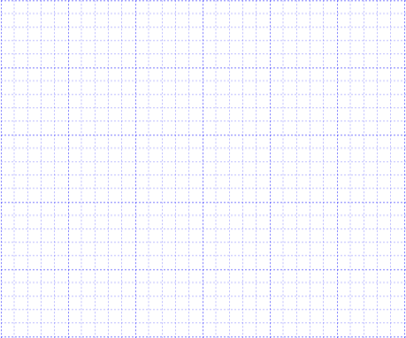

# Gridlines

**Gridlines** are the pattern of lines drawn behind the Diagram elements. It provides a visual guidance while dragging or arranging the objects on the Diagram surface.

The model's [snapSettings](/api/js/ejdiagram#members:snapsettings "snapSettings") property is used to customize the gridlines and control the snapping behavior in the diagram

## Customize the gridlines visibility

The [snapSettings.snapConstraints](/api/js/ejdiagram#members:snapsettings-snapconstraints "snapSettings.snapConstraints") enables you to show/hide the gridlines. The following code example illustrates how to show or hide gridlines.



//Shows both horizontal and vertical gridlines
var snapSettings = {
	snapConstraints: ej.datavisualization.Diagram.SnapConstraints.ShowLines
};

$(function() {
	$("#diagram").ejDiagram({
		width: "400px",
		height: "400px",
		snapSettings: snapSettings
	});
});



To show only horizontal/vertical gridlines or to hide gridlines, refer to [Constraints](/js/Diagram/Constraints#snapconstraints "Constraints")

## Appearance

You can customize the appearance of the gridlines by using a set of predefined properties. 

* The [horizontalGridLines](/api/js/ejdiagram#members:snapsettings-horizontalgridlines "horizontalGridLines") and [verticalGridLines](/api/js/ejdiagram#members:snapsettings-verticalgridlines "verticalGridLines") properties allow to customize the appearance of the horizontal and vertical gridlines respectively.

* The horizontalGridLines [lineColor](/api/js/ejdiagram#members:snapsettings-horizontalgridlines-linecolor "lineColor") and [lineDashArray](/api/js/ejdiagram#members:snapsettings-horizontalgridlines-linedasharray "lineDashArray") properties are used to customizes the line color and line style of the horizontal gridlines.

* The verticalGridLines [lineColor](/api/js/ejdiagram#members:snapsettings-verticalgridlines-linecolor "lineColor") and [lineDashArray](/api/js/ejdiagram#members:snapsettings-verticalgridlines-linedasharray "lineDashArray") properties are used to customizes the line color and line style of the vertical gridlines.

The following code example illustrates how to customize the appearance of gridlines.



var snapSettings = {
	snapConstraints: ej.datavisualization.Diagram.SnapConstraints.ShowLines,
	// Customizes the line color and line style to the gridlines.
	horizontalGridLines: {
		lineColor: "blue",
		lineDashArray: "2 2"
	},
	verticalGridLines: {
		lineColor: "blue",
		lineDashArray: "2 2"
	}
};

$(function() {
	$("#diagram").ejDiagram({
		width: "400px",
		height: "400px",
		snapSettings: snapSettings
	});
});



### Line Intervals

Thickness and the space between gridlines can be customized by using horizontalGridLines's [linesInterval](/api/js/ejdiagram#members:snapsettings-horizontalgridlines-linesinterval "linesInterval") and verticalGridLines's [linesInterval](/api/js/ejdiagram#members:snapsettings-verticalgridlines-linesinterval "linesInterval") property. In the linesInterval collections, values at the odd places are referred as the thickness of lines and the values at the even places are referred as the space between gridlines.

The following code example illustrates how to customize the thickness of lines and the line intervals.



var snapSettings = {
	snapConstraints: ej.datavisualization.Diagram.SnapConstraints.ShowLines,
	horizontalGridLines: {
		// Defines the thickness and intervals for a pattern of lines
		linesInterval: [1.25, 14, 0.25, 15, 0.25, 15, 0.25, 15, 0.25, 15],
		lineColor: "blue",
		lineDashArray: "2 2"
	},
	verticalGridLines: {
		linesInterval: [1.25, 14, 0.25, 15, 0.25, 15, 0.25, 15, 0.25, 15],
		lineColor: "blue",
		lineDashArray: "2 2"
	}
};

$(function() {
	$("#diagram").ejDiagram({
		width: "400px",
		height: "400px",
		snapSettings: snapSettings
	});
});



## Snapping

### Snap To Lines

This feature allows the Diagram objects to snap to the nearest intersection of gridlines while being dragged or resized. This feature enables easier alignment during layout or design.

Snapping to gridlines can be enabled/disabled with the [snapSettings.snapConstraints](/api/js/ejdiagram#members:snapsettings-snapconstraints "snapSettings.snapConstraints"). The following code example illustrates how to enable/disable the snapping to gridlines.



//Enables snapping to both the horizontal and vertical lines.
snapSettings = {
	snapConstraints: ej.datavisualization.Diagram.SnapConstraints.SnapToLines
};

$(function() {
	$("#diagram").ejDiagram({
		width: "400px",
		height: "400px",
		snapSettings: snapSettings,
	});
});



To enable/disable snapping to horizontal/vertical lines, refer to [Constraints] (/js/Diagram/Constraints#SnapConstraints "Constraints")

### Customization of Snap Intervals

By default, the objects are snapped towards the nearest gridline. The gridline or position towards where the diagram object snaps can be customized with the property, horizontalGridLines's [snapInterval](/api/js/ejdiagram#members:snapsettings-horizontalgridlines-snapinterval "snapInterval") and verticalGridLines's [snapInterval](/api/js/ejdiagram#members:snapsettings-verticalgridlines-snapinterval "snapInterval") property. 

The following code example illustrates how to customize the snap intervals.



$("#diagram").ejDiagram({
	width: "400px",
	height: "400px",
	snapSettings: {
		horizontalGridLines: {
			//Defines a set of intervals where the object is snapped.
			//In this example, the object is snapped to every 10px.
			snapInterval: [10]
		},
		verticalGridLines: {
			//The object is snapped to every 10px.
			snapInterval: [10]
		},
		snapConstraints: ej.datavisualization.Diagram.SnapConstraints.All
	},
});



### Snap To Objects

The snap-to-object provides visual cues to assist with aligning and spacing Diagram elements. A node can be snapped with its neighboring objects based on certain alignments. Such alignments are visually represented as smart guides.

The [enableSnapToObject](/api/js/ejdiagram#members:snapsettings-enablesnaptoobject "enableSnapToObject") property allows you to enable/disable smart guides. The following code example illustrates how to enable/disable the smart guides.

The [snapAngle](/api/js/ejdiagram#members:snapsettings-snapangle "snapAngle") property allows you to define the snap angle by which the object needs to be rotated.

The [snapObjectDistance](/api/js/ejdiagram#members:snapsettings-snapobjectdistance "snapObjectDistance") property allows you to define minimum distance between the selected object and the nearest object.



$("#diagram").ejDiagram({
	width: "400px",
	height: "400px",
	//Enables smart guides
	snapSettings: {
		enableSnapToObject: true
	},
});



