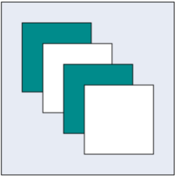
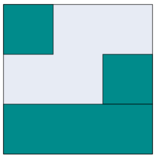

# Group

Group is used to cluster multiple nodes and connectors into a single element. It acts like a container for its children (nodes, groups, and connectors). Every change made to the group also affects the children. Child elements can be edited individually. 

## Create Group

### Add group when initializing diagram

You can add a group to the Diagram model through [nodes](/api/js/ejdiagram#members:nodes "nodes") collection. To define an object as group, set its [type](/api/js/ejdiagram#members:nodes-type "type") property as "group" and you need to add the child objects to the [children](/api/js/ejdiagram#members:nodes-children "children")  collection of the group. The following code illustrates how to create a group node.

* The group's [canUngroup](/api/js/ejdiagram#members:nodes-canungroup "canUngroup") property is used to defines whether the group can be ungrouped or not.



var nodes = [{
	//Sets the name
	name: "group1",
	// Sets the type as group
	type: "group",
	//Defines the collection of children
	children: [{
		name: "rectangle1",
		offsetX: 100,
		offsetY: 100,
		width: 100,
		height: 100,
		type: "node",
		fillColor: "darkCyan",
		borderWidth: 2,
		labels: [{
			text: "rectangle1"
		}]
	},{
		name: "rectangle2",
		offsetX: 200,
		offsetY: 200,
		width: 100,
		height: 100,
		type: "node",
		fillColor: "darkCyan",
		borderWidth: 2,
		labels: [{
		text: "rectangle2"
		}]
	}]
}]

//Initialize Diagram
$("#DiagramContent").ejDiagram({
	//Sets nodes collection to Diagram model.
	nodes: nodes
});



### Add group at run time

You can add a group node at runtime by using the client side method [add](/api/js/ejdiagram#methods:add "add").

The following code illustrates how a group node is added at run time.



var group = {
	name: "group1",
	type: "group",
	children: [{
		name: "rectangle1",
		offsetX: 100,
		offsetY: 100,
		width: 100,
		height: 100,
		type: "node",
		fillColor: "darkCyan",
		borderWidth: 2,
		labels: [{
			text: "rectangle1"
		}]
	}, {
		name: "rectangle2",
		offsetX: 200,
		offsetY: 200,
		width: 100,
		height: 100,
		type: "node",
		fillColor: "darkCyan",
		borderWidth: 2,
		labels: [{
			text: "rectangle2"
		}]
	}]
};

var diagram = $("#DiagramContent").ejDiagram("instance");
// Adds group to the Diagram.
diagram.add(group);



In a group node, when you add or remove a children, the [groupChange](/api/js/ejdiagram#events:groupchange "groupChange") event gets triggered.

### Group from palette

Group nodes can be predefined and added to symbol palette. You can drop those groups into Diagram, when required.

To explore how to add groups from symbol palette, refer to [Symbol Palette](/js/Diagram/Symbol-Palette "Symbol Palette")

## Container

Containers are used to automatically measure and arrange the size and position of the child elements in a predefined manner.
There are two types of containers available.

### Canvas

* The Canvas panel supports absolute positioning and provides the least layout functionality to its contained Diagram elements. 
* Canvas allows you to position its contained elements by using margin and alignment properties.
* It allows elements to be either vertically or horizontally aligned.

The [container](/api/js/ejdiagram#members:nodes-container "container") property of group should be defined and its [type](/api/js/ejdiagram#members:nodes-container-type "type") should be set as `canvas` to create a canvas panel. Also, you can set an orientation as horizontal or vertical for canvas panel using nodes container [orientation](/api/js/ejdiagram#members:nodes-container-orientation "orientation") property. The following code illustrates how to add a canvas panel.



var nodes = [{
	type: "group",
	name: "canvas",
	offsetX: 400,
	offsetY: 400,
	
	children: [{
		type: "node",
		name: "node1",
		fillColor: "darkCyan",
		width: 100,
		height: 100
	}, {
		type: "node",
		name: "node2",
		// Sets the margin to define the space around the child node.
		marginTop: 30,
		marginLeft: 30,
		fillColor: "white",
		width: 100,
		height: 100
	}, {
		type: "node",
		name: "node3",
		marginTop: 60,
		marginLeft: 60,
		fillColor: "darkCyan",
		width: 100,
		height: 100
	}, {
		type: "node",
		name: "node4",
		marginTop: 90,
		marginLeft: 90,
		fillColor: "white",
		width: 100,
		height: 100
	}],
	
	//Sets the container as canvas.
	container: {
		type: "canvas"
	},
	fillColor: "#E7EBF4",
	borderColor: "black",
	
	//Sets the padding to give space between the group border and group content.
	paddingLeft: 30,
	paddingTop: 30,
	paddingRight: 30,
	paddingBottom: 30
}];

$("#DiagramContent").ejDiagram({
	nodes: nodes
});



### Stack

* Stack panel is used to arrange its children in a single line or stack order, either vertically or horizontally.

* It controls spacing by setting margin properties of child and padding properties of group. By default, a Stack Panel’s [orientation](/api/js/ejdiagram#members:nodes-container-orientation "orientation") is vertical.

* The [container](/api/js/ejdiagram#members:nodes-container "container") property of group should be defined and its [type](/api/js/ejdiagram#members:nodes-container-type "type") should be set as `stack` to create a canvas panel.

* The group's [paddingTop](/api/js/ejdiagram#members:nodes-paddingtop "paddingTop"), [paddingBottom](/api/js/ejdiagram#members:nodes-paddingbottom "paddingBottom"),[paddingLeft](/api/js/ejdiagram#members:nodes-paddingleft "paddingLeft") and [paddingRight](/api/js/ejdiagram#members:nodes-paddingright "paddingRight") properties allows you to controls the spacing around an children defined in the stack.
		
* The connector [marginTop](/api/js/ejdiagram#members:connectors-margintop "marginTop"), [marginBottom](/api/js/ejdiagram#members:connectors-marginbottom "marginBottom"),[marginLeft](/api/js/ejdiagram#members:connectors-marginleft "marginLeft") and [marginRight](/api/js/ejdiagram#members:connectors-marginright "marginRight") properties allows you to controls the spacing of the connector within the stack.

* The nodes [marginTop](/api/js/ejdiagram#members:nodes-margintop "marginTop"), [marginBottom](/api/js/ejdiagram#members:nodes-marginbottom "marginBottom"),[marginLeft](/api/js/ejdiagram#members:nodes-marginleft "marginLeft") and [marginRight](/api/js/ejdiagram#members:nodes-marginright "marginRight")  properties allows you to controls the spacing of the connector within the stack.

* The nodes [horizontalAlign](/api/js/ejdiagram#members:nodes-horizontalalign "horizontalAlign") and [verticalAlign](/api/js/ejdiagram#members:nodes-verticalalign "verticalAlign") properties are used to align the node on the container with set of predefined horizontal and vertical direction.

* The connectors [horizontalAlign](/api/js/ejdiagram#members:connectors-horizontalalign "horizontalAlign") and [verticalAlign](/api/js/ejdiagram#members:connectors-verticalalign "verticalAlign") properties are used to align the connector on the container with set of predefined horizontal and vertical direction.

The following code illustrates how to add a stack panel.



var nodes = [{
	type: "group",
	name: "Stack",
	offsetX: 600,
	offsetY: 200,
	fillColor: "#E7EBF4",
	borderColor: "black",
	// Sets the minimum size for stack panel.
	minHeight: 300,
	minWidth: 300,
	children: [{
		type: "node",
		name: "snode1",
		fillColor: "darkCyan",
		//Sets the horizontal Alignment for child node.
		horizontalAlign: "left",
		width: 100,
		height: 100
	}, {
		type: "node",
		name: "snode2",
		fillColor: "darkCyan",
		horizontalAlign: "right",
		width: 100,
		height: 100
	}, {
		type: "node",
		name: "snode3",
		fillColor: "darkCyan",
		horizontalAlign: "stretch",
		width: 100,
		height: 100
	}],
	// Sets the container as stack.
	container: {
		type: "stack"
	},
}];

$("#DiagramContent").ejDiagram({
	nodes: nodes
});



## Difference between a basic group and containers

| Group | Container |
|---|---|
| It arranges the child elements based on the child elementâ??s position and size properties. | Each container has a predefined behaviour to measure and arrange its child elements. Canvas and stack containers are supported in the Diagram. |
| Padding, Min and Max Size properties are not applicable for basic group. | It is applicable for container. |
| Children's margin and alignment properties are not applicable for basic group. | It is applicable for container. |

## Interaction

You can edit the group and its children at runtime. For more information about how to interact with a group, refer to [Edit Groups](/js/Diagram/Interaction#selection "Interaction").