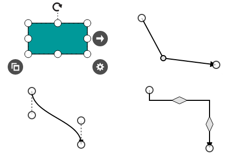
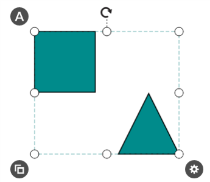
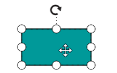
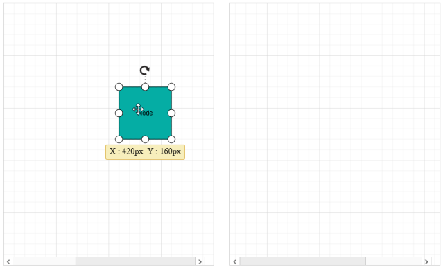

# Interaction

## Selection

Selector provides a visual representation of selected elements. It behaves like a container and enables you to update the size, position, and rotation angle of the selected elements through interaction and programmatically. Single or multiple elements can be selected at a time.

### Single selection

An element can be selected by clicking that element. During single click, all previously selected items are cleared. The following image shows how the selected elements are visually represented.

* While selecting the diagram elements, you can use below events to do your customization.
* When we select/unselect a diagram elements, the [selectionChange](/api/js/ejdiagram#events:selectionchange "selectionChange") event gets triggered.
* When we click on elements/model in the diagram, the [click](/api/js/ejdiagram#events:click "click") event gets triggered. This event triggers even when the diagram is static.
* Like click event, the [itemClick](/api/js/ejdiagram#events:itemclick "itemClick") event gets triggered only when we click on diagram elements.

### Selecting a group

When a child element of any group is clicked, its contained group is selected instead of the child element. With consecutive clicks on the selected element, selection is changed from top to bottom in the hierarchy of parent group to its children.

### Multiple selection

Multiple elements can be selected with the following ways.

1. Ctrl+Click

	During single click, any existing item in the selection list be cleared, and only the item clicked recently is there in the selection list. To avoid cleaning the old selected item, Ctrl key must be on hold when clicking.

2. Selection rectangle / Rubber band selection

	Clicking and dragging the Diagram area allows to create a rectangular region. The elements that are covered under the rectangular region are selected at the end.

Multiple selected elements are visually represented as shown.

### Select/Unselect elements programmatically

The client side methods [addSelection](/api/js/ejdiagram#methods:addselection "addSelection"), [clearSelection](/api/js/ejdiagram#methods:clearselection "clearSelection") and [removeSelection](/api/js/ejdiagram#methods:removeselection "removeSelection") help select/unselect elements at runtime. The following code example illustrates how to select/unselect an item through programmatically.



var diagram = $("#DiagramContent").ejDiagram("instance");
var node = diagram.findNode("node1");

//Selects an element
diagram.addSelection(node);

//Clears the current selection
diagram.clearSelection();

//Unselects a particular object
diagram.removeSelection(node);



You can get the current selected items from the [children](/api/js/ejdiagram#members:selecteditems-children "children") collection of [selectedItems](/api/js/ejdiagram#members:selecteditems "selectedItems") property of the Diagram model.
The client side method `updateSelector` helps you to change the [width](/api/js/ejdiagram#members:selecteditems-width "width"), [height](/api/js/ejdiagram#members:selecteditems-height "height"), [offsetX](/api/js/ejdiagram#members:selecteditems-offsetx "offsetX"), [offsetY](/api/js/ejdiagram#members:selecteditems-offsety "offsetY") and [rotation angle](/api/js/ejdiagram#members:selecteditems-rotateangle "rotate angle") of the selected elements at runtime. The following code example illustrates how to read the selected items and how to update the position, size, and rotation angle.



var diagram = $("#DiagramContent").ejDiagram("instance");

//Updates the size, position and rotateAngle of selected elements.

diagram.updateSelector({
	offsetX: 200,
	offsetY: 200,
	width: 200,
	height: 200,
	rotateAngle: 200
});

//Iterates the selected elements
for (var i = 0; i < diagram.model.selectedItems.children.length; i++) {
	var child = diagram.model.selectedItems.children[i];
}



The client side method [updateSelectedObject](/api/js/ejdiagram#methods:updateselectedobject "updateSelectedObject") used to update the specified node as selected object. For example, When you click on a group node, the entire group gets selected. if you need to select the group children on first click, then you need to pass that node name to this method.

N> SelectedItems’s children is a read-only property. You cannot change the children collection at run time.

#### GetConstraints

The SelectedItems’s [getConstraints](/api/js/ejdiagram#members:selecteditems-getconstraints "getConstraints") function is provided for the purpose of to decide the interaction with multiple selection. The method is used to decide when you perform interaction with multiple selected elements in which any one of the element has an interaction disabled, then you can decide whether interaction such as dragging, resizing and rotation needs to be enabled or not.

### Select entire elements in diagram programmatically

The client side method selectAll used to select all the elements such as nodes/connectors in diagram. Please refer to below link which shows how to use selectAll method on diagram.

[selectAll](/api/js/ejdiagram#methods:selectall "selectAll")

## Drag

* An object can be dragged by clicking and dragging it. When multiple elements are selected, dragging any one of the selected elements move every selected element.
* While dragging, the objects are snapped towards the nearest objects to make better alignments. For better alignments, refer to [Snapping](/js/Diagram/Gridlines#snapping "Snapping").

* When you drag the elements in diagram, the [drag](/api/js/ejdiagram#events:drag "drag") event gets triggered and you can do your customization in this event.

## Working with multiple diagrams

Diagram provides support to drag diagram elements from one diagram to another. 

If you enable [FloatElements](/api/js/ejdiagram#members:constraints "FloatElements") constraints to any diagram, it will allow you to drag elements from it and the elements can be dropped into any other diagram.

The following code illustrates how to drag nodes over multiple diagrams.


    &lt;body&gt;

        &lt;div id="sourceDiagram"&gt;

        &lt;/div&gt;

        &lt;div id="targetDiagram"&gt;

        &lt;/div&gt;

    &lt;/body&gt;



    
        //Enables the FloatElements constraints
        var constraints = ej.datavisualization.Diagram.DiagramConstraints.Default | ej.datavisualization.Diagram.DiagramConstraints.FloatElements;

        var node = { name: "node1", height: 100, width: 100, offsetX: 100, offsetY: 100, fillColor: "#05ADA4", labels: [{ text: "Node" }] };
        
        //Creates the source
        $("#sourceDiagram").ejDiagram({
            height: "500px",
            width: "400px",
            nodes: [node],
            //Set the constraints to the diagram
            constraints: constraints
        });
        
        //Creates the target diagram
        $("#targetDiagram").ejDiagram({
            height: "500px",
            width: "400px",
            constraints: constraints
        });
        
     


The following screen short illustrates how the nodes are dragged from one diagram to another.
 

 

## Resize

* Selector is surrounded by eight thumbs. When dragging these thumbs, selected items can be resized smaller or larger.
* When one corner of the selector is dragged, opposite corner is in a static position.
* While resizing, the objects are snapped towards the nearest objects to make better alignments. For better alignments, refer to [Snapping](/js/Diagram/Gridlines#snapping "Snapping").

* When a node is resized, the [sizeChange](/api/js/ejdiagram#events:sizechange "sizeChange") event gets triggered. 

## Rotate

* A rotate handler is placed above the selector. Clicking and dragging the handler in a circular direction lead to rotate the node.
* The node is rotated with reference to the static pivot point.
* Pivot thumb (thumb at the middle of the node) appears while rotating the node to represent the static point.
* For more information about pivot, refer to [Position](/js/Diagram/Node#position "Position").

* When the diagram elements are rotated, the [rotationChange](/api/js/ejdiagram#events:rotationchange "rotationChange") event gets triggered.

## Connection editing

* Each segment of a selected connector is editable with some specific handles/thumbs.

* When a connector segment is edited, the [segmentChange](/api/js/ejdiagram#events:segmentchange "segmentChange") event gets triggered.

### End point handles

Source and target points of the selected connectors are represented with two handles. Clicking and dragging those handles help you to adjust the source and target points.

* If you drag connector end points or updating connector end points, then you can use below events to do your customization.
* When the connector source point is changed, the [connectorSourceChange](/api/js/ejdiagram#events:connectorsourcechange "connectorSourceChange") event gets triggered.
* When the connector target point is changed, the [connectorTargetChange](/api/js/ejdiagram#events:connectortargetchange "connectorTargetChange") event gets triggered.
* When you connect connector with ports/node or disconnect from it, the [connectionChange](/api/js/ejdiagram#events:connectionchange "connectionChange") event gets triggered.

### Straight segment editing

* End point of each straight segment is represented by a thumb that enables to edit the segment.
* Any number of new segments can be inserted into a straight line by clicking that when shift and ctrl keys are pressed. (Ctrl+Shift+Click).
* Straight segments can be removed by clicking the segment end point, when ctrl and shift keys are pressed. (Ctrl+Shift+Click).

### Orthogonal thumbs

* Orthogonal thumbs allow to adjust the length of adjacent segments by clicking and dragging it.

* When necessary, some segments are added or removed automatically, when dragging the segment. This is to maintain proper routing of orthogonality between segments.

### Bezier thumbs

* Bezier segments are annotated with two thumbs to represent the control points. Control points of the curve can be configured by clicking and dragging the control thumbs.

## Drag and drop nodes over other elements

Diagram provides support to drop a node/connector over another node/connector. Drop event is raised to notify that an element is dropped over another one and it is disabled by default. It can enabled with the [constraints](/api/js/ejdiagram#members:nodes-constraints "constraints") property. The following code illustrates how to enable **dropping**.



var nodeConstraints = ej.datavisualization.Diagram.NodeConstraints;
var nodes = [{
	name: "node",
	width: 100,
	height: 100,
	offsetX: 100,
	offsetY: 100,
	fillColor: "#1BA0E2",
	//Enables allow drop for node.
	constraints: nodeConstraints.Default | nodeConstraints.AllowDrop,
}];

var connectorConstraints = ej.datavisualization.Diagram.ConnectorConstraints;
var connectors = [{
	name: "connector1",
	sourcePoint: { x: 200, y: 50 },
	targetPoint: { x: 300, y: 150 },
	segments: [{ type: "orthogonal", length: 50, direction: "bottom" }],
	//Enables allow drop for connector.
	constraints: connectorConstraints.Default | connectorConstraints.AllowDrop,
}];

$("#diagram").ejDiagram({
	width: "100%",
	height: "100%",
	pageSettings: {
		scrollLimit: "diagram"
	},
	nodes: nodes,
	connectors: connectors
});



The following code example illustrates how to insert a child to a group interactively.


$("#diagram").ejDiagram({
	//Defines drop event
	drop: onDrop
}
function onDrop(args) {
	if (args.target && args.element) {
		//Element that is being dropped
		var node = args.element;
		//Element over which another element is dropped
		var target = args.target;
		if (diagram.getObjectType(target) == "group" && diagram.getObjectType(node) == "node") {
			//Inserts the node into group
			node.parent = target.name;
			target.children.push(node.name);
		}
	}
}


 * When the node is rendered in the diagram, you can use the following events to detect the mouse behavior on node.
 * The diagram client side event [mouseEnter](/api/js/ejdiagram#events:mouseenter "mouseEnter") gets triggered when mouse enters node/connector.
 * The diagram client side event [mouseLeave](/api/js/ejdiagram#events:mouseleave "mouseLeave") gets triggered when mouse leaves node/connector.
 * The diagram client side event [mouseOver](/api/js/ejdiagram#events:mouseover "mouseOver") gets triggered when mouse hovers over a node/connector.

## User handles

* User handles are used to add some frequently used commands around the selector. To create user handles, define and add them to the [userHandles](/api/js/ejdiagram#members:selecteditems-userhandles "userHandles") collection of [selectedItems](/api/js/ejdiagram#members:selecteditems "selectedItems") property.

* The [name](/api/js/ejdiagram#members:selecteditems-userhandles-name "name") property of user handle is used to define the name of the user handle and its further used to find the user handle at runtime and do any customization.

* The [tool](/api/js/ejdiagram#members:selecteditems-userhandles-tool "tool") property of user handle should be set with any appropriate tool to enable interaction.

The following code example illustrates how to draw a user handle.



// Defines a tool to interact with the user handle
var CloneTool = (function (base) {
	ej.datavisualization.Diagram.extend(CloneTool, base);
	// Initializes the tool
	function CloneTool(name) {
		base.call(this, name);
	}
	// Defines the required events
	CloneTool.prototype.mouseup = function (evt) {
		//clones the selected elements when the custom handle is clicked.
		this.diagram.copy();
		//Pastes the cloned elements.
		this.diagram.paste();
		base.prototype.mouseup.call(this, evt);
	};
	return CloneTool;
})(ej.datavisualization.Diagram.ToolBase);

var userHandles = [];
//Initializes the handles
var cloneHandle = ej.datavisualization.Diagram.UserHandle();
// Name of the user handle.
cloneHandle.name = "Clone";
// Sets the tool that you have defined to interact with handle.
cloneHandle.tool = new CloneTool(cloneHandle.name);
userHandles.push(cloneHandle);
//Initializes Diagram
$("#DiagramContent").ejDiagram({
	//Sets user handles
	selectedItems: {
		userHandles: userHandles
	}
});


### update user handles at runtime

You can use client side method [updateUserHandles](/api/js/ejdiagram#methods:updateuserhandles "updateUserHandles") to update user handles with respect to given node. Please refer to the below code example which shows how to update user handles at runtime.



var diagram=$("#diagramcontent").ejDiagram("instance");
var node = diagram.selectionList[0];
diagram.updateUserHandles(node);



### Alignment

User handles can be aligned relative to the node boundaries. It has margin, offset, horizontal and vertical alignment settings. It is quite tricky when all four alignments are used together but gives you more control over alignment.

#### Offset

The [offset](/api/js/ejdiagram#members:selecteditems-userhandles-offset "offset") property of userhandle is used to align the user handle based on fractions. 0 represents top/left corner, 1 represents bottom/right corner, and 0.5 represents half of width/height.

#### Horizontal and vertical alignments

The [horizontalAlignment](/api/js/ejdiagram#members:selecteditems-userhandles-horizontalalignment "horizontalAlignment") property of userhandle is used to set how the userhandle is horizontally aligned at the userhandle position determined from the fraction values. The [verticalAlignment](/api/js/ejdiagram#members:selecteditems-userhandles-verticalalignment "verticalAlignment") property is used to set how userhandle is vertically aligned at the userhandle position.

#### Margin

**Margin** is an absolute value used to add some blank space in any one of its four sides. You can displace the userhandle with the [margin](/api/js/ejdiagram#members:selecteditems-userhandles-margin "margin") property.

### Appearance

* The [size](/api/js/ejdiagram#members:selecteditems-userhandles-size "size"), [borderColor](/api/js/ejdiagram#members:selecteditems-userhandles-bordercolor "borderColor"), [backgroundColor](/api/js/ejdiagram#members:selecteditems-userhandles-backgroundcolor "backgroundColor") properties of user handle used for its appearance customization.

* The [enableMultiSelection](/api/js/ejdiagram#members:selecteditems-userhandles-enablemultiselection "enableMultiSelection") property of the user handle defines whether the user handle should be added, when more than one element is selected and [visible](/api/js/ejdiagram#members:selecteditems-userhandles-visible "visible") property of the user handle defines the visibility of the user handle.

* The [pathData](/api/js/ejdiagram#members:selecteditems-userhandles-pathdata "pathData") property of the user handle used to define the custom shape inside the user handle and [pathColor](/api/js/ejdiagram#members:selecteditems-userhandles-pathcolor "pathColor") property used to define the fill color of the custom shape.

The following code example illustrates how to customize the appearance of the user handle.


var UserHandlePositions = ej.datavisualization.Diagram.UserHandlePositions;
var userHandles = [];
var cloneHandle = ej.datavisualization.Diagram.UserHandle();
cloneHandle.name = "Clone";
// Sets the position of the user handle.
cloneHandle.position = UserHandlePositions.BottomLeft;
// Sets the user handle visibility.
cloneHandle.visible = true;
// Defines whether user handle should be enabled for multiple selection or not.
cloneHandle.enableMultiSelection = true;
// Sets the size of the user handle.
cloneHandle.size = 30;
// Customizes the appearance of user handle
cloneHandle.backgroundColor = "#4D4D4D";
cloneHandle.pathColor = "white";
cloneHandle.borderColor = "red";
cloneHandle.borderWidth = "2";
cloneHandle.pathData = "M4.6350084,4.8909971 L4.6350084,9.3649971 9.5480137,9.3649971 9.5480137,4.8909971 z M3.0000062,2.8189973 L11.184016,2.8189973 11.184016,10.999997 3.0000062,10.999997 z M0,0 L7.3649998,0 7.3649998,1.4020001 1.4029988,1.4020001 1.4029988,8.0660002 0,8.0660002 0,1.4020001 0,0.70300276 z";
userHandles.push(cloneHandle);

$("#DiagramContent").ejDiagram({
	selectedItems: {
		userHandles: userHandles
	}
});


## Zoom pan

* When a large Diagram is loaded, only certain portion of the Diagram is visible. The remaining portions are clipped. Clipped portions can be explored by scrolling the scrollbars or panning the Diagram.
* Diagram can be zoomed in or out by using Ctrl + mouse wheel.
* When the diagram is zoomed or panned, the [scrollChange](/api/js/ejdiagram#events:scrollchange "scrollChange") event gets triggered.

## Keyboard

Diagram provides support to interact with the elements with key gestures. By default, some in-built commands are bound with a relevant set of key combinations.

The following table illustrates those commands with the associated key values.

| Shortcut Key | Command | Description |
|---|---|---|
| Ctrl + A | selectAll | Select all nodes/connectors in diagram |
| Ctrl + C | copy | Copy the diagram selected elements |
| Ctrl + V | paste | Paste the copied elements |
| Ctrl + X | cut | Cut the selected elements |
| Ctrl + Z | undo | Undo(Reverse the last editing action performed on diagram) |
| Ctrl + Y | redo | Redo(Restores the last editing action when no other actions have occurred since the last undo on diagram) |
| Delete | delete | Delete the selected elements |
| Ctrl /Shift+ Click on object | | Multiple selection(Selector binds all selected nodes/connectors) |
| Up Arrow | nudge("up") | nudgeUp(move the selected elements towards up by one pixel) |
| Down Arrow | nudge("down") | nudgeDown(move the selected elements towards down by one pixel) |
| Left Arrow | nudge("left") | nudgeLeft(move the selected elements towards left by one pixel) |
| Right Arrow | nudge("right") | nudgeRight(move the selected elements towards right by one pixel) |
| Ctrl+MouseScroll | zoom | Zoom(Zoom in/Zoom out the diagram) |
| F2 | startLabelEditing | Starts to edit the label of selected element |
| Esc | endLabelEditing | Sets the label mode as View and stops editing. |
| Tab | focusToNextItem | Focus the next node/connector based on z-order |
| Shift + Tab | focusToPreviousItem | Focus the previous node/connector based on z-order |
| Enter | selectFocusedItem | Select the focussed node/connector |

To add custom commands, configure or modify key/mouse gesture through [Command Manager](/js/Diagram/commands#command-manager "Command Manager").
 