# Label

**Label** is a block of text that can be displayed over a node or connector. Label is used to textually represent an object with a string that can be edited at run time. You can add Multiple Labels to a node/connector.

## Create Label

You can add a label to a node/connector by defining the label object and adding that to the [labels](/api/js/ejdiagram#members:nodes-labels "labels")  collection of node/connector. The [text](/api/js/ejdiagram#members:nodes-labels-text "text")  property of label defines the text to be displayed. The following code illustrates how to create a Label. 



//Initializes Diagram
$("#diagram").ejDiagram({
	width: "100%",
	height: "100%",
	pageSettings: {
		scrollLimit: "diagram"
	},
	//Initializes nodes collection
	nodes: [{
		name: "node",
		width: 100,
		height: 100,
		offsetX: 100,
		offsetY: 100,
		borderColor: "black",
		fillColor: "#1BA0E2",
		//Initializes labels collection
		labels: [
			// Defines JSON to create a label
			{
				//Defines the text to be displayed
				text: "Label"
			}
		]
	}],
	//Initializes connectors collection
	connectors: [{
		name: "connector1",
		sourcePoint: {
			x: 200,
			y: 50
		},
		targetPoint: {
			x: 300,
			y: 150
		},
		segments: [{
			type: "orthogonal",
			length: 50,
			direction: "bottom"
		}],
		//Initializes labels collection
		labels: [
			//Defines JSON to create a label
			{
				//Defines the text to be displayed
				text: "Label",
				//Defines the background color of the text block
				fillColor: "white"
			}
		]
	}]
});



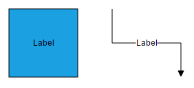

To explore more label properties, refer to [Label Properties](/api/js/ejdiagram#members:nodes-labels "Label Properties").

### Add Labels at runtime

* Labels can be added at runtime by using the client side method [addLabel](/api/js/ejdiagram#methods:addlabel "addLabel"). Also, we can insert a label into a node's label collection at runtime using client side method [insertLabel](/api/js/ejdiagram#methods:insertlabel "insertLabel"). The following code illustrates how to add a label to a node. 

* The label's [name](/api/js/ejdiagram#members:nodes-labels-name "name") property is used to define the name of the label and its further used to find the label at runtime and do any customization.



        var diagram = $("#sourceDiagram").ejDiagram("instance");

        // Defines JSON to create a label
        var label = { name: "label", text: "Node" };
        diagram.addLabel("node1", label); 
		
		//Insert label at a specific index of labels collection
    	var label = { name: "label", text: "New Label", offset: { x: 0.1, y: 0.1 } };
    	diagram.insertLabel("node1", label, 1); 



### Remove Labels at runtime

You can remove a collection of labels from the node by using client side method removeLabels. Please refer to below link which shows how to use removeLabels method.

[removeLabels](/api/js/ejdiagram#methods:removelabels "removeLabels")

## Update Label at runtime

The client side API [updateLabel](/api/js/ejdiagram#methods:updatelabel "updateLabel") is used to update the labels at run time.

The following code example illustrates how to change the label properties.



var diagram = $("#diagram").ejDiagram("instance");
var selectedObject = diagram.model.selectedItems.children[0];
diagram.updateLabel(selectedObject.name, selectedObject.labels[0], { text: "label", fillColor: "red" });



## Alignment

Label can be aligned relative to the node boundaries. It has margin, offset, horizontal and vertical alignment settings. It is quite tricky when all four alignments are used together but gives you more control over alignment.

### Offset

The [offset](/api/js/ejdiagram#members:nodes-labels-offset "offset") property of label is used to align the labels based on fractions. 0 represents top/left corner, 1 represents bottom/right corner, and 0.5 represents half of width/height.

To set size for a nodes label, use [width](/api/js/ejdiagram#members:nodes-labels-width "width") and [height](/api/js/ejdiagram#members:nodes-labels-height "height") properties.

The following image shows the relationship between the label position (black colored circle) and offset (fraction values).

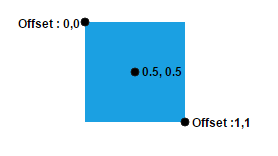

### Horizontal and vertical alignments

The [horizontalAlignment](/api/js/ejdiagram#members:nodes-labels-horizontalalignment "horizontalAlignment") property of label is used to set how the label is horizontally aligned at the label position determined from the fraction values. The [verticalAlignment](/api/js/ejdiagram#members:nodes-labels-verticalalignment "verticalAlignment") property is used to set how label is vertically aligned at the label position. 

The following tables illustrates all the possible alignments visually with **offset (0, 0).**

| Horizontal Alignment | Vertical Alignment | Output with Offset(0,0) |
|---|---|---|
| Left | Top | 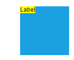 |
| Center | | 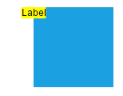 |
| Right | | 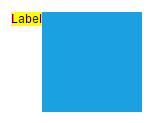 |
| Left | Center | 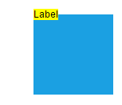 |
| Center | | 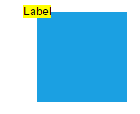 |
| Right | | 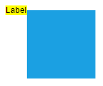 |
| Left | Bottom | 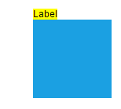 |
| Center | | 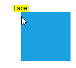 |
| Right | | 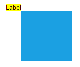 |

The following codes illustrates how to align labels.



//Initializes Diagram
$("#diagram").ejDiagram({
	width: "100%",
	height: "100%",
	pageSettings: {
		scrollLimit: "diagram"
	},
	nodes: [{
		name: "node",
		width: 100,
		height: 100,
		offsetX: 100,
		offsetY: 100,
		borderColor: "black",
		fillColor: "#1BA0E2",
		labels: [{
			text: "Label",
			// Sets offset to label
			offset: {
				x: 0,
				y: 0.5
			},
			// Sets to align label horizontally relative to given offset 
			horizontalAlignment: ej.datavisualization.Diagram.HorizontalAlignment.Left,
			// Sets to align label vertically relative to given offset
			verticalAlignment: ej.datavisualization.Diagram.VerticalAlignment.Center,
			// Sets text alignment to label
			textAlign: ej.datavisualization.Diagram.TextAlign.Center
		}]
	}],
});



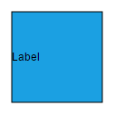

### Label alignment with respect to Segments

 [segmentOffset](/api/js/ejdiagram#members:connectors-labels-segmentoffset "segmentOffset") and [alignment](/api/js/ejdiagram#members:connectors-labels-alignment "alignment") properties of label allows you to align the connector labels with respect to the segments. In the following image, the labels are placed exactly over the segments regardless of its rectangular bounds.
 
 
 
 Following code example illustrates how to align connector labels.
 
 

 var nodes = [
          { name: "node1", width: 50, height: 40, offsetX: 200, offsetY: 200, labels: [{ "text": "Task 1" }] },
          { name: "node2", width: 50, height: 40, offsetX: 400, offsetY: 200, labels: [{ "text": "Task 2" }] }
		  ];
		  var connectors = [
		  { name: "connector1", sourceNode: "node1", targetNode: "node2"}
		  ];
		  //Initializes Diagram
		  $("#diagram").ejDiagram({
            width: "100%",
            height: "100%",
            nodes: nodes,
            connectors: connectors,
            snapSettings: ej.datavisualization.Diagram.SnapConstraints.None,
            defaultSettings: {
                connector: {
                    segments: [{ type: "orthogonal" }], 
					// Sets labels for segments
					labels: [{
                            text: "0",
                            fontColor: "black",
							
							// Aligns the label either top or left(before) of the connector segment
                            alignment: "before",
							
							// Sets the position of the label with respect to the segment
                            segmentOffset: 0
                        },{
                            text: "1",
                            fontColor: "black",
							
							// Aligns the label either bottom or right(after) of the connector segment
                            alignment: "after",
							
							// Sets segmentOffset as 1
                            segmentOffset: 1,
							
							// Enables boundaryConstraints for the label should be docked within the label bounds
                            boundaryConstraints: true,
							
                        }], lineWidth: 2
						},
						node: { borderColor: "#000000", fillColor: "#1BA0E2", labels: [{ "fontColor": "black", }]},
            },
        });
		


By default, connector labels will be aligned with respect to the segments. The [relativeMode](/api/js/ejdiagram#members:connectors-labels-relativemode "relativeMode")  property of label allows you to disable this segment specific label alignment. Following code example illustrates how to disable the segment specific label alignment.



 var nodes = [
          { name: "node1", width: 50, height: 40, offsetX: 200, offsetY: 200, labels: [{ "text": "Task 1" }] },
          { name: "node2", width: 50, height: 40, offsetX: 400, offsetY: 200, labels: [{ "text": "Task 2" }] }
		  ];
		  var connectors = [
		  { name: "connector1", sourceNode: "node1", targetNode: "node2",
		  lineWidth: 2,
		  segments: [{ type: "orthogonal" }],
		  
		  // Sets labels for segments
		   labels: [{
		   text: "0",
		   fontColor: "black",
		   
		   //Sets the relativeMode as segmentpath
		   relativeMode: "segmentpath",
		   }]
		   }];
		  //Initializes Diagram
		  $("#diagram").ejDiagram({
            width: "100%",
            height: "100%",
            connectors: connectors,
            snapSettings: ej.datavisualization.Diagram.SnapConstraints.None
			});
		


### Margin

**Margin** is an absolute value used to add some blank space in any one of its four sides. You can displace the labels with the [margin](/api/js/ejdiagram#members:nodes-labels-margin "margin") property.
The following code example illustrates how to align a label based on its `offset`, `horizontalAlignment`, `verticalAlignment` and `margin` values.



//Initializes Diagram
$("#diagram").ejDiagram({
	width: "100%",
	height: "100%",
	pageSettings: {
		scrollLimit: "diagram"
	},
	//Sets nodes collection to Diagram model
	nodes: [{
		name: "node",
		width: 100,
		height: 100,
		offsetX: 100,
		offsetY: 100,
		borderColor: "black",
		fillColor: "#1BA0E2",
		labels: [{
			text: "Label",
			offset: {
				x: 0.5,
				y: 1
			},
			horizontalAlignment: ej.datavisualization.Diagram.HorizontalAlignment.Center,
			verticalAlignment: ej.datavisualization.Diagram.VerticalAlignment.Top,
			//Sets margin to add label outside a node 
			margin: {
				top: 10
			}
		}]
	}],
});



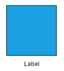

### Text Alignment

The [textAlign](/api/js/ejdiagram#members:nodes-labels-textalign "textAlign") property of label allows you to set how the text should be aligned (left, right, center, or justify) inside the text block. The following codes illustrate how to set textAlign for a label.



//Initializes Diagram
$("#diagram").ejDiagram({
	width: "100%",
	height: "100%",
	pageSettings: {
		scrollLimit: "diagram"
	},
	nodes: [{
		name: "node",
		width: 100,
		height: 100,
		offsetX: 100,
		offsetY: 100,
		borderColor: "black",
		fillColor: "#1BA0E2",
		// Sets text alignment for a label
		labels: [{
			text: "Text Align is set as Left",
			textAlign: ej.datavisualization.Diagram.TextAlign.Left
		}]
	}],
});



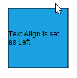

| TextAlign | Image |
|---|---|
| Left |  |
| Right | 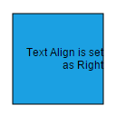 |
| Center | 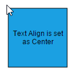 |
| Justify | 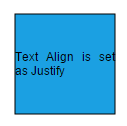 |

## Hyperlink

**Diagram** provides a support to add a [hyperlink](/api/js/ejdiagram#members:connectors-labels-hyperlink "hyperlink") for the nodes/connectors label. It can also be customized.



// Defines JSON to create a node
var nodes = [{
	name: "hyperLinkNode", 
	fillColor: "white",
	width: 150, height: 60,
	offsetX: 100, offsetY: 100,
	// Sets the hyperlink for the node label
	labels: [{ "hyperText": "https://www.syncfusion.com" }]
	}];

//Initializes Diagram
$("#diagram").ejDiagram({
	width: "100%", height: "100%",
	//Initializes nodes collection
	nodes: nodes
});



## Template support for Label

**Diagram** provides a template support for label. You need to define a id of template(SVG/Html) using label's [templateId](/api/js/ejdiagram#members:nodes-labels-templateid "templateId") property. 

## Wrapping

When text overflows node boundaries, you can control it by using text wrapping. So, it is wrapped into multiple lines. The [wrapping](/api/js/ejdiagram#members:nodes-labels-wrapping "wrapping") property of label defines how the text should be wrapped. The following code illustrates how to wrap a text in a node.



$("#diagram").ejDiagram({
	width: "100%",
	height: "100%",
	pageSettings: {
		scrollLimit: "diagram"
	},
	nodes: [{
		name: "node",
		width: 100,
		height: 100,
		offsetX: 100,
		offsetY: 100,
		borderColor: "black",
		fillColor: "#1BA0E2",
		//Enables Text-wrapping
		labels: [{
			text: "Label Text Wrapping",
			wrapping: ej.datavisualization.Diagram.TextWrapping.Wrap
		}]
	}],
});



| Values | Description | Image |
|---|---|---|
| NoWrap | Text will not be wrapped | 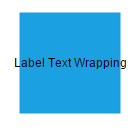 |
| Wrap | Text-wrapping occurs when the text overflows beyond the available node width. |  |
| WrapWithOverflow (Default) | Text-wrapping occurs when the text overflows beyond the available node width. However, the text may overflow beyond the node width in the case of a very long word. |  |

## TextOverflow

* The label's [textOverflow](/api/js/ejdiagram#members:nodes-labels-textoverflow "textOverflow") property is used control whether to display the overflowed content in node or not. 
* Also you can use label's [overflowType](/api/js/ejdiagram#members:nodes-labels-overflowtype "overflowType") property to define whether the overflowed content can be clipped (i.e. cut off, hidden) or display an ellipsis ('…').

## Appearance

* You can change the font style of the labels with the font specific properties([fontSize](/api/js/ejdiagram#members:nodes-labels-fontsize "fontSize"), [fontFamily](/api/js/ejdiagram#members:nodes-labels-fontfamily "fontFamily"), [fontColor](/api/js/ejdiagram#members:nodes-labels-fontcolor "fontColor"). The following code illustrates how to customize the appearance of a label.

* The label's [bold](/api/js/ejdiagram#members:nodes-labels-bold "bold"), [italic](/api/js/ejdiagram#members:nodes-labels-italic "italic") and [textDecoration](/api/js/ejdiagram#members:nodes-labels-textdecoration "textDecoration") properties are used to style the label's text.

* The label's [fillColor](/api/js/ejdiagram#members:nodes-labels-fillcolor "fillColor"), [borderColor](/api/js/ejdiagram#members:nodes-labels-bordercolor "bordercolor"), [borderWidth] (/api/js/ejdiagram#members:nodes-labels-borderwidth "borderWidth") properties are used to define the background color and border color of the label and [opacity](/api/js/ejdiagram#members:nodes-labels-opacity "opacity") property is used to define the transparency of the labels.

* The [cssClass](/api/js/ejdiagram#members:nodes-labels-cssclass "cssClass") property used to customize the style of label using user defined CSS class.

* The [visible](/api/js/ejdiagram#members:nodes-labels-visible "visible") property of the label enables or disables the visibility of label.



$("#diagram").ejDiagram({
	width: "100%",
	height: "100%",
	pageSettings: {
		scrollLimit: "diagram"
	},
	//Sets nodes collection to Diagram model
	nodes: [{
		name: "node",
		width: 100,
		height: 100,
		offsetX: 100,
		offsetY: 100,
		borderColor: "black",
		fillColor: "#1BA0E2",
		labels: [{
			text: "Label Text",
			//Sets styles to a label 
			fontSize: 12,
			fontFamily: "TimesNewRoman",
			fontColor: "black",
			bold: true,
			italic: true,
			textDecoration: ej.datavisualization.Diagram.TextDecorations.Underline
		}]
	}],
});



The fill, border and opacity appearances of the text can also be customized with appearance specific properties of label.The following code illustrates how to customize background, opacity and border of a label.



$("#diagram").ejDiagram({
	width: "100%",
	height: "100%",
	pageSettings: {
		scrollLimit: "diagram"
	},
	//Sets nodes collection to Diagram model
	nodes: [{
		name: "node",
		width: 100,
		height: 100,
		offsetX: 100,
		offsetY: 100,
		borderColor: "black",
		fillColor: "#1BA0E2",
		labels: [{
			text: "Label Text",
			//Customizes background and borders of a label 
			fillColor: "white",
			borderColor: "black",
			borderWidth: 1,
			//Customize transparency of a label
			opacity: 0.7
		}]
	}],
});



## Drag

A **Label** can be displaced from its original position to any preferred location interactively. Dragging is disabled by default. You can enable label dragging with the [constraints](/api/js/ejdiagram#members:nodes-constraints "constraints") property of node/connector. The following code illustrates how to enable label **dragging**.



var nodeConstraints = ej.datavisualization.Diagram.NodeConstraints;
var nodes = [{
	name: "node",
	width: 100,
	height: 100,
	offsetX: 100,
	offsetY: 100,
	borderColor: "black",
	fillColor: "#1BA0E2",
	//Enables Label Dragging for node.
	constraints: nodeConstraints.Default | nodeConstraints.DragLabel,
	labels: [{
		text: "Label Text"
	}]
}];

var connectorConstraints = ej.datavisualization.Diagram.ConnectorConstraints;
var connectors = [{
	name: "connector1",
	sourcePoint: {
		x: 200,
		y: 50
	},
	targetPoint: {
		x: 300,
		y: 150
	},
	segments: [{
		type: "orthogonal",
		length: 50,
		direction: "bottom"
	}],
	//Enables Label Dragging for connector. 
	constraints: connectorConstraints.Default | connectorConstraints.DragLabel,
	labels: [{
		text: "Label "
	}]
}];

$("#diagram").ejDiagram({
	width: "100%",
	height: "100%",
	pageSettings: {
		scrollLimit: "diagram"
	},
	nodes: nodes,
	connectors: connectors
});



 
## Rotate

You can rotate the labels to any desired angle. Labels are rotated to the angle that is defined by the [rotateAngle](/api/js/ejdiagram#members:nodes-labels-rotateangle "rotateAngle") property of label. The following code illustrates how to rotate a label.



//Initializes Diagram
$("#diagram").ejDiagram({
	width: "100%",
	height: "100%",
	pageSettings: {
		scrollLimit: "diagram"
	},
	nodes: [{
		name: "node",
		width: 100,
		height: 100,
		offsetX: 100,
		offsetY: 100,
		borderColor: "black",
		fillColor: "#1BA0E2",
		labels: [{
			text: "Label",
			//Sets label's rotation Angle
			rotateAngle: 45
		}]
	}]
});



N> There is no built-in support to rotate labels interactively.

## Edit

**Diagram** provides support to edit a Label at runtime, either programmatically or interactively. By default, label is in **View** mode. But it can be brought to edit mode in two ways; 

1. By double-clicking the label.
2. By selecting the item and pressing the **F2** key. 

Double-clicking any label will enables **editing** of that. Double-clicking the node enables first label editing. When the focus of editor is lost, the label for the node is updated.
When you double click on the node/connector/diagram model, the [doubleClick](/api/js/ejdiagram#events:doubleclick "doubleClick") event gets triggered.

You can programmatically edit the label by changing the [mode](/api/js/ejdiagram#members:nodes-labels-mode "mode") of the label. Also, you can use client side method [startLabelEdit](/api/js/ejdiagram#methods:startlabeledit "startLabelEdit") to edit the label at runtime. The following code illustrates how to edit the label programmatically.



var diagram = $("#diagram").ejDiagram("instance");
var node = diagram.model.selectedItems.children[0];
//Sets label mode as Edit 
var options = {
	mode: ej.datavisualization.Diagram.LabelEditMode.Edit
};
diagram.updateLabel(node.name, node.labels[0], options);
//edit the label at runtime
diagram.startLabelEdit(node,node.labels[0]);



* Once the text editing is ended and text editor is focused, you can use the below events to do your customization.
* The diagram client side event [editorFocusChange](/api/js/ejdiagram#events:editorfocuschange "editorFocusChange") gets triggered when editor got focus at the time of node’s label or text node editing.
* The diagram client side event [textChange](/api/js/ejdiagram#events:textchange "textChange") gets triggered when label editing is ended.

### Read Only labels

Diagram allows to create read only labels. You have to set the [readOnly](/api/js/ejdiagram#members:nodes-labels-readonly "readOnly") property of label to enable/disable the read only mode. The following code illustrates how to enable **readOnly** mode.



//Initializes Diagram
$("#diagram").ejDiagram({
	width: "100%",
	height: "100%",
	pageSettings: {
		scrollLimit: "diagram"
	},
	nodes: [{
		name: "node",
		width: 100,
		height: 100,
		offsetX: 100,
		offsetY: 100,
		borderColor: "black",
		fillColor: "#1BA0E2",
		//Sets label as read-only
		labels: [{
			text: "Label",
			readOnly: true
		}]
	}],
});



### Drag Limit

* The diagram control now supports defining the [dragLimit](/api/js/ejdiagram#members:connectors-labels-dragLimit "dragLimit") to the label while dragging from the connector and also update the postion to the nearest segment offset.

* You can set the value to dragLimit [left](/api/js/ejdiagram#members:connectors-labels-dragLimit-left "left"), [right](/api/js/ejdiagram#members:connectors-labels-dragLimit-right "right"), [top](/api/js/ejdiagram#members:connectors-labels-dragLimit-top "top") and [bottom](/api/js/ejdiagram#members:connectors-labels-dragLimit-bottom "bottom") properties which allows the dragging of connector labels to a certain limit based on user defined values.

 * By default, drag limit will be disabled for connector. It can be enabled with the [constraints](/api/js/ejdiagram#members:connector-constraints "constraints") property of connector.



var connectorConstraints = ej.datavisualization.Diagram.ConnectorConstraints;

//Enables drag limit for a connector.
var constraints = connectorConstraints.Default | connectorConstraints.DragLimit | connectorConstraints.DragLabel;

//Initializes Diagram

	$("#diagram").ejDiagram({
		connectors:[
			{
				name:"connector1",
				constraints: constraints,
				labels:[
					{ text:"connector", { dragLimit:{ left: 10, right: 10, top: 10, bottom: 10 }}}
				]
			}
		]
	});


## Multiple labels

You can add any number of labels to a node or connector. The following code illustrates how to add multiple labels to a node. 



$("#diagram").ejDiagram({
	width: "100%",
	height: "100%",
	pageSettings: {
		scrollLimit: "diagram"
	},
	nodes: [{
		name: "node",
		width: 100,
		height: 100,
		offsetX: 100,
		offsetY: 100,
		borderColor: "black",
		fillColor: "#1BA0E2",
		//Adds multiple labels to a node
		labels: [{
			text: "Left",
			offset: {
				x: 0.12,
				y: 0.1
			}
		}, {
			text: "Center",
			offset: {
				x: 0.5,
				y: 0.5
			}
		}, {
			text: "Right",
			offset: {
				x: 0.82,
				y: 0.9
			}
		}]
	}],
});



## LabelRendering Mode

Diagram provides a support to render the label in the diagram in two mode by using [labelRenderingMode](/api/js/ejdiagram#members:labelrenderingmode "labelRenderingMode") property.

* Text wrapping is not available for SVG elements by default. So while rendering the label in SVG mode, we have to achieve the wrapping by some calculation. So it will take more time when compared to rendering the label in HTML mode. Since text wrapping is available for HTML elements by default.

* However while rendering the label in HTML mode, we have to face the below [limitation](/js/diagram/label#limitation "limitation").



 $("#diagram").ejDiagram({
	 
    //renders label in same layer
    labelRenderingMode: "svg"
 
 });



## Constraints

The [constraints](/api/js/ejdiagram#members:nodes-labels-constraints "constraints") property of label allows you to enable/disable certain label behaviours. For instance, you can disable label interaction such as dragging, resizing, rotation and so on.

## Limitation

* To enable faster rendering, labels are rendered in a separate layer because of this, all the labels always stay on top. When two nodes are overlapped, text of underlying node is not hidden by the overlapped node. 

| Expected behavior | Current behavior |
|---|---|
|  |  |

 

