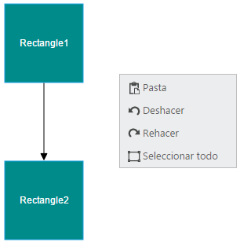

# Localization

* Localization is the process of providing controls in different cultures to help you set your own culture easily. Diagram provides localization support for Context Menu items.
* The Diagram model’s [locale](/api/js/ejdiagram#members:locale "locale") property is used to define the culture code. 

The following code illustrates how to provide localization support for Context Menu items.



// Defines the context menu items with spanish language

ej.datavisualization.Diagram.Locale["es-ES"] = {
	cut: "Corte",
	copy: "Copia",
	paste: "Pasta",
	undo: "Deshacer",
	redo: "Rehacer",
	selectAll: "Seleccionar todo",
	grouping: "Agrupación",
	group: "Grupo",
	ungroup: "Desagrupar",
	order: "Fin",
	bringToFront: "Traer a delante",
	moveForward: "Movimiento adelante",
	sendToBack: "Enviar a espalda",
	sendBackward: "Enviar hacia atrás"
};

$(function() {
	var nodes = [{
		name: "rectangle1",
		offsetY: 100,
		labels: [{
			"text": "Rectangle1"
		}]
	}, {
		name: "rectangle2",
		offsetY: 300,
		labels: [{
			"text": "Rectangle2"
		}]
	}],
	
	var connectors = [{
		name: "connector1",
		sourceNode: "rectangle1",
		targetNode: "rectangle2"
	}]

	//Initializes the Diagram.
	$("#diagram").ejDiagram({
		width: "700px",
		height: "600px",
		//Sets the culture code
		locale: "es-ES",
		nodes: nodes,
		connectors: connectors,
		defaultSettings: {
			//Sets the default properties of the nodes.
			node: {
				width: 100,
				height: 100,
				offsetX: 100,
				borderColor: "#1BA0E2",
				fillColor: "darkcyan",
				labels: [{
					"fontColor": "white"
				}]
			}
		}
	});
});



N> You have to define the textual descriptions of the context menu items for your custom cultures.