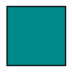
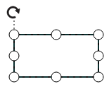
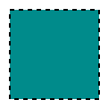
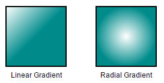
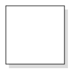
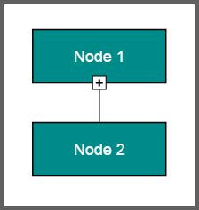
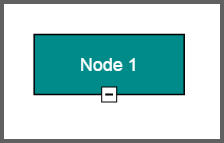

# Node

Nodes are graphical objects used to visually represent the geometrical information, process flow, internal business procedure, entity, or any other kind of data.

## Create Node

A node can be created and added to the Diagram, either programmatically or interactively. Nodes are stacked on the Diagram area from bottom to top in the order they are added.

### Add node through nodes collection

To create a node, You have to define the node object and add that to [nodes](/api/js/ejdiagram#members:nodes "nodes") collection of the Diagram model. The following code example illustrates how to add a node to the Diagram.


// Defines JSON to create a node
var node = {
	//Name of the node
	name: "node1",

	//Sets the size
	width: 100,
	height: 100,

	//Sets the position
	offsetX: 250,
	offsetY: 250,

	//Customizes the appearance
	fillColor: "darkcyan",
	borderWidth: 2
};

//Adds node to nodes collection
var nodes = [];
nodes.push(node);

//Initializes Diagram
$("#diagram").ejDiagram({
	width: "100%", height: "100%",
	//Initializes nodes collection
	nodes: nodes
});


### Add/Remove node at runtime

* Nodes can be added at runtime by using public method, [add](/api/js/ejdiagram#methods:add "add") and can be removed at runtime by using public method, [remove](/api/js/ejdiagram#methods:remove "remove").

* To add a node to group at runtime, define group name in node's [parent](/api/js/ejdiagram#members:nodes-parent "parent") property.

* The node's [name](/api/js/ejdiagram#members:nodes-name "name") property is used to define the name of the node and its further used to find the node at runtime and do any customization. 

* A public method [findNode](/api/js/ejdiagram#methods:findnode "findNode") is used to find the node/connector at runtime.

The following code illustrates how to add a node.


// Defines JSON to create a node
var node = {
	name: "node1",
	width: 100,
	height: 100,

	//Sets position
	offsetX: 250,
	offsetY: 250,
	fillColor: "darkcyan",
	borderWidth: 2
};

var diagram = $("#diagram").ejDiagram("instance");

// Adds node to the Diagram
diagram.add(node);



When a node is either added or removed in diagram, the [nodeCollectionChange](/api/js/ejdiagram#events:nodecollectionchange "nodeCollectionChange") event raised.

### Add node from palette

Nodes can be predefined and added to palette and can be dropped into the Diagram when needed. For more information about adding nodes from symbol palette, refer to [Symbol Palette](/js/Diagram/Symbol-Palette "Symbol Palette").

* Once we drag a node/connector from the palette to diagram, you can use the below events to do your customization.
* When a symbol is dragged into diagram from symbol palette, the [dragEnter](/api/js/ejdiagram#events:dragenter "dragEnter") event gets triggered. 
* When a symbol is dragged over diagram,the [dragOver](/api/js/ejdiagram#events:dragover "dragOver") event gets triggered.
* When a symbol is dragged and dropped from symbol palette to diagram area, the [drop](/api/js/ejdiagram#events:drop "drop") event gets triggered.
* When a symbol is dragged outside of the diagram, the [dragLeave](/api/js/ejdiagram#events:dragleave "dragLeave") event gets triggered.

### Create node through data source

Nodes can be generated automatically with the information provided through data source. The default properties for these nodes are fetched from default settings. For more information about data source, refer to [Data Binding](/js/Diagram/Data-Binding "Data Binding").

### Draw nodes

Nodes can be interactively drawn by clicking and dragging the Diagram surface by using **DrawingTool**. For more information about drawing nodes, refer to [Draw Nodes](/js/Diagram/Tools#drawing-tools:shapes "Draw Nodes").

## Update Node at runtime

The client side method [updateNode](/api/js/ejdiagram#methods:updatenode "updateNode") is used to update the nodes at run time. The following code example illustrates how to update a node at runtime.



var diagram = $("#DiagramContent").ejDiagram("instance");
diagram.updateNode("nodeName", {
	fillColor: "#1BA0E2",
	borderWidth: 5,
	borderColor: "#000000"
})


When the node/connector properties are changed at runtime, the [propertyChange](/api/js/ejdiagram#events:propertychange "propertyChange") event gets triggered.

## Position

* Position of a node is controlled by using its [offsetX](/api/js/ejdiagram#members:nodes-offsetx "offsetX") and [offsetY](/api/js/ejdiagram#members:nodes-offsety "offsetY") properties. By default, these offset properties represent the distance between origin of the Diagram's page and node's center point. 

* You may expect this offset values to represent the distance between page origin and node's top left corner instead of center. [pivot](/api/js/ejdiagram#members:nodes-pivot "pivot") property helps solve this problem. Default value of node's pivot point is (0.5, 0.5), that means center of Node. 

* The size of the node can be controlled by using its [width](/api/js/ejdiagram#members:nodes-width "width") and [height](/api/js/ejdiagram#members:nodes-height "height") properties.

* Rotation of a node is controlled by using its [rotateAngle](/api/js/ejdiagram#members:nodes-rotateangle "rotateAngle") property.

* You can update the above properties at runtime using updateNode method.

The following table illustrates how pivot relates offset values with node boundaries.

| Pivot | Offset |
|---|---|
| (0.5,0.5) | offsetX and offsetY values are considered as the node's center point. |
| (0,0) | offsetX and offsetY values are considered as the top left corner of node |
| (1,1) | offsetX and offsetY values are considered as the bottom right corner of the node. |

The following code illustrates how to change the `pivot` value.



// Defines JSON to create node
var nodes = [{
	name: "node", offsetX: 100, offsetY: 100,
	height: 100, width: 100,
	shape: "rectangle",
	//Sets pivot point 
	pivot: ej.datavisualization.Diagram.Point(0, 0)
}];



## Types

Diagram allows to add different kind of nodes. To explore the types of nodes, refer to [Types of Nodes](/js/Diagram/Shapes "Types of Nodes").

## Appearance

* You can customize the appearance of a node by changing its [fillColor](/api/js/ejdiagram#members:nodes-fillcolor "fillColor"), [borderColor](/api/js/ejdiagram#members:nodes-bordercolor "borderColor"), [borderWidth](/api/js/ejdiagram#members:nodes-borderwidth "borderWidth"), [borderDashArray](/api/js/ejdiagram#members:nodes-borderdasharray "borderDashArray"), [opacity](/api/js/ejdiagram#members:nodes-opacity "opacity"), [patterns](/api/js/ejdiagram#members:nodes-gradient "patterns") and [shadow](/api/js/ejdiagram#members:nodes-shadow "shadow"). 

* The [cssClass](/api/js/ejdiagram#members:nodes-cssclass "cssClass") property of the node used to customize the style of label using user defined CSS class.

* The [visible](/api/js/ejdiagram#members:nodes-visible "visible") property of the node enables or disables the visibility of node.

The following code illustrates how to customize the appearance of the shape.


var nodes = [{
	name: "node1",
	width: 100, height: 100,
	offsetX: 250, offsetY: 250,
	//Sets styles to a node to customize the appearance
	fillColor: "darkcyan",
	borderWidth: 2,
	borderColor: "black",
	borderDashArray: "5 5",
}];

//Initializes Diagram
$("#diagram").ejDiagram({
	width: "100%", 
	height: "100%",
	//Initializes nodes collection
	nodes: nodes
});



 
### Gradient

* The [gradient](/api/js/ejdiagram#members:nodes-gradient "gradient") property of node allows you to define and applies the gradient effect to that node.

* The gradient [stop](/api/js/ejdiagram#members:nodes-gradient-stop "stop") property defines the [color](/api/js/ejdiagram#members:nodes-gradient-stop-color "color") and a [position](/api/js/ejdiagram#members:nodes-gradient-stop-offset "position") where the previous color transition ends and a new color transition starts.

* The gradient.stop's [opacity](/api/js/ejdiagram#members:nodes-gradient-stop-opacity "opacity") property defines the transparency level of the region.

There are two types of gradients.

* [Linear gradient](/api/js/ejdiagram#members:nodes-gradient-lineargradient "Linear gradient") - Defines a smooth transition between a set of colors (so-called [stops](/api/js/ejdiagram#members:nodes-gradient-lineargradient-stops "stops")) on a line. 

* A Linear gradient's [x1](/api/js/ejdiagram#members:nodes-gradient-lineargradient-x1 "x1"), [y1](/api/js/ejdiagram#members:nodes-gradient-lineargradient-y1 "y1"), [x2](/api/js/ejdiagram#members:nodes-gradient-lineargradient-x2 "x2"), [y2](/api/js/ejdiagram#members:nodes-gradient-lineargradient-y2 "y2") properties are used to define the position(relative to node) of the rectangular region that needs to be painted.

* [Radial gradient](/api/js/ejdiagram#members:nodes-gradient-radialgradient "Radial gradient") - Defines a smooth transition between [stops](/api/js/ejdiagram#members:nodes-gradient-radialgradient-stops "stops") on a circle.

* A Radial gradient's [cx](/api/js/ejdiagram#members:nodes-gradient-radialgradient-cx "cx"), [cy](/api/js/ejdiagram#members:nodes-gradient-radialgradient-cy "cy"), [fx](/api/js/ejdiagram#members:nodes-gradient-radialgradient-fx "fx") , [fy](/api/js/ejdiagram#members:nodes-gradient-radialgradient-fy "fy") properties are used to define the position(relative to node) of the outer most or inner most circle of the radial gradient.

* A Linear gradient's [type](/api/js/ejdiagram#members:nodes-gradient-lineargradient-type "type") and radial gradient's [type](/api/js/ejdiagram#members:nodes-gradient-radialgradient-type "type") property is used to define the type of the gradient.



//Creates linear gradient

var linearGradient = {
	type: "linear",
	//Start point of linear gradient
	x1: 0, y1: 0,
	//End point of linear gradient
	x2: 50, y2: 50,
	//Sets an array of stop objects
	stops: [
		{ color: "white", offset: 0 },
		{ color: "darkCyan", offset: 100 }
	]
};

//Creates radial gradient

var radialGradient = {
	type: "radial",
	//Center point of outer circle
	cx: 50, cy: 50,
	//Center point of inner circle
	fx: 25, fy: 25,
	//Radius of a radial gradient
	r: 50,
	//Sets an array of stop objects
	stops: [
		{ color: "white", offset: 0 },
		{ color: "darkCyan", offset: 100 }
	]
};

var nodes = [{
	name: "node1",
	width: 100, height: 100,
	offsetX: 250, offsetY: 250,
	//Sets styles to a node to customize the appearance
	fillColor: "darkcyan",
	borderWidth: 2,
	gradient: linearGradient
}];


## Shadow

**Diagram** provides support to add **shadow** effect to a node that is disabled by default. It can be enabled with the [constraints](/api/js/ejdiagram#members:nodes-constraints "constraints") property of node. The following code illustrates how to drop shadow.


var nodeConstraints = ej.datavisualization.Diagram.NodeConstraints;

//Enables Shadow effect for a node.
var constraints = nodeConstraints.Default | nodeConstraints.Shadow;

// Defines JSON to create path node
var nodes = [{
	name: "node", offsetX: 100, offsetY: 100,
	height: 100, width:100,
	//Sets shape of node
	shape: "rectangle",
	//Enables Shadow for the node.
	constraints: constraints
}];


The following code illustrates how to disable shadow effect at runtime.



var diagram = $("#diagram").ejDiagram("instance");
var node = diagram.findNode("node");
var nodeConstraints = ej.datavisualization.Diagram.NodeConstraints;

//Disables Shadow effect for a node.
constraints = node.constraints & ~nodeConstraints.Shadow;
diagram.updateNode("node", { constraints: constraints });



### Customizing Shadow

The [angle](/api/js/ejdiagram#members:nodes-shadow-angle "angle"), [distance](/api/js/ejdiagram#members:nodes-shadow-distance "distance"), and [opacity](/api/js/ejdiagram#members:nodes-shadow-opacity "opacity") of the shadow can be customized with the [shadow](/api/js/ejdiagram#members:nodes-shadow "shadow") property of node. The following code example illustrates how to customize shadow.


var nodes = [{
	name: "node", offsetX: 100, offsetY: 100,
	height: 100, width: 100,
	//Sets shape of node 
	shape: "rectangle",
	//Enables Shadow for the node.
	constraints: constraints,
	//Customizes shadow effect
	shadow: { opacity: 0.8, distance: 9, angle: 50}
}];


## Icon

Diagram provides support to describe the state of the node. i.e., node is expanded or collapsed state.

N> Icon can be created only when the node has outedges.

* To explore the properties of expand and collapse icon, refer to [expandIcon](/api/js/ejdiagram#members:nodes-expandicon "expandIcon") and [collapseIcon](/api/js/ejdiagram#members:nodes-collapseicon "collapseIcon").

* The expandIcon's [shape](/api/js/ejdiagram#members:nodes-expandicon-shape "shape") property and collapseIcon's [shape](/api/js/ejdiagram#members:nodes-collapseicon-shape "shape") property allows to define the shape of the icon. 

The following code example illustrates how to create icon of various shapes.



// Defines JSON to create a node
var nodes = [{
	name: "node1", offsetX: 100, offsetY: 100,
	height: 100, width:100,
	//Sets shape of node
	shape: "rectangle",
	//Sets properties for expandIcon
	expandIcon:{ shape:"arrowdown", width:10, height:10 },
	//Sets properties for collapseIcon
	collapseIcon:{ shape:"arrowup", width:10, height:10 }
},
	name: "node2", offsetX: 100, offsetY: 100,
	height: 100, width:100,
	//Sets shape of node
	shape: "rectangle",
];

// Defines JSON to create a node
var connectors = [{
	name: "connect", sourceNode: "node1", targetNode: "node2"
}];

//Initializes Diagram
$("#diagram").ejDiagram({
	width: "100%", height: "100%",
	//Initializes nodes collection
	nodes: nodes
	connectors: connectors
});



### Customizing Expand Icon

* You can set an borderColor, borderWidth, background color for an expandIcon using [borderColor](/api/js/ejdiagram#members:nodes-expandicon-bordercolor "borderColor"),[borderWidth](/api/js/ejdiagram#members:nodes-expandicon-borderwidth "borderWidth") and [fillColor](/api/js/ejdiagram#members:nodes-expandicon-fillcolor "fillColor") properties.

* To set an size for expandIcon, use [width](/api/js/ejdiagram#members:nodes-expandicon-width "width") and [height](/api/js/ejdiagram#members:nodes-expandicon-height "height") properties.

* The expand icon can be aligned relative to the node boundaries. It has [margin](/api/js/ejdiagram#members:nodes-expandicon-margin "margin"), [offset](/api/js/ejdiagram#members:nodes-expandicon-offset "offset"), [horizontalAlignment](/api/js/ejdiagram#members:nodes-expandicon-horizontalalignment "horizontalAlignment") and [verticalAlignment](/api/js/ejdiagram#members:nodes-expandicon-verticalalignment "verticalAlignment") settings. It is quite tricky when all four alignments are used together but gives you more control over alignment.

### Customizing Collapse Icon

* You can set an borderColor, borderWidth, background color for an collapseIcon using [borderColor](/api/js/ejdiagram#members:nodes-collapseicon-bordercolor "borderColor"),[borderWidth](/api/js/ejdiagram#members:nodes-collapseicon-borderwidth "borderWidth") and [fillColor](/api/js/ejdiagram#members:nodes-collapseicon-fillcolor "fillColor") properties.

* To set an size for collapseIcon, use [width](/api/js/ejdiagram#members:nodes-collapseicon-width "width") and [height](/api/js/ejdiagram#members:nodes-collapseicon-height "height") properties.

* Like expand icon, collapse icon also can be aligned relative to the node boundaries. It has [margin](/api/js/ejdiagram#members:nodes-collapseicon-margin "margin"), [offset](/api/js/ejdiagram#members:nodes-collapseicon-offset "offset"), [horizontalAlignment](/api/js/ejdiagram#members:nodes-collapseicon-horizontalalignment "horizontalAlignment") and [verticalAlignment](/api/js/ejdiagram#members:nodes-collapseicon-verticalalignment "verticalAlignment") settings. It is quite tricky when all four alignments are used together but gives you more control over alignment.

## Interaction

Diagram provides support to drag, resize, or rotate the node interactively. For more information about editing a node at runtime, refer to [Edit Nodes](/js/Diagram/Interaction "Interaction").

## Constraints

The [constraints](/api/js/ejdiagram#members:nodes-constraints "constraints") property of node allows you to enable/disable certain features. For more information about node constraints, refer to [Node Constraints](/js/Diagram/Constraints#nodeconstraints "Node Constraints").

## Custom Properties

The [addInfo](/api/js/ejdiagram#members:nodes-addinfo "addInfo") property of node allows to maintain additional information to node.

## Stack Order

The nodes [zOrder](/api/js/ejdiagram#members:nodes-zorder "zOrder") property specifies the stack order of an node. An node with greater stack order is always in front of an node with a lower stack order.