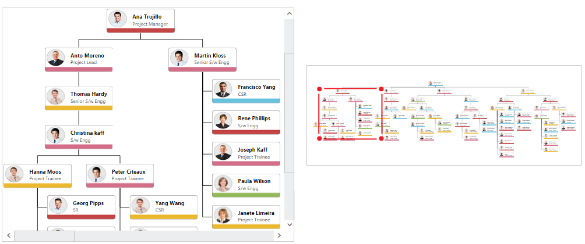

# Overview Control

**Overview** control allows you to see a preview or an overall view of the entire content of a Diagram. This helps you to look at the overall picture of a large Diagram and also to navigate, pan, or zoom, on a particular position of the page.

When you work on a very large Diagram, you may not know the part you are actually working on, or navigation from one part to another might be difficult. One solution for navigation is to zoom out the entire Diagram and find where you are. Then, you can zoom in a particular area you want to. This solution is not suitable when you need some frequent navigation.

Overview control solves these problems by showing you a preview, that is, an overall view of the entire Diagram. A rectangle indicates viewport of the Diagram. Navigation becomes easy by dragging this rectangle.

## Create overview

* The [width](/api/js/ejoverview#members:width "width") and [height](/api/js/ejoverview#members:height "height") property of the overview allows you to define the size of the overview.

* The [sourceID](/api/js/ejoverview#members:sourceID "sourceID") property of overview should be set with the corresponding Diagram ID for you need the overall view. 

The following code illustrates how to create overview.  



<!--Initializes the Diagram element-->

;

<!-- Initializes the overview element -->

;





// Initializes the Diagram control
$("#diagram").ejDiagram({
	width: "1020px",
	height: "600px"
});

// Initializes the overview control
$("#overview").ejOverview({
	// Relates Diagram with overview
	sourceID: "diagram",
	width: "100%",
	height: "100%"
});



## Zoom and Pan

In overview, the view port of the Diagram is highlighted with a red colored rectangle. Diagram can be zoomed/panned by interacting with that. You can interact with overview as follows. 

* Resize the rectangle - Zooms in/out the Diagram
* Drag the rectangle - Pans the Diagram
* Click at a position - Navigates to the clicked region
* Choose a particular region by clicking and dragging - Navigates to the specified region

The following image shows how the Diagram is zoomed/panned with overview.
