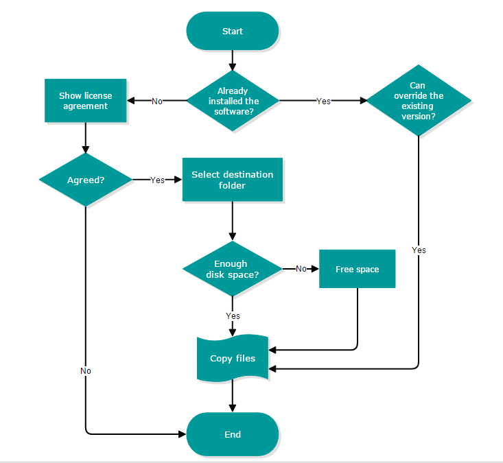

# Overview

**Essential Diagram JavaScript** creates rich Visio-like applications. Its Framework comprises of many Elements that helps you to create an application easily. The rich feature set of the Diagram control includes Snapping, Guidelines, Gridlines, Serialization and Zooming.

The list of rich features of Diagram control in JavaScript is as follows.

* **Node, Connector, Group, Port, Label:** Element used to compose diagram.
* **Symbol Palette:** It holds a list of symbols that is dropped over diagram.
* **Clipboard Commands:** Performs Cut, Copy and Paste operations.
* **Undo/Redo:** Performs correction in recent change.
* **Serialization:** Save current state of Diagram, and load them back when needed.
* **Snapping:** Snap the diagram elements towards the nearest elements.
* **Gridlines:** Visual horizontal/vertical lines that helps to align elements on diagram.
* **Interaction:** Zoom, pan, multiple selections, keyboard shortcuts, snapping.
* **Layout:** Arranges nodes in a tree-like structure based on relationship between the Nodes.
