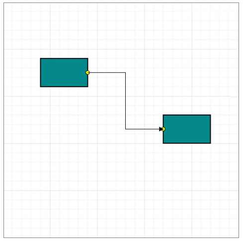
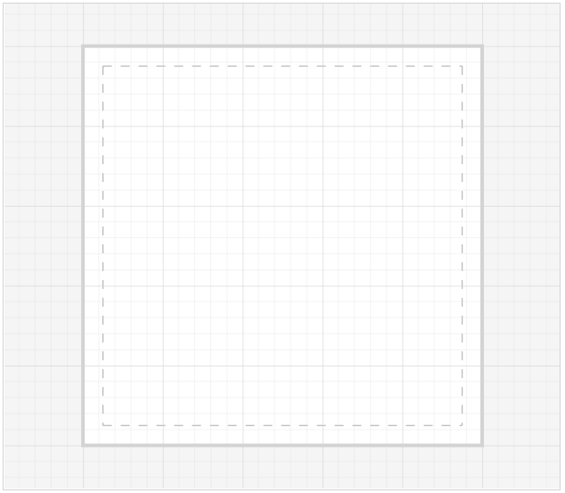
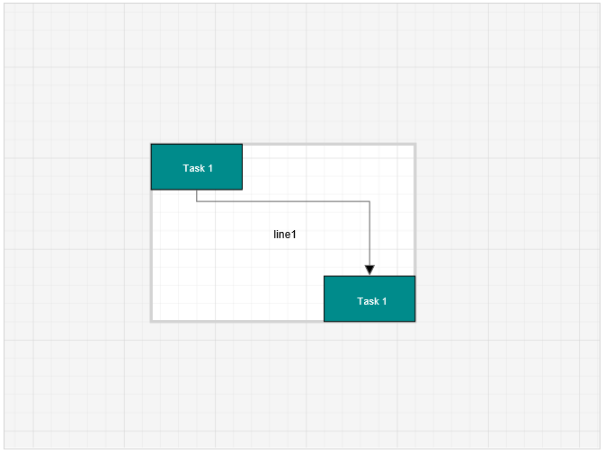

# Page Settings 

Page settings enable to customize the appearance, width, and height of the Diagram page.

## Page size and appearance

* The size and appearance of the Diagram pages can be customized with the [pageSettings](/api/js/ejdiagram#members:pagesettings "pageSettings") property. 

* The [pageWidth](/api/js/ejdiagram#members:pagesettings-pagewidth "pageWidth") and [pageHeight](/api/js/ejdiagram#members:pagesettings-pageheight "pageHeight") properties of page settings define the size of the page and based on the size, the [pageOrientation](/api/js/ejdiagram#members:pagesettings-pageorientation "pageOrientation") will be set for the page. In addition to that, you can customize the appearance of the page with [backgroundImage](/api/js/ejdiagram#members:backgroundimage "backgroundImage") and set of appearance specific properties.

* The [pageBackgroundColor](/api/js/ejdiagram#members:pagesettings-pagebackgroundcolor "pageBackgroundColor"), [pageBorderColor](/api/js/ejdiagram#members:pagesettings-pagebordercolor "pageBorderColor") and [pageBorderWidth](/api/js/ejdiagram#members:pagesettings-pageborderwidth "pageBorderWidth") properties are used to customize the background color and border color of the page.

* The [pageMargin](/api/js/ejdiagram#members:pagesettings-pagemargin "pageMargin") property is used to define the page margin.

To explore those properties, refer [Page Settings](/api/js/ejdiagram#members:pagesettings "Page Settings").

You can also customize the appearance of off-page regions with the property [backgroundColor](/api/js/ejdiagram#members:backgroundcolor "backgroundColor").

N> When the pageWidth and pageHeight are not specified, the rectangular region that completely fits all nodes and connectors are considered as page size.

### BackgroundImage

You can stretch and align the background image anywhere over the diagram area. 
The [source](/api/js/ejdiagram#backgroundimagesource-string "source") property of [backgroundImage](/api/js/ejdiagram#members:backgroundimage "backgroundImage") allows you to set the path of the image. The [scale](/api/js/ejdiagram#backgroundimagescale-enum "scale") and the `align`[align](/api/js/ejdiagram#members:backgroundimage-alignment "align") properties help to stretch/align the background images.
 
To explore the backgroundImage properties, refer [Background Image](/api/js/ejdiagram#members:backgroundimage "Background Image").

The following code illustrates how to stretch and align the background image.



$("#diagram").ejDiagram({
	//Sets off-page background
	backgroundColor: "whitesmoke",
    backgroundImage: {alignment:ej.datavisualization.Diagram.ImageAlignment.XMidYMin, scale:ej.datavisualization.Diagram.scaleConstraints.Meet, source:"airplane.png"},
	pageSettings: {
		//Sets page size
		pageHeight: 500,
		pageWidth: 500,
		//Customizes the appearance of page
		pageBorderWidth: 4,
		pageBackgroundColor: "white",
		pageBorderColor: "lightgray",
		pageMargin: 25,
		showPageBreak: true,
		multiplePage: true,
		pageOrientation: ej.datavisualization.Diagram.PageOrientations.Portrait
	}
});


## MultiplePage and PageBreaks

When MultiplePage is enabled, size of the page dynamically increases or decreases in multiples of page width and height and completely fits diagram within the page boundaries. Page Breaks is used as a visual guide to see how pages are split into multiple pages.

[multiplePage](/api/js/ejdiagram#members:pagesettings-multiplepage "multiplePage") and [showPageBreak](/api/js/ejdiagram#members:pagesettings-showpagebreak "showPageBreak") properties of page settings allow you to enable/disable multiple pages and page breaks respectively.
The following code illustrates how to enable multiple page and page break lines.



$("#diagram").ejDiagram({
	pageSettings: {
		//Enables the multiple page
		multiplePage: true,
		//Enables the page break lines
		showPageBreak: true,
	}
});



## Boundary Constraints

 Diagram provides support to restrict/customize the interactive region, out of which the elements cannot be dragged, resized or rotated. 
 [boundaryConstraints](/api/js/ejdiagram#members:pagesettings-boundaryconstraints "boundaryConstraints") property of page settings allows you to customize the interactive region. To explore the boundary constraints, refer refer [Boundary Constraints](/api/js/ejdiagram#members:boundaryConstraints "Boundary Constraints").

The following code example illustrates how to define boundaryConstraints.



    //set page setting properties
    $("#Diagram").ejDiagram({
        //sets the boundaryConstraints  
        pageSettings: {
		    //Allows to drag within the diagram content
            boundaryConstraints: ej.datavisualization.Diagram.BoundaryConstraints.Diagram; 
        }
    });
    
