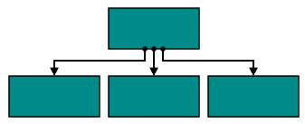
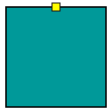
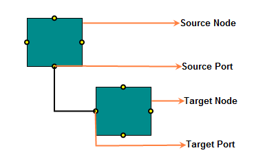

# Port

Essential Diagram for JS provides support to define custom ports for making connections.

When a connector is connected between two nodes, its end points are automatically docked to node's nearest boundary as shown in the following image. 

Ports act as the connection points of node and allows to create connections with only those specific points as shown in the following image.

## Create Port

### Add ports when initializing nodes

To add a connection port, you need to define the port object and add it to node's [ports](/api/js/ejdiagram#members:nodes-ports "ports") collection. The [offset](/api/js/ejdiagram#members:nodes-ports-offset "offset") property of port accepts an object of fractions and used to determine the position of ports. The following code illustrates how to add ports when initializing the node.



var nodes = [{
	width: 100,
	height: 100,
	// Defines a collection of ports
	ports: [
		//Defines JSON to create port
		{
		//Sets the port name
		name: "port1",
		// Specifies the port offset – fraction value relative
		to node bounds
		offset: {
			x: 0,
			y: 0.5
		},
	}]
}];

$("#diagram").ejDiagram({
	// Sets the nodes to Diagram model
	nodes: nodes,
});

 

### Add ports at runtime

You can add ports at runtime by using the client side method [addPorts](/api/js/ejdiagram#methods:addports "addPorts"). The following code illustrates how to add ports to node at runtime.

* The port's [name](/api/js/ejdiagram#members:nodes-ports-name "name") property is used to define the name of the port and its further used to find the port at runtime and do any customization.



// Defines a collection of ports that have to be added at runtime
var ports = [
	{
		name: "port1",
		// Specifies the port offset – fraction value relative
		to node bounds – determines the position of port on node
		offset: {	
			x: 0,	
			y: 0.5
		}
	},
	{ name: "port2",offset: {x: 1,y: 0.5 }},
	{ name: "port3",offset: {x: 0.5,y: 0 }},
	{ name: "port4",offset: {x: 0.5,y: 1 }}
];

// Gets the instance for the Diagram
var diagram = $("#diagram").ejDiagram("instance");
// Adds the ports to the node of name "node"
diagram.addPorts("node", ports)



To explore the set of properties for defining a port, refer to [Port Properties](/api/js/ejdiagram#members:nodes-ports "Port Properties")

### Remove ports at runtime

You can remove ports at runtime by using client side method removePorts. Please refer to below link which shows how to remove ports at runtime.

[removePorts](/api/js/ejdiagram#methods:removeports "removePorts")

### Update Port at runtime

The client side API [updatePort](/api/js/ejdiagram#methods:updateport "updatePort") is used to update the ports at run time. The following code example illustrates how to change the port properties.



var diagram = $("#diagram").ejDiagram("instance");
var selectedObject = diagram.model.selectedItems.children[0];
var visibility = ej.datavisualization.Diagram.PortVisibility.Visible;
diagram.updatePort(selectedObject.name, selectedObject.ports[0], { fillColor: "red", visibility: visibility });



## Connect with ports

Connector’s [sourcePort](/api/js/ejdiagram#members:connectors-sourceport "sourcePort") and [targetPort](/api/js/ejdiagram#members:connectors-targetport "targetPort") properties allow to create connections between some specific points of source/target nodes. 
For more information about creating connections with port, refer to [Connections with ports](/js/Diagram/Connector#connections-with-ports "Connections with ports")

## Appearance 

* You can change the shape of port by using its [shape](/api/js/ejdiagram#members:nodes-ports-shape "shape") property. To explore the different types of port shapes, refer to [Port Shapes](/api/js/ejdiagram#members:nodes-ports-shape "Port Shapes"). If you need to render a custom shape, then you can set shape as `path` and define path using [pathData](/api/js/ejdiagram#members:nodes-ports-pathdata "pathData") property of port.

* The appearance of ports can be customized by using [borderColor](/api/js/ejdiagram#members:nodes-ports-bordercolor "borderColor"), [borderWidth](/api/js/ejdiagram#members:nodes-ports-borderwidth "borderWidth"), [fillColor](/api/js/ejdiagram#members:nodes-ports-fillcolor "fillColor") properties of the port. 

* To customize the port size, use [size](/api/js/ejdiagram#members:nodes-ports-size "size") property of port.

* The ports [visibility](/api/js/ejdiagram#members:nodes-ports-visibility "visibility") property allows you to define when the port should be visible.

* The [cssClass](/api/js/ejdiagram#members:nodes-ports-cssclass "cssClass") property used to customize the style of port using user defined CSS class.

The following code illustrates how to change the appearance of port.



var ports = [{
	// Specifies the port position
	offset: {
		x: 1,
		y: 0.5
	},
	//Defines the shape of port
	shape: ej.datavisualization.Diagram.PortShapes.Circle,
	//Specifies the port visibility
	visibility: true,
	//Customizes the appearance
	fillColor: "yellow",
	size: 12,
	borderColor: "black",
	borderWidth: 2
}];

var nodes = [{ name: "node", ports: ports }];



## Offset

The [offset](/api/js/ejdiagram#members:nodes-ports-offset "offset") property of port is used to align the port based on fractions. 0 represents top/left corner, 1 represents bottom/right corner, and 0.5 represents half of width/height.

## Constraints

The [constraints](/api/js/ejdiagram#members:nodes-ports-constraints "constraints") property allows to enable/disable certain behaviors of ports. For more information about port constraints, refer to [Port Constraints](/js/Diagram/Constraints#portconstraints)