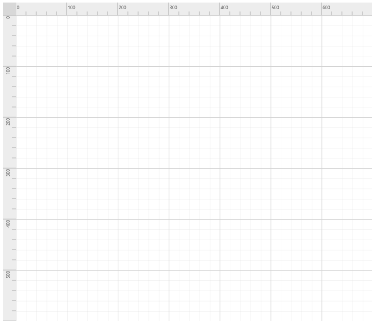

# Rulers

The Ruler provides a Horizontal and Vertical guide for measuring in the Diagram control. The Ruler can be used to measure the Diagram objects, indicate positions, and align Diagram elements. This is especially useful in creating scale models. 

## Adding Rulers to the Diagram

* The diagram.model's [rulerSettings](/api/js/ejdiagram#members:rulersettings "rulerSettings") property is used control the visibility and appearance of the ruler in the diagram.

* The rulerSettings [showRulers](/api/js/ejdiagram#members:rulersettings-showrulers "showRulers") property is used to show/hide the rulers in the diagram.

* The rulerSettings [horizontalRuler](/api/js/ejdiagram#members:rulersettings-horizontalruler "horizontalRuler") and  [verticalRuler](/api/js/ejdiagram#members:rulersettings-verticalruler "verticalRuler") properties are used to customize the rulers appearance in the diagram.



$("#diagram").ejDiagram({
    rulerSettings: {
        showRulers: true
    }
});



## Customizing the Ruler

By default, ruler segments are arranged based on pixel values.

* The horizontalRuler's [interval](/api/js/ejdiagram#members:rulersettings-horizontalruler-interval "interval") property allows you to define the interval between ruler segments and [segmentWidth](/api/js/ejdiagram#members:rulersettings-horizontalruler-segmentwidth "segmentWidth") property allows you to define the segment width of the ruler. Similarly you can use verticalRuler's [interval](/api/js/ejdiagram#members:rulersettings-verticalruler-interval "interval") and [segmentWidth](/api/js/ejdiagram#members:rulersettings-verticalruler-segmentwidth "segmentWidth") properties to define the interval and segment width of the vertical ruler

* The horizontalRuler's [arrangeTick](/api/js/ejdiagram#members:rulersettings-horizontalruler-arrangetick "arrangeTick") and verticalRuler's [arrangeTick](/api/js/ejdiagram#members:rulersettings-verticalruler-arrangetick "arrangeTick")  function is provided for the purpose of customizing the appearance of ruler ticks.It will be called for each tick rendering.

* The horizontalRuler's [tickAlignment](/api/js/ejdiagram#members:rulersettings-horizontalruler-tickalignment "tickAlignment") property is used to align the ruler tick either left or right side the ruler. The verticalRuler's [tickAlignment](/api/js/ejdiagram#members:rulersettings-verticalruler-tickalignment "tickAlignment") property is used to align the ruler tick either top or bottom side the ruler.

* The horizontalRuler's [markerColor](/api/js/ejdiagram#members:rulersettings-horizontalruler-markercolor "markerColor") and verticalRuler's [markerColor](/api/js/ejdiagram#members:rulersettings-verticalruler-markercolor "markerColor") property is used to define the ruler marker color and marker will be shown when performing the interaction in the diagram.

* The horizontalRuler's [length](/api/js/ejdiagram#members:rulersettings-horizontalruler-length "length") and [thickness](/api/js/ejdiagram#members:rulersettings-horizontalruler-thickness "thickness") properties are used to define the width and height of the ruler respectively.

* The verticalRuler's [length](/api/js/ejdiagram#members:rulersettings-verticalruler-length "length") and [thickness](/api/js/ejdiagram#members:rulersettings-verticalruler-thickness "thickness") properties are used to define the height and width of the ruler respectively.



$("#diagram").ejDiagram({
    // Customizing the Ruler
    rulerSettings: {
        showRulers: true,
        //Customizing the horizontal ruler.
        horizontalRuler: {
            //Creating a custom segment with 6 intervals.
            interval: 6,
            // Customizing the ruler segment width.
            segmentWidth: 100,
            // Customizing the Ruler ticks.
            arrangeTick: "arrangeTick",
            // Customizing the Ruler ticks alignment.
            tickAlignment: ej.datavisualization.Diagram.TickAlignment.LeftOrTop,
            // Customizing the Ruler marker color
            markerColor: "blue",
            // Customizing the thickness of the ruler bar.
            thickness: 25
        },
        verticalRuler: {
            interval: 6,
            segmentWidth: 100,
            arrangeTick: "arrangeTick",
            tickAlignment: ej.datavisualization.Diagram.TickAlignment.LeftOrTop,
            markerColor: "blue",
            thickness: 25
        }
    }
});

function arrangeTick(args) {
	// Customizing the Ruler ticks.
    if (args.tickInterval % 100 == 0) {
    }
    else if (args.tickInterval % 50 == 0) {
        args.tickLength = 12.5
    }
}



