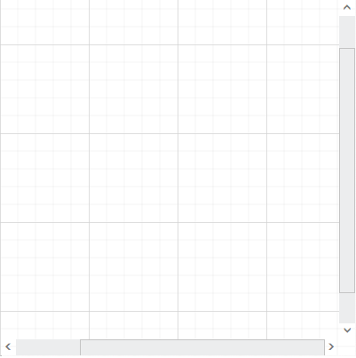

# Scroll Settings
The Diagram can be scrolled by using the vertical and horizontal scrollbars. In addition to the scrollbars, you can use mouse wheel to scroll the Diagram. 
Diagram's [scrollSettings](/api/js/ejdiagram#members:scrollsettings "scrollSettings") enables you to read the current scroll status, view port size, current zoom, and zoom factor. It also allows you to scroll the Diagram programmatically. 

## Get current scroll status

Scroll settings allows you to read the scroll status, [viewPortWidth](/api/js/ejdiagram#members:scrollsettings-viewportwidth "viewPortWidth"), [viewPortHeight](/api/js/ejdiagram#members:scrollsettings-viewportheight "viewPortHeight"), and [currentZoom](/api/js/ejdiagram#members:scrollsettings-currentzoom "currentZoom") with a set of properties. To explore those properties, see [Scroll Settings](/api/js/ejdiagram#members:scrollsettings "Scroll Settings")

## Define scroll status
Diagram allows you to pan the Diagram before loading, so that any desired region of a large Diagram is made to view. You can programmatically pan the Diagram with the [horizontalOffset](/api/js/ejdiagram#members:scrollsettings-horizontaloffset "horizontalOffset") and [verticalOffset](/api/js/ejdiagram#members:scrollsettings-verticaloffset "verticalOffset") properties of scroll settings. The following code illustrates how to set pan the Diagram programmatically.



$("#diagram").ejDiagram({
	height: "400px",
	width: "400px",
	//Sets horizontal and vertical scroll offsets
	scrollSettings: {
		horizontalOffset: 100,
		verticalOffset: 50,
		zoomFactor: 0.2
	},

	//Sets page settings
	pageSettings: {
		pageWidth: 500,
		pageHeight: 500
	}
});



In the example given below, the vertical scroll bar is scrolled down by 50px and horizontal scroll bar is scrolled to right by 100px. 

## Update scroll status

You can programmatically change the scroll offsets at runtime by using the client side method [update](/api/js/ejdiagram#methods:update "update"). The following code illustrates how to change the scroll offsets and zoom factor at runtime.



var diagram = $("#diagram").ejDiagram("instance");
var scrollSettings = {
	//Sets scroll status
	horizontalOffset: 200,
	verticalOffset: 200,
	//Sets zoomFactor
	zoomFactor: 0.5
}

//Updates scroll settings
diagram.update({ scrollSettings: scrollSettings });



## AutoScroll 

Autoscroll feature automatically scrolls the Diagram whenever the node or connector is moved beyond the boundary of the Diagram. So that, it is always visible during dragging, resizing, and multiple selection operations. Autoscroll is automatically triggered when any one of the following is done towards the edges of the Diagram.

* Node dragging, resizing 
* Connection editing
* Rubber band selection
* Label dragging

The diagram client side event [autoScrollChange](/api/js/ejdiagram#events:autoscrollchange "autoScrollChange") gets triggered when the auto scroll(scrollbars) is changed and you can do your own customization in this event.

You can enable/disable the auto scroll behavior in your diagram by using [enableAutoScroll](/api/js/ejdiagram#members:enableautoscroll "enableautoscroll") property of the diagram.

## Autoscroll border

The Autoscroll border is used to specify the maximum distance between the object and Diagram edge to trigger Autoscroll. The default value is set as 15 for all sides (left, right, top, and bottom) and it can be changed by using the [autoScrollBorder](/api/js/ejdiagram#members:pagesettings-autoscrollborder "autoScrollBorder") property of page settings. The following code example illustrates how to set Autoscroll border. 



$("#Diagram").ejDiagram({
	pageSettings: {
		// Specifies autoscroll border
		autoScrollBorder: { left: 150, top: 15, right: 15, bottom: 15 }
	}
});



## Scroll limit

The scroll limit allows you to define the scrollable region of the Diagram. It includes the following options.

* Allows to scroll in all directions without any restriction.
* Allows to scroll within the Diagram content.
* Allows to scroll within the specified scrollable area.

* [scrollLimit](/api/js/ejdiagram#members:pagesettings-scrolllimit "scrollLimit") property of scroll settings helps to limit the scrolling.

* The scrollSettings [padding](/api/js/ejdiagram#members:scrollsettings-padding "padding") allows to extend the scrollable region that is based on the scroll limit.

The following code example illustrates how to specify the scroll limit.



$("#diagram").ejDiagram({
	pageSettings: {
	//Sets the scroll limit
	scrollLimit: "infinity"
	}
});



## Scrollable Area

You can restrict scrolling beyond any particular rectangular area by using the [scrollableArea](/api/js/ejdiagram#members:pagesettings-scrollablearea "scrollableArea") property of scroll settings. To restrict scrolling beyond any custom region, you have to set the [scrollLimit](/api/js/ejdiagram#members:pagesettings-scrolllimit "scrollLimit") as "limited". The following code example illustrates how to customize scrollable area.



$("#diagram").ejDiagram({
	pageSettings: {
		//Sets scroll limit as limited
		scrollLimit: "limited",
		//Sets the limited scrollable area
		scrollableArea: {
			x: 0,
			y: 0,
			width: 500,
			height: 500
		}
	}
});



## ScrollToNode

You can bring the node/connector into view by using client side method scrollToNode. Please refer to below link which shows how to use scrollToNode method in diagram.

[scrollToNode](/api/js/ejdiagram#methods:scrolltonode "scrollToNode")

## UpdateViewport

The [updateViewPort](/api/js/ejdiagram#methods:updateviewport "updateViewPort") method is used to update the diagram page and view size at runtime. 
