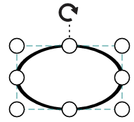

# Shapes

Diagram provides support to add different kind of nodes. They are as follows.

* Text Node
* Image Node
* HTML Node
* Native Node
* Basic Shapes
* Flow Shapes

## Text

Texts can be added to the Diagram as text nodes. For text nodes, the [type](/api/js/ejdiagram#members:nodes-type "type") should be set as "text". In addition, you need to define the [textBlock](/api/js/ejdiagram#members:nodes-textblock "textBlock") object that is used to define the `text` to be added and to customize the appearance of that text. The following code illustrates how to create a text node.



var diagram = ej.datavisualization.Diagram;
//Creates a html node
var nodes = [{
	name: "textNode",
	offsetX: 100,
	offsetY: 100,
	width: 100,
	height: 50,
	//Sets type of the node
	type: diagram.Shapes.Text,
	//Customizes the appearances such as text, font, fill, and stroke.
	textBlock: {
		text: "Text Node",
		fontColor: "black",
		textAlign: diagram.TextAlign.Center
	}
}];



## Image
Diagram allows to add images as image nodes. For image nodes, the [type](/api/js/ejdiagram#members:nodes-type "type") should be set as "image". In addition, the [source](/api/js/ejdiagram#members:nodes-source "source") property of node enables you to set the image source. 

The following code illustrates how an **Image** node is created.



var diagram = ej.datavisualization.Diagram;
//Creates an Image node
var nodes = [{
	name: "imageNode", offsetX: 100, offsetY: 100,
	width: 50, height: 50,
	
	//Sets type of the node as Image
	type: diagram.Shapes.Image,
	
	//Sets url of the image
	source: "sample/syncfusion.png"
}];



N> Deploy your HTML file in the web Application and export the diagram (image node) or else the image node will not be exported in the chrome and Firefox due to security issues. Please refer to the link below.

Link: http://asked.online/draw-images-on-canvas-locally-using-chrome/2546077/

Link1: http://stackoverflow.com/questions/4761711/local-image-in-canvas-in-chrome

### Image Alignment

You can stretch and align the image content anywhere but within the node boundary.

The `contentAlignment` property of node allows to align an image within the node boundary. The [scale](/api/js/ejdiagram#nodesscale-enum "scale") property of node allows to stretch the image as you desired (either to maintain proportion or to stretch). By default, the `scale` property of node is set as "meet".
The following code illustrates how to scale or stretch the content of the image node.



// Defines JSON to create node with image
var nodes = [{
	name: "imageNode", 
	width: 100, 
	height: 60, 
	offsetX: 40, 
	offsetY: 40,
	type: ej.datavisualization.Diagram.Shapes.Image,
	source: "sample/employee.png"
	borderWidth:3,
	borderColor:"white",
}];
//Initializes Diagram
$("#diagram").ejDiagram({
	width: "100%", 
	height: "100%",
	//Initializes nodes collection
	nodes: nodes,
});



The following tables illustrates all the possible scale options for the image node

| Values| Image |
|---|---|
| None |  |
| Meet |  |
| Slice |  |
| Stretch |  |

## HTML

**Html** elements can be embedded in the Diagram through **Html** type node. To create a HTML node, you need to set the [type](/api/js/ejdiagram#members:nodes-type "type") of node as "html". In addition, you need to set the id of HTML template to the [templateId](/api/js/ejdiagram#members:nodes-templateid "templateId") property of node. The following code illustrates how an **Html** node is created.



<!--dependency scripts-->

<!—define html element-->





// Defines JSON to create node with HTML element
var nodes = [{
	name: "htmlNode", offsetX: 100, offsetY: 100,
	width: 120, height: 60,
	
	//Sets type as Html
	type: ej.datavisualization.Diagram.Shapes.Html,
	
	//Sets id of html template
	templateId: "htmlTemplate",
	value: "Button"
}];



N> HTML node cannot be exported to image format, like JPEG, PNG, and BMP. It is by design that while exporting, Diagram is drawn in a canvas. Further, this canvas is exported into image formats. Currently, drawing in a canvas equivalent from all possible HTML is not feasible. Hence, this limitation. 

## Native

**Diagram** provides support to embed **SVG** element into a node. To create a native node, the [type](/api/js/ejdiagram#members:nodes-type "type") node should be set as "native". Also, you need to define the id of the SVG template by using the [templateId](/api/js/ejdiagram#members:nodes-templateid "templateId") property of node. The following code illustrates how a **Native node** is created.



<!--dependency scripts-->

<!--define html element-->





// Defines JSON to create node with HTML element
var nodes = [{
	name: "NativeNode", offsetX: 100, offsetY: 100,

	//Sets type as Native
	type: ej.datavisualization.Diagram.Shapes.Native,

	//Sets id of SVG element
	templateId: "svgTemplate",
	labels: [{text: "Mail"}]
}];



N> Like HTML node, Native node also cannot be exported to image format. Fill color of native node can be overridden by the inline style or fill of the SVG element specified in the template. 

### SVG content alignment

You can stretch and align the svg content anywhere but within the node boundary.

The `contentAlignment` property of node allows to align the svg content within the node boundaries. The [scale](/api/js/ejdiagram#nodesscale-enum "scale") property of node allows to stretch the svg content as you desired(either to maintain proportion or to stretch).By default, the `scale` property of node is set as "meet".
The following code illustrates how to scale or stretch the content of the node.



<!--dependency scripts-->

<!--define html element-->





// Defines JSON to create node with SVG element
var nodes = [{
	name: "NativeNode", 
	width: 100, 
	height: 60, 
	offsetX: 40, 
	offsetY: 40,
	fillColor:"darkcyan",
	borderWidth:3,
	borderColor:"black",

	//Sets type as Native
	type: ej.datavisualization.Diagram.Shapes.Native,

	//Sets id of SVG element
	templateId: "svgTemplate",
}];
//Initializes Diagram
$("#diagram").ejDiagram({
	width: "100%", 
	height: "100%",
	//Initializes nodes collection
	nodes: nodes,
});



The following tables illustrates all the possible scale options for the node

| Values| Image |
|---|---|
| None |  |
| Meet |  |
| Slice |  |
| Stretch |  |

## Basic Shapes

* The Basic shapes are common shapes that are used to represent the geometrical information visually. To create basic shapes, the [type](/api/js/ejdiagram#members:nodes-type "type") of the node should be set as "basic". Its [shape](/api/js/ejdiagram#members:nodes-shape "shape") property can be set with any one of the built-in shape. [Basic Shapes](/api/js/ejdiagram#members:nodes-shape "Basic Shapes"). 
* To render a rounded rectangle, you need to set type as `basic` and shape as `rectangle` and set the [cornerRadius](/api/js/ejdiagram#members:nodes-cornerradius "cornerRadius") property to specify the radius of rounded rectangle.
* To render a polygon shape, you can specify the collection of points to a [points](/api/js/ejdiagram#members:nodes-points "points") property.

The following code example illustrates how to create a basic shape. 



$("#diagram").ejDiagram({
	width: "100%",
	height: "100%",
	pageSettings: {
		scrollLimit: "diagram"
	},
	nodes: [{
		name: "node",
		width: 100,
		height: 70,
		offsetX: 100,
		offsetY: 100,
		borderWidth: 2,
		borderColor: "black",

		//Specifies the radius of rounded corner
		cornerRadius:10,

		//Sets the type of shape
		type: ej.datavisualization.Diagram.Shapes.Basic,

		//Sets the type of basic shape
		shape: ej.datavisualization.Diagram.BasicShapes.Rectangle
	}],
});



N> By default, the `type` property of node is set as "basic".

N> When the `shape` is not set for a basic shape, it is considered a "rectangle".

## Path

Path node is a commonly used basic shape that allows visually to represent the geometrical information. To create a path node, You need to specify the [type](/api/js/ejdiagram#members:nodes-type "type") as "basic" and the [shape](/api/js/ejdiagram#members:nodes-shape "shape") as "path". The [pathData](/api/js/ejdiagram#members:nodes-pathdata "pathData") property of node allows you to define the path to be drawn. The following code illustrates how a Path node is created.



// Defines JSON to create path node

var nodes = [{
	name: "pathNode", offsetX: 100, offsetY: 100,
	width: 120, height: 60,
	//By default, the type is considered as "basic"

	//Sets shape as Path
	shape: Diagram.BasicShapes.Path,

	//Defines svg path data
	pathData: "M35.2441,25 L22.7161,49.9937 L22.7161,0.00657536 L35.2441,25 z M22.7167,25 L-0.00131226,25 M35.2441,49.6337 L35.2441,0.368951 M35.2441,25 L49.9981,25"
}];



The list of basic shapes are as follows.

## Flow Shapes

The flow shapes are used to represent the process flow. It is used for analyzing, designing, and managing for documentation process. To create a flow shape, you need to specify the [type](/api/js/ejdiagram#members:nodes-type "type") as "flow". Its [shape](/api/js/ejdiagram#members:nodes-shape "shape") property can be set with any one of the built-in shape. [Flow Shapes](/api/js/ejdiagram#members:nodes-shape "Flow Shapes") and by default, it is considered as "process". The following code example illustrates how to create a flow shape. 



$("#diagram").ejDiagram({
	width: "100%",
	height: "100%",
	pageSettings: {
		scrollLimit: "diagram"
	},
	nodes: [{
		name: "node",
		width: 100,
		height: 100,
		offsetX: 100,
		offsetY: 100,
		borderWidth: 2,
		borderColor: "black",
		//Sets the type of shape
		type: ej.datavisualization.Diagram.Shapes.Flow,
		//Sets the type of flow shape
		shape: ej.datavisualization.Diagram.FlowShapes.Document
	}],
});



The list of flow shapes are as follows.

