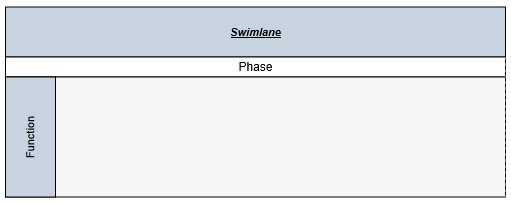

# Swim lane

Swim-lane Diagrams are typically used to visualize the relationship between a business process and the department responsible for it by focusing on the logical relationships between activities. Swimlanes may be arranged either horizontally or vertically.

## Initialize Diagram

Add a placeholder `div` element that can be used to initialize the diagram widget as shown below.



<body>
	

	
</body>



## Create a swimlane

To create a swimlane, you need to define an object with [isSwimlane](/api/js/ejdiagram#members:nodes-isswimlane "isSwimlane") property that helps identify the object as a swimlane. By default, the swimlanes are arranged vertically. You can change that with the [orientation](/api/js/ejdiagram#members:nodes-orientation "orientation") property of swimlane.

The following code example illustrates how to define a swimlane object.



var swimlane = {
	name: "swimlaneNode",
	//Changes the orientation
	orientation: "horizontal",
	//Sets the position and size
	offsetX: 400,
	offsetY: 200,
	height: 100,
	width: 700,
	//Sets the type of object as swimlane
	isSwimlane: true
};



## Add swimlane into diagram

Adding a swimlane to the Diagram is same as adding a node. You can add either through the [nodes](/api/js/ejdiagram#members:nodes "nodes") collection or through the client side method `add`. You can also drag and drop a swimlane from symbol palette.
For more information about adding a node/swimlane to the Diagram, refer to [Add Nodes](/js/Diagram/Node#create-node "Add Nodes").

The following code example illustrates how to add a swimlane to the Diagram through `nodes` collection.



$("#diagram").ejDiagram({
	nodes: [swimlane]
});



## Headers

Swimlane allows to define a header to textually describe it. The [header](/api/js/ejdiagram#members:nodes-header "header") property of swimlane allows you to define its textual description(`text`) and to customize its appearance. The following code example illustrates how to define swimlane header.



//Defines the header and format its text
var header = {
	text: "Swimlane",
	height: 50,
	fillColor: "#C7D4DF",
	fontColor: "black", fontSize: 11, fontFamily: "Arial",
	bold: true, italic: true, textDecoration: "underline"
};

//Initializes swimlane with header
var swimlane = {
	type: "swimlane",
	name: "swimlaneNode",
	orientation: "horizontal",
	offsetX: 400,
	offsetY: 200,
	height: 100,
	width: 700,
	isSwimlane: true,
	//Defines header
	header:header
};

$("#diagram").ejDiagram({
	nodes: [swimlane],
});

//Updates the swimlane header at runtime
var diagram = $("#diagram").ejDiagram("instance");
diagram.updateNode("swimlaneName", { header: {fontColor:"white"} })



### Update Header

Swimlane headers can be updated at runtime with the client side method [updateNode](/api/js/ejdiagram#methods:updatenode "updateNode"). The following code example illustrates how to update a lane's header at runtime.



var diagram = $("#diagram").ejDiagram("instance");

//Defines the header and format its text
var header = {
	text: "swimlane",
	bold: true,
	italic: true
};

diagram.updateNode("swimlane", { header: header });



### Disable headers

You can hide the swimlane headers. The following code example illustrates how to hide headers.



var header = {
	text: "Swimlane",
	//Sets "0" to hide header
	height: 0
};



## Lane

Lane is a functional unit or a responsible department of a business process that helps to map a process within the functional unit or in between other functional units.
You can add any number of [lanes](/api/js/ejdiagram#members:nodes-lanes "lanes") to a swimlane and the lanes are automatically stacked inside a swimlane based in the order they are added.

### Create an empty lane

* To create an empty lane, you need to define an object with [isLane](/api/js/ejdiagram#members:nodes-lanes-islane "isLane") property that helps identify the object as a lane. 

* The lane's [name](/api/js/ejdiagram#members:nodes-lanes-name "name") property is used to define the name of the lane and its further used to find the lane at runtime and do any customization.

The following example illustrates how to define a swimlane with a lane.



//Defines an empty lane
var lane = {
	name: "lane1",
	fillColor: "#f5f5f5",
	height: 120,

	//Sets the object as Lane
	isLane:"true"
};

//Initializes swimlane with a header and a lane
var swimlane = {
	type: "swimlane",
	name: "swimlaneNode",
	orientation: "horizontal",
	offsetX: 400,
	offsetY: 200,
	height: 100,
	width: 700,
	isSwimlane: true,
	//Defines header - header defined in the headers section
	header:header,
	//Defines lanes collection
	lanes: [lane]
};



### Create a lane with header

* The [header](/api/js/ejdiagram#members:nodes-lanes-header "header") property of the lane allows you to textually describe the lane(`text`) and to customize the appearance of the description. The following code example illustrates how to define a lane header.

* The size of the lane can be controlled by using its [width](/api/js/ejdiagram#members:nodes-lanes-width "width") and [height](/api/js/ejdiagram#members:nodes-lanes-height "height") properties. Also you can limit the size of a lane with its [minWidth](/api/js/ejdiagram#members:nodes-minwidth "minWidth"), [minHeight](/api/js/ejdiagram#members:nodes-minheight "minHeight"), [maxWidth](/api/js/ejdiagram#members:nodes-maxwidth "maxWidth"), and [maxHeight](/api/js/ejdiagram#members:nodes-maxheight "maxHeight") properties.



//Defines the lane header
var laneHeader = {
	text: "swimlane label",
	fillColor: "#C7D4DF",
	fontColor: "black", fontSize: 15, fontFamily: "Arial",
	bold: false, italic: false, textDecoration: "none"
};

//Initializes the lane
var lane = {
	name: "lane1",
	fillColor: "#f5f5f5",
	height: 120,
	isLane: true,
	//Specifies the lane header
	header: laneHeader,
	//Specifies the minimum and maximum size of the lane
	minWidth: 500,
	maxWidth: 700,
	minHeight: 120,
	maxHeight: 200,
};

//Adds lanes to swimlane
var swimlane = {
	type: "swimlane",
	name: "swimlaneNode",
	orientation: "horizontal",
	offsetX: 400,
	offsetY: 200,
	height: 100,
	width: 700,
	isSwimlane: true,
	//Defines header - header defined in the headers section
	header:header,
	//Adds lanes to swimlane
	lanes: [lane]
};



#### Disable/Update header

You can disable/update the lane header at runtime with the client side method, [updateNode](/api/js/ejdiagram#methods:updatenode "updateNode"). The following code example illustrates how to disable the lane header at run time.



var diagram = $("#diagram").ejDiagram("instance");

//Sets "0" to hide header
diagram.updateNode("laneName", { header: {height: 0} })



### Add nodes to a lane

To add nodes to a lane, You need to add them to the [children](/api/js/ejdiagram#members:nodes-lanes-children "children") collection of lane. The following code example illustrates how to add nodes to a lane.



//Defines children of lane
var children = [
{
	name: "node",
	width: 70,
	height: 30,
	labels: [{
		text: "Node",
	}],
	// Specifies the margin values of the child
	marginLeft: 70,
	marginTop: 1
}];

//Initializes the lane
var lane = {
	name: "lane1",
	fillColor: "#f5f5f5",
	height: 120,
	isLane: true,
	//Defines header - as above snippet
	header: laneHeader,
	//Adds nodes to lane
	children:children,
	//Specifies the minimum and maximum size of the lane
	minWidth: 500,
	maxWidth: 700,
	minHeight: 120,
	maxHeight: 200,
};

//Adds lanes to swimlane
var swimlane = {
	type: "swimlane",
	name: "swimlaneNode",
	orientation: "horizontal",
	offsetX: 400,
	offsetY: 200,
	height: 100,
	width: 700,
	isSwimlane: true,
	//Defines header - header defined in the headers section
	header:header,
	//Adds lanes to swimlane
	lanes: [lane]
};



## Add lane at runtime

We can add a lane at runtime width client side API method addLane. please refer to the below link which shows how to use addLane method in diagram.

[addLane](/api/js/ejdiagram#methods:addlane "addLane"). 

## Customizing Lanes appearance

* To set a background color for an lane, use [fillColor](/api/js/ejdiagram#members:nodes-lanes-fillcolor "fillColor") property.

* The lanes [cssClass](/api/js/ejdiagram#members:nodes-lanes-cssclass "cssClass") property is used to customize the style of lanes using user defined CSS class.

## Custom Properties

The [addInfo](/api/js/ejdiagram#members:nodes-lanes-addinfo "addInfo") property of lane allows to maintain additional information to lane.

## Stack Order

The lanes [zOrder](/api/js/ejdiagram#members:nodes-lanes-zorder "zOrder") property specifies the stack order of an lane. An lane with greater stack order is always in front of an lane with a lower stack order.

## Phase

[Phases](/api/js/ejdiagram#members:nodes-phases "phases") are the sub-processes that are used to break the swimlane into multiple smaller regions.

### Add phase

* To define a phase, you have to set the length of the region to the [offset](/api/js/ejdiagram#members:nodes-phases-offset "offset") property of phase. Every region can be textually described with the [label](/api/js/ejdiagram#members:nodes-phases-label "label") property of phase.

* The phase's [name](/api/js/ejdiagram#members:nodes-phases-name "name") property is used to define the name of the phase and its further used to find the phase from swimlane at runtime and do any customization.

* The swimlane [phaseSize](/api/js/ejdiagram#members:nodes-phasesize "phaseSize") property is used to set the height/width of the phase header based on [orientation](/api/js/ejdiagram#members:nodes-orientation "orientation") property of swimlane.

The following code example illustrates how to add a phase on initializing swimlane.



//Creates a phase
var phase1 = {
	name: "Phase1",
	//Length of the first region
	offset: 300,
	//Initializes labels for phases
	label: { text: "Phase1" },
	//Specifies the appearance of separator
	lineWidth: 1,
	lineDashArray: "3,3",
	lineColor: "#606060"
};

var phase2 = {
	name: "Phase2",
	label: { text: "Phase2" }
};

var swimlane = {
	type: "swimlane",
	name: "swimlaneNode",
	orientation: "horizontal",
	offsetX: 400, offsetY: 200,
	height: 100,width: 500,
	//Initializes the phase collection
	phases: [phase1, phase2],
	//Adds lanes and header as mentioned in header and lane section
	lanes: [lane],
	header: header
};



### Add phase at runtime

You can add a region at runtime with the client side method, [addPhase](/api/js/ejdiagram#methods:addphase "addPhase"). The following code example illustrates how to add a phase at runtime.



var phase = {
	name: "Phase3",
	label: { text: "Phase3" }
};

var diagram = $("#diagram").ejDiagram("instance");
diagram.addPhase("swimlaneName", phase);



A phase can be updated at runtime with the client side API [updateNode](/api/js/ejdiagram#methods:updatenode "updateNode"). The following code example illustrates how to a update phase at runtime.



var diagram = $("#diagram").ejDiagram("instance");
var options = {
	//Specifies the style of the phase to be updated
	lineDashArray: "3,3",
	lineColor: "#C7D4DF",
	lineWidth: 2
}
diagram.updateNode("phaseName", options);



N> A default phase is added, when the phase collection of the swimlane is empty. When the phase collection is initialized, a default phase is appended at the end of swimlane.

## Customizing phase appearance

* The phase [lineColor](/api/js/ejdiagram#members:nodes-phases-linecolor "lineColor"), [lineDashArray](/api/js/ejdiagram#members:nodes-phases-linedasharray "lineDashArray"), [lineWidth](/api/js/ejdiagram#members:nodes-phases-linewidth "lineWidth") properties are used to customize the line style of the phase.

## Limitations

* You cannot add connectors as the children of lanes.