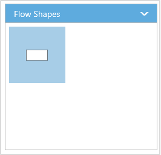
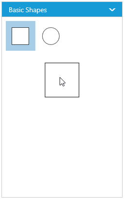

# Symbol Palette

The **SymbolPalette** displays a collection of palettes. The Palette shows a set of nodes and connectors. It allows you to drag and drop the nodes and connectors into the Diagram.

## Create symbol palette

* The [width](/api/js/ejsymbolpalette#members:width "width") and [height](/api/js/ejsymbolpalette#members:height "height") property of the symbolpalette allows you to define the size of the symbolpalette.

* The [diagramId](/api/js/ejsymbolpalette#members:diagramid "diagramId") property of symbolpalette should be set with the corresponding Diagram ID to drag and drop the nodes and connectors into the Diagram. The following code illustrates how to create symbolpalette.

* The [cssClass](/api/js/ejsymbolpalette#members:cssClass "diagramId") property of symbolpalette allows to define the user defined CSS class to customize the style of the symbolpalette.



<!--Initializes the Diagram element-->

;

<!-- Initializes the SymbolPalette element -->

;





// Initializes the Diagram control
$("#diagram").ejDiagram({
	width: "1020px",
	height: "600px"
});

// Initializes the SymbolPalette control
$("#symbolpalette").ejSymbolPalette({
	// Relates Diagram with SymbolPalette
	diagramId: "diagram",
	width: "100%",
	height: "100%"
});



## Add palettes to SymbolPalette

A palette allows to display a group of related symbols and it textually annotates the group with its header.
To initialize a palette, define a JSON object with the property [name](/api/js/ejsymbolpalette#members:palettes-name "name") that is displayed as the header text of palette. The [expanded](/api/js/ejsymbolpalette#members:palettes-expanded "expanded") property of palette allows to expand/collapse its palette items.
The following code example illustrates how to define a palette and how its added to symbol palette.



    //Defines the JSON to create a palette
    var palette = 
    {
        //Sets the name of the palette
        name: "Basic Shapes", 
        //Sets whether the palette expands/collapse its children
        expanded: true,
    };



You can add any number of palettes to the [palettes](/api/js/ejsymbolpalette#members:palettes "palettes") collection of the symbol palette. The following example illustrates how to define symbol palette with a palette object that is defined in the previous step.



    //Initializes the symbol palette
    $("#symbolpalette").ejSymbolPalette({ 
    //Defines the palette collection 
    palettes: [
        palette
    ],
    //Specifies the symbol palette size
    height: "100%", 
    width: "100%"
    });



The following image shows the symbol palette with multiple palette Items.

### Customize the Palette Header

Palettes can be annotated with its header texts and you can change the height of palette header by using [HeaderHeight](/api/js/ejsymbolpalette#members:headerheight "HeaderHeight") property of symbol palette.

Also, you can embed any HTML element into a palette header by defining the ScriptTemplate id to palette's templateId property. Following code example illustrates how to customize palette headers.



    <!--dependency scripts-->
        											





    //Defines the JSON to create a palette with custom header
    var palette =
    {
        name: "Basic Shapes",
        //Sets the id of the script template 
        templateId: "svgTemplate",
    };
    
    $("#symbolpalette").ejSymbolPalette({
        palettes: [
            palette
        ],
        //Specifies height of the symbol palette header
        headerHeight:30,
    });



The following image shows the customized palette header

## Add symbols to palette

The symbol need to be defined and added to the [items](/api/js/ejsymbolpalette#members:palettes-items "items") collection of the palette. You can create a symbol as a node, group, connector, lane, or phase except swimlane. 

* When adding the lane into palette, The lane's [orientation](/api/js/ejdiagram#members:nodes-lanes-orientation "orientation") property allows you to define render the lane in either horizontal/vertical direction.

* Similarly, the phase's [orientation](/api/js/ejdiagram#members:nodes-phases-orientation "orientation") property is mainly used to add phase in symbol palette. The orientation can be set as horizontal/vertical to render horizontal/vertical phases respectively. The [type](/api/js/ejdiagram#members:nodes-phases-type "type") property of phase that helps identify the object as a phase.

* Also node.paletteItem's [label](/api/js/ejdiagram#members:nodes-paletteitem-label "label") property is used to set the  display name to symbol added in the symbol palette.

To create a symbol, you first need to define that element as JSON. The following code example illustrates how to define a symbol.



    //Creates a node
    var node = {
        name: "Ellipse",
        //Specifies node size
        width: 40, height: 40,
        //Specifies node offset and shape 
        offsetX: 20, offsetY: 20, shape: "ellipse",
    };


 
The following code example illustrates how to define a palette with symbols that are defined in the previous section. 



    //Defines the JSON to create a palette
    var palette = 
    {
        name: "Basic Shapes", 
        expanded: true,
        //Adds the palette items to palette
        items: [node]
    };
    
    $("#symbolpalette").ejSymbolPalette({ 
        palettes: [
            palette
        ],
    });



### Add/Remove symbols to palette at runtime

* Symbols can be added to palette at runtime by using public method, [addPaletteItem](/api/js/ejsymbolpalette#methods:addpaletteitem "addPaletteItem").

* Symbols can be removed from palette at runtime by using public method, [removePaletteItem](/api/js/ejsymbolpalette#methods:removePaletteItem "removePaletteItem").

### Customize the size of symbols

You can customize the size of the individual symbol. The [paletteItem](/api/js/ejdiagram#members:nodes-paletteitem "paletteItem") property of node enables you to define the size of the symbols. The following code example illustrates how to change the size of a symbol.



    $("#symbolpalette").ejSymbolPalette({
        //Defines the palette collection 
        palettes: [{
            name: "Basic Shapes",
            expanded: true,
            items: [{
                name: "Rectangle",
                height: 40,
                width: 80,
                //Specifies the size of symbol 
                paletteItem: { 
                    //Defines the size of the symbol
                    width: 50,
                    height: 50, 
                    margin: {
                        left: 20,
                        right: 20,
                        top: 20,
                        bottom: 20
                    }
                }
            }]
        }],

        //Specifies the default size to render symbols
        paletteItemWidth: 50,
        paletteItemHeight: 50, 
    });



Symbol size will be set based on the following precedence.

**Precedence**

| Palette Item | Rendering Size |  
|---|---|---|
| Width | paletteItem.width > model.paletteItemWidth > node.width |  
| Height | paletteItem.height > model.paletteItem.Height > node.height | 

* Symbol size will be rendered in the palette based on node.paletteItem's [width](/api/js/ejdiagram#members:nodes-paletteitem-width "width") and [height](/api/js/ejdiagram#members:nodes-paletteitem-height "height") property. 
* If paletteItem's width and height property is not specified, symbol size will be rendered in the palette based on model's [paletteItemWidth](/api/js/ejsymbolpalette#members:paletteitemheight "paletteItemWidth") and [paletteItemHeight](/api/js/ejsymbolpalette#members:paletteitemwidth "paletteItemHeight") property. 
* If you don't specify above two, then symbol size will be rendered in the palette based on node's [width](/api/js/ejdiagram#members:nodes-width "width") and [height](/api/js/ejdiagram#members:nodes-height "height") property. 

* The node.paletteItem's [margin](/api/js/ejdiagram#members:nodes-paletteitem-margin "margin") property is used to create the space around elements, outside of any defined borders. 

### Stretch the symbols into the palette

The [enableScale](/api/js/ejdiagram#members:nodes-paletteitem-enablescale "enableScale") property of the paletteItem enables you to customize the size of the symbol regardless of the precedence. The following code example illustrates how to customize the symbol size.



    $("#symbolpalette").ejSymbolPalette({
        palettes: [{
            name: "Basic Shapes",
            expanded: true,
            items: [{
                name: "Rectangle",
                height: 40,
                width: 80,
                //Specifies the size of palette Item 
                paletteItem: {
                    // Enables to fit the content into the specified palette item size
                    enableScale: true
                    // When it is set as false, the element is rendered with actual node size
                }
            }]
        }]
    });



## Symbol Previews

Image, simple snippet to customize the preview size

You can customize the preview size of the individual palette items. The [paletteItem](/api/js/ejdiagram#members:nodes-paletteitem "paletteItem") property of node enables you to define the preview size of the symbol items. The following code example illustrates how to change the preview size of a palette item.



    $("#symbolpalette").ejSymbolPalette({
        //Defines the palette collection 
        palettes: [{
            name: "Basic Shapes",
            expanded: true,
            items: [
                    {
                        name: "Rectangle", height: 50, width: 50,
                        //Specifies the individual palette item preview size   
                        paletteItem: {
                            previewWidth: 50,
                            previewHeight: 50,
                        }
                    },
                    {
                        name: "Rectangle2", height: 50, width: 50, shape: "ellipse",
                    }]
        }], 
    });



You can also customize the preview size of the all palette items. The [previewWidth](/api/js/ejsymbolpalette#members:previewwidth "previewWidth") and [previewHeight](/api/js/ejsymbolpalette#members:previewheight "previewHeight") property of SymbolPalette enables you to define the preview size to all the symbol palette items. The following code example illustrates how to change the preview size of a symbol palette items.



    $("#symbolpalette").ejSymbolPalette({
        //Defines the palette collection         
        palettes: [{
            name: "Basic Shapes",
            expanded: true,
            items: [{
                name: "Rectangle",
                height: 50,
                width: 50,
            }, {
                name: "Rectangle2",
                height: 50,
                width: 50,
                shape: "ellipse",
            }]
        }],
        //Specifies the preview size to symbol palette items.
        previewWidth: 100,
        previewHeight: 100,
    });



Symbol palette allows to sets the [offset](/api/js/ejsymbolpalette#members:previewoffset "offset") of the dragging helper relative to the mouse cursor.



              $("#symbolpalette").ejSymbolPalette({
                    //Defines the palette collection 
                    palettes: [{
                        name: "Basic Shapes",
                        expanded: true,
                        items: [{
                            name: "Rectangle",
                            height: 50,
                            width: 50, 
                        }]
                    }], 
                    previewOffset: { x: 50, y: 50 }, 
                });



Symbol preview size will be set based on the following precedence.

**Precedence**

| Palette Item |   Preview Size |
|---|---|---|
| Width |  paletteItem.previewWidth > model.previewWidth > node.width |
| Height | paletteItem.previewHeight > model.previewHeight > node.height |

* Symbol preview size will be set based on node.paletteItem's [previewWidth](/api/js/ejdiagram#members:nodes-paletteitem-previewwidth "previewWidth") and [previewHeight](/api/js/ejdiagram#members:nodes-paletteitem-previewheight "previewHeight") property. 
* If paletteItem's width and height property is not specified, symbol size will be set based on model's [previewWidth](/api/js/ejsymbolpalette#members:previewwidth "previewWidth") and [previewHeight](/api/js/ejsymbolpalette#members:previewheight "previewHeight") property. 
* If you don't specify above two, then symbol size will be rendered in the palette based on node's [width](/api/js/ejdiagram#members:nodes-width "width") and [height](/api/js/ejdiagram#members:nodes-height "height") property. 

## Show/hide the symbol Text 

You can show/hide the symbol text by using the [showPaletteItemText](/api/js/ejsymbolpalette#members:showpaletteitemtext "showPaletteItemText") property of symbol palette.



    // Initializes symbol palette
    $("#palette").ejSymbolPalette({
        //Specifies whether palette item text should be visible or not
        showPaletteItemText: true,
    });


To explore the properties of symbol palette, refer to [Symbol Palette Properties](/api/js/ejsymbolpalette#members "Symbol Palette Properties").

## Disable Drag and Drop

* The [allowDrag](/api/js/ejsymbolpalette#members "allowDrag") property of the symbolpalette allows you to enable the dragging the symbols from the symbol palette.

## Add Symbols to Diagram on Single Click

* SymbolPalette control provide the options to add the symbols to diagram when click on the the symbols from palette by using the client side event [selectionChange](/api/js/ejsymbolpalette#events "selectionChange").

* The `selectionChange` event will get triggered when a palette item gets selected and return the selected item through arguments. You can use this to add the symbols to diagram.

## Default Settings

* While adding more number of symbols such as nodes and connectors to the palette, you can define the default settings for those objects through [defaultSettings](/api/js/ejsymbolpalette#members:defaultsettings "defaultSettings") property of the symbol palette.  

* The [node](/api/js/ejsymbolpalette#members:defaultsettings-node "node") property of defaultSettings allows to define the default settings for nodes and [connectors](/api/js/ejsymbolpalette#members:defaultsettings-connector "connectors") property of defaultSettings allows to define the default settings for connectors.
