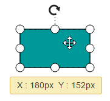
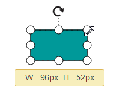
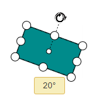
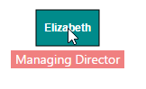
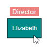
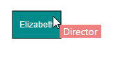

# Tooltip
In Graphical User Interface (GUI), tooltip is a message that is displayed when mouse hovers over an element. Diagram provides tooltip support while dragging, resizing, rotating a node, and when mouse hovers any Diagram element.

## Default tooltip

By default, Diagram displays a tooltip to provide the size, position, and angle related information while dragging, resizing, and rotation. The following images illustrate how the Diagram displays the node information during interaction.

| Drag | Resize | Rotate |
|---|---|---|
|  |  |  |

### Disable default tooltip

To disable the default tooltip, You need to set [selectedItems.tooltip](/api/js/ejdiagram#members:selecteditems-tooltip "selectedItems.tooltip") as `null`. The following code example illustrates how to disable default tooltip.



$("#diagram").ejDiagram({
	//Disable tooltip during interaction
	selectedItems: {
		constraints:ej.datavisualization.Diagram.SelectorConstraints.All &~  ej.datavisualization.Diagram.SelectorConstraints.Tooltip
	}
});

 

## Common tooltip for all nodes and connectors

Diagram provides support to show tooltip when mouse hovers over any node/connector. 
To show tooltip on mouse over, the [tooltip](/api/js/ejdiagram#members:tooltip "tooltip") property of Diagram model needs to be set with the tooltip [templateId](/api/js/ejdiagram#members:tooltip-templateid "templateId") and [alignment](/api/js/ejdiagram#members:tooltip-alignment "alignment") as shown in the following example.



<!--Define tooltip template-->





$("#diagram").ejDiagram({
	width: "100%",
	height: "700px",
	//Defines mouse over tooltip
	tooltip: {
		templateId: "mouseovertooltip",
		alignment: {
			horizontal: "center",
			vertical: "bottom"
		}
	},
	//Defines nodes
	nodes: [{
		name: "elizabeth",
		width: 70,
		height: 40,
		offsetX: 100,
		offsetY: 100,
		fillColor: "darkCyan",
		labels: [{
			text: "Elizabeth",
			fontColor: "white",
			bold: "true"
		}],
		Designation: "Managing Director"
	}]
});

 

### Disable tooltip at runtime

Tooltips on mouse over can be disabled by assigning [tooltip](/api/js/ejdiagram#members:tooltip "tooltip") property as `null`. The following code example illustrates how to disable the mouse over tooltip at runtime.



$("#diagram").ejDiagram({
	//Disables mouse over tooltip at runtime
	tooltip: null
});

 

## Tooltip for a specific node/connector

Tooltips can be customized for each node and connector. Tooltip can be defined for individual node/connector by using the node's [tooltip](/api/js/ejdiagram#members:nodes-tooltip "tooltip") and connector's [tooltip](/api/js/ejdiagram#members:connectors-tooltip "tooltip") property. In addition to that, you have to remove the **InheritTooltip** option from the [constraints](/api/js/ejdiagram#members:constraints "constraints") of that node/connector. The following code example illustrates how to customize tooltips for individual elements.



var NodeConstraints = ej.datavisualization.Diagram.NodeConstraints;

//Customizes tooltip for a node/connector
var node = {
	//Remove InheritTooltip not to inherit the tooltip defined in model
	constraints: NodeConstraints.Default & ~NodeConstraints.InheritTooltip,
	//Defines mouse over tooltip for a node
	tooltip: {
		templateId: "nodetooltiptemplate"
	}
};

//Disables tooltip for any node/connector
node = {
	//Removes InheritTooltip not to inherit the tooltip defined in model
	constraints: NodeConstraints.Default & ~NodeConstraints.InheritTooltip,
	//Disables tooltip for a node
	tooltip: null
};

 

## Tooltip alignments

### Tooltip relative to object

* Diagram provides support to show tooltip around the node/connector that is hovered by mouse. You can align the tooltip as you wish by using the [alignment](/api/js/ejdiagram#members:tooltip-alignment "alignment") and [margin](/api/js/ejdiagram#members:tooltip-margin "margin") properties of tooltip. The [relativeMode](/api/js/ejdiagram#members:tooltip-relativemode "relativeMode") property of tooltip defines whether the tooltip has to be displayed around the object or at the mouse position. 

* The alignment's [horizontal](/api/js/ejdiagram#members:tooltip-alignment-horizontal "horizontal") and [vertical](/api/js/ejdiagram#members:tooltip-alignment-vertical "vertical") properties are used to align the tooltip with horizontal and vertical direction.

The following code example illustrates how to position the tooltip around object.



<!--Define tooltip template-->





var NodeConstraints = ej.datavisualization.Diagram.NodeConstraints;

var node = {
	name: "elizabeth", width: 70, height: 40, offsetX: 100, offsetY: 100,
	//Removes inherit tooltip from constraints
	constraints: NodeConstraints.Default & ~NodeConstraints.InheritTooltip,
	//Defines tooltip
	tooltip: {
		//Defines template id
		templateId: "mouseovertooltip",
		//Sets to show tooltip around the element
		relativeMode:ej.datavisualization.Diagram.RelativeMode.Object,
		//Sets the alignment properties
		alignment: {
			//Defines horizontal alignment around node
			horizontal: "center",
			//Defines vertical alignment around node
			vertical: "top"
		}
	},
	Designation: "Director",
	fillColor: "darkcyan", labels: [{ text: "Elizabeth", fontColor: "white" }]
};



### Tooltip relative to mouse position

To display the tooltip at mouse position, you need to set "mouse" option to the [relativeMode](/api/js/ejdiagram#members:tooltip-relativemode "relativeMode") property of tooltip. The following code example illustrates how to show tooltip at mouse position.



var NodeConstraints = ej.datavisualization.Diagram.NodeConstraints;

//Defines tooltip template as mentioned in the previous snippet
var node = {
	name: "elizabeth", width: 70, height: 40, offsetX: 100, offsetY: 100,
	//Removes inherit tooltip from constraints
	constraints: NodeConstraints.Default & ~NodeConstraints.InheritTooltip,
	//Defines tooltip
	tooltip: {
		//Sets to show tooltip at mouse position
		relativeMode:ej.datavisualization.Diagram.RelativeMode.Mouse,
		//Defines template id
		templateId: "mouseovertooltip",
		//Sets margin - absolute distance between mouse position and tooltip
		margin: { top: 10, left: 10 },
	},
	Designation: "Director",
	fillColor: "darkcyan", 
	labels: [{ text: "Elizabeth", fontColor: "white" }]
}; 



