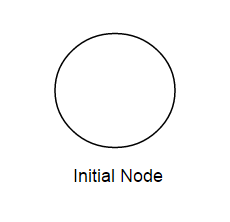
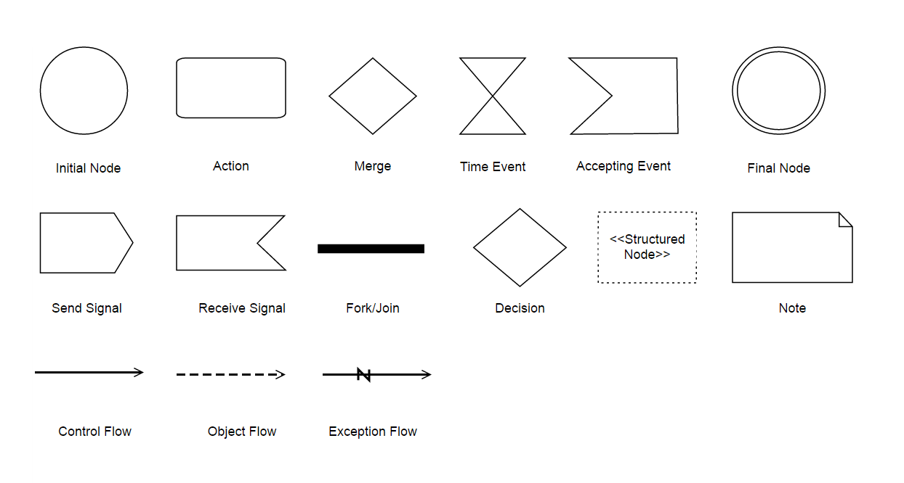

### UML Activity Shapes

UML activity Shapes used to draw a behavior diagram which shows flow of control or object flow with emphasis on the sequence and conditions of the flow.
These diagrams are useful for analyzing a use case by describing what actions need to take place and when they should occur, describing a complicates sequential algorithm and modeling applications with parallel processes. 

To create a UMLActivity shape, the “type” of the node should be set as "UMLActivity" and its “shape” should be set as any one of the built-in shape.
The following code example illustrates how to create a simple behavior diagram.
 
 
 
 $("#diagram").ejDiagram({
	width: "100%",
	height: "100%",
	pageSettings: {
		scrollLimit: "diagram"
	},
	nodes: [{
		name: "initialNode",
		offsetX: 100,
		offsetY: 100,
        width: 80, 
        height: 50,
        //Sets type of shape
         type: "umlactivity",
         //Sets the activity shape as initial node
         shape: ej.datavisualization.Diagram.UMLActivityShapes.InitialNode,
            }]
 }];

	

The list of flow shapes are as follows.

