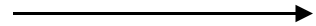
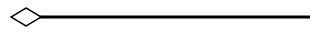
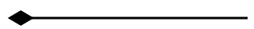
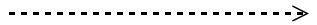
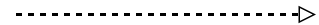
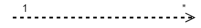

# UML Class Diagram Shapes

Class diagram is used to represent the static view of an application. The class diagrams are widely used in the modelling of object oriented systems because they are the only UML diagrams which can be mapped directly with object oriented languages. 
Diagram supports to generate the class diagram shapes from business logic. 

The UML class diagram shapes are explained as follows.

## Class

* A Class describes a set of objects that shares the same specifications of features,constraints and semantics.To define a class object, you need to define the [classifier](/api/js/ejdiagram#members:nodes-classifier "classifier") as "class".

* Also, you need to define the [name](/api/js/ejdiagram#members:nodes-class-name "name"), [attributes](/api/js/ejdiagram#members:nodes-class-attributes "attributes") and [methods](/api/js/ejdiagram#members:nodes-class-methods "methods") of the class using the [class](/api/js/ejdiagram#members:nodes-class "class") property of node.

* The attribute's [name](/api/js/ejdiagram#members:nodes-class-attributes-name "name"), [type](/api/js/ejdiagram#members:nodes-class-attributes-type "type") and [scope](/api/js/ejdiagram#members:nodes-class-attributes-scope "scope") properties are allows you to define the name, data type and visibility of the attribute.

* The method's [name](/api/js/ejdiagram#members:nodes-class-methods-name "name"), [arguments](/api/js/ejdiagram#members:nodes-class-methods-arguments "arguments"), [type](/api/js/ejdiagram#members:nodes-class-methods-type "type") and [scope](/api/js/ejdiagram#members:nodes-class-methods-scope "scope") properties are allows you to define the name, argument, return type and visibility of the methods.

* The method.arguments object properties [name](/api/js/ejdiagram#members:nodes-class-methods-arguments-name "name") and [type](/api/js/ejdiagram#members:nodes-class-methods-arguments-type "type") allows to define the name and type of the argument.
 
The following code example illustrates how to create a class.



$("#diagram").ejDiagram({
	width: "100%",
	height: "100%",
	pageSettings: {
		scrollLimit: "diagram"
	},
	nodes: [{
		name: "Patient",
		offsetX: 100,
		offsetY: 100,
		borderWidth: 2,
		borderColor: "black",
		//Sets type of shape
		type: "umlclassifier",
		//Sets the type of classifier
		classifier: ej.datavisualization.Diagram.ClassifierShapes.Class,
        //Sets the class object
        "class": {
                //Name of a class header
                 name: "Patient", 
                 //Sets the collection of attributes
              attributes: [{
                  name: "accepted", 
                  type: "Date",
                  //sets the scope value for class member
                  scope:"protected"
                          }, 
                   {
                   name: "prescription", 
                   type: "String[*]" 
                            }],
                   //Sets the collection of methods
                 methods: [{ 
                    name: "getHistory", 
                 //sets the arguments for methods
                 arguments: [{ 
                     name: "Date"
                              }], 
                      type: "History" }]
                      },
	}]
});

	

N> The default value for the property `classifier` is "class".

## Interface

* An Interface is a kind of classifier that represents a declaration of a set of coherent public features and obligations. To create an interface, you need to define the [classifier](/api/js/ejdiagram#members:nodes-classifier "classifier") property as "interface". 

* Also, you need to define the [name](/api/js/ejdiagram#members:nodes-interface-name "name"), [attributes](/api/js/ejdiagram#members:nodes-interface-attributes "attributes") and [methods](/api/js/ejdiagram#members:nodes-interface-methods "methods") of the interface using the [interface](/api/js/ejdiagram#members:nodes-interface "interface") property of the node.

* The attribute's [name](/api/js/ejdiagram#members:nodes-interface-attributes-name "name"), [type](/api/js/ejdiagram#members:nodes-interface-attributes-type "type") and [scope](/api/js/ejdiagram#members:nodes-interface-attributes-scope "scope") properties are allows you to define the name, data type and visibility of the attribute.

* The method's [name](/api/js/ejdiagram#members:nodes-interface-methods-name "name"), [arguments](/api/js/ejdiagram#members:nodes-interface-methods-arguments "arguments"), [type](/api/js/ejdiagram#members:nodes-interface-methods-type "type") and [scope](/api/js/ejdiagram#members:nodes-interface-interface-scope "scope") properties are allows you to define the name, argument, return type and visibility of the methods.

* The method.arguments object properties [name](/api/js/ejdiagram#members:nodes-interface-methods-arguments-name "name") and [type](/api/js/ejdiagram#members:nodes-interface-methods-arguments-type "type") allows to define the name and type of the argument.
 
The following code example illustrates how to create an interface.



$("#diagram").ejDiagram({
	width: "100%",
	height: "100%",
	pageSettings: {
		scrollLimit: "diagram"
	},
	nodes: [{
		name: "Bank",
		offsetX: 100,
		offsetY: 100,
		borderWidth: 2,
		borderColor: "black",
		//Sets type of shape
		type: "umlclassifier", 
		//Sets the type of classifier
		classifier: ej.datavisualization.Diagram.ClassifierShapes.Interface,
        //Sets the interface object
        interface: {
             name: "Bank Account", 
             attributes: [{
                   name: "owner", 
                   type: "String[*]" 
                           }, 
                           {
                   name: "balance", 
                   type: "Dollars" 
                           }],
               methods: [{ 
                   name: "deposit", 
                arguments: [{ 
                    name:"amount",
                    type:"Dollars"
                            }], 
                         }]
                       },
	}]
});

	

##  Enumeration

* To define an enumeration, you need to define the [classifier](/api/js/ejdiagram#members:nodes-classifier "classifier") property of node as "enumeration".  Also you need to define the [name](/api/js/ejdiagram#members:nodes-enumeration-name "name") and [members](/api/js/ejdiagram#members:nodes-enumeration-members "members") of the enumeration using the [enumeration](/api/js/ejdiagram#members:nodes-enumeration "enumeration") property of node.

* You can set a name for the enumeration members collection using [name](/api/js/ejdiagram#members:nodes-enumeration-members-name "name") property of members collection.

The following code example illustrates how to create an enumeration.
 
 
 
 $("#diagram").ejDiagram({
	width: "100%",
	height: "100%",
	pageSettings: {
		scrollLimit: "diagram"
	},
	nodes: [{
		name: "Enums",
		offsetX: 100,
		offsetY: 100,
		borderWidth: 2,
		borderColor: "black",
		//Sets type of shape
		type: "umlclassifier", 
		//Sets the type of classifier
		classifier: ej.datavisualization.Diagram.ClassifierShapes.Enumeration, 
        //Sets the enumeration object
         enumeration:{
             name: "AccountType", 
             //sets the members of enumeration
              members: [{ 
                    name: "Checking Account" 
                        }, 
                         {
                     name: "Savings Account" 
                          },
                           {                     
                      name:"Credit Account"
                               } 
                          ]}
	}]
});

	

## Connector Shapes

* The connector [shape](/api/js/ejdiagram#members:connectors-shape "shape") property defines the role/meaning of the connector.
* The different types of connector shapes are BPMN, UMLClassifier and UMLActivity and can render these Shapes by setting connector shape [type](/api/js/ejdiagram#members:connectors-shape-type "type") property.
* The type of [flow](/api/js/ejdiagram#members:connectors-shape-flow "flow") shapes in a BPMN process are [sequence](/api/js/ejdiagram#members:connectors-shape-sequence "sequence"), [association](/api/js/ejdiagram#members:connectors-shape-flow-association "association") and [message](/api/js/ejdiagram#members:connectors-shape-relationship "message").

## Relationships

A [relationship](/api/js/ejdiagram#members:connectors-shape-flow "relationship") is a general term covering the specific types of logical connections found on class diagrams.

The list of relationships are demonstrated as follows.

| shape | Image |
|---|---|
| Association |  |
| Aggregation |  |
| Composition |  |
| Inheritance |  |
| Dependency  |  |

## Association

Association is basically a set of links that connects elements of an UML model. The type of association are as follows.

* Directional
* BiDirectional

The [association](/api/js/ejdiagram#members:connectors-shape-flow-association "association") property allows you to define the type of association. The default value of `association` is "Directional". The following code example illustrates how to create an association.



 $("#diagram").ejDiagram({
	width: "100%",
	height: "100%",
	pageSettings: {
		scrollLimit: "diagram"
	},
    connectors: [{
        name: "connect1", 
        sourcePoint:{
               x:100,
               y:200
             }, 
         targetPoint: 
            {
               x:300
               ,y:200
             }, 
          segments: [{ 
                type: "straight" 
              }], 
           shape: {
                  type: "umlclassifier",
                  //Sets the type of the relationships as association
                  relationship: ej.datavisualization.Diagram.ClassifierShapes.Association,
                  //Sets the type of association
                  association: ej.datavisualization.Diagram.AssociationFlows.Directional,
              }
	}]
});	



N> The default value for the property `association` is "directional".

## Aggregation

Aggregation is a binary association between a property and one or more composite objects which group together a set of instances.
Aggregation is decorated with a hollow diamond. To create an aggregation shape, you need to define the [relationship](/api/js/ejdiagram#members:connectors-shape-relationship "relationship") as "aggregation".

The following code example illustrates how to create an aggregation.



 $("#diagram").ejDiagram({
	width: "100%",
	height: "100%",
	pageSettings: {
		scrollLimit: "diagram"
	},
    connectors: [{
        name: "connect1", 
        sourcePoint:{
               x:100,
               y:200
             }, 
         targetPoint: 
            {
               x:300
               ,y:200
             }, 
          segments: [{ 
                type: "straight" 
              }], 
           shape: {
                  type: "umlclassifier",
                  //Sets the type of the relationships as aggregation
                  relationship: ej.datavisualization.Diagram.ClassifierShapes.Aggregation,
                  }
	}]
});	



## Composition

Composition is a "strong" form of "aggregation". Composition is decorated with a black diamond.
To create a composition shape, define the [relationship](/api/js/ejdiagram#members:connectors-shape-relationship "relationship") property of connector as "composition".

The following code example illustrates how to create a composition.



 $("#diagram").ejDiagram({
	width: "100%",
	height: "100%",
	pageSettings: {
		scrollLimit: "diagram"
	},
    connectors: [{
        name: "connect1", 
        sourcePoint:{
               x:100,
               y:200
             }, 
         targetPoint: 
            {
               x:300
               ,y:200
             }, 
          segments: [{ 
                type: "straight" 
              }], 
           shape: {
                  type: "umlclassifier",
                  //Sets the type of the relationships as composition
                  relationship: ej.datavisualization.Diagram.ClassifierShapes.Composition,
                  }
	}]
});	



## Dependency

Dependency is a directed relationship which is used to show that some UML elements needs or depends on other model elements for specifications. Dependency  is shown as dashed line with opened arrow.
To create a dependency, you need to define the [relationship](/api/js/ejdiagram#members:connectors-shape-relationship "relationship") property of connector as "dependency".

 The following code example illustrates how to create an dependency.



 $("#diagram").ejDiagram({
	width: "100%",
	height: "100%",
	pageSettings: {
		scrollLimit: "diagram"
	},
    connectors: [{
        name: "connect1", 
        sourcePoint:{
               x:100,
               y:200
             }, 
         targetPoint: 
            {
               x:300
               ,y:200
             }, 
          segments: [{ 
                type: "straight" 
              }], 
           shape: {
                  type: "umlclassifier",
                  //Sets the type of the relationships as dependency
                  relationship: ej.datavisualization.Diagram.ClassifierShapes.Dependency,
                  }
	}]
});	



## Inheritance

Inheritance is also called as "generalization". Inheritance is a binary taxonomic directed relationship between a more general classifier(super class) and a more specific classifier(subclass).
Inheritance is shown as a line with hollow triangle.

To create a inheritance, you need to define the [relationship](/api/js/ejdiagram#members:connectors-shape-relationship "relationship") as "inheritance".

The following code example illustrates how to create an inheritance.



 $("#diagram").ejDiagram({
	width: "100%",
	height: "100%",
	pageSettings: {
		scrollLimit: "diagram"
	},
    connectors: [{
        name: "connect1", 
        sourcePoint:{
               x:100,
               y:200
             }, 
         targetPoint: 
            {
               x:300
               ,y:200
             }, 
          segments: [{ 
                type: "straight" 
              }], 
           shape: {
                  type: "umlclassifier",
                  //Sets the type of the relationships as inheritance
                  relationship: ej.datavisualization.Diagram.ClassifierShapes.Inheritance,
                  }
	}]
});	



## Multiplicity

Multiplicity is a definition of an inclusive interval of non-negative integers to specify the allowable number of instances of described element. The [type](/api/js/ejdiagram#members:connectors-shape-multiplicity-type "type") of multiplicity are as follows.

* OneToOne
* ManyToOne
* OneToMany
* ManyToMany

* By default the multiplicity will be considered as "OneToOne". 
* [multiplicity](/api/js/ejdiagram#members:connectors-shape-multiplicity "multiplicity") property in UML allows to specify large number of elements or some collection of elements.

* The shape.multiplicity's [source](/api/js/ejdiagram#members:connectors-shape-multiplicity-source "source") property used to set the source label to connector and [target](/api/js/ejdiagram#members:connectors-shape-multiplicity-target "target") property used to set the target label to connector.

* To set an optionality/cardinality for the connector source label, use [optional](/api/js/ejdiagram#members:connectors-shape-multiplicity-source-optional "optional") property.

* [lowerBounds](/api/js/ejdiagram#members:connectors-shape-multiplicity-source-lowerbounds "lowerBounds") and [upperBounds](/api/js/ejdiagram#members:connectors-shape-multiplicity-source-upperbounds "upperBounds") could be natural constants or constant expressions evaluated to natural (non negative) number. Upper bound could be also specified as asterisk '*' which denotes unlimited number of elements. Upper bound should be greater than or equal to the lower bound.

The following code example illustrates how to customize the multiplicity.



 $("#diagram").ejDiagram({
	width: "100%",
	height: "100%",
	pageSettings: {
		scrollLimit: "diagram"
	},
    connectors: [{
        name: "connect1", 
        sourcePoint:{
               x:100,
               y:200
             }, 
         targetPoint: 
            {
               x:300
               ,y:200
             }, 
              labels: [{
				  margin:{
                    top:10,
                    left:10,
                    right:10,
                    bottom:20}
			       }
		            ],
          segments: [{ 
                type: "straight" 
              }], 
           shape: {
                  type: "umlclassifier",
                  relationship: ej.datavisualization.Diagram.ClassifierShapes.Dependency,
                  //Sets the type of multiplicity
                  multiplicity:{
                  //Sets the type of multiplicity
                  type:"onetomany",
                  //Sets the source label
                  source: { 
                  //Sets the optionality/cardinality for the connector
                  optional: true, 
                  //Specifies interval for number of instances of described element
                  lowerBounds: 89, 
                  upperBounds: 67 }, 
                  //Sets the target label
                  target: { optional: true, lowerBounds: 78, upperBounds: 90 }}
              }
	}]
});	



## ActivityFlow shape

[ActivityFlow](/api/js/ejdiagram#members:connectors-shape-activityflow "ActivityFlow") shape used to Defines the shape of UMLActivity to connector. Applicable, if the connector is of type UMLActivity.

## Editing

You can edit the name, attributes and methods of the class diagram shapes just with a double click. When you double click a class diagram shape, a text editor with three different sections(name, members, methods) will be generated.
The string "---" acts as a splitter between the three sections. 

The following image illustrates how the text editor will be.

  
